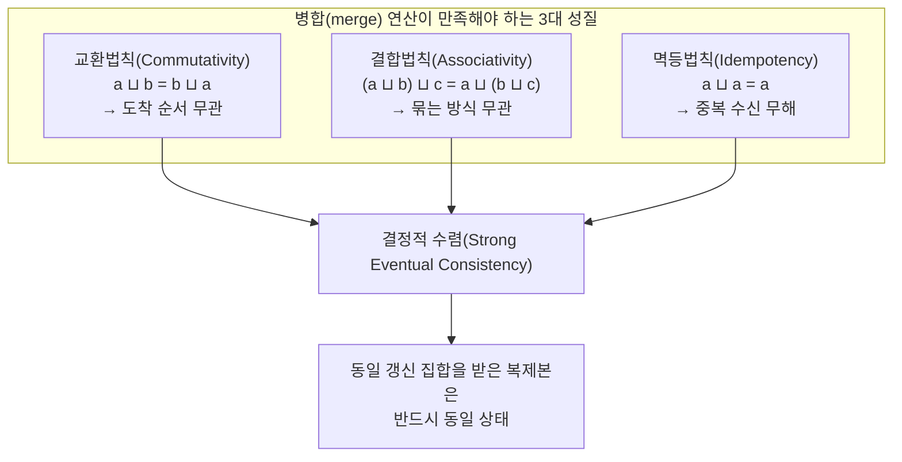
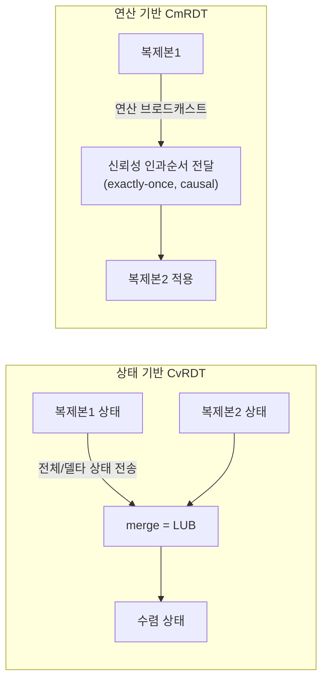
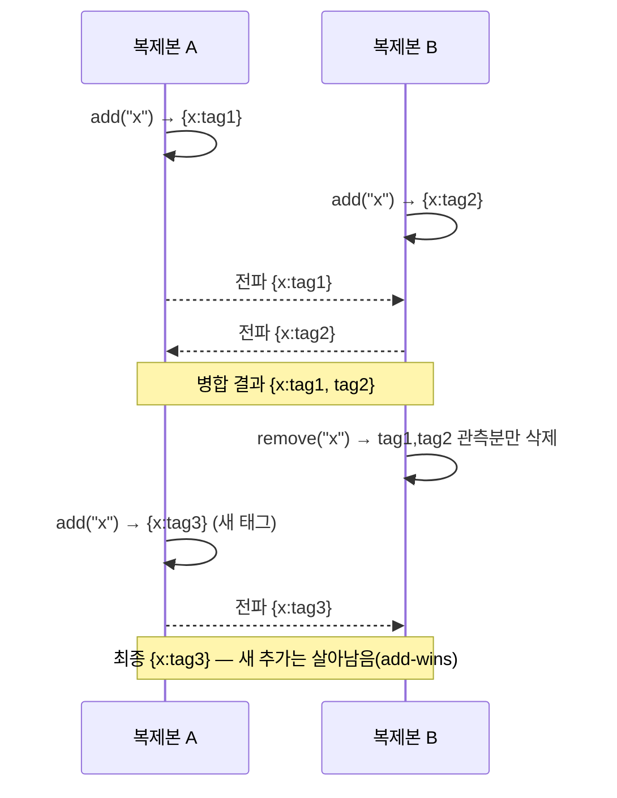

# CRDT(충돌 없는 복제 데이터 타입)

## 1. 개요

### 가. 정의

> **CRDT(Conflict-free Replicated Data Type, 충돌 없는 복제 데이터 타입)**란 여러 복제본(Replica)이 각자 독립적으로 갱신을 수행하고 임의의 순서로 서로의 변경을 주고받더라도, 갱신이 모든 복제본에 전파되기만 하면 **중앙 조정자나 합의 과정 없이 수학적으로 반드시 동일한 최종 상태로 수렴(Strong Eventual Consistency, SEC)**하도록 설계된 복제 데이터 구조이다.

CRDT는 2011년 Marc Shapiro, Nuno Preguiça 등이 정리한 개념으로, 분산 시스템에서 "어떻게 하면 노드끼리 매번 합의하지 않고도 일관성을 보장할 수 있는가"라는 오래된 난제에 대한 대수(algebra) 기반의 해법이다. 오늘날 Redis(Active-Active CRDB), Riak, Azure Cosmos DB 같은 분산 데이터스토어와 Figma·Google Docs·Apple Notes 같은 실시간 협업 편집기, 그리고 Automerge·Yjs 같은 로컬 우선(Local-first) 라이브러리의 핵심 엔진으로 자리 잡았다.

### 나. 등장 배경과 필요성

분산 복제 환경에서 여러 노드가 같은 데이터를 동시에 수정하면 필연적으로 **충돌(conflict)**이 발생한다. 전통적 해법은 두 갈래였다. 하나는 Paxos·Raft 같은 **강한 합의(consensus)**로 매 쓰기마다 과반수 노드의 동의를 받는 방식인데, 이는 일관성은 확실하나 네트워크 왕복이 필수여서 지연이 크고, 분단(partition) 시 가용성을 포기해야 한다. 다른 하나는 "마지막 쓰기 승리(LWW, Last-Write-Wins)"처럼 타임스탬프로 한쪽을 버리는 방식인데, 구현은 간단하나 **먼저 쓴 갱신이 소리 없이 유실**되는 문제가 있다.

CAP 정리가 말하듯 네트워크 분단이 존재하는 한 일관성(C)과 가용성(A)을 동시에 완벽히 얻을 수는 없다. CRDT는 이 딜레마에서 **가용성과 분단 내성(AP)을 택하되, 강한 결과적 일관성(SEC)이라는 형태로 일관성의 상당 부분을 회복**하려는 접근이다. 핵심 아이디어는 병합(merge) 연산을 **교환법칙·결합법칙·멱등법칙**을 만족하도록 대수적으로 설계하는 것이다. 이 세 성질이 성립하면 갱신의 도착 순서·중복·지연에 무관하게 결과가 유일하게 정해지므로, 노드는 서로를 기다리거나 조정할 필요 없이 오프라인에서도 자유롭게 편집하고 나중에 자동으로 병합할 수 있다. 협업 편집기에서 두 사용자가 같은 문장을 동시에 고쳐도 데이터가 깨지지 않는 이유가 바로 이 수렴 보장에 있다.

### 다. 핵심 특징

CRDT의 특징은 네 가지로 압축된다. 첫째, **무조정 갱신(coordination-free update)** — 쓰기 시점에 다른 노드와의 통신이 필요 없어 지연이 낮고 오프라인에서도 동작한다. 둘째, **결정적 수렴** — 같은 갱신 집합을 받은 복제본은 병합 순서와 무관하게 반드시 같은 상태가 된다. 셋째, **분단 내성** — 네트워크가 끊겨도 각 조각이 독립 서비스하다가 복구 시 자동 병합된다. 넷째, **자동 충돌 해소** — 충돌을 오류로 보지 않고 데이터 구조의 병합 규칙이 결정적으로 흡수한다. 이 특징들은 강한 불변식 강제·즉각적 전역 일관성을 포기한 대가로 얻어진 것이므로, 도입 시 **무엇을 얻고 무엇을 내주는지**를 명확히 인식해야 한다.

## 2. 수렴의 수학적 토대 — 반격자(Semilattice)

CRDT가 "충돌 없음"을 보장하는 근거는 상태 공간이 **결합 반격자(Join Semilattice)**를 이루고, 병합 연산이 그 위의 **최소 상한(Least Upper Bound, LUB)**을 계산한다는 데 있다. 반격자에서 병합 연산 ⊔ 은 다음 세 성질을 만족한다.

교환법칙은 메시지가 어떤 순서로 도착하든 결과가 같음을, 결합법칙은 어떻게 묶어 병합하든 결과가 같음을, 멱등법칙은 같은 메시지를 여러 번 받아도(재전송·중복) 결과가 변하지 않음을 보장한다. 세 성질이 함께 성립하면 상태는 격자 위에서 **단조 증가(monotonic)**하며, 서로 다른 경로로 진화한 복제본도 같은 갱신 집합을 받으면 격자상의 동일한 최소 상한으로 반드시 만난다. 이것이 "합의 없이 수렴한다"는 CRDT 주장의 핵심 증명이다.

이 대수적 성질이 실무에 주는 함의는 크다. 네트워크가 메시지를 재정렬·중복·지연시켜도, 심지어 노드가 며칠간 오프라인이었다가 복귀해도, 밀린 갱신을 순서 상관없이 흘려보내기만 하면 정합성이 회복된다. 즉 CRDT는 **불안정한 네트워크를 정확성의 전제가 아니라 성능 변수로 격하**시킨다.

다만 주의할 점은 이 보장이 "**전달만 되면**"이라는 조건부라는 것이다. CRDT는 갱신이 결국 모든 복제본에 도달한다는 **결과적 전파(eventual delivery)**를 전제로 하므로, 영원히 격리된 복제본이나 유실되어 재전송되지 않는 갱신까지 구제하지는 못한다. 따라서 실무에서는 안티엔트로피(anti-entropy) 동기화나 주기적 상태 교환으로 "언젠가 반드시 전달"을 보장하는 전파 계층을 CRDT와 반드시 함께 설계한다.

## 3. 두 가지 구현 방식 — 상태 기반(CvRDT)과 연산 기반(CmRDT)

CRDT는 복제본 간에 "무엇을 주고받느냐"에 따라 두 계열로 나뉜다. 하나는 상태 전체(또는 델타)를 주고받는 **상태 기반(State-based, CvRDT)**이고, 다른 하나는 개별 연산을 브로드캐스트하는 **연산 기반(Operation-based, CmRDT)**이다. 두 방식은 이론적으로 상호 변환 가능하지만 전송량·네트워크 가정·구현 난도에서 실무적 트레이드오프가 뚜렷하다.

**상태 기반**은 복제본이 자신의 전체 상태를 주기적으로 이웃에 보내고, 수신 측이 병합 함수로 두 상태의 최소 상한을 취한다. 병합이 멱등·교환·결합적이므로 **메시지 유실·중복·재정렬에 강인**하며, 가십(gossip) 프로토콜처럼 느슨한 전파 위에서도 안전하다. 단점은 상태 전체를 보내면 전송량이 크다는 점인데, 이를 완화한 것이 변경분만 보내는 **델타 상태 CRDT(Delta-state CRDT)**로 Redis Active-Active 등이 채택한다.

**연산 기반**은 "요소 추가", "카운터 +1" 같은 개별 연산만 전파하므로 대역폭 효율이 좋다. 대신 정확성을 위해 전달 계층이 **정확히 한 번(exactly-once)·인과 순서(causal order) 전달**을 보장해야 한다는 강한 전제를 지운다. 연산이 중복 적용되면(예: 카운터 증가가 두 번) 결과가 깨지기 때문이다. 실시간 협업 편집기가 이 계열을 즐겨 쓰되, 재접속 시 놓친 연산을 순서대로 재생하는 로그·버전 벡터 메커니즘을 함께 둔다.

두 방식을 가르는 실무 기준은 **네트워크 가정과 전송량의 균형**이다. 가십·재전송이 일상적인 느슨한 인프라(모바일·에지·P2P)에서는 유실·중복에 무해한 상태 기반이 안전하고, 브로커가 순서·전달을 견고히 보장하는 백엔드 환경에서는 대역폭 효율이 좋은 연산 기반이 유리하다. 예컨대 노드 5개가 초당 수만 건 갱신하는 카운터를 상태 기반으로 매번 전체 전송하면 부담이 크지만, 델타 상태 CRDT로 "변경된 항목 몫"만 보내면 전송량을 수십 분의 1로 줄이면서도 상태 기반의 강인함을 유지할 수 있다. Redis Active-Active가 델타 상태 방식을 택한 것도 이 균형점 때문이다.

### 가. 인과성 추적 — 버전 벡터의 역할

CRDT가 "동시(concurrent) 갱신"과 "인과적으로 앞선(happens-before) 갱신"을 구분하려면 시간 순서를 알아야 하는데, 물리 시계는 노드 간 오차로 신뢰할 수 없다. 그래서 대부분의 CRDT는 노드별 논리 카운터를 모은 **버전 벡터(Version Vector)** 또는 **도트(dot)** 를 병합의 근거로 사용한다. 두 갱신의 버전 벡터가 서로를 포함하지 못하면 "동시 발생"으로 판정해 병합 규칙(add-wins, 다중값 보존 등)을 적용하고, 한쪽이 다른 쪽을 포함하면 최신 것만 남긴다.

이 메커니즘은 정확성의 근간이지만 동시에 **메타데이터 증가의 원천**이기도 하다. 노드 수가 많아질수록 버전 벡터가 길어지고, OR-Set의 태그·툼스톤과 결합되면 상태가 팽창한다. 따라서 실무에서는 안정화된 도트를 주기적으로 정리(compaction)하거나, 노드 식별자를 재사용 가능한 짧은 ID로 관리하는 등 **인과성 메타데이터의 수명주기 관리**가 설계의 필수 요소가 된다.

## 4. 대표 CRDT 유형과 동작

가장 단순한 예는 **G-Counter(Grow-only Counter)**다. 노드마다 자기 몫의 카운터를 따로 두고 증가시키며, 전체 값은 모든 노드 몫의 합, 병합은 각 항목의 최댓값을 취한다. 최댓값은 교환·결합·멱등적이므로 수렴이 보장된다.

구체적으로 노드 A·B·C가 좋아요 수를 집계한다고 하자. 각 노드는 `{A:_, B:_, C:_}` 벡터를 들고 자기 항목만 올린다. A가 세 번, B가 두 번 올린 뒤 서로 상태를 교환하면 A는 `{A:3,B:0,C:0}`, B는 `{A:0,B:2,C:0}`을 갖는다. 병합은 항목별 최댓값이므로 두 상태를 합치면 양쪽 모두 `{A:3,B:2,C:0}`이 되고 총합은 5로 일치한다. 여기서 A의 상태가 네트워크 문제로 B에게 두 번 도착해도, 최댓값 연산의 멱등성 덕분에 결과가 `{A:3,...}`에서 변하지 않는다 — **중복 수신이 무해**하다는 성질이 숫자로 드러나는 대목이다. 감소까지 지원하려면 증가용·감소용 G-Counter 두 개를 묶은 **PN-Counter**를 쓴다(전체 값 = 증가합 − 감소합). 이런 카운터는 조회수·좋아요·재고처럼 **정확한 합계가 필요하지만 순간적 불일치는 허용되는** 지표 집계에 널리 쓰인다.

집합(Set) 계열은 더 미묘하다. **G-Set**은 추가만 가능해 단순하지만, 삭제를 지원하는 순간 "동시에 추가와 삭제가 일어나면 무엇이 이기나"라는 문제가 생긴다. **2P-Set**은 한 번 삭제하면 다시 추가 못 하는 제약이 있고, 실무에서 많이 쓰는 **OR-Set(Observed-Remove Set)**은 각 추가에 고유 태그를 붙여, 삭제는 "관측된 그 태그"만 지우도록 해 **추가 우선(add-wins)** 의미를 자연스럽게 구현한다.

OR-Set의 설계 의도를 조금 더 풀면, 삭제란 "특정 원소를 없앤다"가 아니라 "**지금까지 내가 관측한 이 원소의 추가 태그들을 무효화한다**"는 정밀한 의미를 갖는다. 그래서 한 노드가 삭제를 전파하는 사이 다른 노드가 새 태그로 같은 원소를 추가하면, 그 새 태그는 삭제 대상에 포함되지 않아 원소가 살아남는다. 이 add-wins 시맨틱은 협업 편집에서 "내가 방금 다시 넣은 항목이 남의 삭제 때문에 사라지는" 직관에 어긋나는 데이터 유실을 막아준다. 반대로 삭제 우선이 필요한 도메인을 위한 변형(remove-wins)도 존재하므로, **업무 의미에 맞는 승패 규칙을 선택**하는 것이 설계 포인트다. 아래는 동시 추가·삭제가 OR-Set에서 병합되는 흐름이다.

텍스트 협업에는 **시퀀스 CRDT**(RGA, LSEQ, Logoot, Yjs의 YATA 등)를 쓴다. 각 문자에 조밀 순서를 부여하는 **위치 식별자(position identifier)**를 부여해, 두 사용자가 같은 지점에 동시에 입력해도 삽입 위치가 결정적으로 정렬되도록 한다. 레지스터 계열로는 병렬 쓰기를 타임스탬프로 하나만 남기는 **LWW-Register**와, 충돌 값을 모두 보존해 상위 계층이 해소하게 하는 **MV-Register(Multi-Value)**가 있다.

이 기본형들은 서로 조합되어 더 복잡한 구조를 만든다. 대표적으로 **OR-Map**은 키마다 값으로 또 다른 CRDT(카운터·집합·레지스터·중첩 맵)를 두고 키별로 재귀적으로 병합한다. 이렇게 하면 JSON 문서 한 건 전체를 하나의 CRDT로 표현할 수 있어, 협업 앱에서 문서의 임의 필드를 여러 사용자가 동시에 고쳐도 필드 단위로 안전하게 병합된다. Automerge가 지향하는 "JSON 자체가 CRDT"라는 모델이 바로 이 재귀적 합성의 결과이며, 이는 개별 자료형을 넘어 **애플리케이션 상태 전체를 복제 대상**으로 끌어올린다는 점에서 의미가 크다.

| 유형 | 대표 CRDT | 병합 규칙(요지) | 주 용도 |
|------|-----------|------------------|---------|
| 카운터 | G-Counter / PN-Counter | 노드별 값의 최댓값·합 | 조회수·좋아요·재고 |
| 집합 | G-Set / 2P-Set / OR-Set | 합집합, 태그 기반 삭제 | 태그·장바구니·팔로우 |
| 레지스터 | LWW-Register / MV-Register | 타임스탬프 최댓값 / 다중값 보존 | 설정값·프로필 필드 |
| 시퀀스 | RGA / LSEQ / YATA | 위치 식별자 순서 정렬 | 협업 문서·코드 편집 |
| 맵 | OR-Map | 키별 하위 CRDT 재귀 병합 | JSON 문서·구조화 상태 |

## 5. 비교 — CRDT vs 합의(Raft/Paxos) vs OT

CRDT를 이해하려면 대안과의 차이가 왜 생기는지를 짚어야 한다. **강한 합의(Raft/Paxos)**는 매 쓰기에 과반수 동의를 요구해 **선형화 가능성(linearizability)**이라는 최강 일관성을 주지만, 그 대가로 쓰기마다 네트워크 왕복이 필요하고 분단 시 소수파는 쓰기를 멈춘다. 반면 CRDT는 **로컬에서 즉시 쓰고 나중에 병합**하므로 지연이 없고 오프라인 편집이 가능하지만, 일시적으로 복제본 간 상태가 다를 수 있고(결과적 일관성) "잔고는 절대 음수가 될 수 없다" 같은 **전역 불변식(global invariant)을 강제하지 못한다.** 그래서 은행 잔고 이체처럼 강한 불변식이 필요한 곳엔 합의가, 협업·집계처럼 가용성이 우선인 곳엔 CRDT가 맞는다.

협업 편집기의 오랜 경쟁 기술인 **OT(Operational Transformation, Google Docs 초기 방식)**와도 대비된다. OT는 연산을 상대 연산 기준으로 "변환"해 순서를 맞추는데, 변환 함수의 조합 경우의 수가 많아 구현이 복잡하고 보통 **중앙 서버**를 전제한다. CRDT는 데이터 구조 자체에 순서를 내장해 서버 없이도(P2P) 수렴하므로 로컬 우선 아키텍처에 유리하나, 삭제 태그·툼스톤(tombstone) 등 **메타데이터가 누적**돼 메모리를 더 쓴다는 약점이 있다. 실제로 Figma는 자체 변형 CRDT를, Google Docs는 OT를 유지하는 등 선택이 갈리는 이유가 여기에 있다.

정리하면 세 기술의 차이는 "조정 비용을 언제 치르느냐"로 요약된다. 합의는 **쓰기 시점에 선불**로 조정 비용(네트워크 왕복·과반수 대기)을 치르고 강한 일관성을 사며, OT는 **중앙 서버가 런타임에** 변환 비용을 치르고, CRDT는 **데이터 구조 설계 시점에** 병합 규칙을 대수적으로 못 박아 런타임 조정을 없앤다. 그 대신 CRDT는 설계 시 감당한 메타데이터·시맨틱 선택의 부담을 운영 내내 지고 간다. 어떤 기술도 절대 우위가 아니며, **일관성 요구 강도·지연 예산·오프라인 필요성·팀의 구현 역량**이라는 축에서 선택해야 한다.

## 6. 심화 — 실무 적용 사례와 최신 동향

실무에서 CRDT의 채택은 빠르게 확산되고 있다. **Redis Enterprise의 Active-Active(CRDB)**는 지리적으로 떨어진 여러 데이터센터가 각자 로컬 쓰기를 받고 지연 낮게 서비스하면서도 백그라운드로 CRDT 병합해 수렴하는 구조로, 글로벌 세션·장바구니·리더보드에 쓰인다. **Riak**은 초창기부터 카운터·집합·맵 CRDT를 1급 자료형으로 제공했고, **Azure Cosmos DB**는 다중 리전 쓰기의 충돌 해소 옵션으로 LWW·커스텀 병합을 제공한다. 협업 도구 쪽에서는 **Figma**가 대규모 동시 편집을, **Linear·Notion류**가 오프라인 편집 후 병합을 CRDT 기반으로 처리한다.

라이브러리 생태계도 성숙했다. JavaScript 진영의 **Yjs**는 문서·배열·맵·텍스트 CRDT를 고성능으로 제공해 웹 협업 편집기에서 사실상 표준이 되었고, **Automerge**는 JSON 문서 전체를 CRDT로 다루며 변경 이력·되돌리기까지 지원한다. 초기 시퀀스 CRDT는 문자마다 메타데이터가 붙어 문서 크기 대비 수 배의 저장 오버헤드가 지적되었으나, 최근 구현들은 연속 삽입을 한 블록으로 묶고 이진 인코딩을 적용해 오버헤드를 크게 낮췄다. 최근 흐름은 두 가지다. 첫째, 툼스톤·태그 메타데이터로 인한 **공간 오버헤드를 줄이는 압축·가비지 컬렉션** 연구(예: 안정화된 연산의 태그 정리)가 활발하다. 둘째, **로컬 우선 소프트웨어(Local-first)** 운동과 결합해, 네트워크 없이도 완전히 동작하고 연결되면 자동 동기화되는 앱 아키텍처의 기반 기술로 부상하고 있다.

정보관리기술사 관점의 예상 출제 방향으로는 ①CRDT의 정의와 SEC 보장 원리(반격자·3대 성질)를 논하라 ②상태 기반과 연산 기반의 차이와 적용 기준을 비교하라 ③CAP·합의 알고리즘과의 관계 속에서 CRDT의 위치를 설명하라 ④실시간 협업/멀티리전 DB 시나리오에서 CRDT 적용 시 고려사항을 제시하라 등이 유력하다. 답안 구성은 "정의→수렴 원리→유형→대안 비교→적용 전략" 순으로 전개하면 심도와 구조를 함께 확보할 수 있다.

## 7. 고려사항 및 시사점

- **적용 도메인의 선별이 우선이다.** CRDT는 "동시 갱신을 자동 병합해도 의미가 훼손되지 않는" 데이터(집계·태그·문서 위치)에 적합하다. 잔고·재고 상한처럼 강한 전역 불변식이 필요한 도메인에는 부적합하므로, **CRDT(가용성 우선)와 합의(일관성 우선)를 데이터 특성별로 혼용**하는 하이브리드 설계가 현실적이다.

- **메타데이터·툼스톤 관리가 운영의 핵심 트레이드오프다.** OR-Set·시퀀스 CRDT는 삭제·순서 정보를 태그로 누적하므로 장기 운영 시 메모리·저장 공간이 팽창한다. **안정화 시점 판단 후 가비지 컬렉션·상태 압축·스냅샷** 전략을 설계 단계에서 반드시 포함해야 하며, 이를 소홀히 하면 성능 저하로 이어진다.

- **의미적 충돌(semantic conflict)은 여전히 상위 계층의 몫이다.** CRDT는 데이터 구조 수준의 수렴은 보장하나, "두 사람이 같은 필드를 다르게 고쳤을 때 어느 값이 업무적으로 옳은가"는 판단하지 못한다. MV-Register로 충돌 값을 보존하고 **사용자·업무 규칙이 최종 해소**하도록 UX·정책을 함께 설계해야 한다.

- **전달 계층 가정과 관측 가능성을 명확히 하라.** 연산 기반 CRDT는 exactly-once·인과 순서 전달을 전제하므로 메시징 인프라(브로커·버전 벡터)의 신뢰성이 정확성에 직결된다. 병합 지연·수렴 여부를 모니터링할 **관측성(수렴 지표·복제 지연·태그 증가율)** 체계를 갖춰야 장애를 조기에 포착할 수 있다.

- **표준화·상호운용성은 아직 발전 중이다.** CRDT 구현별 인코딩·병합 규칙이 제각각이라 라이브러리 간 호환이 제한적이다. 로컬 우선 아키텍처를 도입할 때는 **특정 라이브러리 종속(lock-in)** 위험을 평가하고, 데이터 포맷·마이그레이션 경로를 미리 확보하는 것이 중장기 관점에서 중요하다.

- **보안·검증 관점도 병행 검토해야 한다.** P2P·오프라인 병합 구조에서는 악의적 노드가 조작된 갱신을 주입하거나 태그를 위조할 여지가 있으므로, 갱신에 대한 **서명·접근제어·감사 로그**를 상위 계층에 둬야 한다. 또한 병합 규칙의 정확성은 대수적 성질에 의존하므로, 커스텀 CRDT를 설계할 때는 교환·결합·멱등성을 **속성 기반 테스트(property-based testing)**로 검증해 수렴이 실제로 성립하는지 확인하는 절차가 필수다.

## 참고자료

- Shapiro, Preguiça, Baquero, Zawirski, "Conflict-free Replicated Data Types", INRIA RR-7687, 2011. https://inria.hal.science/inria-00609399
- Redis Enterprise, "Active-Active geo-distributed Redis (CRDBs)". https://redis.io/docs/latest/operate/rs/databases/active-active/
- Yjs 공식 문서. https://docs.yjs.dev/
- Automerge 공식 사이트. https://automerge.org/
- Kleppmann et al., "Local-first software". https://www.inkandswitch.com/local-first/

---

> **한 줄 요약**: CRDT는 병합 연산을 교환·결합·멱등적으로 설계해 중앙 합의 없이도 모든 복제본이 동일 상태로 수렴(SEC)하도록 보장하는 복제 데이터 타입으로, 실시간 협업 편집과 멀티리전 데이터스토어처럼 가용성·오프라인 편집이 중요한 영역에서 합의 알고리즘의 대안으로 널리 쓰인다.
