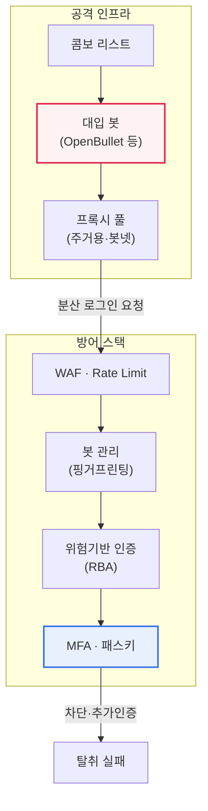

# 크리덴셜 스터핑(Credential Stuffing)

## 1. 개요

### 가. 정의

> 다른 사이트에서 **유출된 계정·비밀번호 목록을 자동화 도구로 여러 사이트에 대입**해 로그인을 시도하는 공격. 사용자가 여러 서비스에 같은 비밀번호를 재사용하는 습관을 정면으로 악용한다.

크리덴셜 스터핑이 다른 인증 공격과 본질적으로 다른 지점은 '**공격자가 이미 유효했던 자격증명을 보유한 채 시작한다**'는 데 있다. 무차별 대입(Brute Force)이나 사전 공격(Dictionary Attack)이 '없는 비밀번호를 만들어 내는' 생성형 공격이라면, 크리덴셜 스터핑은 '이미 존재하는 정답 후보를 대입하는' 재사용형 공격이다. 이 차이가 방어 전략 전체를 바꾼다. 생성형 공격은 실패가 폭증하므로 계정 잠금·복잡도 강화로 막을 수 있지만, 크리덴셜 스터핑은 각 시도가 '한때 진짜였던 값'이라 실패율 자체가 상대적으로 낮고 성공 시 즉시 계정을 장악한다.

또한 크리덴셜 스터핑은 '**정상 로그인과 구분하기 어렵다**'는 점에서 탐지 관점의 난제를 만든다. 각 요청은 형식적으로 완벽히 유효한 로그인 시도이며, 아이디·비밀번호 조합이 실제 사용자 데이터와 동일하다. 방어 측이 볼 수 있는 것은 개별 요청의 정오(正誤)가 아니라, 수많은 요청이 만들어 내는 '패턴'뿐이다. 그래서 이 공격의 방어는 인증 로직 하나가 아니라 **행위·환경·속도·분포를 종합하는 이상 탐지의 문제**로 귀결된다.

마지막으로 사람들의 비밀번호 재사용률이 매우 높다는 사회적 사실이 이 공격을 구조적으로 성립시킨다. 한 사이트에서 유출된 계정이 다른 사이트에서도 그대로 통하는 경우가 상당하며, 그 결과 한 곳의 유출이 사용자가 가입한 모든 서비스로 번지는 **연쇄 계정 탈취(Account Takeover, ATO)** 를 일으킨다. 비밀번호라는 단일 비밀을 여러 서비스가 공유하는 순간, 각 서비스의 보안 수준은 '가장 약한 서비스'로 수렴한다.

### 나. 등장 배경 및 필요성

대규모 개인정보 유출 사고가 반복되면서 수십억 건에 달하는 계정정보가 다크웹과 지하 포럼에 유통되었다. 유출 목록을 정리·판매하는 시장이 형성되고, 이를 자동으로 대입하는 봇 도구(예: Sentry MBA, OpenBullet 계열의 콤보 대입 도구)가 상용화되면서 공격의 진입장벽이 극적으로 낮아졌다. 과거에는 정교한 스크립트를 직접 작성해야 했다면, 지금은 콤보 리스트(아이디:비밀번호 목록)와 대상 사이트의 설정 파일만 있으면 비전문가도 대규모 공격을 수행할 수 있다.

기업 관점의 필요성도 명확하다. 계정 탈취는 단순한 로그인 실패가 아니라 **금전 탈취·포인트 도용·개인정보 2차 유출·평판 손상**으로 직결되며, 전자상거래·핀테크·게임·OTT처럼 계정 자체가 자산인 산업에서 피해가 특히 크다. 국내에서도 다수의 커머스·포털 서비스가 '외부 유출 계정을 이용한 부정 로그인 시도'를 공지하며 강제 비밀번호 재설정을 유도한 사례가 반복되었는데, 이는 크리덴셜 스터핑이 이미 일상적 위협임을 보여준다.

## 2. 공격 흐름과 단계별 원리

크리덴셜 스터핑은 대체로 '수집 → 검증(대입) → 선별 → 악용'의 4단계로 전개된다. 아래는 공격의 전체 흐름을 나타낸 구조도이다.

**첫째, 수집 단계**에서 공격자는 유출 목록(콤보 리스트)을 확보한다. 여러 유출 사고의 데이터를 병합·중복 제거해 '아이디:비밀번호' 쌍의 대용량 목록을 만든다. 이 단계에서 이미 대상 사이트의 사용자 규모와 재사용률을 감안한 '기대 성공 건수'가 사실상 결정된다. 즉 공격의 효율은 방어 기술보다 유출 데이터의 신선도·품질에 더 크게 좌우된다.

**둘째, 검증(대입) 단계**에서 봇이 로그인 API에 대량으로 요청을 보낸다. 핵심 회피 기법은 **분산**이다. 공격자는 프록시·봇넷·주거용 프록시(Residential Proxy)로 IP를 수천~수만 개로 흩고, 요청 속도를 사람처럼 느리게 조절(Low-and-slow)하며, User-Agent·헤더·브라우저 핑거프린트를 위조해 정상 트래픽과 섞는다. IP를 분산하는 이유는 한 IP에서 대량 시도 시 차단당하기 때문으로, 이 때문에 **단순 IP 기반 차단만으로는 막기 어렵다**. 주거용 프록시는 실제 가정용 IP를 경유하므로 평판 기반 차단도 우회한다.

**셋째, 선별 단계**에서 성공한 로그인(유효 계정)을 추려낸다. 응답 코드·리다이렉트·본문 크기 차이를 자동 분석해 성공/실패를 구분하고, 성공 계정에 대해 잔액·포인트·연결된 결제수단 유무 등 '가치'를 자동 조회(Account Checking)하기도 한다.

**넷째, 악용·판매 단계**에서 탈취 계정으로 금전·포인트를 빼돌리거나, 검증된 유효 계정 목록을 더 높은 가격에 재판매한다. 검증을 거친 '살아있는 계정'은 원본 콤보 리스트보다 훨씬 비싸게 거래되므로, 대입 자체가 하나의 수익 사업이 된다.

## 3. 공격 인프라와 회피 메커니즘 (세부 아키텍처)

방어를 설계하려면 공격자가 탐지를 어떻게 회피하는지 구조적으로 이해해야 한다. 아래 다이어그램은 공격자–프록시–방어 스택 사이의 상호작용을 나타낸 세부 아키텍처이다.

공격 인프라의 핵심은 '**정상성을 가장하는 세 겹의 위장**'이다. 네트워크 계층에서는 프록시 분산으로 출발지를 숨기고, 세션 계층에서는 헤더·핑거프린트를 위조해 브라우저를 흉내 내며, 행위 계층에서는 요청 간격을 무작위화해 사람의 리듬을 모방한다. 방어 측이 한 계층만 보면 언제나 정상으로 보이는 이유가 여기에 있다.

그래서 방어 스택도 계층적으로 구성된다. 가장 바깥의 **WAF·Rate Limiting**은 명백한 대량 트래픽을 걸러내는 1차 방어막이지만, 분산·저속 공격은 통과시킨다. 그 안쪽의 **봇 관리(Bot Management)** 는 디바이스 핑거프린팅·자바스크립트 챌린지·행위 분석으로 '사람이 아닌 클라이언트'를 식별한다. 다음의 **위험기반 인증(RBA)** 은 로그인의 위험 점수를 계산해 의심스러운 경우에만 추가 인증을 요구하고, 최종 방어선인 **MFA·패스키**는 비밀번호가 정확하더라도 두 번째 요소가 없으면 로그인을 막는다. 이렇게 계층을 겹치는 이유는, 어느 한 방어도 단독으로는 완전하지 않기 때문이다.

## 4. 유사 공격과의 비교

크리덴셜 스터핑을 무차별 대입과 나란히 놓고 보면, 방어의 초점이 왜 달라지는지 분명해진다. 표는 비교의 요약일 뿐이며, 중요한 것은 그 차이가 '어디에서' 비롯되는가이다.

| 구분 | 크리덴셜 스터핑 | 무차별 대입(Brute Force) |
|---|---|---|
| **입력** | 유출된 실제 계정목록 | 임의 문자 조합 생성 |
| **성공률** | 높음(재사용 악용) | 낮음 |
| **탐지 난이도** | 어려움(정상 계정처럼 보임) | 상대적 용이(반복 실패) |
| **방어 초점** | 재사용 차단·MFA·봇 탐지 | 계정 잠금·복잡도 |

차이의 뿌리는 '**대입 후보의 출처**'에 있다. 무차별 대입은 존재하지 않을 확률이 높은 조합을 무수히 던지므로, 특정 계정에 실패가 집중된다. 따라서 '한 계정에 대한 반복 실패'라는 신호가 뚜렷하고, 계정 잠금(Account Lockout)이나 지수적 지연(Exponential Backoff)이 효과적이다. 반면 크리덴셜 스터핑은 '한 계정당 한두 번'만 시도하되 '수백만 계정에 걸쳐' 시도하므로, 계정 단위로 보면 실패가 눈에 띄지 않는다. 그래서 계정 잠금은 오히려 정상 사용자를 가두는 부작용만 남기고 공격은 그대로 통과시킨다.

실무적 함의는, 크리덴셜 스터핑 방어를 '**개별 계정의 실패 횟수'가 아니라 '전체 로그인 트래픽의 분포와 성공 패턴**'으로 옮겨야 한다는 것이다. 예컨대 '평소 로그인 성공률이 60%인데 갑자기 특정 시간대에 실패율이 98%로 치솟고, 성공한 계정들의 지역이 비정상적으로 넓게 분포한다'는 거시 신호가 탐지의 열쇠가 된다. 또한 파비스(Password Spraying, 흔한 비밀번호 소수를 다수 계정에 대입)과도 구분해야 하는데, 스프레이가 '비밀번호 소수 × 계정 다수'라면 스터핑은 '유효 쌍 다수'라는 점에서 데이터 출처가 다르다.

### 참고: 피해 규모의 직관

크리덴셜 스터핑의 위협을 직관적으로 이해하려면 '성공률의 산술'을 보면 된다. 업계 통념상 재사용 기반 대입의 성공률은 대략 0.1~2% 수준으로 알려져 있는데, 수치 자체는 데이터 신선도·대상에 따라 크게 달라지므로 확정값이 아니라 개략적 감으로 보아야 한다. 그럼에도 이 낮아 보이는 비율이 위험한 이유는 규모 때문이다. 예컨대 성공률을 보수적으로 0.5%로 가정하면, 100만 건의 콤보를 대입할 때 약 5,000개의 유효 계정이 탈취된다. 공격자는 봇으로 수천만 건을 자동 대입하므로, 낮은 성공률이 곧 대규모 탈취로 번역된다. 로그인 API가 초당 수백~수천 건의 시도를 받는다면, 방어가 없을 때 하룻밤 사이에 수만 개 계정이 뚫릴 수 있다. 이 '작은 확률 × 큰 규모'의 구조가 왜 억지력(대입 비용 상승)과 최종차단(MFA)을 동시에 걸어야 하는지를 설명한다.

## 5. 대응 방안

크리덴셜 스터핑의 근본 방어는 '**비밀번호 하나에만 의존하지 않는 것**'이다. 비밀번호가 유출되어도 2차 인증이 있으면 로그인이 차단되므로 **다중인증(MFA)** 과 **패스키(FIDO2/WebAuthn)** 가 가장 효과적이다. 특히 패스키는 공개키 기반이라 서버에 재사용 가능한 비밀 자체가 저장되지 않고, 피싱에도 강해 근본적으로 '재사용될 비밀번호'라는 공격 표면을 없앤다. 여기에 비정상 로그인 패턴을 잡아내는 이상 탐지, 봇을 걸러내는 기술을 계층적으로 더한다.

| 대응 | 내용 |
|---|---|
| **다중인증(MFA)·패스키** | 비밀번호 유출돼도 2차 인증으로 차단(핵심) |
| **이상 탐지** | 대량·비정상 지역·비정상 속도 로그인 탐지·차단 |
| **봇 방지** | CAPTCHA, 디바이스 핑거프린팅, Rate Limiting |
| **비밀번호 정책** | 유출 비밀번호 차단(HIBP 연동), 재사용 방지 |
| **모니터링** | 다크웹 유출 계정 감시·강제 재설정 |

각 대응은 서로를 보완한다. MFA·패스키가 최종 방어선이라면, 봇 방지·Rate Limiting은 대입 자체의 비용을 높여 공격 효율을 떨어뜨리는 '억지력'이다. 유출 비밀번호 차단(예: Have I Been Pwned의 Pwned Passwords 연동)은 사용자가 이미 유출된 비밀번호를 애초에 설정하지 못하게 막아, 재사용 고리를 원천에서 끊는다. 다크웹 모니터링은 자사 계정의 유출을 조기에 감지해 선제적 강제 재설정을 가능하게 한다. 핵심은 어느 하나에 의존하지 않고 **탐지·억지·최종차단을 겹겹이 쌓는 다층 방어(Defense in Depth)** 라는 점이다.

## 6. 심화: 위험기반 인증(RBA)과 최신 대응 동향

최근 인증 방어의 중심축은 **위험기반 인증(Risk-Based Authentication, RBA)** 으로 이동하고 있다. RBA는 모든 로그인에 동일한 강도의 인증을 요구하지 않고, 로그인 시도의 위험 점수를 실시간으로 계산해 **위험이 낮으면 마찰 없이 통과, 높으면 추가 인증을 요구**한다. 점수 산정에는 접속 IP의 평판, 지리적 위치와 '불가능한 이동(Impossible Travel, 짧은 시간에 물리적으로 불가능한 지역 이동)', 디바이스 핑거프린트, 접속 시간대, 과거 행위 패턴 등이 종합된다. 이 방식은 정상 사용자의 편의를 해치지 않으면서 의심 로그인만 정밀 차단한다는 점에서, '보안'과 'UX'의 트레이드오프를 완화한다.

방어 기술의 표준화도 진전되었다. FIDO2/WebAuthn 기반 패스키가 주요 플랫폼(애플·구글·마이크로소프트)에서 상호 운용되며 빠르게 확산되고, 인증 이벤트를 사업자 간 실시간으로 공유하는 **CAEP/SSF(Continuous Access Evaluation Protocol / Shared Signals Framework)** 같은 표준이 부상해, 한 서비스에서 탐지된 계정 위험 신호를 다른 서비스가 즉시 반영할 수 있는 방향으로 진화하고 있다. 봇 관리 영역에서는 CAPTCHA의 사용성 문제를 줄이기 위해 배경에서 무마찰로 동작하는 챌린지(예: Cloudflare Turnstile류)가 확산 중이다. 다만 이러한 최신 표준·제품의 구체적 채택 현황과 세부 사양은 빠르게 변하므로, 실제 적용 시에는 최신 문서로 재확인해야 한다.

## 7. 고려사항 및 시사점 (기술사 관점)

1. **MFA·패스키가 근본 대책이며, 인증 패러다임 전환이 필요하다.** 비밀번호라는 단일 인증 요소에 대한 의존에서 벗어나는 것이 크리덴셜 스터핑을 무력화하는 가장 확실한 길이다. 장기적으로는 서버에 공유 비밀을 두지 않는 패스키·FIDO2로의 전환이 전략적 방향이며, 이는 크리덴셜 스터핑뿐 아니라 피싱까지 함께 무력화한다.

2. **사용자 습관과 기술 통제의 병행이 필요하다.** 비밀번호 재사용 금지 교육만으로는 한계가 뚜렷하므로, 서비스 측에서 유출 비밀번호를 차단(HIBP 연동)하고 이상 로그인을 탐지하는 '기술적 강제'가 병행되어야 한다. 보안을 사용자 선의에 맡기지 않는 설계가 핵심이다.

3. **로그인 API의 봇 트래픽 관리가 방어의 최전선이다.** IP 분산·저속 공격에 대응해 디바이스·행위 기반 탐지와 위험기반 인증으로 의심 로그인에만 추가 인증을 요구하는 방식이 표준이 되고 있다. Rate Limiting은 계정 단위·IP 단위·글로벌 단위를 복합적으로 적용해야 우회를 줄일 수 있다.

4. **보안과 사용자 경험(UX)의 균형이 전략의 성패를 좌우한다.** 무차별적으로 MFA·CAPTCHA를 강제하면 이탈률이 오르고, 반대로 마찰을 없애면 방어가 뚫린다. 따라서 위험이 높은 소수 로그인에만 마찰을 부과하는 RBA 기반 '적응형 인증'이 전략적 해법이며, 이는 비용·효과·전환율을 함께 최적화한다.

5. **공급망·생태계 차원의 대응이 확산된다.** 한 서비스의 유출이 전체 생태계로 번지는 구조이므로, CAEP/SSF 같은 사업자 간 위험신호 공유 표준과 다크웹 모니터링을 연계해, 개별 기업 방어를 넘어선 '집단 방어' 체계로 나아가는 것이 향후 연계 기술의 핵심 축이다.

## 참고자료

- OWASP, "Credential Stuffing" — https://owasp.org/www-community/attacks/Credential_stuffing
- OWASP Cheat Sheet Series, "Credential Stuffing Prevention" — https://cheatsheetseries.owasp.org/cheatsheets/Credential_Stuffing_Prevention_Cheat_Sheet.html
- NIST SP 800-63B, "Digital Identity Guidelines: Authentication" — https://pages.nist.gov/800-63-3/sp800-63b.html
- Have I Been Pwned, "Pwned Passwords" — https://haveibeenpwned.com/Passwords

---

> **한 줄 요약**: 크리덴셜 스터핑은 *유출 계정을 자동 대입* 해 비밀번호 재사용을 악용하는 공격으로, 각 시도가 정상 로그인처럼 보여 탐지가 어렵고 IP 분산으로 단순 차단을 우회한다. 근본 대응은 **MFA·패스키로 비밀번호 단일 의존에서 벗어나는 것**이며, 봇 관리·위험기반 인증(RBA)·유출 비밀번호 차단을 겹치는 **다층 방어**와 사업자 간 위험신호 공유가 전략적 방향이다.
