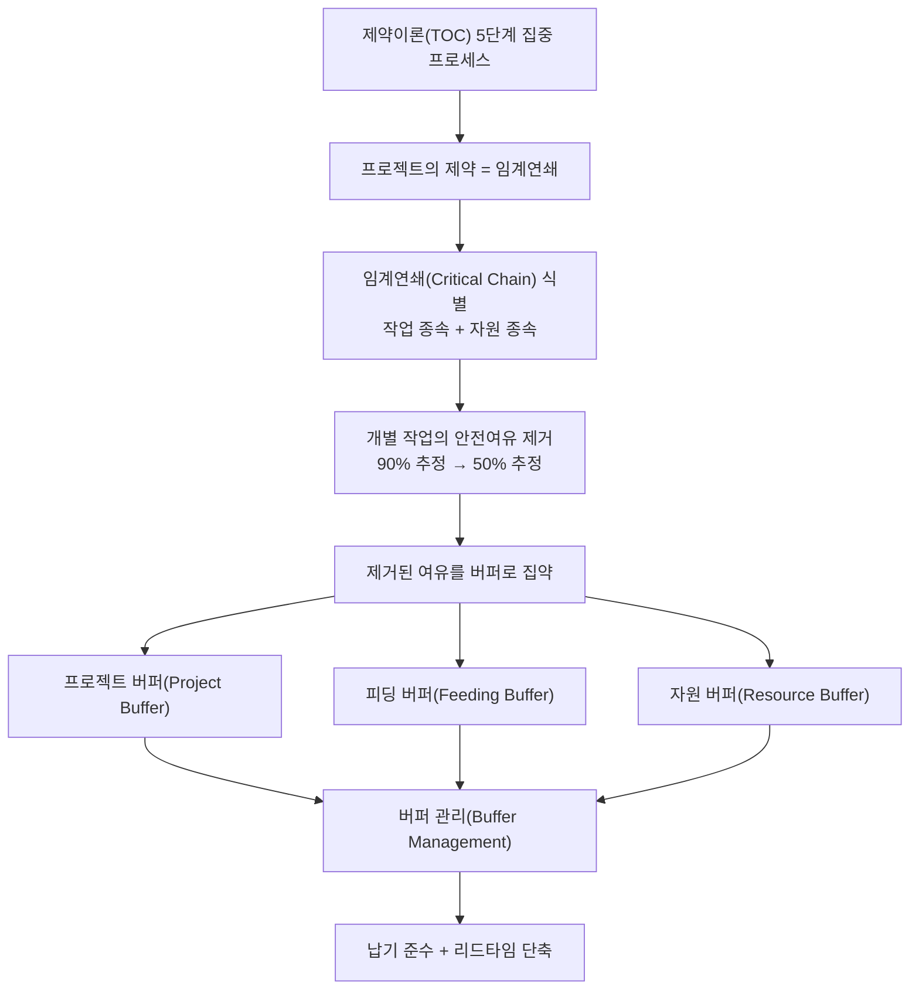
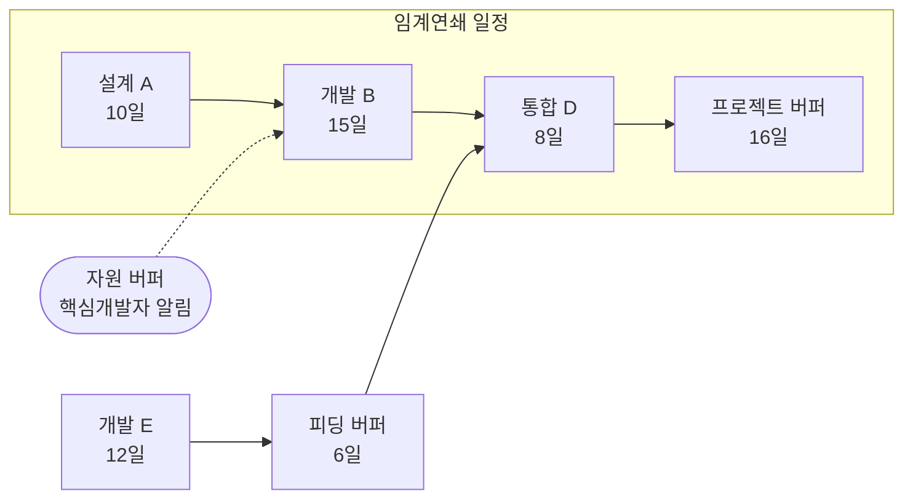
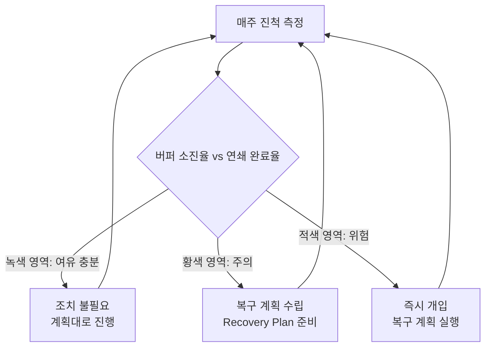

# 임계연쇄 프로젝트관리(CCPM, Critical Chain Project Management)

## 1. 개요

> **정의**: 임계연쇄 프로젝트관리(CCPM)는 제약이론(TOC, Theory of Constraints)을 프로젝트 일정관리에 적용한 방법론으로, **작업 간 선후관계뿐 아니라 자원 제약까지 함께 고려한 가장 긴 종속 작업 사슬(임계연쇄)**을 식별하고, 개별 작업에 숨겨진 안전여유를 걷어내어 **공용 버퍼(Buffer)로 집약·관리**함으로써 납기 준수와 리드타임 단축을 동시에 추구하는 기법이다.

전통적 일정관리 기법인 CPM(Critical Path Method)과 PERT는 1950년대 이래 프로젝트 관리의 표준으로 자리잡았지만, 실제 현장에서는 "각 작업을 계획대로 마쳤는데도 프로젝트 전체는 지연된다"는 역설이 반복되었다. 골드랫(Eliyahu M. Goldratt)은 1997년 저서 『Critical Chain』에서 그 원인을 **작업 추정치에 관행적으로 포함되는 과도한 안전여유(safety time)와, 그 여유가 인간 행동 때문에 낭비되는 구조**에서 찾았다. CCPM은 이 낭비를 제거하고, 남은 안전여유를 프로젝트 차원에서 통합 관리하는 것을 핵심 아이디어로 한다.

CCPM이 등장한 배경에는 몇 가지 구조적 문제가 있다. 첫째, 담당자는 자신의 작업 추정치에 "만약을 대비한" 여유를 붙여 대개 90% 수준의 안전 추정치(safe estimate)를 제출한다. 둘째, 그렇게 확보한 여유는 **학생 증후군(Student Syndrome)** — 마감이 임박해서야 착수하는 행동 — 과 **파킨슨 법칙(Parkinson's Law)** — 일은 주어진 시간을 모두 채우도록 늘어난다 — 에 의해 소진된다. 셋째, 여러 작업을 동시에 처리하는 **나쁜 멀티태스킹(bad multitasking)**은 전환 비용으로 각 작업의 리드타임을 오히려 늘린다. 넷째, 앞 작업의 지연은 뒤 작업으로 누적·전파되지만 앞 작업의 조기 완료 이익은 뒤 작업이 준비되지 않아 사라진다(지연은 전달되고 여유는 사라진다). 이러한 행동적·구조적 손실을 정면으로 다룬다는 점에서 CCPM은 단순한 스케줄링 알고리즘이 아니라 **행동과학과 제약이론을 결합한 관리 철학**에 가깝다.

정보관리기술사 관점에서 CCPM은 대규모 SI·차세대 시스템 구축처럼 자원(핵심 개발자·아키텍트)이 병목이 되고 일정 리스크가 큰 프로젝트에서 특히 유효하다. 최근에는 애자일·칸반과의 결합, 다중 프로젝트 포트폴리오 관리(멀티프로젝트 CCPM)로 확장되면서 여전히 실무적 함의가 크다.

## 2. CCPM의 개념 구조와 제약이론(TOC) 연계

CCPM은 제약이론의 사고 체계를 프로젝트에 이식한 것이다. TOC는 "시스템의 성과는 가장 약한 고리(제약, Constraint)에 의해 결정된다"는 전제 아래, 제약을 찾아 집중적으로 관리(5단계 집중 프로세스: 식별→활용→종속→향상→반복)함으로써 전체 처리량을 극대화한다. 프로젝트에서 이 제약에 해당하는 것이 바로 **임계연쇄**이며, 나머지 관리 장치(버퍼)는 제약을 보호하기 위한 종속 요소로 설계된다.

위 구조도가 보여주듯 CCPM의 논리는 "제약(임계연쇄)을 정확히 식별하고, 그것을 버퍼로 보호하며, 버퍼 소진 상태로 진척을 통제한다"는 한 줄기로 관통된다. 개별 작업의 마감(local optimum)을 지키는 것이 목표가 아니라, **프로젝트 전체 완료(global optimum)**를 지키는 것이 목표라는 점이 CPM과의 근본적 차이다. 예컨대 어떤 작업이 계획보다 3일 늦어도 프로젝트 버퍼가 충분히 남아 있으면 이는 "정상"으로 간주되며, 관리자는 버퍼 소진 추이만 보고 개입 시점을 판단한다.

이 관점의 전환은 관리 지표의 전환을 수반한다. 전통적 관리가 "각 작업이 마감일을 지켰는가"를 묻는다면, CCPM은 "프로젝트 버퍼가 얼마나 남았는가"를 묻는다. 따라서 담당자는 개별 마감 압박에서 벗어나 **이어달리기 경주(roadrunner) 방식** — 바통을 받으면 즉시 전력으로 달리고, 끝나면 바로 넘긴다 — 으로 일하도록 유도된다. 이는 학생 증후군과 멀티태스킹을 구조적으로 억제하는 효과가 있다.

## 3. 임계연쇄의 식별과 임계경로(CPM)와의 차이

임계연쇄를 이해하는 가장 좋은 방법은 임계경로와의 차이를 보는 것이다. **임계경로(Critical Path)**는 작업 간 논리적 선후관계만을 고려하여 계산한 가장 긴 경로다. 그러나 현실에서는 두 작업이 서로 종속관계가 없어도 **같은 자원(예: 단 한 명뿐인 DBA)**을 필요로 하면 동시에 수행할 수 없다. 이 자원 충돌을 해소(resource leveling)하고 나면, 실제로 프로젝트를 가장 오래 끄는 사슬은 임계경로와 달라질 수 있다. 이렇게 **작업 종속성과 자원 종속성을 모두 반영한 최장 사슬이 임계연쇄**다.

위 세부 다이어그램에서 A→B→D가 자원 제약까지 고려한 임계연쇄이고, 이 사슬 끝에 **프로젝트 버퍼**가 붙는다. 비임계 경로인 E는 D 지점에서 임계연쇄에 합류하므로, E의 지연이 임계연쇄를 밀어내지 못하도록 합류 지점 앞에 **피딩 버퍼**를 둔다. 또한 임계연쇄상의 B 작업을 수행할 핵심 자원이 제때 투입되도록 **자원 버퍼**(실제 시간이 아니라 사전 경보 신호)를 배치한다.

임계경로와 임계연쇄의 차이는 실무적으로 매우 중요하다. 임계경로 기법은 자원이 무한하다고 가정하므로, 자원이 부족한 현실에서는 계획 자체가 실행 불가능할 수 있다. 반면 CCPM은 처음부터 자원 가용성을 전제로 사슬을 계산하기 때문에 **실행 가능한(feasible) 일정**을 산출한다. 다만 임계연쇄는 자원 배분이 바뀌면 사슬 자체가 달라질 수 있어, 임계경로보다 계산이 복잡하고 재계획 시 재산정이 필요하다는 부담이 있다.

| 구분 | 임계경로(CPM) | 임계연쇄(CCPM) |
|------|--------------|----------------|
| 고려 요소 | 작업 선후관계만 | 작업 선후 + 자원 제약 |
| 안전여유 | 각 작업에 내재(90% 추정) | 제거 후 버퍼로 집약(50% 추정) |
| 관리 지표 | 개별 작업 마감 준수 | 버퍼 소진율 |
| 자원 가정 | 무한 자원 가정 | 유한 자원 반영 |
| 행동 손실 대응 | 미고려 | 학생증후군·파킨슨·멀티태스킹 억제 |

## 4. 버퍼의 유형과 산정 방법

CCPM의 성패는 버퍼 설계에 달려 있다. 버퍼는 개별 작업에서 걷어낸 안전여유를 집약한 것으로, 통계적으로 **여러 작업의 불확실성을 합치면 개별 여유의 단순 합보다 작은 총량으로도 같은 보호 수준을 얻을 수 있다**(중심극한정리에 기반한 위험 통합 효과)는 원리에 근거한다. 이 때문에 안전여유를 개별 작업에 흩어 두는 것보다 한곳에 모으는 편이 전체 일정을 짧게 만들면서도 납기 보호력은 유지한다.

**가. 프로젝트 버퍼(Project Buffer)**

프로젝트 버퍼는 임계연쇄 전체를 보호하기 위해 사슬의 맨 끝, 즉 프로젝트 완료일 직전에 배치하는 시간 완충이다. 임계연쇄상 각 작업에서 제거한 안전여유의 총량 중 일부(관행적으로 절반 정도)를 이 버퍼로 삼는다. 임계연쇄상의 어떤 작업이 지연되더라도 그 지연을 이 버퍼가 흡수하므로, 프로젝트 약속 납기는 버퍼가 완전히 소진되기 전까지 지켜진다.

프로젝트 버퍼의 크기 산정에는 여러 방법이 쓰인다. 가장 단순한 것은 **50% 컷 앤 페이스트(cut-and-paste) 규칙**으로, 임계연쇄 길이의 약 50%를 버퍼로 두는 방식이다. 예를 들어 임계연쇄가 33일(A 10일 + B 15일 + D 8일)이면 프로젝트 버퍼는 약 16일이 된다. 더 정교한 방법으로는 각 작업의 불확실성 편차를 제곱합의 제곱근으로 합산하는 **제곱근 오차 제곱합(SSQ, Square Root of Sum of Squares)** 방식이 있어, 작업 수가 많고 불확실성이 클수록 상대적으로 더 작은 버퍼로도 충분한 보호가 가능하다.

실무에서는 버퍼가 지나치게 크면 파킨슨 법칙을 다시 부르고, 지나치게 작으면 잦은 납기 위협을 초래하므로 **프로젝트 특성(불확실성·규모·경험)에 맞춘 조정**이 필수다. 신기술 도입 비중이 높은 차세대 프로젝트라면 SSQ 산정 결과에 상향 조정을 두는 식으로 보수적으로 접근한다.

**나. 피딩 버퍼(Feeding Buffer)**

피딩 버퍼는 비임계(피딩) 경로가 임계연쇄에 합류하는 지점 앞에 배치한다. 목적은 명확하다. 비임계 경로의 지연이 임계연쇄로 전파되어 프로젝트 버퍼를 조기에 갉아먹는 것을 막는 것이다. 앞의 예에서 개발 E(12일)가 통합 D 앞에서 합류할 때, E가 다소 늦어도 6일의 피딩 버퍼가 그 지연을 흡수해 임계연쇄의 D 착수 시점을 지켜준다.

피딩 버퍼는 임계연쇄를 이중으로 보호한다. 첫 번째 방어선이 각 합류 지점의 피딩 버퍼이고, 이를 뚫고 들어온 지연에 대한 최종 방어선이 프로젝트 버퍼다. 이 계층적 보호 덕분에 비임계 경로가 임계연쇄로 승격(critical chain으로 바뀌는 현상)되는 위험을 줄일 수 있다.

**다. 자원 버퍼(Resource Buffer)**

자원 버퍼는 앞의 두 버퍼와 성격이 다르다. 시간(일정)을 소비하는 완충이 아니라, **임계연쇄상의 작업을 수행할 핵심 자원이 제때 준비되도록 하는 사전 경보 신호**다. 예를 들어 임계연쇄상의 개발 B가 시작되기 며칠 전, 담당 핵심 개발자에게 "곧 당신 차례이니 다른 일을 정리하고 대기하라"는 알림을 보내는 것이 자원 버퍼의 역할이다. 이는 자원이 다른 프로젝트에 묶여 임계연쇄의 바통을 늦게 받는 사태를 예방한다.

| 버퍼 유형 | 위치 | 성격 | 목적 |
|-----------|------|------|------|
| 프로젝트 버퍼 | 임계연쇄 끝 | 시간 완충 | 프로젝트 납기 보호 |
| 피딩 버퍼 | 비임계→임계 합류점 | 시간 완충 | 지연 전파 차단 |
| 자원 버퍼 | 임계연쇄 자원 앞 | 경보 신호 | 자원 적시 투입 |

## 5. 일정 수립 절차와 버퍼 관리(Buffer Management)

CCPM의 일정 수립은 다음 순서로 진행된다. ① WBS를 기반으로 작업과 선후관계를 정의하고, ② 각 작업을 90% 안전 추정이 아니라 **50% 중앙값(median) 추정**으로 다시 산정한다. ③ 자원 충돌을 해소하여 임계연쇄를 식별하고, ④ 임계연쇄 끝에 프로젝트 버퍼, 합류점에 피딩 버퍼, 자원 앞에 자원 버퍼를 삽입한다. ⑤ 각 작업은 마감일이 아니라 **가능한 한 늦게 시작(ALAP)**을 원칙으로 배치해 재공품(WIP)과 조기 투자 위험을 줄인다.

실행 단계의 핵심은 **버퍼 관리**다. 관리자는 개별 작업의 마감 준수가 아니라 "임계연쇄가 얼마나 진행되었는가" 대비 "프로젝트 버퍼가 얼마나 소진되었는가"를 추적한다. 이를 시각화한 것이 **피버 차트(Fever Chart)**로, 가로축에 임계연쇄 완료율, 세로축에 버퍼 소진율을 두고 현재 상태를 점으로 찍어 신호등 색으로 구분한다.

피버 차트의 해석 규칙은 직관적이다. 임계연쇄가 30% 진행되었는데 버퍼를 20%만 썼다면 여유가 충분하므로 **녹색(정상)**이다. 반대로 임계연쇄 30% 진행에 버퍼를 60% 소진했다면 **적색(위험)**으로, 즉시 복구 계획을 실행해야 한다. 그 사이가 **황색(주의)**으로, 아직 개입하지는 않되 복구 계획을 미리 준비한다. 이처럼 CCPM은 관리자가 **"언제 개입할 것인가"에 대한 객관적 신호**를 제공한다는 점에서 관리 의사결정을 크게 단순화한다.

버퍼 관리의 실무적 이점은 관리자의 개입을 "필요한 순간에만" 집중시킨다는 데 있다. 전통적 관리에서는 모든 작업의 지연을 일일이 추궁하지만, CCPM에서는 버퍼가 적색이 될 때만 강하게 개입하므로 **관리 부하가 줄고 팀의 자율성이 높아진다**. 예컨대 300개 작업으로 구성된 SI 프로젝트에서 버퍼 신호가 녹색이면 300개를 낱낱이 점검할 필요 없이 임계연쇄와 버퍼 추이만 보면 된다.

구체적 수치 예로, 임계연쇄가 33일이고 프로젝트 버퍼가 16일인 프로젝트를 생각해 보자. 임계연쇄가 11일(약 33%) 진행된 시점에 개발 B가 예상보다 지연되어 버퍼를 이미 10일(약 63%) 써버렸다면, 진척 대비 버퍼 소진이 과도한 적색 상태다. 관리자는 이 시점에 인력 보강·범위 조정·병행 처리 같은 복구 계획을 즉시 발동한다. 반대로 임계연쇄가 22일(약 67%) 진행되고 버퍼는 6일(약 38%)만 소진되었다면 여유가 넉넉한 녹색이므로, 담당자가 개별 작업 마감을 며칠 넘겼더라도 개입하지 않는다. 이처럼 **버퍼와 진척의 상대 비율**이 판단 기준이 된다는 점이 CCPM 진척 통제의 핵심이다.

## 6. 단일 프로젝트를 넘어: 다중 프로젝트 CCPM

실제 조직은 대개 여러 프로젝트를 동시에 수행하며, 이때 진짜 병목은 특정 프로젝트 내부가 아니라 **조직 전체에서 공유되는 핵심 자원(예: 아키텍트 풀, 성능 테스트 환경)**이다. 다중 프로젝트 CCPM은 이 공유 병목 자원을 **드럼(Drum) 자원**으로 지정하고, 드럼의 처리 능력에 맞춰 프로젝트 착수 시점을 시차 배치(staggering)한다.

이때 두 가지 장치가 추가된다. **능력 제약 버퍼(Capacity Constraint Buffer)**는 드럼 자원이 한 프로젝트에서 다음 프로젝트로 넘어갈 때 지연이 전파되지 않도록 두는 완충이고, **드럼 버퍼(Drum Buffer)**는 각 프로젝트의 작업이 드럼 자원에 도달하기 전 준비를 보장한다. 이 방식은 조직이 **동시 진행 프로젝트 수를 의도적으로 줄여 나쁜 멀티태스킹을 제거**하고, 오히려 전체 완료율(throughput)을 높이는 역설적 효과를 낸다.

실증 사례로 자주 인용되는 것은 항공기 정비·중공업·제약 R&D 등 자원 병목이 뚜렷한 산업이다. 예컨대 한 항공 정비 조직이 다중 프로젝트 CCPM을 도입해 정비 리드타임을 상당 폭 단축했다는 사례가 보고되며, 이는 "일을 더 많이 벌이는 것"이 아니라 "동시 작업을 줄여 흐름을 빠르게 하는 것"이 성과를 낸다는 TOC의 통찰을 보여준다. 다만 산업·조직마다 효과 편차가 크므로 구체 수치는 일반화하기보다 해당 조직의 파일럿으로 검증하는 것이 바람직하다.

## 7. 심화: 애자일·하이브리드 환경에서의 CCPM과 예상 출제 방향

최근 소프트웨어 개발은 애자일·칸반으로 무게중심이 옮겨졌지만, CCPM의 핵심 통찰은 여전히 유효하며 오히려 상호 보완적이다. 칸반의 **WIP 제한(Work-In-Progress Limit)**은 CCPM이 강조하는 "나쁜 멀티태스킹 제거·흐름 최적화"와 사실상 같은 목표를 공유한다. 실제로 일정에 강한 계약적 납기가 걸린 대규모 프로젝트에서는 상위 수준의 마일스톤·릴리스 계획에 CCPM의 버퍼 관리를 적용하고, 하위 실행은 스프린트·칸반으로 운용하는 **하이브리드 접근**이 늘고 있다. 이때 스프린트 단위의 불확실성은 릴리스 버퍼로 흡수하고, 릴리스 번다운과 버퍼 피버 차트를 병행 모니터링한다.

또한 CCPM은 기댓값 기반 단일 추정의 한계를 보완하기 위해 **몬테카를로 시뮬레이션**과 결합되기도 한다. 각 작업의 확률 분포를 반영해 버퍼 크기를 통계적으로 최적화하면, 50% 컷 규칙이나 SSQ보다 정밀한 완충을 설계할 수 있다. PMBOK 7판이 예측형·적응형을 아우르는 **테일러링(tailoring)**과 가치·흐름 중심 원칙을 강조하는 흐름과도 CCPM의 사고는 잘 부합한다.

정보관리기술사 시험 관점에서 CCPM은 다음과 같은 출제 방향이 예상된다. 첫째, **CPM/PERT와의 비교**를 통해 임계경로와 임계연쇄의 차이, 자원 제약 반영 여부를 묻는 유형이다. 둘째, **버퍼 3종(프로젝트·피딩·자원)의 역할과 산정법**을 설명하고 예시 네트워크에서 버퍼 위치를 그리게 하는 유형이다. 셋째, **버퍼 관리(피버 차트)를 활용한 진척 통제·개입 시점 판단**을 논하는 유형이다. 답안 작성 시에는 반드시 개념도(임계연쇄 네트워크 + 피버 차트)를 그리고, 학생증후군·파킨슨 법칙 등 행동적 배경과 TOC 연계를 서술해 깊이를 보여주는 것이 고득점 전략이다.

## 8. 고려사항 및 시사점 (기술사 관점)

**첫째, 조직 문화·행동 변화가 전제되어야 한다.** CCPM은 개별 작업 마감을 지키지 않아도 된다는 전제 위에 서 있으므로, 마감 준수를 미덕으로 여겨온 조직에서는 저항이 크다. 담당자가 50% 추정을 "실패를 강요당하는 것"으로 오해하지 않도록, 버퍼가 조직 차원의 공용 안전망임을 교육하고 **버퍼 소진을 문책의 근거가 아니라 관리 신호로 사용**하는 문화 정착이 성패를 가른다.

**둘째, 버퍼 크기 설정은 트레이드오프다.** 버퍼가 크면 파킨슨 법칙과 늘어난 리드타임을, 작으면 잦은 납기 위협과 관리자 과잉 개입을 부른다. 프로젝트 불확실성·규모·팀 성숙도에 따라 50% 컷·SSQ·몬테카를로 중 적합한 산정법을 **테일러링**하고, 실행 데이터를 축적해 다음 프로젝트에 환류하는 반복적 보정이 필요하다.

**셋째, 정확한 자원 데이터와 도구 지원이 필수다.** 임계연쇄는 자원 배분에 따라 사슬 자체가 변하므로, 자원 가용성·역량·경합 정보가 부정확하면 계획의 신뢰성이 무너진다. 수작업으로는 재계산이 어려워 CCPM을 지원하는 전용 스케줄링 도구(예: 버퍼·피버 차트 자동 계산 기능)나 EVM·PMIS와의 연계가 권장된다.

**넷째, 방법론 남용·경직 적용을 경계해야 한다.** CCPM은 자원 병목이 뚜렷하고 일정 리스크가 큰 프로젝트에서 강점을 발휘하지만, 소규모·저불확실성 프로젝트에는 오히려 과도할 수 있다. 애자일·칸반이 더 적합한 영역과 CCPM이 유효한 영역을 구분하고, 필요 시 **하이브리드로 결합**하는 상황 적합적(contingency) 판단이 기술사의 몫이다.

**다섯째, 성과 측정 지표를 재정렬해야 한다.** CCPM 도입 시 KPI를 개별 작업 준수율이 아니라 프로젝트 처리량·버퍼 소진 추이·다중 프로젝트 완료율로 바꾸어야 방법론의 취지가 살아난다. 지표가 옛 방식에 머물면 팀은 여전히 개별 마감에 매달려 CCPM의 효과가 상쇄된다.

## 참고자료

- Critical chain project management — Wikipedia, https://en.wikipedia.org/wiki/Critical_chain_project_management
- Theory of constraints — Wikipedia, https://en.wikipedia.org/wiki/Theory_of_constraints
- Project Management Institute(PMI), 『A Guide to the Project Management Body of Knowledge(PMBOK Guide)』 7th Edition 개요, https://www.pmi.org/pmbok-guide-standards

---
> **한 줄 요약**: CCPM은 제약이론을 프로젝트 일정에 적용해, 작업·자원 제약을 함께 고려한 임계연쇄를 식별하고 개별 안전여유를 프로젝트·피딩·자원 버퍼로 집약·관리(피버 차트)함으로써, 학생증후군·파킨슨·멀티태스킹 손실을 줄이고 납기 준수와 리드타임 단축을 동시에 달성하는 일정관리 방법론이다.
