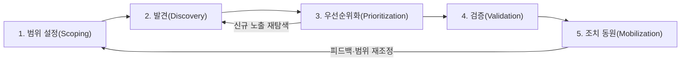
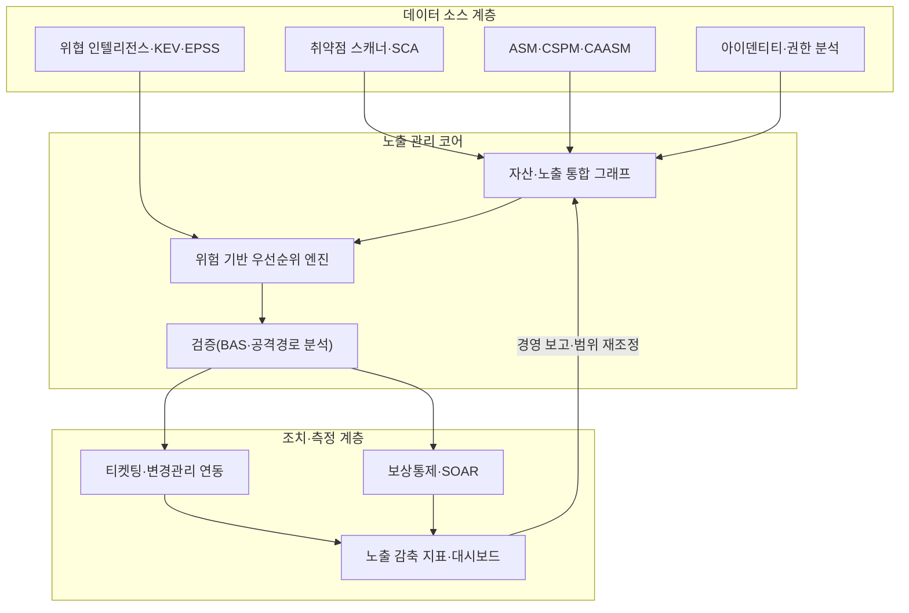

# CTEM(지속적 위협 노출 관리, Continuous Threat Exposure Management)

## 1. 개요

> **정의**: CTEM(Continuous Threat Exposure Management)은 조직이 보유한 자산·서비스·아이덴티티에 존재하는 노출(exposure)을 공격자 관점에서 지속적으로 식별하고, 실제 악용 가능성과 사업 영향에 따라 우선순위를 매겨 검증한 뒤, 조치를 조율(mobilization)하는 것을 하나의 반복 순환으로 운영하는 위험 감축 프로그램이다.

전통적인 취약점 관리(Vulnerability Management)는 분기 또는 월 단위 스캔으로 CVE 목록을 뽑고 CVSS 점수가 높은 항목부터 패치하는 방식으로 운영되어 왔다. 그러나 이 방식은 세 가지 구조적 한계를 가진다. 첫째, 스캔 시점과 조치 시점 사이에 공백이 커서 공격자가 이미 악용 중인 노출을 뒤늦게 발견한다. 둘째, CVSS 점수만으로는 해당 취약점이 우리 환경에서 실제로 도달·악용 가능한지를 알 수 없어, 실제 위험이 낮은 항목에 자원을 낭비한다. 셋째, 취약점(CVE)만 다루기 때문에 잘못된 설정, 과도한 권한, 노출된 인증정보, 공격 표면 확장과 같은 비-CVE 노출을 놓친다.

클라우드·SaaS·원격근무·공급망 확대로 공격 표면은 조직 경계를 넘어 끊임없이 변하고, 랜섬웨어·인포스틸러·공급망 침해와 같은 위협은 취약점 하나가 아니라 여러 약점을 연쇄(attack path)로 엮어 침투한다. 이러한 환경에서 "얼마나 많은 취약점을 닫았는가"보다 "공격자가 우리에게 실제로 무엇을 할 수 있는가, 그중 사업에 치명적인 경로는 무엇인가"라는 질문이 더 중요해졌다. CTEM은 Gartner가 2022년 제시한 이후 최근 보안 전략의 핵심 프레임워크로 부상했으며, 개별 도구가 아니라 노출을 지속적으로 줄여 나가는 **프로그램(운영 체계)**이라는 점이 본질이다.

한편 CTEM은 완전히 새로운 기술을 요구하기보다, 이미 조직에 존재하는 취약점 관리·모의해킹·자산관리·위협 인텔리전스 역량을 하나의 목표 아래 재배치하는 성격이 강하다. 따라서 도입의 관건은 값비싼 신규 도구 구매가 아니라, 흩어진 활동을 순환으로 엮고 그 성과를 사업 언어로 측정·보고하는 운영 설계에 있다. 이 점에서 CTEM은 보안 조직의 성숙도를 끌어올리는 프레임워크이자, 경영진과 보안 부서가 위험을 같은 지표로 대화하게 만드는 소통 도구이기도 하다.

이 답안에서는 CTEM의 5단계 순환 구조와 참조 아키텍처, 각 단계의 활동과 구성요소, 기존 취약점 관리·모의해킹과의 차이, 실무 적용 사례, 그리고 기술사 관점의 도입 전략과 고려사항을 논술한다.

## 2. CTEM의 5단계 순환 구조

CTEM은 일회성 진단이 아니라 다음 다섯 단계를 반복하는 순환 프로그램으로 정의된다. 각 단계는 이전 단계의 산출물을 입력으로 받아 다음 단계로 넘기며, 마지막 단계의 결과가 다시 첫 단계의 범위를 재조정한다.

**가. 범위 설정(Scoping)** — 첫 단계는 기술적 스캔 범위가 아니라 **사업 관점의 보호 대상**을 정의하는 것이다. 전체 IT 자산을 한 번에 다루려 하면 프로그램이 무거워져 실패하기 쉽다. 따라서 매출에 직결되는 핵심 서비스, 규제 대상 개인정보 처리 시스템, 외부에 노출된 공격 표면(External Attack Surface), SaaS·아이덴티티 같은 특정 영역을 우선 범위로 선택한다. 이 단계에서 경영진·현업과 함께 "무엇이 침해되면 가장 큰 손실인가"를 합의하는 것이 이후 우선순위화의 기준선이 된다. 범위는 고정이 아니라 순환마다 재조정되며, 성숙도가 높아질수록 넓혀 간다.

**나. 발견(Discovery)** — 설정된 범위 내에서 자산과 노출을 최대한 빠짐없이 식별한다. 여기서 노출은 CVE 취약점뿐 아니라 클라우드 오설정, 과도한 IAM 권한, 노출된 API·스토리지 버킷, 만료·유출된 인증정보, 섀도 IT, 종속성 취약점(SBOM 관점) 등을 포괄한다. ASM(Attack Surface Management)·CSPM·CAASM·아이덴티티 위협 탐지 도구가 데이터 소스로 결합되며, 자산 인벤토리와 노출 목록을 하나의 그래프로 통합하는 것이 관건이다. 발견의 목표는 "많이 찾는 것"이 아니라 "범위 내에서 정확하게 찾는 것"으로, 노이즈가 많으면 다음 단계 우선순위화가 무력화된다.

**다. 우선순위화(Prioritization)** — 발견된 노출 전부를 조치할 수는 없으므로, 실제 악용 가능성과 사업 영향을 결합해 순위를 매긴다. 이때 CVSS 단독이 아니라 EPSS(악용 확률), CISA KEV(실제 악용된 취약점 목록), 위협 인텔리전스, 자산의 중요도, 그리고 **공격 경로상 위치**를 함께 본다. 예컨대 CVSS 9.8이라도 내부 격리망에 있고 도달 경로가 없으면 순위가 낮아지고, CVSS 6.5라도 외부 노출 자산에서 도메인 관리자로 이어지는 경로의 길목이면 최우선이 된다. 우선순위화는 "위험 기반(risk-based)" 접근의 핵심 단계다.

이 접근이 중요한 이유는 취약점의 절대량과 실제 악용되는 취약점의 수 사이에 큰 간극이 있기 때문이다. 공개된 CVE는 매년 수만 건씩 늘어나지만, 그중 실제로 악용이 관측되는 비율은 한 자릿수 퍼센트대에 그친다는 것이 여러 위협 연구의 공통된 관찰이다. 따라서 전체 취약점을 CVSS 순으로 쫓는 대신, "실제 악용 확률이 높고(EPSS·KEV), 우리 환경에서 도달 가능하며(경로 분석), 핵심 자산에 영향을 주는(자산 중요도)" 교집합에 집중하면 조치 대상을 극적으로 줄이면서도 위험 감축 효과는 오히려 커진다. 이것이 CTEM이 "더 많이가 아니라 더 정확히"를 지향하는 근거다.

**라. 검증(Validation)** — 우선순위가 높은 노출이 **실제로 악용 가능한지, 어디까지 침투가 이어지는지**를 안전하게 확인한다. BAS(Breach and Attack Simulation), 자동화된 침투 테스트, 레드팀, 공격 경로 분석(Attack Path Mapping)이 사용된다. 검증은 두 가지를 답한다. 하나는 "이 노출이 진짜 뚫리는가"(악용 가능성), 다른 하나는 "뚫리면 어떤 자산까지 도달하고 기존 탐지·차단 통제가 막아내는가"(대응 유효성)이다. 검증을 거치면 이론적 위험 목록이 **입증된 위험**으로 바뀌어, 조치 자원의 근거가 명확해진다.

검증 단계는 우선순위화의 오탐을 걸러 내는 역할도 한다. 우선순위가 높게 산출된 노출이라도 실제 환경에서는 다른 통제에 의해 경로가 끊겨 있거나 이미 완화된 경우가 있는데, 검증 없이 조치를 강행하면 불필요한 변경으로 운영 리스크와 현업 피로를 키운다. 반대로 우선순위 지표만으로는 눈에 띄지 않던 낮은 심각도 노출들이 연쇄될 때 치명적 경로를 형성하는 경우도 검증에서 드러난다. 즉 검증은 우선순위화 결과를 현실로 교정하는 되먹임 장치이며, 이 때문에 우선순위화(3단계)와 검증(4단계)은 순환 안에서 특히 긴밀하게 맞물린다.

**마. 조치 동원(Mobilization)** — 검증된 위험을 실제로 줄이기 위해 조직을 움직이는 단계다. 핵심은 자동 패치가 아니라 **사람과 프로세스의 조율**이다. 인프라팀·개발팀·아이덴티티팀·클라우드팀에게 명확한 조치 항목과 근거·기한을 전달하고, 티켓팅·변경관리와 연동하며, 즉시 패치가 어려운 항목은 보상통제(WAF 룰, 세분화, 권한 회수)를 적용한다. 이 단계의 성과가 다시 측정되어 다음 순환의 범위와 우선순위에 반영된다.

다섯 단계는 서로 독립적으로 존재하지 않고 순환의 리듬(cadence) 속에서 맞물린다. 발견과 우선순위화는 공격 표면이 수시로 바뀌므로 비교적 짧은 주기로 반복되고, 검증은 자원 소모가 크므로 상위 위험에 집중해 상대적으로 긴 주기로 실행되며, 범위 설정과 조치 동원은 분기·반기 단위의 경영 리뷰와 정렬된다. 이처럼 단계별로 다른 주기를 두되 하나의 순환으로 연결하는 것이 CTEM 운영 설계의 핵심이다. 순환이 한 바퀴 돌 때마다 조직은 "지난 순환 대비 위험이 얼마나 줄었는가"를 근거로 다음 우선순위를 조정한다.

## 3. 참조 아키텍처와 구성요소

CTEM은 특정 제품이 아니라 여러 보안 데이터 소스를 통합해 노출을 관리하는 상위 계층으로 동작한다. 아래는 데이터 수집부터 조치·측정까지의 흐름을 나타낸 아키텍처이다.

구성요소는 크게 세 계층으로 나뉜다. **데이터 소스 계층**은 취약점 스캐너, SCA/SBOM, ASM·CSPM·CAASM, 아이덴티티·권한 분석, 그리고 EPSS·KEV·위협 인텔리전스 피드를 포함한다. **노출 관리 코어**는 이질적인 데이터를 자산 단위로 정규화·중복제거해 하나의 그래프로 만들고, 위협 인텔리전스와 자산 중요도를 결합해 우선순위를 산출하며, BAS와 공격 경로 분석으로 위험을 입증한다. **조치·측정 계층**은 조치 워크플로우(티켓·변경관리·SOAR)와 노출 감축 지표(평균 조치 시간, 위험 노출 추이, 핵심 자산 도달 가능성)를 경영진 대시보드로 제공한다.

여기서 가장 어려운 부분은 코어 계층의 **자산·노출 통합 그래프**를 만드는 일이다. 취약점 스캐너는 IP·호스트 단위로, 클라우드 도구는 리소스 단위로, 아이덴티티 도구는 계정·역할 단위로 데이터를 생성하기 때문에, 같은 자산이 여러 이름으로 중복 기록되거나 서로 다른 도구의 결과가 연결되지 않는 문제가 흔하다. 이를 해결하려면 자산 식별 기준을 정규화하고, 노출을 자산·아이덴티티·경로의 그래프로 연결해 "이 노출에서 저 자산까지 이어지는가"를 질의할 수 있어야 한다. 통합 그래프가 부실하면 우선순위화와 경로 검증이 모두 부정확해지므로, 코어 계층의 데이터 품질이 곧 프로그램의 품질이 된다.

아래 표는 각 단계에서 사용되는 대표 기술·산출물을 정리한 것이다. 다만 도구는 수단일 뿐이며, 단계 간 데이터가 끊기지 않고 이어지도록 통합하는 것이 프로그램 성패를 가른다.

| 단계 | 핵심 활동 | 대표 기술·데이터 | 주요 산출물 |
|------|-----------|------------------|-------------|
| 범위 설정 | 보호 대상 정의 | 자산 중요도, 사업 영향도 | 범위 정의서·기준선 |
| 발견 | 자산·노출 식별 | ASM, CSPM, CAASM, SCA | 통합 노출 인벤토리 |
| 우선순위화 | 위험 기반 정렬 | EPSS, KEV, 위협 인텔리전스 | 우선순위 노출 목록 |
| 검증 | 악용·경로 입증 | BAS, 자동 침투, 레드팀 | 입증된 공격 경로 |
| 조치 동원 | 조직 조율·감축 | SOAR, 티켓팅, 보상통제 | 조치 이행·감축 지표 |

## 4. 기존 접근과의 비교 및 사례

CTEM을 정확히 이해하려면 기존의 취약점 관리(VM), 모의해킹(Penetration Test)과의 차이를 원리 수준에서 구분해야 한다. 취약점 관리는 "취약점 목록 관리"에 초점을 두고 주기적 스캔·패치 사이클로 운영되므로, 스캔 사이 공백과 CVE 편중이라는 한계를 갖는다. 모의해킹은 특정 시점에 전문가가 깊이 있게 침투를 시도하지만, 연 1~2회 실시되어 지속성이 없고 범위가 좁다. CTEM은 이 둘을 대체하기보다 상위에서 **묶어 지속적으로 운영**한다. 즉 발견은 넓게(ASM), 우선순위는 위협 기반으로, 검증은 자동화(BAS)와 레드팀으로, 조치는 조직 전체의 순환으로 연결한다는 점이 차별점이다.

| 구분 | 취약점 관리(VM) | 모의해킹(PT) | CTEM |
|------|-----------------|--------------|------|
| 대상 | CVE 중심 | 특정 시스템 | 취약점+오설정+권한+표면 |
| 주기 | 주기적 스캔 | 연 1~2회 | 지속(순환) |
| 우선순위 | CVSS 중심 | 전문가 판단 | 악용성·경로·사업영향 |
| 검증 | 대부분 없음 | 있음(수동) | 자동+수동 지속 검증 |
| 목표 | 취약점 감소 | 침투 가능성 확인 | 사업 위험 지속 감축 |

차이가 생기는 근본 원인은 **평가 기준의 이동**에 있다. VM이 "닫은 취약점 수"라는 활동 지표를 본다면, CTEM은 "핵심 자산으로의 실제 도달 가능성 감소"라는 결과 지표를 본다. 이 때문에 실무에서 CTEM을 도입하면 조치 대상 목록이 오히려 줄어든다. 예를 들어 어떤 금융사가 수만 건의 미조치 취약점을 안고 있을 때, EPSS·KEV·경로 분석을 적용하면 실제 악용 가능하고 핵심 자산에 도달하는 항목은 수백 건 수준으로 좁혀져, 한정된 인력이 진짜 위험에 집중할 수 있다.

이러한 결과 지향은 보고 방식에도 영향을 준다. VM 시대의 보고가 "이번 달 취약점 1만 건 중 8천 건 조치"처럼 활동량을 나열했다면, CTEM 보고는 "외부에서 핵심 결제 시스템으로 도달 가능한 검증된 경로가 전월 12건에서 3건으로 감소"처럼 위험의 변화를 서술한다. 후자는 경영진이 투자 대비 효과를 판단하고 다음 우선순위를 결정하는 데 직접적인 근거가 된다는 점에서, CTEM이 보안을 기술 활동에서 사업 위험 관리로 끌어올리는 지점을 보여 준다.

구체적 사례로, 랜섬웨어 공격의 대다수는 알려진(패치 가능한) 취약점과 노출된 원격접속·유효 인증정보의 조합으로 초기 침투가 이루어진다. CTEM은 발견 단계에서 외부 노출 RDP/VPN과 유출 인증정보를 잡아내고, 우선순위화에서 KEV에 등재된 악용 취약점을 상위로 올리며, 검증 단계의 BAS로 "이 노출에서 파일서버까지 실제로 이동 가능함"을 입증한 뒤, 조치 단계에서 MFA 적용·계정 회수·세분화를 동원한다. 또 다른 사례로 클라우드 환경에서는 공개된 스토리지 버킷과 과도한 IAM 역할이 결합해 데이터 유출 경로가 되는데, CTEM은 CSPM 오설정과 권한 분석을 하나의 경로로 연결해 "인터넷 → 오설정 함수 → 과권한 역할 → 데이터"라는 경로를 시각화하고 그 길목을 우선 차단한다.

## 5. 도입 로드맵과 성숙도 모델

CTEM은 한 번에 완성되는 시스템이 아니라 성숙도를 단계적으로 높여 가는 여정이다. 도입 초기에는 데이터와 프로세스가 파편화되어 있으므로, 무리하게 전 자산을 대상으로 삼기보다 좁은 범위에서 순환을 완주해 "노출이 실제로 줄었다"는 증거를 만드는 것이 중요하다. 아래는 일반적으로 관찰되는 3단계 성숙 경로이다.

**가. 1단계 — 기초(가시성 확보)**: 이 단계의 목표는 흩어진 자산과 노출 데이터를 하나로 모으는 것이다. 자산 인벤토리(CMDB·CAASM)를 정비하고 외부 공격 표면(ASM)과 취약점 스캔 결과를 통합해 "우리가 무엇을 가지고 있고 어디가 노출되어 있는가"를 처음으로 한눈에 본다. 아직 우선순위화는 CVSS 위주이고 검증은 수동이지만, 통합 가시성 자체가 이후 모든 단계의 토대가 된다. 이 단계의 대표 지표는 자산 커버리지율과 외부 표면 목록의 정확도이다.

**나. 2단계 — 위험 기반 운영(우선순위·검증 도입)**: 발견된 노출에 EPSS·KEV·자산 중요도를 결합해 위험 기반으로 정렬하고, BAS·공격 경로 분석으로 상위 항목을 검증하기 시작한다. 조치는 티켓팅·변경관리와 연동되어 추적 가능해진다. 이 단계에서 조치 대상 목록이 극적으로 줄고, 평균 조치 시간(MTTR)과 핵심 자산 도달 가능성 같은 결과 지표가 처음으로 측정된다. 대부분의 조직이 실질적 효과를 체감하는 구간이다.

**다. 3단계 — 지속·자동화(프로그램 정착)**: 5단계 순환이 정례화되고, SOAR 플레이북으로 조치가 자동화되며, 노출 감축 추이가 경영진 대시보드로 상시 보고된다. 범위는 클라우드·아이덴티티·SaaS·공급망(SBOM)까지 확장되고, 위협 인텔리전스가 우선순위를 실시간에 가깝게 갱신한다. 이 단계에서 CTEM은 개별 보안 활동을 "지속적 위험 감축"이라는 목표 아래 정렬하는 상위 거버넌스 체계로 자리 잡는다.

성숙도를 높일 때 흔한 실패 요인은 도구를 먼저 늘리고 프로세스를 나중에 맞추는 것이다. 실제 성공 사례들은 범위를 좁게 잡아 순환을 완주하고, 그 성과를 경영진에게 결과 지표로 증명한 뒤 예산과 범위를 확대하는 순서를 따른다. 즉 성숙도의 진전은 기술의 문제라기보다 조직 학습과 신뢰 축적의 문제에 가깝다.

## 6. 심화 — 최신 동향과 예상 출제 방향

CTEM은 최근 보안 시장에서 개별 제품군을 하나의 프로그램으로 수렴시키는 축으로 작동하고 있다. 첫째, **ASM·BAS·위험 기반 취약점 관리(RBVM)·CAASM**이 각각 독립 제품에서 CTEM 플랫폼으로 통합되는 흐름이 뚜렷하다. 둘째, **아이덴티티 노출**의 비중이 커지면서 ITDR(Identity Threat Detection & Response)과의 결합, 과도한 권한·유효 인증정보 관리가 CTEM 발견·검증의 핵심으로 부상했다. 셋째, **생성형 AI**가 노출 데이터 요약, 조치 가이드 자동 생성, 공격 경로 설명 등에 활용되며, 동시에 LLM 애플리케이션·데이터 파이프라인 자체가 새로운 노출 대상(프롬프트 인젝션, 모델·데이터 접근 권한)으로 CTEM 범위에 편입되고 있다.

우선순위화 지표도 정교해지고 있다. CVSS 단독의 한계를 보완하기 위해 EPSS(향후 30일 내 악용 확률)와 CISA KEV(실제 악용 확인 목록)를 결합하는 것이 사실상 표준이 되었고, 여기에 자산 중요도와 경로 분석을 더한 다층 스코어링이 확산 중이다. 제로 트러스트·ASPM(애플리케이션 보안 태세 관리)·SBOM 기반 공급망 노출 관리와의 연계도 강화되고 있다.

기술사 관점에서 예상 출제 방향은 다음과 같다. (1) CTEM의 5단계를 도식과 함께 설명하고 각 단계의 활동·산출물을 쓰라는 서술형, (2) 기존 취약점 관리·모의해킹과 CTEM을 비교하고 도입 필요성을 논하라는 비교형, (3) 랜섬웨어·클라우드 오설정 등 특정 시나리오에서 CTEM을 어떻게 적용할지 답안을 구성하라는 응용형이다. 답안 전략으로는 "노출≠CVE", "지속적 순환", "위험 기반 우선순위", "검증으로 입증", "조직 조율(mobilization)"의 다섯 키워드를 축으로 삼고, 개념도와 비교표를 함께 제시하는 것이 효과적이다.

## 7. 고려사항 및 시사점

첫째, **조직·프로세스 우선의 접근이 필요하다.** CTEM은 도구 도입이 아니라 프로그램 운영이므로, 처음부터 전체 자산을 대상으로 하면 실패한다. 핵심 서비스·외부 표면 등 좁은 범위에서 순환을 성공시켜 성과를 증명한 뒤 단계적으로 확장하는 것이 성숙도 모델에 부합한다. 경영진 스폰서십과 현업의 참여 없이는 마지막 조치 동원 단계가 작동하지 않는다.

둘째, **측정 지표를 활동에서 결과로 전환해야 한다.** "닫은 취약점 수"가 아니라 "핵심 자산으로의 도달 가능성 감소", "평균 조치 시간(MTTR)", "검증으로 입증된 위험 대비 조치율", "외부 공격 표면 추이"를 지표로 삼아야 실제 위험 감축을 증명할 수 있다. 지표는 경영 보고와 예산 근거로 연결되어 프로그램의 지속성을 담보한다.

셋째, **데이터 통합과 노이즈 관리가 성패를 좌우한다.** 여러 도구의 자산·노출 데이터를 중복 없이 하나의 그래프로 정규화하지 못하면 우선순위화가 무력화된다. 자산 인벤토리(CMDB·CAASM)의 정확성이 전제이며, 오탐·중복은 현업의 신뢰를 잃게 하므로 검증 단계로 걸러야 한다. 연계 기술로는 SBOM·ASPM(개발 단계 노출), ITDR(아이덴티티), CSPM(클라우드)이 필수적으로 결합된다.

넷째, **검증의 안전성과 자동화 수준을 트레이드오프해야 한다.** BAS·자동 침투는 운영계에 영향을 줄 수 있으므로 안전한 시뮬레이션 범위·시간대·롤백을 설계해야 하며, 자동화만으로 잡히지 않는 복합 경로는 레드팀으로 보완한다. 자동화는 넓이를, 사람은 깊이를 담당하도록 역할을 분담하는 것이 현실적이다.

다섯째, **제로 트러스트·SOAR·위협 인텔리전스와의 전략적 정렬이 필요하다.** CTEM이 식별·검증한 경로는 제로 트러스트의 세분화·최소권한 정책으로 차단되고, 조치 동원은 SOAR 플레이북으로 자동화되며, 우선순위는 위협 인텔리전스로 갱신된다. 이처럼 CTEM은 개별 보안 활동을 "지속적 위험 감축"이라는 하나의 목표 아래 정렬하는 상위 운영 체계로 자리 잡을 전망이다.

## 참고자료

- Gartner, "How to Manage Cybersecurity Threats, Not Episodes" (Continuous Threat Exposure Management), https://www.gartner.com/en/articles/how-to-manage-cybersecurity-threats-not-episodes
- CISA, Known Exploited Vulnerabilities (KEV) Catalog, https://www.cisa.gov/known-exploited-vulnerabilities-catalog
- FIRST, Exploit Prediction Scoring System (EPSS), https://www.first.org/epss/

---

> **한 줄 요약**: CTEM은 자산·오설정·권한·표면을 아우르는 노출을 공격자 관점에서 지속적으로 발견·우선순위화·검증·조치하는 5단계 순환 프로그램으로, "닫은 취약점 수"가 아니라 "핵심 자산으로의 실제 도달 가능성 감소"를 목표로 삼는 위험 기반 보안 운영 체계다.
