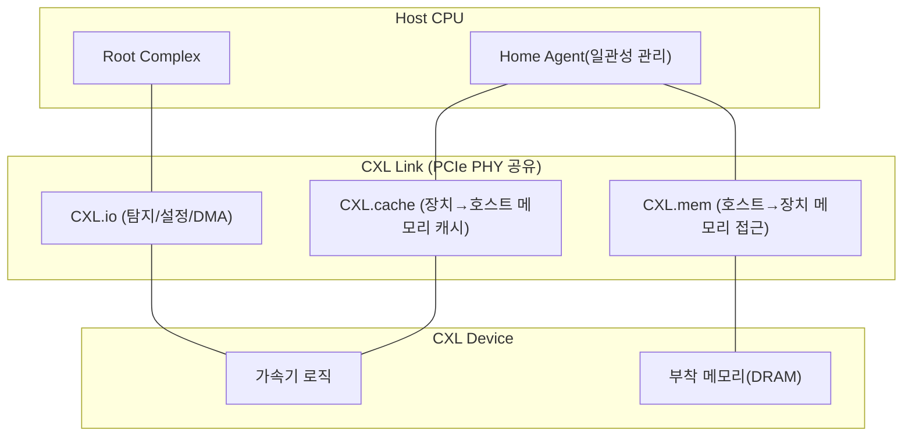
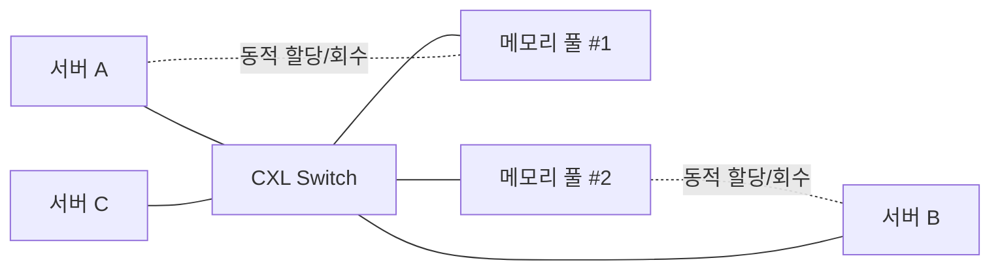

# CXL(Compute Express Link) 초고속 인터커넥트

## 1. 개요

### 가. 정의
> **CXL(Compute Express Link)** 은 PCIe 물리계층 위에서 동작하며, CPU·가속기·메모리 확장장치 사이에 **캐시 일관성(Cache Coherency)** 을 유지한 채 저지연으로 메모리를 공유·확장·풀링(Pooling)할 수 있게 하는 개방형 표준 인터커넥트다.

전통적으로 CPU에 붙는 메모리(DIMM)의 용량·대역폭은 CPU가 제공하는 채널 수에 묶여 있었고, PCIe로 붙는 장치(GPU·NIC 등)는 빠르지만 **CPU와 캐시 일관성을 공유하지 못해** 데이터를 복사·동기화하는 오버헤드가 컸다. CXL은 "PCIe의 넓은 생태계와 물리계층을 그대로 쓰되, 그 위에 **메모리 시맨틱(load/store)과 캐시 일관성**을 얹는다"는 발상으로 이 두 세계를 하나로 잇는다. 즉 장치의 메모리를 CPU가 자기 메모리처럼 `load/store` 명령으로 직접 접근할 수 있게 한다.

### 나. 등장 배경 및 필요성
AI·HPC 워크로드가 커지면서 두 가지 병목이 동시에 나타났다. 첫째는 **메모리 용량·대역폭의 벽**이다. 대형 언어모델과 인메모리 분석은 수 TB급 메모리를 요구하지만, CPU 소켓당 DIMM 슬롯 수는 물리적으로 제한되어 더 이상 늘리기 어렵다. 둘째는 **이기종 가속기 간 데이터 이동 비용**이다. GPU·FPGA·스마트NIC이 늘어날수록 장치마다 별도 메모리를 두고 PCIe로 복사하는 방식은 지연과 전력을 낭비한다. 여기에 데이터센터 차원에서는 서버마다 메모리를 과다 프로비저닝해 **평균 40~50% 이상이 유휴 상태로 낭비(Stranded Memory)** 되는 문제가 겹쳤다. CXL은 메모리를 CPU에서 분리(Disaggregation)해 **필요한 만큼 동적으로 할당·회수**함으로써 이 세 문제를 함께 해결하려는 표준으로 등장했다.

## 2. 프로토콜 구조와 계층

CXL은 하나의 물리 링크 위에서 용도가 다른 **세 개의 서브 프로토콜**을 시분할로 다중화한다. 이 분리가 CXL의 핵심 설계다 — 단순 입출력, 캐시 접근, 메모리 접근이 서로 다른 일관성·지연 요구를 갖기 때문이다.

**CXL.io** 는 PCIe와 거의 동일한 프로토콜로, 장치 탐지·설정(Enumeration)·인터럽트·DMA를 담당하며 **모든 CXL 장치에 필수**다. 나머지 두 프로토콜이 붙기 위한 토대 역할을 한다. **CXL.cache** 는 장치가 호스트 메모리를 **일관성 있게 캐싱**하도록 허용한다. 예컨대 가속기가 CPU 메모리의 특정 영역을 읽어 자기 캐시에 두고 연산하면, CPU가 그 영역을 수정했을 때 하드웨어가 자동으로 무효화·갱신을 처리한다. **CXL.mem** 은 반대로 호스트가 장치에 부착된 메모리를 **자기 주소 공간의 일부처럼 `load/store`** 로 접근하게 한다. 메모리 확장·풀링이 바로 이 프로토콜 위에서 이뤄진다.

### 가. 장치 유형(Device Type)
프로토콜 조합에 따라 장치는 세 가지로 나뉜다. 유형 구분은 곧 "그 장치가 캐시를 갖느냐, 메모리를 제공하느냐"의 문제다.

| 유형 | 사용 프로토콜 | 대표 장치 | 특징 |
|---|---|---|---|
| **Type 1** | io + cache | 스마트NIC·연산형 가속기 | 자체 메모리 없이 호스트 메모리를 일관성 있게 캐싱 |
| **Type 2** | io + cache + mem | GPU·FPGA 가속기 | 캐시·메모리 모두 보유, 양방향 일관성 공유 |
| **Type 3** | io + mem | 메모리 확장기(Expander)·풀 | 캐시 없이 대용량 메모리만 제공(확장·풀링의 주역) |

Type 3가 오늘날 CXL 상용화의 중심이다. DDR5 DIMM을 얹은 확장 카드를 PCIe 슬롯에 꽂으면 CPU가 이를 추가 메모리 계층으로 인식하며, 소켓의 물리적 슬롯 한계를 넘어 용량을 늘릴 수 있기 때문이다.

## 3. 메모리 풀링과 분리(Disaggregation)

CXL의 궁극적 가치는 단순 확장을 넘어 **메모리 풀링**에 있다. 여러 서버(호스트)가 **CXL 스위치**를 통해 하나의 공용 메모리 풀에 접속하고, 필요할 때 특정 용량을 할당받아 쓰고 반납하는 구조다.

이 구조가 해결하는 문제는 **유휴 메모리 낭비**다. 서버 A가 순간적으로 큰 메모리를 필요로 하면 풀에서 빌려 쓰고, 작업이 끝나면 반납해 서버 B가 쓴다. 물리 메모리를 서버마다 최대치로 고정 배치할 필요가 없어져, 데이터센터 전체 메모리 구매량과 전력을 크게 줄일 수 있다. 실제 클라우드 사업자 분석에서 유휴 메모리가 전체의 절반 가까이에 이른다는 보고가 있었고, 풀링은 이 낭비를 직접 겨냥한다. 다만 스위치를 한 단 거치면 지연이 수십~수백 ns 늘어나므로, CXL 메모리는 로컬 DRAM보다 느린 **원거리 메모리 계층(Tier)** 으로 취급되며 운영체제·하이퍼바이저의 **계층형 메모리 관리(Tiered Memory, 예: Linux의 메모리 티어링)** 와 결합돼야 성능이 유지된다.

## 4. 표준 진화와 유사 기술 비교

CXL은 짧은 기간에 빠르게 진화했다. 각 버전은 앞선 세대와 **하위 호환**을 유지하면서 적용 범위를 넓혀 왔다.

| 버전 | 기반 PCIe | 핵심 추가 기능 |
|---|---|---|
| **CXL 1.1** | PCIe 5.0 | 단일 호스트 메모리 확장, Type 1/2/3 정의 |
| **CXL 2.0** | PCIe 5.0 | 단일 단 **스위칭**, **메모리 풀링**, 핫플러그, 무결성·암호화(IDE) |
| **CXL 3.0** | PCIe 6.0(64GT/s) | 다단 스위칭·**패브릭**, **메모리 공유(하드웨어 일관성)**, 대역폭 2배 |
| **CXL 3.1** | PCIe 6.0 | **PBR(Port Based Routing)** 기반 패브릭 확장, **TSP**(신뢰실행환경 보안), 메모리 확장기 개선 |

여기서 2.0의 "풀링"과 3.0의 "공유(Sharing)"는 구분해야 한다. 풀링은 한 시점에 한 호스트가 특정 영역을 **배타적으로** 점유하는 것이고, 공유는 여러 호스트가 **같은 영역을 동시에** 접근하되 하드웨어가 일관성을 보장하는 것으로 난이도와 활용도가 다르다. 또한 3.1의 **TSP(Trusted-Execution-Environment Security Protocol)** 는 풀에서 빌려온 메모리에 다른 호스트의 데이터가 남아 노출되는 위험을 막기 위해, 기밀 컴퓨팅(Confidential Computing) 환경에서 메모리를 암호화·격리하는 장치로, 풀링의 보안 약점을 정면으로 다룬다.

유사 기술과의 관계도 중요하다. **PCIe** 는 CXL의 물리계층 토대이지만 일관성이 없는 순수 I/O 링크이고, **NVLink**(엔비디아)·**Infinity Fabric**(AMD) 은 특정 벤더의 GPU·CPU를 잇는 폐쇄형 고속 링크다. CXL은 이들과 달리 **개방형 업계 표준**이라는 점, 그리고 CPU 중심으로 메모리 시맨틱을 표준화한다는 점에서 차별화된다. 실제로 초기 경쟁 규격이던 Gen-Z·OpenCAPI·CCIX의 자산이 CXL 컨소시엄으로 흡수·통합되며 CXL이 사실상 단일 표준으로 자리 잡았다.

## 5. 고려사항 및 시사점

기술사 관점에서 CXL 도입은 다음을 종합적으로 판단해야 한다.

- **성능-지연 트레이드오프**: CXL 메모리는 로컬 DRAM보다 지연이 크므로, 전면 대체가 아니라 **핫/콜드 데이터 계층화** 전략으로 접근해야 한다. 지연에 민감한 워크로드는 로컬에, 용량 위주 워크로드(대형 인메모리 DB·추천엔진)는 CXL 계층에 배치하는 배치 최적화가 핵심이다.
- **TCO·전력 절감 효과**: 메모리 풀링으로 유휴 메모리를 줄여 총소유비용과 전력을 낮출 수 있으나, 스위치·확장 컨트롤러 등 **추가 하드웨어 비용**과의 손익분기를 규모(서버 대수·메모리 편차)에 따라 계산해야 한다. 대규모 클라우드일수록 유리하다.
- **보안·격리**: 여러 호스트가 공유하는 풀은 **잔존 데이터 노출·측면 채널** 위험이 있으므로, CXL 3.1의 TSP와 IDE(링크 암호화)를 적용하고 기밀 컴퓨팅과 연계해야 한다.
- **생태계 성숙도와 전망**: CPU(인텔·AMD)의 CXL 지원과 OS(리눅스 메모리 티어링) 지원이 갖춰지며 Type 3 확장기가 우선 상용화되었고, 향후 **패브릭 기반 완전 분리형 데이터센터(Composable/Disaggregated Infrastructure)** 로 확장될 전망이다. 다만 다단 스위칭·메모리 공유의 실사용 성숙에는 시간이 필요하므로, 단계적(확장 → 풀링 → 공유) 도입 로드맵을 권고한다.

## 참고자료
- CXL Consortium, "Introducing the CXL 3.x Specification" (2025), https://computeexpresslink.org/wp-content/uploads/2025/02/CXL_Q1-2025-Webinar-Presentation_FINAL.pdf
- "An Introduction to the Compute Express Link (CXL) Interconnect", arXiv, https://arxiv.org/pdf/2306.11227

---
> **한 줄 요약**: CXL은 PCIe 물리계층 위에 캐시 일관성과 메모리 시맨틱을 얹어, CPU·가속기·메모리를 저지연으로 잇고 메모리를 확장·풀링·공유함으로써 AI·데이터센터의 메모리 벽과 유휴 낭비를 해소하는 개방형 표준 인터커넥트다.
