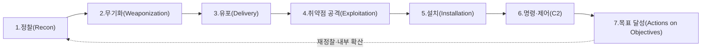
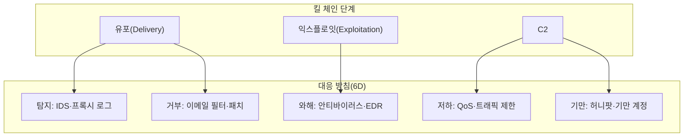

# 사이버 킬 체인(Cyber Kill Chain)

## 1. 개요

> **사이버 킬 체인(Cyber Kill Chain)**은 표적형 사이버 공격을 정찰부터 목표 달성까지 이어지는 7단계의 연쇄 과정으로 모델링하고, 각 단계를 조기에 차단(Break the chain)함으로써 침해를 예방·탐지·대응하는 방어 중심(Defender-centric)의 위협 분석 프레임워크이다.

원래 킬 체인(Kill Chain)은 미 공군의 표적 타격 교리인 F2T2EA(Find–Fix–Track–Target–Engage–Assess)에서 유래한 군사 용어로, "적을 발견해 최종 타격에 이르는 일련의 단계"를 의미한다. 2011년 록히드마틴(Lockheed Martin)의 연구진(Hutchins, Cloppert, Amin)이 이 개념을 APT(Advanced Persistent Threat) 방어에 적용한 논문 *Intelligence-Driven Computer Network Defense*를 발표하면서 사이버 보안의 핵심 모델로 자리 잡았다.

이 모델이 등장한 배경에는 방어 패러다임의 전환이 있다. 전통적 보안은 방화벽·안티바이러스 같은 개별 통제로 "침입 시점"만을 방어하는 사후 대응(Reactive) 중심이었다. 그러나 APT는 수 주에서 수 개월에 걸쳐 은밀하게 진행되는 다단계 공격이므로, 단일 시점 방어로는 막을 수 없다. 킬 체인은 공격을 "여러 단계의 연쇄"로 분해함으로써, **방어자가 단 하나의 단계만 끊어도 전체 공격을 무력화할 수 있다**는 비대칭적 이점(Defender's advantage)을 제공한다. 즉, 공격자는 모든 단계를 성공해야 하지만 방어자는 어느 한 단계만 차단하면 되므로, 방어를 "지능 주도(Intelligence-driven)"의 능동적 활동으로 전환시킨다는 데 핵심 의의가 있다.

또한 킬 체인은 공격의 진행 단계를 공통 언어로 표준화하여, 보안 관제(SOC)·위협 인텔리전스·사고 대응(IR) 조직이 침해 정황을 동일한 관점에서 소통하고, 통제(Control)를 단계별로 매핑해 방어 공백을 식별하는 체계적 기준을 제공한다.

## 2. 사이버 킬 체인의 7단계 구조

킬 체인은 공격이 시간 순으로 진행되는 7개의 순차적 단계로 구성된다. 앞 단계일수록 방어 비용이 낮고 피해가 작으므로, **가능한 한 왼쪽(Left of Boom)에서 차단**하는 것이 원칙이다.

각 단계는 단순한 순서가 아니라, 공격자가 반드시 완수해야 하는 **필요조건의 연쇄**이다. 방어자는 각 단계마다 공격 흔적(Indicator)을 수집·분석하여 통제를 배치한다.

### 가. 정찰(Reconnaissance)

공격자가 표적 조직에 대한 정보를 수집하는 준비 단계이다. 조직도·이메일 주소·기술 스택·노출된 서버 등을 조사하며, 대부분 조직 외부에서 이루어져 탐지가 어렵다.

정찰은 다시 **수동적 정찰**과 **능동적 정찰**로 나뉜다. 수동적 정찰은 링크드인·구인공고·기업 홈페이지·SNS·검색엔진(구글 도킹)·Shodan 같은 공개 출처를 활용하는 OSINT(Open Source Intelligence)로, 표적과 직접 접촉하지 않아 흔적이 거의 없다. 능동적 정찰은 포트 스캐닝·배너 그래빙·취약점 스캐닝처럼 표적 시스템에 직접 패킷을 보내 정보를 얻는 방식으로, IDS/IPS 로그에 흔적을 남긴다. 예컨대 특정 대기업을 노린 스피어피싱 공격은 먼저 링크드인에서 재무팀 직원 명단과 이메일 형식을 수집하는 정찰로 시작된다.

방어자는 이 단계에서 웹 로그 분석으로 비정상 스캔을 탐지하고, 공개 정보 노출을 최소화(Attack Surface Management)하며, 위협 인텔리전스로 자사를 표적화하는 정황을 조기에 포착한다.

### 나. 무기화(Weaponization)

수집한 정보를 바탕으로 익스플로잇과 백도어를 결합해 실제 공격 도구를 제작하는 단계이다. 대표적으로 악성코드가 삽입된 PDF·오피스 문서(매크로), 취약점을 트리거하는 익스플로잇 킷, 원격제어(RAT) 페이로드 등이 만들어진다.

이 단계는 전적으로 공격자 환경에서 이루어지므로 방어자가 직접 관측할 수 없다. 따라서 방어는 무기화 결과물의 특징(악성 문서의 구조적 패턴, 특정 익스플로잇 킷의 시그니처)을 위협 인텔리전스로 확보해 후속 단계에서 탐지하는 간접적 방식에 의존한다. 예를 들어 Emotet 계열 공격은 매크로가 포함된 워드 문서 형태로 무기화되며, 이 문서의 구조적 특징이 곧 탐지 지표(Indicator)가 된다.

무기화 산출물의 관측 불가라는 특성은 방어 지표를 정적 시그니처(해시·문자열)에서 **행위·전술 지표(TTP)로 전환**해야 하는 이유를 설명한다. 데이비드 비앙코(David Bianco)의 "고통의 피라미드(Pyramid of Pain)"에 따르면 해시·IP는 공격자가 쉽게 바꿀 수 있어 방어 효과가 낮은 반면, 도구·TTP 수준의 지표를 탐지하면 공격자에게 재무장 비용을 강제해 훨씬 효과적이다. 킬 체인의 무기화 단계는 바로 이 상위 지표 확보의 중요성을 부각시킨다.

### 다. 유포(Delivery)

제작된 무기를 표적에게 전달하는 단계로, 방어자가 **최초로 능동 방어에 개입할 수 있는 지점**이다. 이메일 첨부(스피어피싱)가 가장 흔하며, 악성 URL, 워터링홀(방문 웹사이트 감염), USB 매체, 공급망(SW 업데이트 위장) 등이 활용된다.

유포 단계에 방어 역량을 집중하는 이유는, 여기서 차단하면 이후 모든 단계가 무의미해지기 때문이다. 이메일 보안(안티스팸·샌드박싱), 웹 프록시·URL 필터링, 첨부파일 무해화(CDR, Content Disarm & Reconstruction), 사용자 보안 인식 교육이 핵심 통제다. 실제로 2016년 이후 다수의 대형 침해는 재무·인사팀을 겨냥한 스피어피싱 이메일 한 통으로 시작되었으며, 이메일 게이트웨이의 샌드박스가 차단에 결정적 역할을 했다.

### 라. 취약점 공격(Exploitation)

전달된 무기가 표적 시스템에서 실행되어 취약점을 트리거하는 단계이다. 소프트웨어 취약점(예: 오피스 원격코드실행, 브라우저 취약점) 악용, 또는 사용자가 매크로를 허용하도록 유도하는 사회공학이 활용된다.

방어의 핵심은 취약점 자체를 제거하거나 실행을 억제하는 것이다. 신속한 패치 관리, EDR(Endpoint Detection & Response)의 행위 기반 차단, DEP/ASLP 같은 익스플로잇 완화 기술, 애플리케이션 화이트리스팅, 매크로 실행 정책 강화가 대표적이다. 제로데이(Zero-day) 취약점의 경우 시그니처 기반 방어가 무력하므로, EDR의 이상행위 탐지가 실질적 방어선이 된다.

### 마. 설치(Installation)

익스플로잇 성공 후 표적 시스템에 백도어·RAT·웹셸 등을 설치해 **지속성(Persistence)**을 확보하는 단계이다. 시스템 재부팅 후에도 접근을 유지하기 위해 레지스트리 Run 키 등록, 서비스 생성, 예약 작업(Scheduled Task) 등록, DLL 사이드로딩 같은 기법을 쓴다.

여기서부터는 공격자가 내부에 발판(Foothold)을 마련한 것이므로, 방어는 **탐지와 봉쇄** 중심으로 전환된다. EDR의 파일 무결성 모니터링(FIM), 실행 파일 서명 검증, 최소 권한 원칙(PoLP), 호스트 로그(신규 서비스·예약작업 생성) 분석이 핵심이다.

### 바. 명령·제어(Command and Control, C2)

설치된 악성코드가 외부의 공격자 서버(C2)와 통신 채널을 수립해 원격 명령을 수신하는 단계이다. 공격자는 이 채널을 통해 추가 도구를 내려받고, 내부 정찰과 수평 이동(Lateral Movement)을 지시한다.

C2 트래픽은 탐지를 피하기 위해 HTTPS·DNS 터널링·정상 클라우드 서비스(예: 협업툴 API)로 위장(Domain Fronting)하는 경우가 많다. 방어는 아웃바운드 트래픽 분석, 알려진 C2 도메인/IP 차단(위협 인텔리전스 피드), DNS 이상 탐지, 네트워크 세그멘테이션과 프록시 강제 경유로 대응한다. **C2 채널 차단은 공격자의 원격 통제권을 끊는 결정적 방어 지점**으로, 이 단계에서 발견되면 아직 실질적 피해 이전에 대응할 여지가 있다.

최근 공격자는 Cobalt Strike·Sliver 같은 상용·오픈소스 C2 프레임워크에 비컨(Beacon)의 통신 주기를 무작위화하는 지터(Jitter)와 정상 도메인 위장을 결합해 탐지를 우회한다. 이에 방어자는 단순 시그니처가 아니라 통신 주기의 규칙성·JA3 핑거프린트·비정상 목적지 엔트로피 같은 행위 지표로 비컨을 탐지하는 방향으로 대응이 고도화되고 있다.

### 사. 목표 달성(Actions on Objectives)

공격자가 최종 목적을 실행하는 단계이다. 데이터 탈취(Exfiltration), 랜섬웨어에 의한 암호화, 데이터 파괴·변조, 계정 탈취를 통한 금융 사기, 시스템 파괴 등이 이에 해당한다. 다수의 APT는 여기서 다시 정찰로 회귀해 내부 시스템으로 확산하는 반복 순환 구조를 갖는다.

방어는 DLP(Data Loss Prevention)로 대량 유출을 차단하고, 백업·복구 체계로 랜섬웨어 피해를 완화하며, 이상 데이터 전송 탐지(UEBA)와 사고 대응 절차(격리·증거보존·복구)로 피해를 최소화한다.

### 아. 종합 사례 — 랜섬웨어 침해의 킬 체인 진행

실제 랜섬웨어 침해는 위 7단계가 순서대로 관측되는 대표적 사례다. ① 공격자는 링크드인과 유출 계정 DB로 재무팀 담당자를 특정하고(정찰), ② 세금계산서를 위장한 매크로 문서를 제작해(무기화), ③ 스피어피싱 이메일로 발송한다(유포). ④ 사용자가 매크로를 허용하면 다운로더가 실행되고(익스플로잇), ⑤ 예약 작업으로 지속성을 확보한 뒤(설치), ⑥ HTTPS로 위장한 C2 채널로 추가 도구를 내려받아 도메인 관리자 권한을 탈취하고 수평 이동한 다음(C2), ⑦ 수 일에 걸쳐 데이터를 유출한 후 전 시스템을 암호화한다(목표 달성). 각 단계별 평균 체류 시간(Dwell Time)은 수 시간에서 수 주로, 방어자가 ③~⑥ 어느 지점에서든 이상 징후를 포착해 차단했다면 최종 암호화(⑦)라는 대형 피해는 막을 수 있었다는 점이 킬 체인 분석의 교훈이다.

## 3. 방어 통제 매핑 — Courses of Action Matrix

킬 체인의 실질적 가치는 각 단계에 방어 조치를 매핑하는 **대응 방침 행렬(Courses of Action Matrix)**에 있다. 록히드마틴은 방어 행위를 탐지(Detect)·거부(Deny)·와해(Disrupt)·저하(Degrade)·기만(Deceive)·파괴(Destroy)의 6가지로 유형화하고, 이를 단계별로 배치해 다층 방어(Defense-in-Depth)를 설계한다.

이 행렬은 조직이 보유한 보안 통제를 단계·유형별로 배치했을 때 **어느 칸이 비어 있는지(방어 공백)**를 시각적으로 드러낸다. 예를 들어 유포 단계에는 탐지·거부 통제가 충분하지만 C2 단계에 기만·와해 통제가 없다면, 침입 후 내부 확산을 막을 역량이 부족하다는 진단이 가능하다. 이처럼 킬 체인은 단순한 공격 서술을 넘어 **방어 투자의 우선순위를 정하는 갭 분석 도구**로 활용된다.

## 4. 유사 프레임워크 비교

킬 체인은 최초의 체계적 공격 모델이지만, 이후 다양한 후속·보완 프레임워크가 등장했다. 이들은 대체 관계가 아니라 **상호 보완적으로 결합**하여 사용하는 것이 실무 표준이다.

| 구분 | 사이버 킬 체인 | MITRE ATT&CK | 다이아몬드 모델 | 통합 킬 체인(Unified) |
|------|---------------|--------------|-----------------|----------------------|
| 제안 | Lockheed Martin(2011) | MITRE(2013~) | Caltagirone 등(2013) | Pols(2017) |
| 관점 | 선형 7단계(순차) | 전술·기법 매트릭스(비선형) | 4요소 관계 분석 | 18단계 확장 |
| 초점 | 외부 침입 흐름 | 침입 후 행위(TTP) 상세 | 사건의 구조적 귀속 | 킬체인+ATT&CK 결합 |
| 강점 | 직관적·통제 매핑 | 실전 TTP·탐지 규칙 | 위협 인텔리전스 귀속 | 내부 이동까지 포괄 |
| 한계 | 내부·경계 이후 약함 | 흐름·우선순위 불명확 | 방어 통제 매핑 부족 | 복잡·학습비용 |

킬 체인은 공격의 **흐름과 순서**를 직관적으로 보여주지만, 내부 침투 이후의 다양한 세부 기법을 표현하기에는 단계가 지나치게 거칠다. 반면 MITRE ATT&CK은 14개 전술(Tactic)과 수백 개 기법(Technique)으로 침입 후 행위를 세밀하게 기술하지만, 이들 간의 시간적 순서나 우선순위는 제시하지 않는다. 따라서 실무에서는 **킬 체인으로 공격의 큰 흐름을 잡고, 각 단계 내부를 ATT&CK 기법으로 상세화**하며, 다이아몬드 모델로 공격자(Adversary)·역량(Capability)·인프라(Infrastructure)·피해자(Victim)의 관계를 귀속 분석하는 3중 결합이 정착되었다. 예를 들어 SOC 분석가는 EDR 경보를 ATT&CK 기법으로 태깅한 뒤, 이를 킬 체인 단계로 집계해 "현재 공격이 설치 단계까지 진행되었다"는 상황 인식을 경영진에게 전달한다.

## 5. 심화 — 한계와 진화, 실무 적용

**킬 체인의 구조적 한계.** 원조 킬 체인은 2011년의 위협 환경, 즉 이메일 기반 외부 침입(Perimeter-centric)을 전제로 설계되었다. 이 때문에 몇 가지 근본적 한계가 지적된다. 첫째, **경계 방어 편향**으로 이미 내부에 있는 위협(내부자·공급망 침해)이나 자격증명 탈취 후 정상 로그인으로 위장하는 공격은 초기 단계가 관측되지 않아 모델이 무력하다. 둘째, **선형 가정의 경직성**으로 실제 APT는 단계를 건너뛰거나 병렬·반복 수행하는데, 7단계 순차 모델은 이를 담지 못한다. 셋째, 클라우드·SaaS·서버리스 환경에서는 "설치"나 "C2"의 의미가 달라져 온프레미스 전제와 어긋난다.

**진화된 모델.** 이러한 한계를 보완하기 위해 **통합 킬 체인(Unified Kill Chain)**은 록히드마틴 모델과 ATT&CK을 결합해 18단계로 확장하고, 특히 **초기 발판(Initial Foothold)–네트워크 확산(Network Propagation)–목표 달성(Action on Objectives)의 3개 국면**으로 재구성해 내부 수평 이동을 명시적으로 포함시켰다. 또한 랜섬웨어에 특화된 킬 체인, 클라우드 킬 체인 등 도메인별 변형이 파생되었다.

**실무 적용 사례.** 킬 체인은 SIEM·SOAR·XDR의 탐지 규칙을 조직화하는 골격으로 널리 쓰인다. SIEM에서 상관분석(Correlation) 규칙을 킬 체인 단계별로 그룹핑하면, 개별 경보를 "정찰→유포→설치"로 이어지는 하나의 공격 시나리오로 자동 연결(Attack Story)해 오탐을 줄이고 대응 우선순위를 부여할 수 있다. SOAR 플레이북 역시 단계별로 자동 대응(유포 단계면 이메일 격리, C2 단계면 호스트 네트워크 차단)을 정의한다. 국내에서도 금융권·공공 SOC가 관제 대시보드를 킬 체인 단계로 구성해, 다수 경보 중 "가장 진행된 단계"를 기준으로 위협을 트리아지하는 방식을 채택하고 있다. 아울러 침해사고 대응 보고서와 위협 헌팅(Threat Hunting) 가설 수립에서도 "공격이 어느 단계까지 왔는가"를 공통 언어로 삼는다.

## 6. 고려사항 및 시사점

기술사 관점에서 사이버 킬 체인의 도입·활용은 다음을 고려해야 한다.

- **단독 사용의 한계와 결합 전략**: 킬 체인만으로는 내부 위협·클라우드 공격을 담기 어려우므로, MITRE ATT&CK(세부 TTP)·다이아몬드 모델(귀속)과 결합한 다층 위협 모델링 체계를 구축해야 한다. 어느 하나를 배타적으로 선택하는 것이 아니라 관점을 상호 보완하는 것이 핵심이다.
- **좌측 차단(Shift-Left) 전략과 비용 트레이드오프**: 앞 단계에서 차단할수록 피해와 대응 비용이 작지만, 정찰·무기화 단계는 조직 외부에서 이뤄져 탐지가 어렵다. 따라서 관측 가능성이 확보되는 유포·익스플로잇 단계에 통제를 집중하되, 위협 인텔리전스로 상류 단계의 가시성을 보완하는 균형이 필요하다.
- **제로 트러스트·다층 방어와의 연계**: 경계 붕괴 시대에는 "이미 침해되었다"는 가정 하에 내부 이동을 차단하는 제로 트러스트(Zero Trust)·마이크로세그멘테이션이 킬 체인 후반부(설치·C2·확산) 방어를 보강한다. 킬 체인은 제로 트러스트 통제의 배치 위치를 정하는 지도 역할을 한다.
- **운영 성숙도와 자동화 연계**: 킬 체인 기반 방어는 SIEM·SOAR·XDR로 단계별 탐지·자동 대응을 연동할 때 실효성을 갖는다. 경보를 단계로 매핑·집계하는 자동화가 없으면 프레임워크는 문서상 개념에 그친다. 조직의 관제 성숙도(사람·프로세스·기술)를 함께 끌어올려야 한다.
- **위협 인텔리전스 기반 방어(Intelligence-Driven)로의 전환**: 킬 체인의 본래 취지는 개별 침해를 "캠페인(Campaign)" 단위로 축적·분석해 동일 공격자의 재침입을 조기에 예측하는 것이다. 사고 대응에서 수집한 각 단계별 지표(IoC/TTP)를 캠페인 인텔리전스로 환류시키는 선순환 체계를 갖출 때, 킬 체인은 일회성 분석 틀을 넘어 지속적 방어 역량으로 기능한다.
- **전망**: AI 기반 공격(자동 정찰·다형성 악성코드)과 공급망 공격이 확산되면서, 정적 7단계보다 AI로 공격 진행을 실시간 추정·예측하는 동적 킬 체인 분석, 그리고 생성형 AI를 활용한 공격 시나리오 시뮬레이션·자동 대응이 발전 방향으로 부상하고 있다.

## 참고자료

- Hutchins, Cloppert, Amin, "Intelligence-Driven Computer Network Defense Informed by Analysis of Adversary Campaigns and Intrusion Kill Chains", Lockheed Martin (2011). https://www.lockheedmartin.com/en-us/capabilities/cyber/cyber-kill-chain.html
- MITRE ATT&CK Framework. https://attack.mitre.org/
- Paul Pols, "The Unified Kill Chain" (2017/2021). https://www.unifiedkillchain.com/

---

> **한 줄 요약**: 사이버 킬 체인은 표적 공격을 정찰→무기화→유포→익스플로잇→설치→C2→목표달성의 7단계로 분해하고, 어느 한 단계만 끊어도 침해를 무력화하는 방어 중심 프레임워크로, MITRE ATT&CK·제로트러스트와 결합해 다층 방어와 SOC 자동 대응의 골격으로 활용된다.
