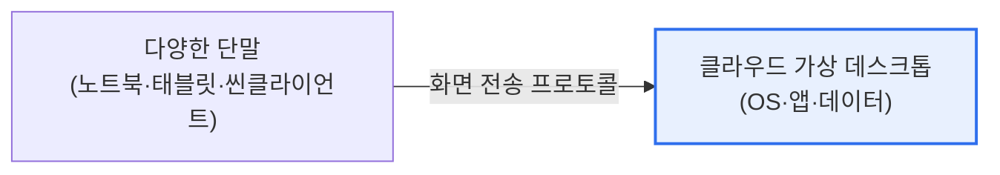

# DaaS(Desktop as a Service)

## 1. 개요

### 가. 정의
> **DaaS(Desktop as a Service)** 는 데스크톱 환경(OS·애플리케이션·데이터)을 **클라우드에서 가상으로 제공하고, 사용자는 어떤 기기로든 접속해 이용**하는 클라우드 서비스다. 가상 데스크톱(VDI)을 클라우드에서 구독형으로 제공하는 형태다.

DaaS의 핵심 가치는 '**업무 환경을 개인 PC가 아니라 클라우드에 두는 것**'이다. 전통적으로 업무 데이터와 프로그램은 각자의 PC에 설치되어, PC를 잃어버리면 데이터가 유출되고 여러 기기에서 일관되게 일하기 어려웠다. DaaS는 데스크톱 자체를 클라우드에 올린다. 사용자의 화면·OS·앱·데이터가 모두 클라우드 서버에 있고, 사용자는 노트북·태블릿·씬클라이언트 등 어떤 단말로든 접속해 그 화면만 받아 쓴다. 실제 연산과 데이터는 클라우드에 있으므로, 단말은 화면을 보여주는 창 역할만 한다. 그 결과 어디서나 같은 업무 환경에 접속하고(이동성), 데이터가 단말에 남지 않아 분실·유출 위험이 줄며(보안), IT 부서는 중앙에서 데스크톱을 일괄 관리·배포할 수 있다(관리 효율). 특히 원격근무·재택이 확산되면서 안전하고 유연한 업무 환경 제공 수단으로 각광받았다.

### 나. 등장 배경
원격·재택근무 확산, BYOD(개인기기 업무 활용), 보안 강화 요구가 맞물리며, 어디서나 안전하게 접속하는 클라우드 데스크톱의 필요성이 커졌다.

## 2. 구조

사용자 단말과 클라우드의 가상 데스크톱이 원격 프로토콜(RDP·PCoIP 등)로 연결되어, 화면·입력만 오가고 실제 처리·데이터는 클라우드에 있다.

## 3. VDI와의 비교

| 구분 | 온프레미스 VDI | DaaS |
|---|---|---|
| **인프라** | 자체 구축·운영 | 클라우드(CSP) 제공 |
| **비용** | 초기 투자 큼 | 구독형(사용량 기반) |
| **확장** | 제한적 | 탄력적(신속 증감) |
| **관리** | 직접 | CSP 위탁·간소 |

DaaS는 VDI를 직접 구축하는 부담(초기 투자·운영)을 없애고, 클라우드의 탄력성·구독 모델로 제공한다는 점이 차별점이다.

## 4. 고려사항 및 시사점

1. **네트워크 의존성과 지연**에 유의한다. 화면을 실시간 전송하므로 네트워크가 불안정하면 사용성이 떨어진다. 안정적 대역폭과 저지연 프로토콜이 품질을 좌우한다.
2. **보안과 중앙 관리가 강점**이다. 데이터가 단말에 남지 않아 분실·유출 위험이 낮고, IT 부서가 중앙에서 패치·정책을 일괄 적용해 보안과 관리 효율을 높인다.
3. **제로트러스트·원격근무의 기반**이다. 어디서 접속하든 클라우드에서 통제된 환경을 제공하므로, 제로트러스트 보안과 결합해 안전한 하이브리드 근무를 실현한다.

---

> **한 줄 요약**: DaaS는 *데스크톱 환경을 클라우드에서 가상 제공* 해 어떤 단말로든 접속하는 서비스로, VDI를 구독형·탄력적으로 제공하며 이동성·보안(데이터 미잔류)·중앙 관리 강점으로 원격근무·제로트러스트의 기반이 된다.
