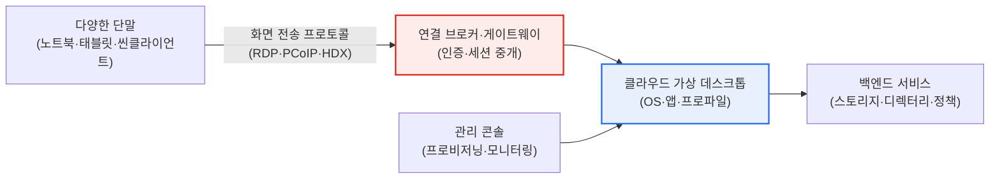
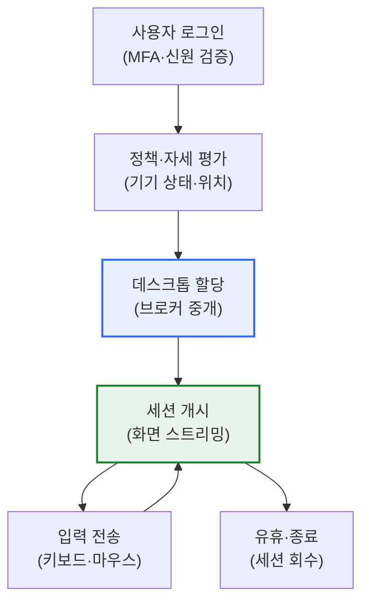

# DaaS(Desktop as a Service)

## 1. 개요

### 가. 정의

> **DaaS(Desktop as a Service)** 는 데스크톱 환경(OS·애플리케이션·사용자 데이터·설정)을 **클라우드에서 가상 인스턴스로 제공하고, 사용자는 어떤 기기로든 접속해 이용**하는 구독형 클라우드 서비스다. 가상 데스크톱 인프라(VDI)를 기업이 직접 구축·운영하는 대신, 클라우드 사업자(CSP)가 관리형으로 제공하는 형태다.

DaaS의 핵심 가치는 '**업무 환경을 개인 PC가 아니라 클라우드에 두는 것**'이다. 전통적으로 업무 데이터와 프로그램은 각자의 PC에 설치되어, PC를 분실하면 데이터가 유출되고 여러 기기에서 일관되게 일하기 어려웠으며, IT 부서는 수백 대의 단말을 일일이 관리해야 했다. DaaS는 데스크톱 자체를 클라우드에 올려 이 구조를 뒤집는다. 사용자의 화면·OS·앱·데이터가 모두 클라우드 서버에 있고, 사용자는 노트북·태블릿·씬클라이언트 등 어떤 단말로든 접속해 그 '화면'만 전송받아 조작한다. 실제 연산과 데이터는 클라우드에 있으므로, 단말은 화면을 보여주고 키보드·마우스 입력을 전달하는 창(窓) 역할만 한다.

그 결과 세 가지 효과가 동시에 발생한다. 첫째, 어디서나 같은 업무 환경에 접속하는 **이동성**이다. 사무실 PC와 재택 노트북이 동일한 데스크톱을 바라보므로 작업의 연속성이 보장된다. 둘째, 데이터가 단말에 남지 않아 분실·유출 위험이 줄어드는 **보안성**이다. 도난당한 노트북에는 화면 캐시만 있을 뿐 실제 데이터는 클라우드에 남는다. 셋째, IT 부서가 중앙에서 데스크톱을 일괄 생성·패치·회수하는 **관리 효율**이다. 신규 입사자에게 완성된 데스크톱을 수 분 만에 발급하고, 퇴사 시 즉시 회수할 수 있다. 특히 원격근무·재택이 확산되면서 안전하고 유연한 업무 환경 제공 수단으로 각광받았다.

### 나. 등장 배경과 필요성

DaaS의 부상은 세 흐름이 맞물린 결과다. 첫째, **원격·하이브리드 근무의 상시화**다. 팬데믹을 계기로 재택이 보편화되면서, 통제되지 않은 가정 네트워크와 개인 기기에서 회사 데이터에 접근하는 상황이 일상이 되었다. 데이터를 단말에 내려받지 않고 클라우드에서만 다루는 DaaS는 이 위험을 구조적으로 낮춘다. 둘째, **BYOD(Bring Your Own Device)** 확산이다. 개인 기기로 업무를 보려는 요구가 커졌지만, 개인 기기에 회사 데이터를 두는 것은 보안상 위험하다. DaaS는 '기기는 개인 것, 데이터는 클라우드'로 분리해 이 딜레마를 해소한다. 셋째, **초기 투자 부담 회피**다. 온프레미스 VDI는 서버·스토리지·네트워크에 막대한 초기 투자와 전문 운영 인력을 요구한다. DaaS는 이를 구독형 운영비(OpEx)로 전환해 중소기업도 가상 데스크톱을 도입할 수 있게 했다.

이러한 배경에서 DaaS는 단순한 '클라우드 PC'를 넘어, 제로트러스트 보안과 결합해 '어디서 접속하든 신원과 상태를 검증한 뒤 통제된 환경만 제공'하는 차세대 업무 인프라의 한 축으로 자리 잡고 있다.

## 2. DaaS의 아키텍처와 구성요소

DaaS는 사용자 단말, 원격 표시 프로토콜, 클라우드의 가상 데스크톱, 그리고 이를 관리하는 제어 평면(control plane)으로 구성된다. 아래 전체 구조도는 각 요소가 어떻게 연결되는지를 보여준다.

```mermaid
flowchart LR
  U["다양한 단말<br/>(노트북·태블릿·씬클라이언트)"] -->|"화면 전송 프로토콜(RDP·PCoIP·HDX)"| B["연결 브로커·게이트웨이<br/>(인증·세션 중개)"]
  B --> C["클라우드 가상 데스크톱<br/>(OS·앱·프로파일)"]
  C --> S["백엔드 서비스<br/>(스토리지·디렉터리·정책)"]
  M["관리 콘솔<br/>(프로비저닝·모니터링)"] --> C
  style C fill:#e8f0fe,stroke:#2f6fed,stroke-width:2px
  style B fill:#fdecea,stroke:#d93025,stroke-width:2px
```

이 구조에서 **연결 브로커(Connection Broker)** 는 핵심 관문이다. 사용자가 접속하면 먼저 신원을 인증하고, 해당 사용자에게 할당된 가상 데스크톱으로 세션을 중개한다. 다중 사용자가 접속할 때 어떤 인스턴스로 연결할지, 유휴 세션을 언제 종료할지도 브로커가 결정한다. 브로커가 병목이 되거나 장애가 나면 전 사용자가 접속 불능이 되므로, 이중화와 확장성이 설계의 중심이 된다.

**원격 표시 프로토콜**은 사용성을 좌우하는 두 번째 축이다. RDP(마이크로소프트), PCoIP·Blast(옴니사·오미니사 계열), HDX(시트릭스) 등이 대표적이며, 화면을 얼마나 효율적으로 압축·전송하는지, 영상·그래픽·오디오를 얼마나 매끄럽게 재현하는지가 프로토콜마다 다르다. 특히 그래픽 작업(설계·영상편집)에는 GPU 가속과 고효율 코덱이 필수라, 프로토콜과 인스턴스 사양 선택이 곧 사용자 만족도로 직결된다.

### 가. 세션 생성과 프로파일 관리

DaaS에서 자주 간과되는 부분이 **사용자 프로파일과 상태 관리**다. 가상 데스크톱은 크게 '전용(persistent)'과 '비전용(non-persistent)'으로 나뉜다. 전용 데스크톱은 사용자별로 고정 인스턴스를 주어 개인 설정·설치 프로그램이 그대로 유지되지만, 인스턴스 수만큼 자원과 비용이 든다. 비전용 데스크톱은 접속할 때마다 표준 이미지에서 새 인스턴스를 띄우고, 사용자별 데이터·설정은 별도 프로파일 저장소에서 불러와 결합한다. 자원 효율이 높지만 프로파일 로딩 설계가 정교하지 않으면 로그인 지연이나 설정 유실이 발생한다. 어느 방식을 택하느냐는 비용, 개인화 요구, 규제 환경을 종합해 결정하는 트레이드오프다.

### 나. 실시간 세션 흐름

아래는 사용자가 접속해 작업하는 순간의 데이터 흐름을 세부화한 것이다. 실제 처리와 데이터는 클라우드에 머물고, 단말과는 화면·입력만 오간다는 점이 핵심이다.

```mermaid
flowchart TB
  L["사용자 로그인<br/>(MFA·신원 검증)"] --> P["정책·자세 평가<br/>(기기 상태·위치)"]
  P --> A["데스크톱 할당<br/>(브로커 중개)"]
  A --> R["세션 개시<br/>(화면 스트리밍)"]
  R --> I["입력 전송<br/>(키보드·마우스)"]
  I --> R
  R --> D["유휴·종료<br/>(세션 회수)"]
  style A fill:#e8f0fe,stroke:#2f6fed,stroke-width:2px
  style R fill:#e6f4ea,stroke:#1e7e34,stroke-width:2px
```

이 흐름에서 주목할 점은 **로그인 시점의 정책·자세 평가(posture check)** 다. 제로트러스트 원칙에 따라, 단순히 비밀번호가 맞는지가 아니라 접속 기기의 보안 상태(백신·패치·탈옥 여부), 위치, 시간대까지 평가해 접근 수준을 동적으로 결정한다. 예컨대 관리되지 않는 기기에서 접속하면 파일 다운로드·클립보드 복사·프린트를 차단한 제한 세션만 허용하는 식이다. 이처럼 DaaS는 세션 개시 순간에 보안 통제를 강제할 수 있다는 점에서, 단말에 흩어진 데이터를 사후에 통제하는 전통 방식보다 근본적으로 안전하다.

## 3. VDI 및 유사 서비스와의 비교

DaaS는 온프레미스 VDI에서 출발했지만 운영 주체와 비용 구조가 다르다. 또한 애플리케이션만 제공하는 서비스나 원격 PC 접속과도 구분된다.

| 구분 | 온프레미스 VDI | DaaS |
|---|---|---|
| **인프라** | 자체 구축·운영 | 클라우드(CSP) 제공·관리 |
| **비용 구조** | 초기 투자(CapEx) 큼 | 구독형(OpEx, 사용량 기반) |
| **확장성** | 물리 자원 한계 | 탄력적(신속 증감) |
| **운영 책임** | 기업 IT 전담 | CSP 위탁·간소화 |
| **도입 속도** | 수개월 | 수일~수주 |

DaaS가 온프레미스 VDI와 갈라지는 근본 이유는 **자본 지출을 운영 지출로 전환**한다는 데 있다. VDI를 직접 구축하려면 피크 사용량에 맞춰 서버를 미리 사 두어야 하고, 그 자원은 평상시 유휴로 남는다. DaaS는 필요한 만큼만 빌려 쓰고 쓴 만큼 내므로, 계절적 인력 변동(신입 대량 채용, 프로젝트 단위 인력)에 탄력적으로 대응한다. 다만 장기적으로 사용량이 크고 안정적이라면 총소유비용(TCO) 측면에서 온프레미스 VDI가 유리할 수 있어, '무조건 DaaS가 싸다'는 단정은 피해야 한다.

한편 유사 개념과의 차이도 명확히 할 필요가 있다. **SaaS/애플리케이션 가상화**가 특정 앱 하나만 원격 제공한다면, DaaS는 OS를 포함한 완전한 데스크톱을 제공한다. 또 개인 사무실 PC를 원격 제어하는 '원격 접속'과 달리, DaaS는 물리 PC 없이 클라우드에서 데스크톱을 생성하므로 확장성과 관리 효율이 근본적으로 다르다.

## 4. 활용 사례

DaaS는 특정 업무 패턴에서 특히 강점을 발휘하며, 산업별로 도입 동기가 다르다. 아래 표는 대표 시나리오와 그 시나리오에서 DaaS가 주는 핵심 이점을 정리한 것이며, 이어지는 문단에서 각 사례의 맥락을 설명한다.

| 시나리오 | 특징 | DaaS의 핵심 이점 |
|---|---|---|
| **콜센터·현장직** | 대규모 표준 업무, 인력 변동 잦음 | 일괄 이미지·신속 증감 |
| **외주·협력사** | 외부 인력의 한시적 접근 | 데이터 미반출·즉시 회수 |
| **글로벌·재해대응** | 지사·재택·비상 상황 | 동일 환경·업무연속성(BCP) |
| **그래픽·연구 업무** | 설계·영상·AI 개발 | GPU 공유·고사양 절감 |

첫째, **콜센터·현장직 등 대규모 표준 업무**다. 수백~수천 명이 동일한 업무 앱을 쓰는 환경에서는 비전용 데스크톱을 표준 이미지로 일괄 제공해 관리 부담을 크게 줄인다. 인력 변동이 잦은 계절성 사업에서 신속한 증감이 특히 유효하다.

둘째, **외부 인력·협력사 접근 통제**다. 외주 개발자나 협력사에 회사 데이터를 단말로 내주지 않고 통제된 클라우드 데스크톱만 제공하면, 계약 종료 시 데스크톱을 회수하는 것만으로 접근을 즉시 차단할 수 있다. 금융·공공처럼 데이터 반출이 엄격히 통제되는 분야에서 사례가 많다.

셋째, **글로벌·재해 대응**이다. 지사·해외 인력에게 본사와 동일한 환경을 클라우드로 제공하고, 재해로 사무실을 쓸 수 없을 때도 어디서나 업무를 재개할 수 있어 업무연속성계획(BCP)의 수단이 된다. 실제로 원격근무 확산기에 많은 기업이 짧은 기간에 DaaS를 도입해 재택 전환을 마친 사례가 보고된다.

## 5. 심화: 제로트러스트·DaaS 시장의 진화

DaaS의 전략적 의미는 **제로트러스트 아키텍처의 실행 지점**이 된다는 데 있다. 제로트러스트는 '신뢰하지 말고 항상 검증하라'는 원칙인데, DaaS는 이를 구현하기 좋은 지점이다. 모든 접근이 브로커·게이트웨이라는 단일 통제점을 거치고, 세션 단위로 신원·기기 상태를 검증하며, 데이터가 단말로 흘러가지 않기 때문이다. 이런 이유로 DaaS는 SASE(Secure Access Service Edge)·SDP(Software Defined Perimeter)와 결합해 '경계 없는 안전한 업무 접근'의 핵심 구성요소로 자리 잡고 있다.

시장 측면에서는 주요 클라우드 사업자가 관리형 DaaS를 경쟁적으로 제공하고 있다. 마이크로소프트의 Windows 365·Azure Virtual Desktop, 아마존의 Amazon WorkSpaces, 그리고 시트릭스·옴니사(구 VMware 엔드유저컴퓨팅) 계열의 클라우드 제공이 대표적이다. 제품별로 과금 방식(월정액 vs 사용량), 지원 프로토콜, GPU 지원, 관리 통합 수준이 다르므로 선정 시 세밀한 비교가 필요하다. 구체적 시장 규모·점유율 수치는 조사기관마다 편차가 크므로 특정 값을 단정하기보다, '원격근무 상시화와 보안 요구로 성장세가 뚜렷하다'는 방향성으로 이해하는 것이 안전하다.

또 하나의 진화는 **GPU 기반 고성능 DaaS**다. 과거 DaaS는 문서·웹 중심 경량 업무에 적합했으나, GPU 인스턴스와 고효율 코덱의 발전으로 설계(CAD)·영상편집·AI 개발처럼 그래픽·연산 집약 업무까지 클라우드 데스크톱으로 수용하는 사례가 늘고 있다. 이는 고사양 워크스테이션을 개인에게 지급하는 대신 클라우드 자원을 공유해 비용을 낮추는 새로운 활용 모델을 연다.

## 6. 고려사항 및 시사점 (기술사 관점)

1. **네트워크 의존성과 지연이 사용성을 좌우한다.** DaaS는 화면을 실시간 전송하므로 네트워크 품질이 곧 체감 성능이다. 대역폭 부족·고지연 환경에서는 입력 반응이 느려져 생산성이 떨어진다. 저지연 프로토콜, 사용자 인접 리전 배치(엣지), 오프라인 대비책을 함께 설계해야 하며, 특히 그래픽 업무는 GPU·코덱 사양을 별도로 검토해야 한다.

2. **보안과 중앙 관리가 최대 강점이자 새로운 단일 실패점이다.** 데이터가 단말에 남지 않아 유출 위험이 낮고 중앙 패치·정책 적용으로 관리가 간소화되지만, 반대로 브로커·게이트웨이가 뚫리거나 다운되면 전체가 마비된다. 제로트러스트 기반 접근 통제, 세션 격리, 관리 평면 이중화로 강점은 살리고 집중 리스크는 분산해야 한다.

3. **비용은 사용 패턴에 따라 재평가해야 한다.** DaaS는 초기 투자를 없애지만, 사용량이 크고 안정적이면 장기 TCO에서 온프레미스 VDI보다 비쌀 수 있다. 전용/비전용 혼합, 유휴 세션 자동 종료, 오토스케일링으로 비용을 최적화하고, 도입 전 사용 시나리오별 TCO 시뮬레이션으로 의사결정하는 것이 바람직하다.

4. **제로트러스트·원격근무 인프라의 기반으로 통합 설계한다.** DaaS를 개별 도구가 아니라 신원관리(IAM)·MFA·SASE·EDR과 연동되는 보안 접근 체계의 일부로 설계해야 효과가 극대화된다. 접속 순간의 신원·기기 자세 검증을 강제하고, 접근 수준을 동적으로 조정하는 정책을 표준화해야 한다.

5. **데이터 주권·규제 준수와 종속성(lock-in)을 함께 고려한다.** 데이터와 데스크톱이 특정 CSP에 위치하므로, 데이터 보관 리전·개인정보 규제 준수·CSP 종속 위험을 사전에 점검해야 한다. 프로파일·이미지의 이식성을 확보하고 출구 전략을 마련해, 특정 사업자에 과도하게 묶이지 않도록 거버넌스를 설계하는 것이 기술사 관점의 핵심이다.

## 참고자료

- Microsoft, "What is Azure Virtual Desktop?" — https://learn.microsoft.com/azure/virtual-desktop/overview
- Amazon Web Services, "Amazon WorkSpaces" — https://aws.amazon.com/workspaces/
- NIST SP 800-207, "Zero Trust Architecture" — https://csrc.nist.gov/pubs/sp/800/207/final

---

> **한 줄 요약**: DaaS는 *데스크톱 환경(OS·앱·데이터)을 클라우드에서 가상 제공* 해 어떤 단말로든 접속하는 구독형 서비스로, 연결 브로커·원격 표시 프로토콜·프로파일 관리를 축으로 VDI를 탄력적으로 대체하며, 이동성·보안(데이터 미잔류)·중앙 관리 강점으로 제로트러스트·원격근무의 기반이 되되 네트워크 의존성·집중 리스크·TCO·CSP 종속을 함께 관리해야 한다.
