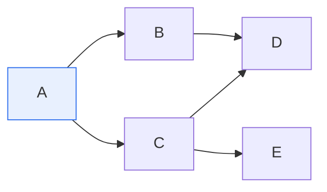

# 방향성 비순환 그래프(DAG)와 위상정렬

## 1. 개요

### 가. DAG의 개념과 특징
> **방향성 비순환 그래프(DAG, Directed Acyclic Graph)** 는 **간선에 방향이 있고(directed), 어떤 정점에서 출발해 자신으로 되돌아오는 순환(cycle)이 없는** 그래프다. 작업의 선후 관계·의존성을 표현하는 데 적합하다.

DAG가 널리 쓰이는 근본 이유는 '**순서와 의존 관계가 있는 일을 표현하기에 딱 맞다**'는 데 있다. 방향이 있다는 것은 "A 다음에 B"라는 순서를, 순환이 없다는 것은 "돌고 도는 모순이 없다"는 것을 뜻한다. 만약 순환이 있으면 A는 B에 앞서야 하는데 B도 A에 앞서야 하는 논리적 모순이 생겨, 순서를 정할 수 없다. DAG는 이런 모순이 없으므로 항상 실행 순서를 정할 수 있다. 그래서 선수과목 이수 관계, 빌드 시스템의 컴파일 의존성, 프로젝트 작업 순서(PERT/CPM), 데이터 파이프라인(Airflow), 스프레드시트 수식 계산, 심지어 블록체인·Git 커밋 이력까지 '순서 있는 의존 관계'는 대부분 DAG로 표현된다. DAG의 이 특성을 활용해 '어떤 순서로 처리해야 모든 의존성을 만족하는가'를 구하는 것이 위상정렬이다.

### 나. 특징
| 특징 | 내용 |
|---|---|
| **방향성** | 간선에 방향(선후·의존 관계) |
| **비순환** | 사이클 없음 → 모순 없는 순서 존재 |
| **위상정렬 가능** | 항상 선형 순서로 나열 가능 |

## 2. 위상정렬(Topological Sort)

> **위상정렬**은 DAG의 모든 정점을, **모든 간선이 앞→뒤 방향이 되도록(선행 정점이 후행 정점보다 먼저 오도록) 일렬로 나열**하는 것이다.

위 DAG에서 위상정렬은 "모든 화살표가 왼쪽→오른쪽을 향하도록" 정점을 줄 세우는 것이다. 예: **A → B → C → D → E** 또는 **A → C → B → E → D** 등 (여러 해가 가능). 핵심은 어떤 정점보다 그 정점을 가리키는 선행 정점이 먼저 나와야 한다는 것이다.

**대표 알고리즘 — Kahn 알고리즘**: 진입차수(들어오는 간선 수)가 0인 정점을 찾아 나열하고 제거하기를 반복한다.

| 단계 | 내용 |
|---|---|
| ① | 각 정점의 진입차수 계산 |
| ② | 진입차수 0인 정점을 큐에 넣고 결과에 추가 |
| ③ | 그 정점 제거, 인접 정점의 진입차수 감소 |
| ④ | 새로 진입차수 0이 된 정점을 큐에 추가, 반복 |

위 예에서 A(진입 0)→ 제거하면 B·C 진입 0 → B,C 나열 → D는 B,C 모두 처리 후, E는 C 처리 후 → 결과 예: **A, B, C, D, E**. (진입차수 0이 없는데 정점이 남으면 사이클이 있다는 뜻이다.)

## 3. 활용

| 분야 | 활용 |
|---|---|
| **빌드·컴파일** | 소스 의존성 순서 결정(Make) |
| **작업 스케줄링** | 선후 관계 작업 순서(PERT/CPM) |
| **데이터 파이프라인** | 태스크 의존 실행(Airflow DAG) |
| **선수과목·의존성 해결** | 이수·설치 순서 결정 |

## 4. 고려사항 및 시사점

1. **사이클 탐지 도구로도 쓰인다.** 위상정렬이 불가능하면(모든 정점을 나열 못 하면) 그래프에 순환이 있다는 뜻이므로, 의존성 순환·교착 탐지에 활용된다.
2. **여러 해가 존재**한다. 위상정렬 결과는 유일하지 않으며(제약이 없는 정점 간 순서는 자유), 필요에 따라 우선순위를 추가해 결정적 순서를 얻는다.
3. **의존성 관리의 기반**이다. 현대 빌드 시스템·워크플로 엔진·패키지 관리자가 DAG와 위상정렬로 의존성을 해결하므로, 대규모 시스템의 자동화·병렬 실행 최적화의 핵심 개념이다. [[stack-queue-list]]

---

> **한 줄 요약**: DAG는 *방향이 있고 순환이 없는 그래프* 로 선후·의존 관계 표현에 적합하며, 위상정렬은 *모든 간선이 앞→뒤가 되도록 정점을 나열* (Kahn 알고리즘: 진입차수 0부터 제거)해 빌드·스케줄링·파이프라인의 실행 순서를 결정한다.
