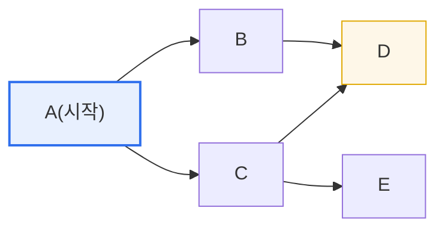
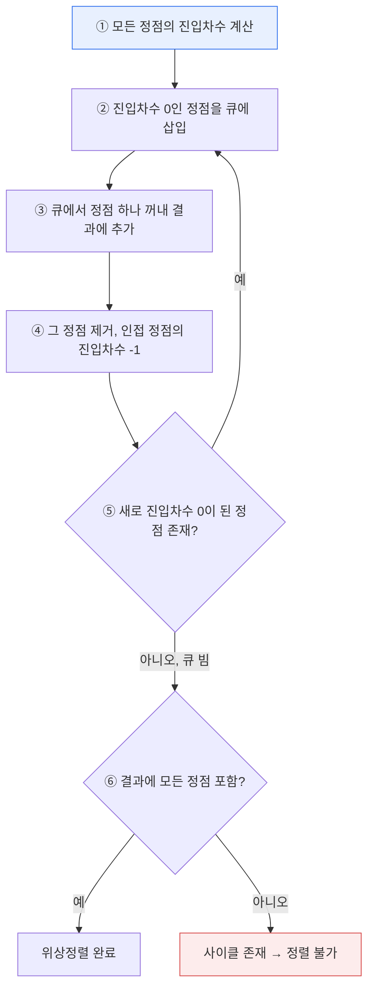

# 방향성 비순환 그래프(DAG)와 위상정렬

## 1. 개요

### 가. DAG의 개념

> **방향성 비순환 그래프(DAG, Directed Acyclic Graph)** 는 **간선에 방향이 있고(directed), 어떤 정점에서 출발해 자신으로 되돌아오는 순환(cycle)이 없는** 그래프다. 작업의 선후 관계·의존성을 모순 없이 표현하는 데 적합한 자료구조다.

DAG가 컴퓨터과학 전 분야에서 널리 쓰이는 근본 이유는 '**순서와 의존 관계가 있는 일을 표현하기에 딱 맞다**'는 데 있다. 간선에 방향이 있다는 것은 "A 다음에 B"라는 선후(precedence) 관계를, 순환이 없다는 것은 "돌고 도는 논리적 모순이 없다"는 것을 뜻한다. 만약 순환이 있으면 A는 B에 앞서야 하는데 동시에 B도 A에 앞서야 하는 모순이 생겨 실행 순서를 정할 수 없다. DAG는 구조적으로 이런 모순을 배제하므로 **항상 유효한 실행 순서가 존재함이 보장**된다.

이 성질 덕분에 현실의 수많은 '순서 있는 의존 관계'가 DAG로 모델링된다. 대학의 선수과목 이수 관계, 빌드 시스템의 컴파일 의존성(예: `main.o`는 `main.c`가 컴파일된 뒤에 링크), 프로젝트 일정 관리(PERT/CPM의 작업 네트워크), 데이터 파이프라인(Apache Airflow의 워크플로 정의), 스프레드시트의 수식 재계산 순서, 나아가 블록체인·Git 커밋 이력(부모 커밋을 가리키는 방향 그래프)까지 모두 DAG다. 즉 DAG는 특정 알고리즘이 아니라 **의존성이라는 문제 영역을 표현하는 공통 언어**에 가깝다.

이렇게 표현된 DAG에서 '어떤 순서로 처리해야 모든 의존성을 만족하는가'를 실제로 계산해 내는 절차가 바로 **위상정렬(Topological Sort)** 이다. 따라서 DAG는 문제를 표현하는 모델이고, 위상정렬은 그 모델을 푸는 대표 알고리즘이라는 관계로 이해하면 된다.

### 나. 등장 배경과 필요성

초기 소프트웨어 빌드나 작업 스케줄링은 사람이 수작업으로 순서를 나열했으나, 구성요소가 수백~수천 개로 늘면서 의존 관계가 복잡하게 얽히기 시작했다. 예컨대 수백 개의 소스 파일을 가진 프로젝트에서 "무엇을 먼저 컴파일해야 하는가"를 사람이 매번 계산하는 것은 불가능에 가깝고, 순환 의존이 숨어 있으면 발견조차 어렵다. 이 문제를 자동화하기 위해 **의존 관계를 그래프로 표현하고 실행 순서를 기계적으로 도출**하는 방식이 필요해졌고, DAG와 위상정렬이 그 이론적·실용적 기반이 되었다.

또한 병렬·분산 처리의 확산도 DAG의 중요성을 키웠다. 서로 의존하지 않는 작업은 동시에 실행할 수 있는데, DAG 구조를 분석하면 "어떤 작업들이 서로 독립이어서 병렬 가능한가"를 정확히 파악할 수 있다. 즉 DAG는 단순한 순서 결정을 넘어 **병렬화 가능한 최대치를 찾아 자원 활용을 극대화**하는 근거를 제공한다.

### 다. 특징

| 특징 | 내용 | 실무적 함의 |
|---|---|---|
| **방향성(Directed)** | 간선이 선후·의존 관계를 표현 | "A 다음 B"를 명시 |
| **비순환(Acyclic)** | 사이클이 없음 → 모순 없는 순서 존재 | 교착·순환 의존 배제 |
| **위상정렬 가능** | 항상 선형 순서로 나열 가능 | 실행 순서 자동 도출 |
| **부분 순서(Partial Order)** | 독립 정점 간 순서는 자유 | 병렬 실행 여지 파악 |

## 2. 위상정렬의 개념과 구조

> **위상정렬**은 DAG의 모든 정점을, **모든 간선이 앞→뒤 방향이 되도록(선행 정점이 후행 정점보다 먼저 오도록) 일렬로 나열**하는 것이다. 즉 부분 순서(partial order)를 모순 없이 전체 순서(total order)로 확장하는 연산이다.

아래는 DAG 하나와 그에 대한 위상정렬의 의미를 나타낸 전체 구조도다.

```mermaid
flowchart LR
  A["A(시작)"] --> B["B"]
  A --> C["C"]
  B --> D["D"]
  C --> D
  C --> E["E"]
  style A fill:#e8f0fe,stroke:#2f6fed,stroke-width:2px
  style D fill:#fef7e8,stroke:#e0a800
```

위 DAG에서 위상정렬은 "모든 화살표가 왼쪽→오른쪽을 향하도록" 정점을 줄 세우는 작업이다. 예를 들어 **A → B → C → D → E** 또는 **A → C → B → E → D** 등 여러 해가 가능하다. 핵심은 어떤 정점이 나열되기 전에 그 정점을 가리키는 모든 선행 정점이 먼저 나와야 한다는 것이다. D는 B와 C가 모두 처리된 뒤에야 나올 수 있고, E는 C가 처리된 뒤에 나올 수 있다.

여기서 주목할 점은 B와 C 사이에는 간선이 없다는 것이다. 둘 사이에는 선후 제약이 없으므로 B가 먼저 나와도, C가 먼저 나와도 위상정렬로서 모두 유효하다. 이처럼 **제약이 없는 정점 쌍의 순서가 자유롭기 때문에 위상정렬 결과는 유일하지 않으며**, 이 자유도가 곧 병렬 실행의 기회를 의미한다. 실행 엔진 입장에서 B와 C는 동시에 처리할 수 있는 후보다.

### 가. Kahn 알고리즘 (진입차수 기반)

대표적인 위상정렬 알고리즘은 **Kahn 알고리즘**으로, 진입차수(in-degree, 들어오는 간선의 수)가 0인 정점을 반복적으로 찾아 제거하는 방식이다. 진입차수가 0이라는 것은 "그 정점을 앞서야 할 선행 작업이 하나도 남아있지 않다"는 뜻이므로, 지금 당장 실행 가능한 정점이라는 의미다.

```mermaid
flowchart TB
  S["① 모든 정점의 진입차수 계산"] --> Q["② 진입차수 0인 정점을 큐에 삽입"]
  Q --> P["③ 큐에서 정점 하나 꺼내 결과에 추가"]
  P --> R["④ 그 정점 제거, 인접 정점의 진입차수 -1"]
  R --> C{"⑤ 새로 진입차수 0이 된 정점 존재?"}
  C -->|"예"| Q
  C -->|"아니오, 큐 빔"| F{"⑥ 결과에 모든 정점 포함?"}
  F -->|"예"| OK["위상정렬 완료"]
  F -->|"아니오"| CYC["사이클 존재 → 정렬 불가"]
  style S fill:#e8f0fe,stroke:#2f6fed
  style CYC fill:#fdecec,stroke:#d64545
```

이 절차를 앞의 예제 DAG에 적용해 보자. 처음에 진입차수가 0인 정점은 A뿐이다(A는 아무도 가리키지 않음). A를 결과에 넣고 제거하면 B와 C의 진입차수가 각각 0이 된다. 이제 B와 C가 실행 후보가 되며, 큐에서 꺼내는 순서에 따라 결과가 갈린다. B, C를 처리하면 D의 진입차수가 0이 되고(B·C 양쪽 간선이 모두 제거됨), E도 C 처리 시점에 0이 된다. 최종적으로 예컨대 **A, B, C, D, E** 라는 순서를 얻는다.

Kahn 알고리즘의 중요한 부수 효과는 **사이클 탐지**다. 절차가 끝났는데 결과에 포함된 정점 수가 전체 정점 수보다 적다면, 남은 정점들은 서로가 서로를 순환적으로 가리키고 있어 진입차수가 결코 0이 되지 못한 것이다. 즉 "위상정렬에 실패했다 = 그래프에 사이클이 있다"가 성립한다. 시간 복잡도는 정점 수 V와 간선 수 E에 대해 **O(V + E)** 로, 모든 정점과 간선을 상수 번씩만 방문하므로 대규모 그래프에서도 효율적이다.

### 나. DFS 기반 위상정렬

또 다른 방식은 **깊이 우선 탐색(DFS)** 을 이용하는 것이다. 각 정점에서 DFS를 수행하되, 한 정점의 모든 자식(후행 정점) 탐색이 끝나는 시점(post-order, 되돌아 나오는 순간)에 그 정점을 스택에 쌓는다. 모든 탐색이 끝난 뒤 스택을 역순으로 꺼내면 위상정렬 결과가 된다.

이 방식이 성립하는 이유는 직관적이다. 어떤 정점 u에서 v로 가는 간선이 있다면, DFS는 u의 탐색을 끝내기 전에 반드시 v의 탐색을 먼저 끝낸다(v가 u의 후손이므로). 따라서 v가 u보다 먼저 스택에 쌓이고, 스택을 역순으로 읽으면 u가 v보다 앞에 오게 되어 "선행이 먼저"라는 위상정렬 조건이 자동으로 충족된다. DFS 방식도 각 정점·간선을 한 번씩 방문하므로 시간 복잡도는 **O(V + E)** 로 동일하며, 탐색 도중 아직 탐색이 끝나지 않은 정점(회색 정점)으로 향하는 역방향 간선(back edge)을 만나면 사이클이 있다고 판정한다.

두 알고리즘은 성능이 동일하지만 성격이 다르다. Kahn 알고리즘은 큐를 사용해 반복(iterative)으로 구현되어 스택 오버플로 위험이 없고, 진입차수 0인 정점이 여러 개일 때 병렬 실행 후보를 자연스럽게 드러낸다는 장점이 있어 워크플로 스케줄러에 적합하다. 반면 DFS 방식은 재귀로 간결하게 구현되며 강한 연결 요소(SCC) 분해 등 다른 그래프 분석과 결합하기 좋다.

## 3. 활용 사례

위상정렬은 이론에 머무르지 않고 우리가 매일 쓰는 도구들의 엔진 속에서 동작한다. 아래 사례들은 모두 "의존 관계를 DAG로 표현하고 위상정렬로 실행 순서를 도출한다"는 동일한 원리를 공유한다.

| 분야 | 활용 | 구체 사례 |
|---|---|---|
| **빌드·컴파일** | 소스 의존성 순서 결정 | Make, Bazel의 타깃 그래프 |
| **작업 스케줄링** | 선후 작업 순서·임계경로 | PERT/CPM, MS Project |
| **데이터 파이프라인** | 태스크 의존 실행·병렬화 | Apache Airflow, Dagster |
| **패키지 관리** | 설치·의존성 해결 순서 | apt, npm, Maven |
| **선수과목·커리큘럼** | 이수 순서 결정 | 대학 수강 신청 시스템 |

가장 대표적인 사례는 **데이터 파이프라인 오케스트레이션**이다. Apache Airflow는 워크플로를 문자 그대로 'DAG'라고 부르며, 각 태스크(예: 데이터 추출 → 정제 → 집계 → 적재)를 정점으로, 의존 관계를 간선으로 정의한다. 스케줄러는 이 DAG를 위상정렬해 실행 순서를 정하되, 서로 의존하지 않는 태스크(예: 서로 다른 두 소스에서의 추출)는 동시에 실행해 처리 시간을 단축한다. 수백 개 태스크로 이뤄진 파이프라인에서 순환 의존이 실수로 정의되면 Airflow는 DAG 등록 단계에서 이를 거부하는데, 이것이 바로 위상정렬 실패를 통한 사이클 탐지의 실제 적용이다.

두 번째 사례는 **빌드 시스템**이다. 구글의 Bazel이나 전통적인 Make는 소스·헤더·라이브러리 간 의존 관계를 DAG로 구성하고 위상정렬 순서로 컴파일한다. 이때 변경되지 않은 정점의 결과를 캐시하면(증분 빌드), 수만 개 파일 규모의 대형 코드베이스에서도 변경분과 그에 의존하는 부분만 다시 빌드해 빌드 시간을 분 단위에서 초 단위로 줄일 수 있다. 여기서도 의존이 없는 타깃들은 다수의 CPU 코어에 분산해 병렬 컴파일한다.

세 번째 사례는 **프로젝트 일정 관리(PERT/CPM)** 다. 작업(activity)을 정점으로, 선후 관계를 간선으로 놓은 DAG에서 위상정렬 순서로 각 작업의 최早·最遲 시작 시각을 계산하면, 전체 프로젝트 기간을 결정하는 **임계경로(Critical Path)** 를 찾을 수 있다. 예컨대 20개 작업으로 구성된 프로젝트에서 임계경로상의 작업이 하루 지연되면 프로젝트 전체가 하루 지연되므로, 관리자는 이 경로에 자원을 집중한다.

## 4. 심화: 병렬 스케줄링과 사이클 처리 전략

현대 시스템에서 위상정렬의 가치는 단순 순서 결정보다 **병렬 실행 최적화**에 있다. Kahn 알고리즘을 변형해, 매 라운드마다 진입차수가 0인 정점들을 '한 묶음(레벨)'으로 동시에 처리하면 DAG를 여러 레벨로 나눌 수 있다. 각 레벨 안의 정점들은 서로 독립이므로 병렬 실행이 가능하고, 레벨 수가 곧 병렬 실행 시 최소 단계 수가 된다. 이 개념은 GPU 연산 그래프 스케줄링, 분산 배치 처리, 하드웨어 회로의 조합 논리 지연 분석 등에 그대로 쓰인다.

한편 실무에서는 "원래 DAG여야 하는데 사이클이 생기는" 문제가 자주 발생한다. 마이크로서비스 간 순환 호출 의존, 순환 참조를 가진 모듈, 스프레드시트의 순환 참조 수식 등이 그 예다. 이때는 (1) 위상정렬로 사이클을 탐지·경고하거나, (2) 강한 연결 요소(SCC)를 하나의 슈퍼 정점으로 축약해(응축 그래프, condensation) 남은 부분만이라도 DAG로 처리하거나, (3) 의존을 끊는 리팩터링(인터페이스 분리, 이벤트 기반 비동기화)으로 사이클 자체를 제거하는 전략을 쓴다. 딥러닝 프레임워크의 계산 그래프도 순전파는 DAG이지만 순환신경망(RNN)은 시간축으로 펼쳐(unrolling) DAG로 변환한 뒤 역전파를 수행한다.

빅데이터·AI 영역에서도 DAG는 핵심 추상화다. Apache Spark는 사용자의 변환 연산들을 DAG로 구성한 뒤 이를 여러 스테이지로 나눠 실행 계획을 최적화하며, TensorFlow·PyTorch의 자동 미분도 순전파 계산 그래프(DAG)를 역방향으로 순회해 기울기를 전파한다. 이처럼 "연산을 DAG로 표현하고 위상 순서로 실행·미분한다"는 패턴은 현대 데이터·AI 스택 전반의 공통 설계 원리로 자리 잡았다.

## 5. 고려사항 및 시사점

1. **사이클 탐지·교착 예방 도구로 활용한다.** 위상정렬 가능 여부는 곧 그래프의 비순환성 판정이므로, 의존성 순환·자원 교착(deadlock)·순환 참조를 조기에 발견하는 검증 수단으로 쓸 수 있다. 대규모 시스템 설계 시 의존 그래프를 주기적으로 위상정렬해 순환 의존을 아키텍처 품질 지표로 관리하는 전략이 유효하다.

2. **병렬화 여지를 정량적으로 파악해 자원 활용을 최적화한다.** 위상정렬의 부분 순서 성질은 어떤 작업들이 독립적인지를 드러내므로, 레벨 분할을 통해 병렬 실행 가능한 최대치와 임계경로 길이를 계산할 수 있다. 이는 스케줄링·자원 배분·성능 예측의 정량적 근거가 된다.

3. **결과의 비유일성을 제어할 전략이 필요하다.** 위상정렬 해는 여러 개이므로, 재현 가능한 빌드나 결정적 실행이 필요하면 정점 이름·우선순위·비용 등 2차 기준을 부여해 결정적 순서(deterministic order)를 강제해야 한다. 반대로 최적화가 목적이면 이 자유도를 스케줄링 최적화에 활용한다.

4. **동적 변화에 대한 증분 처리를 고려한다.** 실제 시스템의 DAG는 정점·간선이 수시로 추가·삭제되므로, 매번 전체를 재정렬하기보다 변경 영향 범위만 다시 계산하는 증분 위상정렬(incremental topological ordering)이 필요하다. 이는 증분 빌드·실시간 파이프라인의 응답성을 좌우하는 핵심 설계 포인트다.

5. **연계 자료구조·알고리즘과 함께 이해한다.** 위상정렬은 그래프 표현(인접 리스트/행렬), 큐·스택([[stack-queue-list]]), DFS/BFS, 최단·임계경로 계산과 긴밀히 연결된다. 기술사 관점에서는 개별 알고리즘 암기보다 "의존성 문제를 DAG로 모델링하고 위상정렬로 해결한다"는 문제 해결 패러다임을 체득하는 것이 중요하다.

## 참고자료

- Wikipedia, "Topological sorting" — https://en.wikipedia.org/wiki/Topological_sorting
- Wikipedia, "Directed acyclic graph" — https://en.wikipedia.org/wiki/Directed_acyclic_graph
- Apache Airflow Documentation, "DAGs" — https://airflow.apache.org/docs/apache-airflow/stable/core-concepts/dags.html

---

> **한 줄 요약**: DAG는 *방향이 있고 순환이 없는 그래프* 로 선후·의존 관계를 모순 없이 표현하며, 위상정렬은 *모든 간선이 앞→뒤가 되도록 정점을 나열*(Kahn: 진입차수 0부터 제거, 또는 DFS post-order 역순, 모두 O(V+E))하여 빌드·스케줄링·데이터 파이프라인의 실행 순서를 결정하고 병렬화 여지와 사이클을 함께 드러낸다.
