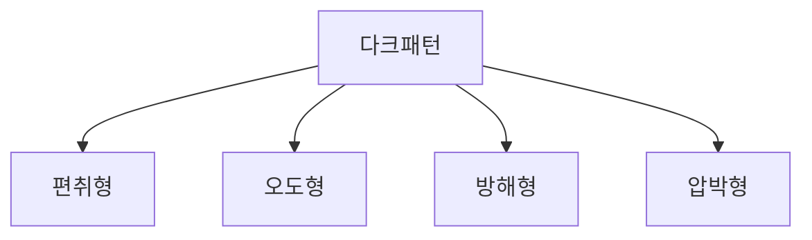

# 다크패턴(Dark Pattern)

## 1. 개요

### 가. 정의
> 사용자를 **기만·오도·방해·압박하여 비합리적 선택을 유도**함으로써 사업자의 이익을 취하도록 설계된 UI/UX 기법. '눈속임 상술'로도 불린다.

다크패턴의 본질은 **인간의 인지적 편향과 습관을 악용**하는 데 있다. 사람은 기본 설정을 그대로 두고(현상유지 편향), 시간 압박을 받으면 충동적으로 결정하며, 복잡한 절차를 만나면 중도 포기한다. 다크패턴은 이런 심리적 약점을 겨냥해 사용자가 자신의 진짜 이익에 반하는 선택(원치 않는 결제, 해지 포기)을 하도록 인터페이스를 의도적으로 비틀어 설계한다.

### 나. 등장 배경 및 문제점
전자상거래와 특히 **구독경제**가 확산되면서 다크패턴 피해가 급증했다. 구독 모델은 "가입은 쉽고 해지는 어렵게" 만들수록 사업자 수익이 늘어나는 구조라, 해지 방해 같은 다크패턴을 유인하는 강한 경제적 동기가 내재한다. 무료체험 후 자동 유료 전환, 숨은 추가 요금처럼 소비자가 인지하지 못한 사이 지출이 발생하는 피해가 누적되자, 공정거래위원회·EU·미국 FTC·OECD가 규율을 강화하는 추세다. 문제의 핵심은 개별 소비자가 손해를 인지하기 어렵고, 인지해도 대응 비용이 커서 방치되기 쉽다는 점이다.

## 2. 세부 유형

다크패턴은 사용자를 속이는 방식에 따라 네 유형으로 나뉘며, 각 유형은 서로 다른 심리를 공략한다. **편취형**은 사용자가 인지하지 못한 사이 결제·추가 구매를 슬쩍 끼워 넣는 방식으로, 주의력의 빈틈을 노린다. **오도형**은 거짓 정보로 잘못된 판단을 유도하는데, 허위 정가를 표시해 할인 착시를 일으키는 것이 전형이다. **방해형**은 사용자가 원하는 행동(해지·탈퇴)을 의도적으로 어렵게 만들어 포기를 유도하며, 가입은 클릭 한 번이지만 해지는 전화만 받는 '로치모텔'이 대표적이다. **압박형**은 긴급성·희소성·죄책감을 자극해 충동적 결정을 몰아붙인다. 예컨대 "지금 3명이 이 상품을 보는 중"이라는 문구나 "혜택을 포기하시겠어요?" 같은 확인 셰이밍이 여기에 해당한다.

| 유형 | 공략 심리 | 세부 기법 | 예시 |
|---|---|---|---|
| **편취형** | 주의력의 빈틈 | 숨은 갱신, 몰래 추가(sneaking) | 무료체험 후 자동 유료 전환 고지 미흡 |
| **오도형** | 잘못된 정보 판단 | 거짓 할인, 위장 광고, 미끼와 스위치 | 허위 정가 표시로 할인 착시 |
| **방해형** | 절차 피로·포기 | 해지·탈퇴 절차 복잡화(로치모텔) | 가입은 원클릭, 해지는 전화만 |
| **압박형** | 긴급성·죄책감 | 품절 임박, 확인 셰이밍 | "지금 3명이 보는 중", 거절 죄책감 문구 |

## 3. 넛지 vs 다크패턴(비교)

다크패턴을 이해하려면 정반대 개념인 **넛지(Nudge)** 와 대조하는 것이 효과적이다. 둘 다 인터페이스로 사용자의 선택을 유도한다는 점에서 겉모습은 비슷하지만, **누구의 이익을 위하는가**에서 갈린다. 넛지는 장기 기증 기본 등록처럼 사용자·사회의 이익을 위해 좋은 선택을 쉽게 만들되 다른 선택의 자유를 보장한다. 반면 다크패턴은 사업자 이익을 위해 사용자를 오도·압박하며 선택의 자유를 실질적으로 침해한다. 따라서 둘을 가르는 결정적 판단 기준은 **소비자의 이익이 침해되는가, 선택의 자유가 실질적으로 보장되는가**이다.

| 구분 | 넛지(Nudge) | 다크패턴 |
|---|---|---|
| **목적** | 이용자·사회 이익, 선택 도움 | 사업자 이익, 소비자 기만 |
| **투명성** | 선택 자유 보장, 정보 명확 | 오도·압박, 정보 은폐 |
| **판단 기준** | **소비자 이익 침해 여부 · 선택 자유의 실질적 보장** | |

## 4. 대응 방안

다크패턴은 사후 규제만으로는 잡기 어렵고 **사전 예방과 병행**해야 한다. 규제(사후)는 이미 발생한 피해를 처벌·시정하는 데 그치지만, 새로운 다크패턴은 계속 진화하기 때문이다. 그래서 제도 차원에서는 전자상거래법 개정으로 금지 유형을 명시하고 과징금·시정명령으로 억지력을 확보하되, 설계 차원에서 공정한 UX 가이드라인과 자율규제로 애초에 다크패턴이 만들어지지 않도록 예방한다. 사업자는 투명한 가격 표시와 '가입만큼 쉬운 해지', 명시적 동의(Opt-in)를 준수하고, 소비자는 구독·결제 내역을 주기적으로 점검하는 인식이 필요하다. 이 네 주체가 함께 움직여야 실효성이 생긴다.

| 주체 | 대응 |
|---|---|
| **제도(사후)** | 전자상거래법 개정, **금지 유형 명시**, 과징금·시정명령 |
| **기술·설계(사전)** | 공정 UX 가이드라인, 명확한 고지·동의, 자율규제 |
| **사업자** | 투명한 가격·해지 절차, Opt-in(명시적 동의) 준수 |
| **소비자** | 인식 제고, 결제·구독 내역 주기적 점검 |

## 5. 고려사항 및 시사점(기술사 관점)
- **사후 규제 + 사전 윤리설계 병행**: 규제는 뒤늦으므로 UX 윤리(Ethical Design)를 조직 문화에 내재화해 설계 단계에서 걸러내는 것이 근본 대책이다.
- **글로벌 규율 대응**: EU 디지털서비스법(DSA)·미국 FTC가 다크패턴을 명시적으로 규율하므로, 글로벌 서비스는 각국 기준을 함께 충족해야 한다.
- **A/B 테스트의 윤리**: 전환율만 좇는 A/B 테스트가 무의식중에 다크패턴으로 흐를 수 있으므로, 지표에 '소비자 이익 침해 여부'를 함께 반영하는 거버넌스가 필요하다.
- **신뢰가 곧 장기 이익**: 단기 전환율을 위한 기만은 브랜드 신뢰를 갉아먹으므로, 투명한 설계가 결국 지속가능한 성장으로 이어진다는 관점 전환이 요구된다.

---

> **한 줄 요약**: 다크패턴은 *편취·오도·방해·압박형* 으로 인지 편향을 악용해 소비자를 기만하는 설계로, 넛지와의 판단 기준은 소비자 이익 침해 여부이며 **제도 규율(사후) + 투명 설계·UX 윤리(사전) + 소비자 인식**의 다층 대응이 필요하다.
