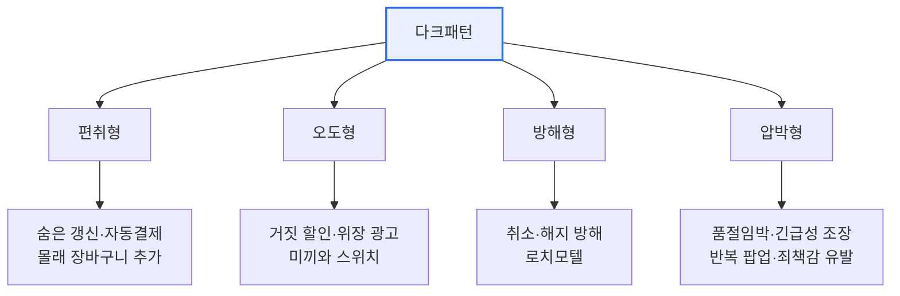

# 다크패턴(Dark Pattern)

## 1. 개요

### 가. 정의
> 소비자를 **기만·오도·압박하여 비합리적 선택을 유도**함으로써 사업자의 이익을 편취하는 UI/UX 설계 기법. '눈속임 상술'로도 불린다.

### 나. 등장 배경 및 문제점
- 전자상거래·구독경제 확산으로 **소비자 피해 급증**(원치 않는 결제·해지 곤란)
- 공정거래위원회·EU·OECD 등 **규율 강화** 추세

## 2. 세부 유형

| 유형 | 세부 기법 | 예시 |
|---|---|---|
| **편취형** | 숨은 갱신, 몰래 추가(sneaking), 자동결제 전환 | 무료체험 후 자동 유료 전환 고지 미흡 |
| **오도형** | 거짓 할인, 위장 광고, 미끼와 스위치 | 허위 정가 표시로 할인 착시 |
| **방해형** | 해지·탈퇴 절차 복잡화(로치모텔) | 가입은 쉽고 해지는 전화만 가능 |
| **압박형** | 긴급성·품절 임박, 반복 팝업, 확인 셰이밍 | "지금 3명이 보는 중", 거절 버튼 죄책감 문구 |

## 3. 대응 방안

| 주체 | 대응 |
|---|---|
| **제도** | 전자상거래법 개정, **다크패턴 금지 유형 명시**, 과징금·시정명령 |
| **기술·설계** | 공정한 UX 가이드라인, 명확한 고지·동의, 자율규제(다크패턴 자율점검) |
| **사업자** | 투명한 가격·해지 절차, Opt-in 방식 준수 |
| **소비자** | 인식 제고, 결제·구독 내역 주기적 점검 |

## 4. 시사점
- '넛지'와 '다크패턴'의 경계 — **소비자 이익 침해 여부**가 판단 기준
- 규제(사후) + 자율규제·UX 윤리(사전)의 **병행**이 효과적
- 글로벌 서비스는 각국 규율(EU DSA 등) 준수 필요

---

> **한 줄 요약**: 다크패턴은 *편취·오도·방해·압박형* 으로 소비자를 기만하는 설계로, **제도 규율 + 투명 설계(자율규제) + 소비자 인식** 의 다층 대응이 필요하다.
