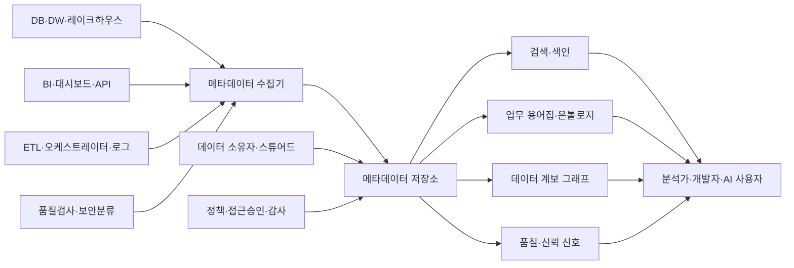
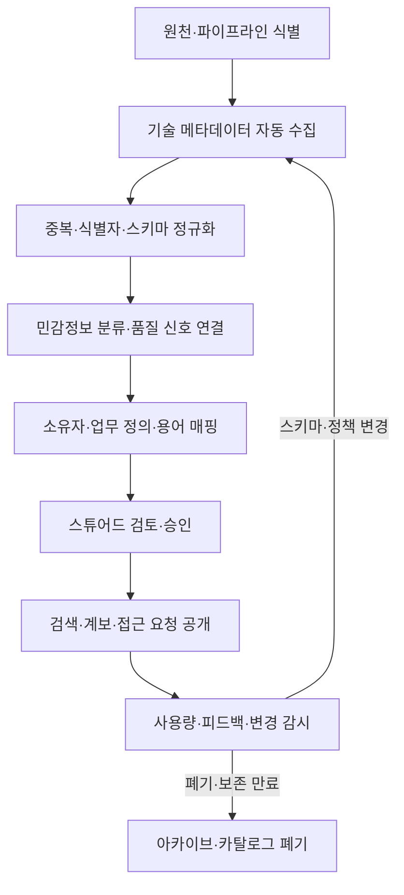

# 데이터 카탈로그(Data Catalog)와 메타데이터 관리

## 1. 개요

> **데이터 카탈로그(Data Catalog)**는 조직이 보유·공유하는 데이터 자산을 검색하고 이해하고 신뢰하고 사용할 수 있도록 기술 메타데이터, 업무 메타데이터, 운영 메타데이터, 거버넌스 정보를 연결해 제공하는 관리 체계다.

데이터베이스와 데이터 레이크가 늘어날수록 데이터가 존재하는 장소를 아는 것만으로는 실제 활용이 어렵다.

같은 `customer_id`라는 이름이 시스템마다 고객번호, 회원번호, 익명화 식별자를 뜻할 수 있고, 테이블의 최신 시각이 적재 시각인지 업무 발생 시각인지도 다를 수 있다.

데이터 카탈로그는 데이터 자체를 복제해 저장하는 저장소가 아니라, 데이터 자산에 대한 설명과 관계를 찾아볼 수 있게 하는 메타데이터의 탐색·통제 계층이다.

사용자는 카탈로그에서 데이터셋의 정의, 소유자, 갱신 주기, 품질 상태, 개인정보 분류, 사용 승인 절차, 상·하류 계보를 확인한 뒤 실제 원천으로 이동한다.

따라서 카탈로그의 목표는 단순 목록화가 아니라 “어떤 데이터가 있는가”에서 “어떤 목적에 어떤 조건으로 사용할 수 있는가”까지 의사결정을 지원하는 데 있다.

메타데이터는 데이터를 설명하는 데이터이며, 기술 메타데이터만으로는 업무 의미와 책임을 표현할 수 없다.

ISO/IEC 11179-1:2023은 메타데이터를 데이터에 대한 설명으로 보고 메타데이터 레지스트리에 대한 개념적 이해의 기반을 제공한다([ISO/IEC 11179-1:2023](https://www.iso.org/standard/78914.html)).

데이터 카탈로그는 이 표준의 메타데이터 관리 관점, 데이터 거버넌스의 책임·정책 관점, 데이터 품질 및 계보 관리 관점을 연결하는 실무 플랫폼으로 볼 수 있다.

카탈로그가 성공하려면 등록 건수보다 사용자가 실제로 검색하고 재사용하며, 변경 영향 분석과 감사에 활용하는지가 중요하다.

반대로 자동 수집된 스키마만 가득하고 정의·소유자·품질 정보가 비어 있으면 카탈로그는 최신성을 잃은 또 하나의 문서 저장소가 된다.

본 답안은 데이터 카탈로그의 구성요소, 메타데이터 유형, 수집·큐레이션 절차, 계보와 품질 연계, 표준 및 도입 전략을 논술형으로 정리한다.

## 2. 등장 배경과 필요성

### 가. 데이터 사일로와 발견 비용

업무 시스템, 파일 서버, SaaS, 로그 플랫폼, 데이터 웨어하우스, 레이크하우스가 각각 다른 명명 규칙과 접근 절차를 사용하면 데이터 소비자는 먼저 “어디에 있는가”를 찾는 데 시간을 쓴다.

데이터 엔지니어가 원천을 찾더라도 컬럼 정의와 갱신 시점을 담당자에게 다시 확인해야 하므로 분석 착수 시간이 길어진다.

이 과정이 사람의 기억과 메신저에 의존하면 담당자 이동 시 지식이 사라지고 같은 데이터셋을 여러 팀이 중복 생산한다.

카탈로그는 검색 인덱스와 업무 용어집을 제공해 발견 비용을 줄이지만, 검색 기능만으로 의미가 자동으로 만들어지는 것은 아니다.

조직은 핵심 데이터 도메인과 우선 사용 사례를 정하고, 필수 메타데이터와 책임자를 지정해야 한다.

예를 들어 마케팅팀이 “월간 활성 고객”을 찾는 경우 테이블 이름보다 표준 용어, 계산식, 기준일, 제외 조건, 승인된 데이터 제품을 함께 검색할 수 있어야 한다.

### 나. 신뢰성과 규제 대응

데이터 품질 문제는 분석 결과 오류뿐 아니라 잘못된 고객 통지, 규제 보고 오류, 모델 편향으로 이어질 수 있다.

카탈로그에 최신 성공 시각, null 비율, 중복률, 스키마 변경, 최근 장애와 같은 품질 신호를 연결하면 소비자는 데이터의 적합성을 판단할 수 있다.

개인정보와 중요정보는 존재 사실만 공개하고 원문은 공개하지 않는 방식으로 메타데이터 접근을 분리할 수 있다.

예를 들어 컬럼에 “주민등록번호”가 있다는 사실은 보안 담당자에게 보여주되, 일반 분석자에게는 원문 샘플과 값 미리보기를 숨길 수 있다.

카탈로그 자체가 민감한 구조 정보를 노출할 수도 있으므로 카탈로그의 검색 권한, 감사 로그, API 토큰, 메타데이터 보존 정책도 보호 대상이다.

## 3. 데이터 카탈로그의 개념 구조

데이터 카탈로그는 자산, 의미, 관계, 책임, 품질, 정책을 하나의 탐색 경험으로 묶는다.

다음 구조에서 수집기는 원천 시스템에서 메타데이터를 읽고, 저장·색인 계층은 검색과 관계 탐색을 지원하며, 거버넌스 계층은 소유권과 정책을 관리한다.

### 가. 데이터 자산과 메타데이터 엔터티

자산은 데이터베이스, 스키마, 테이블, 컬럼, 파일, 토픽, API, 대시보드, 리포트, ML 피처와 모델 등으로 세분화할 수 있다.

자산의 식별자는 시스템별 이름만 쓰지 말고 환경, 도메인, 플랫폼을 포함한 전역 식별자로 관리해야 한다.

예를 들어 `prod.crm.customer`와 `dev.crm.customer`를 같은 자산으로 합치면 운영 데이터와 시험 데이터의 품질·권한을 혼동하게 된다.

메타데이터 레코드는 자산의 이름, 설명, 생성·변경 시각, 스키마, 위치, 소유자, 태그, 분류, 사용량, 품질 결과, 계보 관계를 가질 수 있다.

ISO/IEC 11179-3:2023은 메타데이터 레지스트리에 기록할 정보의 개념적 데이터 모델을 규정하며, 2023년 발행된 제4판이다([ISO/IEC 11179-3:2023](https://www.iso.org/standard/78915.html)).

카탈로그 구현은 표준의 모든 항목을 그대로 복사하는 방식보다 조직의 검색·감사·공유 목적에 맞는 핵심 속성을 먼저 정의하고 확장하는 방식이 현실적이다.

### 나. 메타데이터의 유형

기술 메타데이터는 데이터베이스·테이블·컬럼·타입·파티션·파일 포맷·스키마 버전처럼 시스템이 직접 추출할 수 있는 정보를 뜻한다.

업무 메타데이터는 용어 정의, 업무 규칙, KPI 계산식, 도메인, 데이터 제품 설명처럼 사람이 읽고 합의해야 하는 의미 정보를 뜻한다.

운영 메타데이터는 적재 성공 여부, 마지막 갱신, 실행 시간, 사용량, 쿼리 빈도, 비용, SLA 위반과 같은 실행 맥락을 뜻한다.

거버넌스 메타데이터는 소유자, 관리자, 개인정보 등급, 보존기간, 접근정책, 승인상태, 감사 이력을 포함한다.

계보 메타데이터는 원천에서 변환을 거쳐 테이블·대시보드·모델에 도달하는 흐름과 컬럼 변환을 나타낸다.

다섯 유형은 서로 대체 관계가 아니다.

스키마가 있어도 업무 정의가 없으면 검색 결과를 해석할 수 없고, 정의가 있어도 최신성·품질 신호가 없으면 사용 여부를 판단할 수 없다.

| 유형 | 주요 속성 | 수집·관리 방식 | 소비자에게 주는 판단 |
|---|---|---|---|
| 기술 | 스키마, 타입, 위치, 파티션 | 커넥터·API 자동 수집 | 어디에 어떤 구조로 존재하는가 |
| 업무 | 용어, 정의, KPI, 규칙 | 용어집·스튜어드 승인 | 무엇을 의미하는가 |
| 운영 | 최신성, 실행, 사용량, 비용 | 파이프라인·로그 연계 | 지금 믿고 쓸 수 있는가 |
| 거버넌스 | 소유자, 등급, 보존, 정책 | 분류·워크플로·승인 | 누가 어떤 조건에서 관리·사용하는가 |
| 계보 | 원천·변환·하류 관계 | SQL·이벤트·수동 보완 | 변경 시 무엇에 영향이 있는가 |

### 다. 검색과 탐색의 원리

기술명 검색은 정확한 자산명을 아는 사용자에게는 유효하지만 업무 사용자는 “이탈 고객”, “미납 위험”, “월간 매출”과 같은 업무 용어로 탐색한다.

따라서 카탈로그는 동의어, 약어, 용어 계층, 태그, 도메인, 오너, 품질 등급, 인기와 최근 사용량을 검색 필터로 제공해야 한다.

검색 결과에는 단순 링크보다 정의, 최신성, 소유자, 샘플 스키마, 품질 지표, 접근 방법, 승인 절차가 함께 보여야 한다.

그러나 품질 점수를 하나의 숫자로 압축하면 소비자가 산정 근거를 오해할 수 있다.

“최근 24시간 이내 갱신”, “null 비율 0.3%”, “개인정보 포함”, “정산 업무의 승인된 데이터 제품”처럼 판단 근거를 설명 가능한 신호로 노출하는 것이 바람직하다.

W3C DCAT 3은 웹에서 데이터 카탈로그 간 상호운용을 돕는 RDF 어휘로서 카탈로그, 데이터셋, 데이터 서비스 등의 설명과 분산 카탈로그 검색을 지원한다([W3C DCAT 3](https://www.w3.org/TR/vocab-dcat-3/)).

## 4. 수집·정제·공유 프로세스

카탈로그 운영은 한 번의 등록 프로젝트가 아니라 메타데이터의 생성, 검증, 배포, 변경, 폐기를 반복하는 수명주기다.

### 가. 자동 수집

자동 수집은 데이터베이스 카탈로그, 클라우드 스토리지, BI 도구, 오케스트레이터, 메시지 브로커, ML 플랫폼에서 메타데이터를 읽는 단계다.

수집 주기는 자산의 변화 속도에 따라 달라진다.

실시간 스키마 변경이 잦은 이벤트 토픽은 이벤트 기반 수집이 적합하고, 월별 정산 테이블은 배치 수집으로도 충분할 수 있다.

수집기는 원천 시스템의 읽기 권한만 사용하고, 비밀번호나 데이터 본문을 메타데이터 값으로 과도하게 저장하지 않아야 한다.

스키마 수집과 샘플 프로파일링은 구분한다.

스키마는 컬럼 이름과 타입을 읽는 것만으로 가능하지만, null·분포·패턴 검사는 실제 값의 일부를 조회하므로 개인정보와 비용 위험이 더 크다.

### 나. 정규화와 식별

도구마다 데이터베이스, 테이블, 데이터셋, 리포트의 명칭과 계층이 다르므로 카탈로그 내부의 공통 자산 모델로 정규화해야 한다.

동일한 테이블이 별칭·복제본·뷰·물리 파티션으로 여러 번 수집되면 중복 검색 결과와 잘못된 사용량이 발생한다.

전역 식별자, 원천 시스템 ID, 환경, 자산 유형, 버전, 마지막 수집 시각을 함께 저장하면 재수집 시 멱등성을 확보할 수 있다.

자산 이름을 억지로 하나로 통합하기보다 원천 이름과 표준 표시 이름을 분리하면 원천 추적성과 업무 검색성을 함께 유지할 수 있다.

스키마 변경은 추가·삭제·타입 변경·의미 변경으로 구분해야 한다.

컬럼이 추가되었다고 항상 호환 가능한 것은 아니며, 동일한 컬럼명이 다른 의미로 변경된 경우는 더 위험한 의미적 파괴적 변경이다.

### 다. 큐레이션과 승인

자동 수집만으로는 “고객”의 정의나 “순매출”의 계산식을 결정할 수 없다.

도메인 데이터 소유자는 업무 책임을 지고, 데이터 스튜어드는 정의·태그·품질 기준을 관리하며, 플랫폼 운영자는 수집기와 저장소의 가용성을 책임진다.

업무 정의와 민감도 분류는 초안, 검토, 승인, 만료 또는 폐기의 상태를 가져야 한다.

승인되지 않은 자산도 검색 가능하게 할지, 승인 자산만 공식 목록에 노출할지는 조직의 자율 탐색과 통제 강도의 균형 문제다.

실무적으로는 “탐색 가능”과 “공식 사용 권고”를 상태로 분리하는 방식이 유용하다.

### 라. 계보와 영향 분석

계보는 데이터가 어디에서 왔고 어떤 변환을 거쳐 어디에서 소비되는지를 표현한다.

테이블 수준 계보는 넓은 구조를 빠르게 파악하는 데 유리하고, 컬럼 수준 계보는 개인정보 전파와 특정 지표 변경 영향 분석에 유리하다.

SQL 파싱만으로 모든 계보를 정확히 얻을 수는 없다.

동적 SQL, 사용자 정의 함수, 외부 파일, 수동 업로드, API 호출이 포함되면 실행 이벤트나 개발자의 보완 입력이 필요하다.

OpenLineage는 데이터 처리 작업의 입력·출력과 실행 맥락을 표준 이벤트로 수집하려는 접근이며, 카탈로그는 이런 런타임 계보를 자산 관계로 연결할 수 있다.

계보는 그림 자체보다 변경 의사결정에 활용되어야 한다.

예를 들어 `customer_phone`의 보존 정책 변경 전에 연결된 리포트, ML 피처, 외부 API를 찾아 배포 순서를 조정하고 관련 소유자에게 통지할 수 있어야 한다.

## 5. 거버넌스·품질·보안 연계

### 가. 소유권과 스튜어드십

데이터 소유자는 데이터의 업무적 책임과 사용 승인 기준을 결정하는 역할이며, 데이터 스튜어드는 정의와 품질 규칙을 실행·조정하는 역할이다.

기술 플랫폼 담당자는 수집 실패와 저장소 성능을 관리하지만, 모든 데이터의 업무 의미를 대신 결정할 수는 없다.

역할을 구분하지 않으면 카탈로그는 기술팀이 입력한 불완전한 목록이 되거나, 중앙 거버넌스 조직이 모든 승인 요청의 병목이 된다.

도메인별 책임자와 중앙 표준위원회가 공존하는 연합형 운영이 대규모 조직에 적합하다.

### 나. 품질 신호와 신뢰 점수

카탈로그는 품질 규칙 자체를 대체하지 않고 품질 측정 결과를 소비자에게 전달하는 허브 역할을 한다.

완전성, 유일성, 유효성, 일관성, 적시성, 정확성 같은 차원을 데이터셋·컬럼·업무 규칙에 매핑할 수 있다.

예를 들어 주문 데이터는 행 수 급감, 금액 음수 비율 증가, 적재 지연, 주문번호 중복을 각각 별도의 검사로 관리한다.

품질 결과에는 검사 시각, 대상 버전, 임계치, 실패 원인, 예외 승인, 복구 상태를 포함해야 한다.

오래된 성공 결과를 최신 품질로 오인하지 않도록 신선도와 품질 검사를 함께 표시한다.

### 다. 개인정보·접근 통제

메타데이터에도 개인정보, 보안구성, 취약한 자산 위치와 같은 민감정보가 들어갈 수 있다.

카탈로그 UI와 API에 역할 기반 접근 제어를 적용하고, 분류 태그에 따라 검색·프로파일·샘플·다운로드 권한을 차등화한다.

비식별화된 컬럼 설명을 공개하더라도 원문 샘플과 계보 세부정보가 결합되어 재식별 단서가 되지 않는지 검토해야 한다.

민감정보 자동 분류는 후보 태그를 제안하는 수단으로 사용하고, 오탐·누락이 큰 영역은 스튜어드 검토와 정기 재검사를 둔다.

접근 승인 이력과 메타데이터 변경 이력은 별도로 보존해 누가 어떤 근거로 분류·정의·정책을 바꾸었는지 추적해야 한다.

## 6. 비교와 사례

### 가. 데이터 카탈로그와 데이터 사전·용어집 비교

데이터 사전은 속성의 정의, 형식, 허용값을 구조화한 산출물에 가깝다.

업무 용어집은 조직이 합의한 용어의 의미와 관계를 관리하는 의미 계층이다.

데이터 카탈로그는 이 둘을 포함할 수 있지만, 실제 자산의 검색·소유권·품질·계보·접근 요청까지 연결하는 운영 플랫폼이라는 점이 다르다.

| 구분 | 데이터 카탈로그 | 데이터 사전 | 업무 용어집 |
|---|---|---|---|
| 중심 대상 | 실제 데이터 자산과 관계 | 데이터 요소의 구조·규격 | 업무 용어와 의미 |
| 주요 사용자 | 분석가·개발자·거버넌스 | 모델러·개발자 | 현업·기획·거버넌스 |
| 자동화 | 수집·계보·사용량·품질 | 스키마 생성·검증 | 자동 제안 후 승인 |
| 핵심 질문 | 무엇을 어디서 어떤 조건으로 쓸까 | 이 필드의 형식과 허용값은 무엇인가 | 이 지표와 용어의 업무 의미는 무엇인가 |
| 운영 상태 | 최신성·품질·접근권한 | 버전·표준 준수 | 승인·변경·동의어 |

세 도구를 분리해 운영할 수도 있지만 식별자와 용어 관계를 연결해야 중복 설명을 줄일 수 있다.

예를 들어 용어집의 “고객”이 여러 데이터셋의 `customer_id`와 연결되고, 해당 데이터셋의 계보와 품질 상태가 카탈로그에 표시되어야 업무 의미가 실제 활용으로 이어진다.

### 나. 사례 1: 금융기관의 규제 보고

금융기관은 고객·계좌·거래 데이터가 여러 채널과 계정계에 분산되어 있고 규제 보고 지표의 정의가 엄격하다.

카탈로그에 보고 지표의 표준 정의, 원천 테이블, 변환 SQL, 승인자, 기준일, 개인정보 등급을 연결하면 보고 변경 시 영향 범위를 확인할 수 있다.

계정계 컬럼명이 변경되면 하류의 위험관리 모델과 보고서 목록을 자동으로 찾아 담당자에게 통지하고, 승인된 대체 데이터셋을 추천할 수 있다.

단, 규제상 원본 데이터에 대한 접근권한과 카탈로그에서 보이는 메타데이터 권한을 분리해야 한다.

### 다. 사례 2: 제조 데이터 플랫폼

제조 현장에서는 센서 토픽, 설비 이벤트, 생산실적, 품질검사 데이터의 주기와 신뢰도가 서로 다르다.

카탈로그는 센서 데이터의 단위, 측정 위치, 수집 주기, 결측 처리, 설비 버전, 스트림 보존기간을 표시할 수 있다.

예지정비 모델 담당자는 단순히 “온도”라는 컬럼을 선택하는 것이 아니라 설비 ID, 센서 교정일, 결측률, 최신 수집 시각, 모델 학습 적합성까지 비교해야 한다.

설비 교체로 센서 ID가 변경되면 자산 관계와 계보를 갱신해 모델 입력의 단절을 조기에 발견할 수 있다.

### 라. 사례 3: 생성형 AI와 데이터 제품

RAG나 에이전트가 사내 문서·테이블을 검색할 때 카탈로그의 설명, 접근정책, 품질·최신성 정보가 검색 컨텍스트가 될 수 있다.

그러나 카탈로그에 등록된 설명이 곧 정답 데이터라는 뜻은 아니다.

AI 검색기는 승인 상태, 데이터 등급, 업무 도메인, 최신성, 사용자 권한을 필터로 적용하고, 답변에는 사용한 자산과 시점을 남겨야 한다.

카탈로그 메타데이터가 오래되면 AI가 잘못된 자산을 추천할 수 있으므로 메타데이터 신선도도 모델 평가와 운영 모니터링의 대상이 된다.

## 7. 심화: 표준·개방형 메타데이터와 데이터 제품

### 가. ISO/IEC 11179와 DCAT의 역할

ISO/IEC 11179 계열은 메타데이터 레지스트리가 어떤 항목을 어떻게 기술하고 등록할지에 대한 개념과 절차를 정리하는 기준이다.

반면 W3C DCAT은 웹에서 카탈로그와 데이터셋·데이터 서비스의 교환과 상호운용을 돕는 RDF 어휘다.

둘은 하나의 제품 버전을 의미하는 경쟁 표준이 아니라 적용 초점이 다르다.

조직 내부의 데이터 요소 정의와 등록 절차는 11179 관점으로 정리하고, 기관 간 공개 데이터 카탈로그 연계는 DCAT 프로파일을 검토하는 식으로 조합할 수 있다.

표준을 도입할 때는 표준 용어를 그대로 화면에 노출하기보다 내부 공통 모델, 매핑 규칙, JSON/RDF 교환 형식, 책임 주체를 정해야 한다.

### 나. 데이터 제품 관점

데이터 제품은 특정 소비자와 목적을 위해 발견 가능하고 품질·SLA·소유권이 명확한 데이터 제공 단위다.

카탈로그는 데이터 제품의 설명서이면서 제품 포털이 될 수 있다.

데이터 제품 페이지에는 목적, 입력·출력 계약, 스키마 버전, 갱신 주기, 품질 목표, 사용 예, 비용·쿼터, 오너, 폐기 정책을 표시한다.

이렇게 하면 카탈로그가 중앙팀의 수동 등록 목록이 아니라 도메인 팀이 책임지는 제공물의 시장 역할을 한다.

다만 데이터 제품을 만든다고 모든 테이블을 상품화할 필요는 없다.

반복 사용되고 안정된 인터페이스가 필요한 핵심 데이터부터 제품화하고, 임시 분석 테이블과 실험 자산은 수명주기와 공개 범위를 낮게 설정하는 것이 비용을 통제한다.

### 다. AI 시대의 메타데이터 품질

AI 검색과 에이전트는 자산명보다 관계·정의·정책을 활용하므로 카탈로그의 의미 계층이 더 중요해지고 있다.

동시에 자동 생성 설명이 늘어날수록 사람이 승인하지 않은 정의가 공식 정보처럼 유통될 위험도 커진다.

AI가 제안한 요약·태그·계보는 생성 출처, 생성 시각, 신뢰도, 검토자, 원문 링크를 남기고 승인 전에는 “제안” 상태로 구분해야 한다.

모델이 접근할 수 있는 메타데이터와 사용자가 볼 수 있는 메타데이터의 권한을 분리해 프롬프트 주입, 정책 우회, 민감한 구조 노출을 방지한다.

## 8. 도입 전략과 성과 측정

첫 단계는 전사 자산을 한 번에 등록하는 것이 아니라 가장 비용이 큰 의사결정과 데이터 도메인을 선택하는 것이다.

예를 들어 규제 보고, 고객 360, 장애 원인 분석 중 하나를 선정하고 성공 기준을 검색 시간, 재사용률, 영향 분석 시간으로 정의한다.

둘째, 핵심 자산의 최소 메타데이터 계약을 정한다.

자산명, 설명, 도메인, 오너, 갱신 주기, 민감도, 품질 상태, 접근 방법, 폐기일을 필수로 두고 추가 속성은 사용 사례에 따라 늘린다.

셋째, 자동 수집과 사람의 큐레이션을 병행한다.

기술 메타데이터는 자동화하고, 업무 정의와 정책 승인에는 도메인 책임자를 배정한다.

넷째, 검색 결과에서 실제 원천으로 이어지는 접근 흐름과 피드백을 운영한다.

마지막으로 사용량과 품질을 측정한다.

| 관점 | 측정 예시 | 해석 시 주의점 |
|---|---|---|
| 발견성 | 검색 성공률, 평균 탐색 시간 | 검색어·도메인별로 분해해야 함 |
| 재사용 | 승인 자산 사용량, 중복 데이터셋 감소 | 사용량 증가가 품질을 의미하지 않음 |
| 신뢰 | 최신 메타데이터 비율, 오너 지정률 | 자산 중요도별 목표가 필요 |
| 영향 분석 | 변경 영향 파악 시간, 누락 계보율 | 자동 계보와 수동 보완을 구분 |
| 거버넌스 | 분류·승인 처리시간, 정책 위반 | 통제 강화로 업무 지연이 생길 수 있음 |
| 비용 | 수집·저장·쿼리 비용, 도구 운영비 | 카탈로그 자체의 ROI와 비교 |

## 9. 고려사항 및 시사점

### 가. 최신성보다 적합성을 함께 관리

메타데이터가 오늘 수집되었더라도 업무 정의가 틀리면 더 위험하다.

기술 최신성, 업무 정의 승인, 품질 검사 시각을 분리해 표시하고 사용 목적별 적합성을 판단하게 해야 한다.

### 나. 자동화의 한계와 인간 검토

스키마와 실행 로그는 자동화하기 쉽지만 의미, 민감도, 책임자, 예외 규칙은 문맥 판단이 필요하다.

AI·규칙 기반 분류는 후보를 빠르게 만들고 도메인 스튜어드가 승인하는 휴먼 인 더 루프 구조가 안전하다.

### 다. 계보의 정확도와 비용 절충

컬럼 수준 계보는 영향 분석에 강하지만 파싱·저장·조회 비용이 크고 동적 로직에서 누락될 수 있다.

핵심 규제 데이터는 세밀하게 관리하되 모든 임시 테이블까지 같은 깊이로 수집하지 않고 중요도 기반으로 깊이를 조정한다.

### 라. 보안과 프라이버시

카탈로그는 데이터 원문을 보관하지 않더라도 자산 위치와 민감도 정보를 노출한다.

최소권한, 행위 감사, 마스킹, API 인증, 메타데이터 보존기간, 폐기 절차를 카탈로그 운영 기준에 포함해야 한다.

### 마. 표준과 벤더 종속성

특정 도구의 내부 모델에만 의존하면 플랫폼 교체와 기관 간 연계가 어려워진다.

전역 식별자, 교환 API, 개방형 계보 이벤트, 표준 용어 매핑을 설계하고, 도구 특화 기능은 어댑터 계층 뒤에 둔다.

### 바. 조직 변화와 운영 책임

카탈로그는 도구 도입 프로젝트가 아니라 데이터 책임을 일상 업무에 넣는 조직 변화다.

오너 지정, 정의 승인, 품질 예외 처리, 폐기 검토를 성과와 운영 프로세스에 연결하지 않으면 초기 등록 후 빠르게 낡는다.

### 사. 기술사 관점의 종합 시사점

데이터 카탈로그는 데이터 거버넌스, 데이터 품질, 개인정보보호, 데이터 제품, AI 신뢰성을 이어 주는 메타데이터 제어면이다.

성공 기준은 등록 자산 수가 아니라 올바른 자산을 더 빨리 발견하고 안전하게 재사용하며 변경 영향을 통제하는 능력이다.

따라서 도입 설계에서는 대상 도메인, 최소 메타데이터, 자동 수집, 업무 승인, 권한 모델, 계보 깊이, 성과 지표를 하나의 운영 모델로 제시해야 한다.

## 참고자료

- [ISO/IEC 11179-1:2023 — Metadata registries](https://www.iso.org/standard/78914.html)
- [ISO/IEC 11179-3:2023 — Metadata registries conceptual model](https://www.iso.org/standard/78915.html)
- [W3C Data Catalog Vocabulary (DCAT) Version 3](https://www.w3.org/TR/vocab-dcat-3/)
- [OpenMetadata — open metadata management platform](https://open-metadata.org/)
- [OpenMetadata Lineage documentation](https://docs.open-metadata.org/v1.13.x/how-to-guides/data-lineage)

---

> **한 줄 요약**: 데이터 카탈로그는 기술·업무·운영·거버넌스 메타데이터를 자산·품질·계보·정책과 연결해 데이터의 발견·신뢰·재사용·변경통제를 가능하게 하는 메타데이터 운영 체계다.
