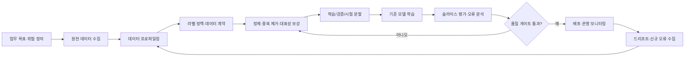
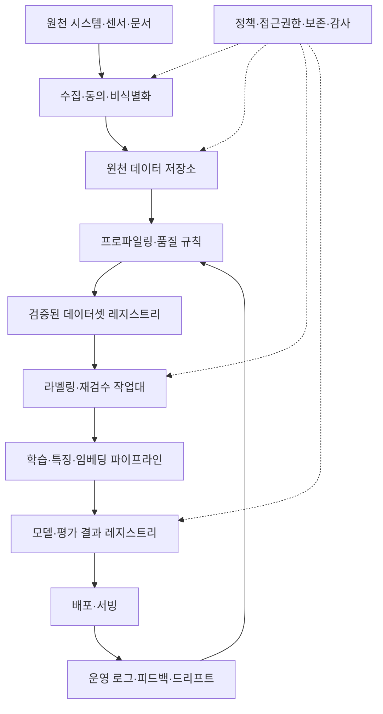

# 데이터 중심 인공지능(Data-Centric AI)과 학습데이터 품질 엔지니어링

## 1. 개요

> **정의**: 데이터 중심 인공지능(Data-Centric AI, DCAI)은 모델 구조와 코드만 고도화하는 대신, 문제에 맞는 학습·검증 데이터를 체계적으로 설계하고 품질을 반복 개선하여 AI 시스템의 성능과 신뢰성을 높이는 접근이다.

전통적인 머신러닝 프로젝트는 같은 데이터셋을 두고 모델의 층 수, 하이퍼파라미터, 손실함수, 앙상블 방법을 바꾸는 모델 중심(Model-Centric) 접근을 많이 사용하였다. 이 방식은 알고리즘 연구에는 유효하지만, 현업에서 성능 저하의 원인이 라벨 오류, 누락, 중복, 편향, 현장 분포 미반영인 경우에는 모델만 바꾸어도 개선 폭이 작다. 데이터 중심 접근은 모델을 무조건 고정한다는 뜻이 아니라, 데이터도 모델과 동등한 시스템 자산으로 보고 명시적인 품질 목표와 개선 루프를 운영한다는 뜻이다.

정보관리기술사 관점에서 DCAI는 단순한 전처리 기법이 아니다. 데이터 수집, 정의, 라벨링, 검수, 버전 관리, 학습, 평가, 배포 후 모니터링을 연결하는 데이터 거버넌스와 MLOps의 결합 문제이다. 따라서 기술사는 정확도 한 숫자만 제시하기보다 업무 목적에 맞는 데이터 적합성, 대표성, 추적성, 개인정보 보호, 운영 지속성을 함께 답안에 포함해야 한다.

등장 배경은 세 가지로 정리할 수 있다. 첫째, 공개 모델과 사전학습 모델의 성능이 상향 평준화되면서 동일한 모델에서 데이터의 차이가 결과를 좌우한다. 둘째, 실제 업무 데이터는 계절성, 장비 변경, 사용자 행동 변화로 학습 시점과 운영 시점의 분포가 달라진다. 셋째, 생성형 AI와 멀티모달 AI는 원천 데이터의 출처와 저작권, 개인정보, 중복, 오염 여부를 추적하지 않으면 모델 성능뿐 아니라 법적·윤리적 위험까지 키운다.

DCAI의 목적은 데이터를 많이 모으는 것이 아니라 목적에 맞는 데이터를 확보하는 것이다. 희귀 장애 유형을 보여 주는 1,000개의 대표 샘플이 정상 상태만 반복한 100,000개의 샘플보다 유용할 수 있다. 반대로 표본 수가 부족한 상태에서 소수 사례만 확대하면 과적합과 실제 환경의 오판이 발생하므로, 품질과 양의 균형을 실험으로 검증해야 한다.

## 2. 데이터 중심 AI의 개념과 추진 구조

### 2.1 모델 중심 접근과의 차이

모델 중심 접근은 데이터셋을 비교적 고정된 입력으로 보고 모델의 표현력과 최적화 방법을 개선한다. 이에 비해 DCAI는 모델 버전이 같더라도 데이터셋 버전, 라벨 정책, 샘플 구성, 오류 유형을 바꾸어 성능을 개선한다. 중요한 점은 두 접근이 양자택일이 아니라는 것이다. 기준 모델을 고정하여 데이터 변경의 효과를 측정하고, 일정한 데이터 품질 수준에 도달한 뒤 모델 개선을 병행하는 것이 실무적이다.

DCAI에서 데이터 품질은 데이터베이스의 일반 품질과 AI의 학습 적합성을 함께 의미한다. 값이 형식적으로 채워져 있어도 실제 분류 경계를 설명하지 못하면 AI 관점에서는 낮은 품질이다. 예를 들어 제조 이미지의 모든 픽셀이 고해상도라도 결함 부위가 가려져 있거나 결함이 없는 샘플만 포함되어 있으면 현장 판정에는 적합하지 않다.

다음 표는 두 접근의 차이를 압축한 것이다. 표의 항목은 암기용 결론이 아니라 뒤에서 설명할 개선 활동의 방향을 결정하는 기준으로 사용한다.

| 구분 | 모델 중심 AI | 데이터 중심 AI |
|---|---|---|
| 주된 개선 대상 | 구조, 파라미터, 손실함수, 추론 코드 | 수집, 라벨, 대표성, 오류·중복, 데이터 분포 |
| 기본 가정 | 데이터셋은 비교적 고정 | 데이터셋도 반복적으로 설계·개선 |
| 성능 측정 | 모델 지표 중심 | 모델 지표와 데이터 품질 지표의 연계 |
| 핵심 역할 | ML 엔지니어·연구자 | 도메인 전문가·데이터 엔지니어·라벨러·거버넌스 담당자 |
| 주요 위험 | 과적합, 계산량, 일반화 실패 | 라벨 편향, 표류, 출처 불명, 개인정보·저작권 |
| 운영 방식 | 학습 파이프라인 중심 | 데이터와 모델을 함께 버전·검증·모니터링 |

모델 중심 접근의 장점은 새로운 모델 구조가 문제의 표현력을 크게 향상시키는 상황에서 빠른 돌파구를 제공한다는 점이다. 그러나 오류 원인이 데이터의 의미 불일치라면 더 큰 모델은 오류를 더 복잡하게 학습할 수 있다. DCAI는 모델을 단순화하자는 주장이 아니라, 모델에 투입되는 데이터의 원인과 맥락을 관리하자는 주장이다.

### 2.2 전체 추진 흐름

DCAI는 일회성 정제 작업이 아니라 데이터 오류를 발견하고 개선한 뒤 다시 평가하는 폐쇄루프이다. 다음 구조에서 품질 게이트는 파이프라인을 멈추는 장치이면서, 어떤 기준을 통과했는지 증적을 남기는 감사 지점이다.

첫 단계에서는 정확도 목표보다 업무 의사결정의 손실 구조를 정의한다. 불량품을 놓치는 비용과 정상품을 불량으로 분류하는 비용이 다르면 단순 정확도보다 재현율, 정밀도, 비용 가중 손실을 사용해야 한다. 이 목표가 없으면 데이터팀은 보기 좋은 균형 데이터만 만들고 현업의 중요한 실패 유형을 놓친다.

데이터 프로파일링은 스키마, 결측률, 값 범위, 중복, 분포, 시간 범위, 출처를 파악하는 활동이다. 이미지라면 해상도·조명·촬영 장비·파일 손상 여부를, 텍스트라면 언어·문자 인코딩·길이·민감정보 포함 여부를 확인한다. 프로파일링 결과는 데이터 품질 기준선과 이후 개선 우선순위를 정하는 근거가 된다.

라벨 정책은 라벨 이름만 정하는 문서가 아니다. 경계 사례를 어떻게 판정하는지, 복수 라벨이 가능한지, 불확실한 표본을 보류하는지, 라벨러 간 의견이 다를 때 누가 결정하는지까지 포함한다. 정책이 바뀌면 과거 데이터와 신규 데이터의 의미가 달라질 수 있으므로 라벨 스키마 버전을 함께 관리해야 한다.

정제 단계에서는 무조건 삭제하지 않는다. 이상치가 측정 오류인지 실제 희귀 사례인지 먼저 원인을 확인한다. 희귀 사례를 삭제하면 평균 지표는 좋아져도 운영 환경의 꼬리 위험을 학습하지 못한다. 따라서 삭제, 수정, 보류, 가중치 조정, 추가 수집 중 어떤 조치를 했는지 데이터 계보에 기록한다.

### 2.3 데이터와 모델의 결합 자산

AI 재현성은 코드와 모델 파일만으로 확보되지 않는다. 학습에 사용한 데이터 스냅샷, 전처리 규칙, 라벨 정책, 특징 추출기, 평가 세트, 실행 환경이 함께 보존되어야 동일한 결과를 재생산할 수 있다. 데이터 버전이 바뀌면 모델 버전도 별도의 릴리스 후보로 취급해야 한다.

데이터 계약(Data Contract)은 생산자와 소비자가 스키마, 의미, 품질 임계값, 변경 통지 방식을 합의하는 장치다. 예를 들어 고객 이벤트의 `event_time`은 UTC 기준이고 5분 이내 도착해야 하며, 식별자는 원문 개인정보가 아니라 토큰이어야 한다고 선언할 수 있다. 계약 위반은 학습 실패나 운영 오판으로 이어질 수 있으므로 CI 단계에서 자동 검사한다.

## 3. 데이터 품질 엔지니어링

### 3.1 품질 차원과 측정

AI에 필요한 품질 차원은 목적과 데이터 유형에 따라 달라진다. 다음 표는 대표적인 차원을 정리하지만, 실제 프로젝트에서는 업무 위험과 모델 오류 분석을 연결하여 측정 항목을 선택한다.

| 품질 차원 | 의미 | 대표 측정 예 |
|---|---|---|
| 정확성 | 실제 대상·업무 규칙과 값이 일치하는 정도 | 참조 데이터 일치율, 라벨 검수율 |
| 완전성 | 필수 값과 필요한 사례가 빠짐없이 존재하는 정도 | 결측률, 필수 필드 충족률 |
| 일관성 | 레코드·출처·시간에 걸쳐 의미가 모순되지 않는 정도 | 규칙 위반 건수, 단위 불일치율 |
| 유일성 | 동일 사건·개체의 중복이 통제되는 정도 | 중복률, 근접 중복 탐지율 |
| 적시성 | 업무 의사결정에 필요한 시점에 도착하는 정도 | 지연시간, 최신성 |
| 대표성 | 운영 대상의 집단·조건·경계를 충분히 반영하는 정도 | 분포 차이, 그룹별 커버리지 |
| 라벨 신뢰성 | 기준에 맞고 라벨러 간 합의가 높은 정도 | 재검수율, Cohen의 카파 |
| 계보·추적성 | 출처와 변환 과정을 재현할 수 있는 정도 | lineage 누락률, provenance 커버리지 |

결측률은 특정 필드의 결측 레코드 수를 전체 레코드 수로 나눈 값으로 정의할 수 있다. 그러나 결측 자체가 무작위인지 특정 고객군·장비·시간대에 집중되는지가 더 중요하다. 선택적으로 발생한 결측을 평균값으로 채우면 모델이 결측 발생 원인을 학습하지 못하거나 특정 집단의 편향이 커질 수 있다.

중복률은 동일한 사건을 반복으로 세는 문제를 측정한다. 텍스트와 이미지에서는 완전 일치뿐 아니라 의미가 유사한 근접 중복도 탐지해야 한다. 중복 데이터가 학습과 시험 세트에 나뉘면 실제 일반화가 아닌 데이터 누출로 인해 지표가 부풀려질 수 있다.

대표성은 전체 데이터가 현실의 비율과 같다는 의미만은 아니다. 운영에서 비용이 큰 희귀 조건을 의도적으로 충분히 포함했는지도 확인한다. 예를 들어 야간·우천·저조도 조건이 실제 전체의 5%라도 안전사고와 연결된다면 별도 평가 슬라이스로 관리해야 한다.

### 3.2 라벨 품질과 사람의 역할

지도학습의 라벨은 사실 자체가 아니라 업무 규칙을 적용한 판단 결과다. 같은 의료 영상이나 고객 문의를 보고도 정책 해석에 따라 라벨이 달라질 수 있으므로, 라벨 품질은 라벨러의 숙련도와 지침의 명확성에 좌우된다. 도메인 전문가가 모든 데이터를 직접 라벨링하기 어려운 경우에는 표본 재검수와 어려운 사례 집중 검수로 비용을 배분한다.

라벨 가이드에는 긍정·부정의 예시, 경계 사례, 보류 기준, 복수 라벨 우선순위, 개인정보 마스킹 규칙을 포함한다. 단순한 라벨 이름 목록은 라벨러 간 편차를 줄이지 못한다. 가이드가 변경되면 변경 이유, 적용 시점, 영향을 받은 데이터 버전을 기록하고 필요하면 과거 라벨을 재매핑한다.

라벨러 간 합의도는 정답을 대신하는 단일 숫자가 아니다. 합의가 낮은 사례는 문제 자체가 모호하거나 지침이 불충분하다는 신호일 수 있다. 이런 사례를 제거하기보다 불확실성 라벨, 다수결과 전문가 판정의 구분, 모델 학습에서의 낮은 가중치 등으로 의미를 보존할 수 있다.

### 3.3 대표성·편향·데이터 분할

데이터 분할은 무작위로 섞는 것이 항상 안전하지 않다. 시간 순서가 있는 수요 예측은 미래 정보가 과거 학습에 섞이지 않도록 시간 기준으로 분할해야 한다. 동일 사용자·동일 장비·동일 문서의 파생본이 여러 세트에 들어가면 그룹 기준 분할을 적용해야 한다.

분할 후에는 전체 평균뿐 아니라 지역, 성별, 연령, 장비, 언어, 시간대, 업무 유형과 같은 슬라이스별 지표를 본다. 전체 F1 점수가 높아도 소수 집단의 재현율이 낮으면 서비스 품질과 공정성 문제가 발생한다. 슬라이스는 개인정보를 불필요하게 확대 수집하라는 뜻이 아니라, 합법적이고 필요한 범위에서 위험을 진단할 수 있는 집계 기준을 설계하라는 의미다.

데이터 증강은 부족한 조건을 보완할 수 있지만 원래 분포의 의미를 훼손할 수 있다. 이미지 회전이 물체 방향에 무관한지, 텍스트 치환이 문장 의도를 보존하는지, 생성 데이터가 실제 오류 패턴을 반영하는지 검증해야 한다. 증강 데이터는 원천 데이터와 구분하여 생성 규칙과 품질 검수를 기록한다.

### 3.4 오류 분석과 적극적 데이터 수집

학습 후 오류 분석은 틀린 샘플을 나열하는 데 그치지 않고, 오류를 원천·라벨·표현·분포·모델 경계로 분류한다. 동일한 오류가 반복되면 모델을 키우기 전에 해당 오류를 잘 보여 주는 표본을 추가하거나 라벨 정책을 수정한다. 이때 오류 분류 체계가 데이터 개선 백로그의 단위가 된다.

적극적 학습(Active Learning)은 모델이 불확실하거나 대표성이 낮다고 판단한 샘플을 우선 라벨링하는 전략이다. 라벨 비용이 높은 도메인에서는 무작위 라벨링보다 효율적일 수 있지만, 초기 모델이 놓치는 영역을 계속 제외할 수 있다. 따라서 불확실성 기반 샘플과 무작위·희귀조건 샘플을 함께 뽑아 탐색 편향을 완화한다.

하드 네거티브는 모델이 자주 오인하지만 실제로는 다른 클래스인 사례다. 하드 네거티브를 추가할 때는 오인 이유를 설명할 수 있어야 한다. 단순히 어려운 이미지만 반복하면 데이터셋이 특정 촬영 조건에 과도하게 맞춰질 수 있으므로, 클래스·환경·시간대별 커버리지를 함께 점검한다.

## 4. 수명주기·아키텍처·거버넌스

### 4.1 품질 개선 아키텍처

다음은 데이터 저장소, 품질 검증, 라벨링, 학습, 운영 피드백을 연결한 논리 아키텍처이다. 핵심은 데이터 레이크나 저장 기술의 이름이 아니라, 모든 변환과 판정에 책임자·버전·품질 결과가 연결되는 구조다.

수집 계층에서는 목적 외 수집을 줄이고 동의·법적 근거·보존 기간을 확인한다. 비식별화가 적용되더라도 다른 정보와 결합하면 재식별될 수 있으므로 접근권한, 반출 통제, 로그를 함께 설계해야 한다. 데이터 중심 AI는 품질을 높이기 위해 데이터를 더 모으자는 접근이 아니며, 필요한 목적에 맞는 최소 데이터 원칙과 충돌하지 않는다.

검증된 데이터셋 레지스트리는 데이터셋의 버전, 스키마, 통계, 라벨 정책, 품질 결과, 승인자, 사용 제한을 관리한다. 모델 레지스트리와 연결하면 어떤 모델이 어떤 데이터 버전으로 학습되었는지 조회할 수 있다. 이 연결은 장애나 규제 질의 시 영향 범위를 빠르게 좁히는 데 중요하다.

운영 피드백은 사용자의 정답 수정, 현업 반려, 모니터링 경보, 신규 환경의 샘플로 구성할 수 있다. 피드백을 그대로 학습에 넣으면 공격자가 오염된 데이터를 주입하거나 잘못된 사용자의 입력을 신뢰하는 문제가 발생한다. 따라서 신뢰도·검수 상태·출처를 기준으로 재학습 후보를 분리한다.

### 4.2 DataOps와 MLOps 통합

DataOps는 데이터 흐름의 품질·재현성·배포를 관리하고, MLOps는 모델 학습·배포·관측을 관리한다. DCAI에서는 두 파이프라인이 분리된 채로 운영되면 데이터 변경이 모델 성능에 미치는 영향을 놓친다. 데이터 스냅샷 변경을 모델 재평가의 트리거로 연결하고, 모델 성능 하락을 데이터 오류 분석의 트리거로 연결해야 한다.

CI 단계에서는 스키마 검사, 필수 필드, 값 범위, 중복·누출, 개인정보 탐지, 라벨 분포를 검사한다. CD 또는 학습 배포 단계에서는 기준 모델 대비 성능, 슬라이스별 성능, 공정성 기준, 설명 가능성, 추론 비용을 확인한다. 자동 게이트는 사람의 판단을 대체하기보다 반복적인 위반을 조기에 차단하고 예외 승인 절차를 표준화한다.

데이터 드리프트는 입력 분포의 변화이고, 개념 드리프트는 입력과 정답의 관계가 변하는 현상이다. 입력 분포가 변하지 않아도 업무 정책이 바뀌면 개념 드리프트가 생길 수 있다. 따라서 통계 분포 검사만으로 충분하지 않으며, 가능한 경우 라벨 지연을 고려한 실제 오류율과 업무 KPI를 함께 모니터링한다.

### 4.3 개인정보·보안·책임성

데이터 중심 AI는 원본 데이터의 수집과 재사용을 증가시킬 위험이 있다. 수집 목적, 최소 수집, 보존 기간, 접근권한, 처리 기록, 삭제 요청 대응을 설계에 포함한다. 민감정보가 포함된 학습 데이터는 비식별화만을 만능 해법으로 보지 않고, 가명처리·접근통제·암호화·안전한 분석환경·출력 검사를 조합한다.

데이터 오염 공격은 공격자가 학습 데이터에 악성 표본이나 잘못된 라벨을 넣어 모델의 일반 성능이나 특정 조건의 행동을 바꾸는 공격이다. 방어를 위해 출처 신뢰도, 변경 이력, 승인된 수집 경로, 이상 라벨 패턴, 기준 데이터와의 성능 변화를 점검한다. 데이터셋 해시나 서명은 무결성 증거를 제공하지만 데이터의 의미적 정확성까지 보장하지는 않는다.

생성 데이터와 외부 데이터의 라이선스, 사용 목적, 재배포 조건을 확인한다. 데이터 출처를 추적할 수 없으면 모델 출력에 대한 설명과 권리 대응이 어려워진다. 데이터시트나 모델 카드에 데이터 구성, 제한, 알려진 편향, 평가 범위를 명시하면 사용자와 감사자가 시스템을 올바른 범위에서 사용하게 할 수 있다.

## 5. 비교 및 사례

### 5.1 데이터 품질 개선과 모델 튜닝의 비교

모델 튜닝은 학습률, 정규화, 구조, 앙상블을 조정하여 동일한 데이터에서 표현력과 일반화 성능을 높인다. 데이터 품질 개선은 라벨 오류와 누락을 고치고, 분포의 빈틈을 채우고, 중복과 누출을 제거하여 모델이 학습하는 신호 자체를 바꾼다. 전자는 모델의 함수 공간을 바꾸고 후자는 입력 신호의 신뢰도와 커버리지를 바꾼다고 설명할 수 있다.

성능이 정체된 원인이 편향된 라벨이면 모델을 바꾸는 실험보다 라벨 재검수의 투자수익이 높을 수 있다. 반대로 데이터가 충분히 정제되어 있고 복잡한 비선형 경계가 필요한 경우에는 모델 튜닝이 더 효과적이다. 기술사는 어느 한쪽을 정답으로 단정하지 말고, 오류 분해와 실험 설계를 통해 개선 방향을 선택한다고 제시해야 한다.

| 상황 | 우선 조치 | 확인 지표 |
|---|---|---|
| 학습·시험 성능이 모두 낮음 | 라벨·특징·문제 정의 점검 | 라벨 합의, 클래스별 재현율 |
| 학습 성능만 높고 시험 성능이 낮음 | 누출·중복·대표성·과적합 점검 | 세트 간 중복, 슬라이스 성능 |
| 전체는 높지만 특정 조건이 낮음 | 조건별 데이터 보강·재분할 | 그룹별 지표, 커버리지 |
| 운영에서만 급락 | 드리프트·센서·정책 변경 분석 | PSI/분포 변화, 업무 오류율 |
| 라벨 비용이 높고 후보가 많음 | 적극적 학습·우선순위 라벨링 | 샘플당 성능 향상, 비용 |

### 5.2 가상 제조 결함검사 사례

다음은 원리 설명을 위한 가상 사례이다. 한 제조라인이 카메라 이미지로 표면 결함을 판정한다고 가정한다. 초기 데이터는 12만 장이지만 주간·주간조명과 정상 제품이 대부분이고, 새로운 카메라와 미세 결함 샘플은 거의 없다. 기준 모델의 전체 정확도는 높지만 신규 라인에서 결함 누락이 많다.

첫째, 데이터 프로파일링으로 촬영 장비·라인·시간대·결함 종류별 분포를 나눈다. 둘째, 동일 제품의 연속 촬영 이미지가 학습·시험에 함께 들어간 누출을 제거한다. 셋째, 도메인 전문가가 결함 경계 사례 5,000장을 재검수하여 라벨 가이드와 보류 라벨을 만든다. 넷째, 신규 카메라와 저조도 조건의 데이터를 의도적으로 추가 수집하되 정상과 결함의 비율을 따로 관리한다.

다섯째, 전체 점수와 함께 결함 재현율, 라인별 재현율, 저조도 슬라이스 재현율을 비교한다. 여섯째, 모델이 자주 틀리는 하드 네거티브를 우선 검수하고, 운영 피드백에서 신뢰도 높은 사례만 다음 데이터셋 버전에 포함한다. 이 과정은 모델 구조를 변경하지 않아도 데이터의 대표성과 라벨 일관성을 개선하여 결함 누락을 줄일 수 있는 전형적인 DCAI 루프다.

성과를 보고할 때는 “정확도가 좋아졌다”만 쓰지 않는다. 데이터 버전, 추가된 조건, 라벨 합의도, 시험 세트 고정 여부, 슬라이스별 개선과 비용을 함께 기록한다. 그래야 개선이 특정 시험 세트에 대한 우연한 최적화인지 실제 운영 품질 향상인지 구분할 수 있다.

## 6. 심화: 최신 흐름과 출제 연계

DCAI는 데이터 라벨링 회사의 작업을 뜻하지 않는다. 최근에는 데이터 준비, 라벨링, 증강, 오류 분석, 데이터 검증을 자동화하고 그 결과를 MLOps 파이프라인에 연결하는 방향으로 발전하고 있다. 다만 자동화 모델이 생성한 라벨도 오류 가능성이 있으므로, 사람 검수와 표본 감사가 필요한 위험 기반 운영이 적절하다.

데이터 품질을 평가하는 표준화 흐름에서는 정확성·완전성·일관성뿐 아니라 대표성, 추적성, 라벨 품질, 개인정보와 같은 AI 특화 측면을 함께 보려는 경향이 있다. ISO/IEC 25012와 같은 데이터 품질 모델을 조직의 품질 기준으로 참조할 수 있지만, 모든 특성을 동일한 임계값으로 적용하면 비용이 커진다. 서비스 위험과 데이터 용도에 맞춰 핵심 품질 차원과 측정 주기를 선택해야 한다.

생성형 AI에서는 문서 정제와 중복 제거, 청크 품질, 메타데이터, 검색 적합성, 개인정보와 저작권의 검증이 중요하다. RAG의 답변 품질을 높이려면 모델만 튜닝하기보다 검색 코퍼스의 최신성, 문서 권한, 청크 경계, 근거 연결을 개선해야 한다. 즉 DCAI의 대상이 전통적인 라벨 데이터에서 검색·평가 데이터와 프롬프트 데이터까지 확장되고 있다.

기출 연계 답안에서는 “정의-필요성-구조-품질지표-수명주기-거버넌스-사례-고려사항” 순서로 전개하면 논리적이다. 데이터 거버넌스, 데이터옵스·MLOps, AI 신뢰성, 개인정보보호, 데이터 계약, 모델 모니터링과 연결하여 기술 간 관계를 설명하면 단일 용어 암기보다 설계형 답안이 된다.

## 7. 고려사항 및 시사점

### 7.1 목표 지표를 먼저 정한다

데이터 품질 지표는 많을수록 좋은 것이 아니다. 업무 실패 비용과 모델 오류 유형을 분석하여 정확성, 대표성, 라벨 합의도, 최신성 중 우선순위를 정한다. 지표의 정의·분자·분모·측정 주기·책임자를 문서화해야 팀마다 다른 숫자를 비교하는 문제를 줄일 수 있다.

### 7.2 시험 세트와 평가 프로토콜을 보호한다

데이터를 반복 개선하는 과정에서 시험 세트까지 들여다보면 과적합이 발생한다. 시험 세트는 가능한 한 고정하고, 개선용 검증 세트와 운영 모니터링 세트를 분리한다. 분포가 크게 변하면 새 시험 세트를 추가하되 기존 기준 세트와의 연속성을 유지한다.

### 7.3 도메인 전문가를 품질 루프에 배치한다

라벨 정책과 오류 원인은 데이터팀만으로 결정하기 어렵다. 도메인 전문가는 어려운 사례의 의미를 해석하고 업무적으로 중요한 실패를 정의한다. 전문가는 모든 표본을 직접 처리하기보다 가이드 작성, 표본 감사, 분쟁 해결, 오류 유형 정의에 집중하는 방식이 효율적이다.

### 7.4 자동화의 한계를 관리한다

데이터 검증 규칙과 자동 라벨링은 반복 업무를 줄이지만, 규칙에 표현되지 않은 의미 오류를 놓칠 수 있다. 자동 판정에는 신뢰도와 예외 경로를 두고, 고위험 변경은 사람 승인과 표본 재검수로 통제한다. 자동화율 자체를 성과로 삼기보다 품질·비용·처리시간의 균형을 평가한다.

### 7.5 개인정보와 권리의 범위를 설계에 포함한다

데이터를 더 모으는 전략은 개인정보 침해와 목적 외 이용을 확대할 수 있다. 수집 전 목적과 보존기간을 검토하고, 필요하지 않은 원문을 학습 저장소로 복제하지 않는다. 외부 데이터와 생성 데이터는 라이선스와 출처를 기록하고, 삭제 요청이나 사용 제한이 모델·데이터 파이프라인에 미치는 영향을 추적한다.

### 7.6 운영 변화에 대응하는 재학습 기준을 둔다

드리프트 경보가 발생했다고 즉시 재학습하면 오염된 데이터나 일시적 이벤트를 학습할 수 있다. 경보의 지속시간, 실제 라벨 확인, 업무 영향, 데이터 출처 신뢰도를 확인한 뒤 재학습 여부를 결정한다. 재학습 전후의 기준 모델 비교와 롤백 버전을 준비한다.

### 7.7 투자 효과를 데이터 단위로 계산한다

라벨 재검수, 추가 수집, 품질 도구 도입의 비용을 성능 향상과 연결한다. 샘플당 라벨 비용, 데이터 준비시간, 오류 감소에 따른 업무 비용 절감, 재학습 비용을 함께 계산한다. 정확도 1%p 개선이 실제 업무 손실을 얼마나 줄이는지 제시해야 경영 의사결정으로 이어진다.

### 7.8 기술사는 증적과 책임 구조를 제시한다

좋은 DCAI 설계는 “깨끗한 데이터를 사용한다”는 선언이 아니라, 누가 어떤 기준으로 승인하고 어떤 버전을 언제 사용했는지 재현할 수 있는 체계다. 데이터셋 카드, 라벨 가이드, 품질 리포트, 계보, 모델 카드, 접근 로그, 예외 승인 기록을 남긴다. 이 증적은 장애 대응뿐 아니라 감사·규제·분쟁에서 시스템의 설명 가능성을 높인다.

## 참고자료

1. [Data-Centric Artificial Intelligence, arXiv](https://arxiv.org/html/2212.11854v4) — 데이터 중심 AI의 정의, 모델 중심 접근과의 비교, 데이터 정제·확장 관점.
2. [ETSI TR 104 180: Data Quality Metrics](https://www.etsi.org/deliver/etsi_tr/104100_104199/104180/01.01.01_60/tr_104180v010101p.pdf) — 데이터 품질 측정 차원과 지표화 참고.
3. [NIST AI Risk Management Framework](https://www.nist.gov/itl/ai-risk-management-framework) — AI 신뢰성·위험 관리와 수명주기 관점 참고.
4. [The Principles of Data-Centric AI, Communications of the ACM](https://cacm.acm.org/research/the-principles-of-data-centric-ai/) — 데이터 중심 개선 루프와 오류 분석 관점 참고.

---

> **한 줄 요약**: 데이터 중심 AI는 더 큰 모델보다 목적에 맞는 데이터의 품질·대표성·계보를 반복 개선하고 이를 MLOps·거버넌스와 연결하여 신뢰할 수 있는 AI를 만드는 방법론이다.
