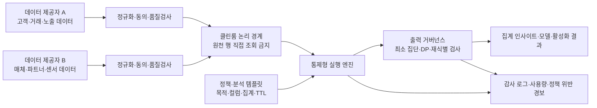
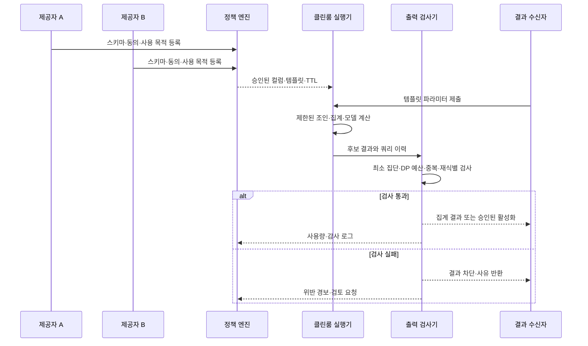

# 데이터 클린룸(Data Clean Room) 기반 프라이버시 보존형 데이터 협업

## 1. 개요

> **정의**: 데이터 클린룸(Data Clean Room, DCR)은 둘 이상의 조직이 원천 데이터를 서로 직접 공개·복사하지 않고, 사전에 합의된 분석·매칭·활성화 연산과 출력 정책 안에서 공동 데이터를 활용하는 통제형 분석 환경이다.

디지털 서비스는 광고 성과 측정, 이상거래 탐지, 공급망 분석, 의료 연구처럼 여러 조직의 데이터를 결합해야 정확도가 높아지는 문제를 반복해서 만난다. 그러나 원천 데이터에는 고객 식별자, 구매 이력, 위치, 금융·의료 정보와 같은 민감한 속성이 섞여 있으므로 파일을 상대방에게 넘기는 전통적 데이터 교환은 유출과 목적 외 이용의 위험을 키운다. 클린룸은 이 문제를 “데이터를 공유할 것인가”가 아니라 “허용된 질문의 결과만 어떻게 공유할 것인가”로 바꾼다.

AWS는 Clean Rooms를 “기초 데이터셋을 서로 공유하거나 복사하지 않고 공동 데이터셋을 분석·협업하는 공간”으로 설명한다([AWS Clean Rooms 개요](https://aws.amazon.com/clean-rooms/)). Snowflake도 협업자가 원천 행을 직접 질의하지 못하고 허용된 템플릿과 집계 결과만 받도록 하는 구조를 제시한다([Snowflake Data Clean Rooms](https://docs.snowflake.com/en/user-guide/cleanrooms/about)). 따라서 DCR은 단순한 암호화 저장소나 별도의 데이터베이스 제품명이 아니라, 데이터·연산·출력·감사의 경계를 함께 설계하는 거버넌스 패턴으로 이해해야 한다.

### 1.1 등장 배경과 필요성

첫째, 데이터의 가치가 조직 경계를 넘는 결합에서 발생한다. 광고주는 자사 구매 데이터와 매체 노출 데이터를 결합해야 전환을 측정할 수 있고, 제조사는 장비 제조사와 운영사의 데이터를 맞춰야 고장 예측 모델을 개선할 수 있다. 개별 조직의 데이터만 보면 원인과 결과의 연결 고리가 끊겨 분석의 편향이 커진다.

둘째, 직접 식별자를 교환하는 방식은 데이터 최소화 원칙과 충돌하기 쉽다. 이메일이나 전화번호를 해시해도 동일한 입력에 같은 해시가 나오면 사전 대입이나 외부 데이터와의 결합으로 재식별될 수 있다. 그러므로 식별자 변환만으로 “익명”이라고 단정하지 않고, 누가 어떤 연산을 언제 수행하고 작은 집단의 결과를 어떻게 차단하는지까지 통제해야 한다.

셋째, 쿠키·모바일 광고 식별자 의존도가 낮아지면서 동의받은 퍼스트파티 데이터 간의 측정과 매칭이 중요해졌다. Google Ads Data Hub는 Google 소유 프로젝트 안에서 프라이버시 검사와 집계를 적용한 뒤 결과를 고객 프로젝트로 기록하는 방식을 설명한다([Ads Data Hub 소개](https://developers.google.com/ads-data-hub/guides/intro)). 이 사례의 핵심은 데이터가 한곳에 모두 모인다는 사실이 아니라, 원시 이벤트를 그대로 내보내지 않는 분석 경계다.

### 1.2 목표와 비목표

DCR의 목표는 협업의 분석 가치를 보존하면서 원천 데이터의 불필요한 노출, 교차 목적의 재사용, 개인 단위 결과의 반환을 줄이는 것이다. 따라서 “얼마나 많은 원천 데이터를 복사했는가”가 아니라 “허용 목적에 필요한 최소 결과를 재현 가능하게 산출했는가”로 성공을 측정한다.

반대로 DCR이 모든 위험을 자동으로 없애는 것은 아니다. 허용된 집계 쿼리도 여러 번 반복하거나 외부 보조 데이터와 결합하면 개인을 추론할 수 있다. 운영자가 정책을 잘못 설정하거나 참여자가 부적절한 데이터를 적재하면 클린룸이라는 이름만 남는다. DCR은 개인정보 보호 설계의 한 구성요소이며, 법적 근거·동의·보존기간·접근통제·침해사고 대응을 대체하지 않는다.

## 2. 핵심 개념과 참조 구조

### 2.1 역할과 신뢰 경계

클린룸에는 보통 데이터 제공자(provider), 분석 요청자(consumer), 플랫폼 운영자(operator), 결과 승인자 또는 데이터 보호 책임자가 참여한다. 한 조직이 여러 역할을 겸할 수 있지만, 역할을 분리해 권한과 책임을 명시하는 편이 안전하다.

데이터 제공자는 자신의 원천 데이터, 사용 목적, 매칭 가능한 키, 허용 가능한 분석 유형을 결정한다. 분석 요청자는 필요한 질문과 결과 스키마를 제출하되 원천 행을 탐색할 권한을 갖지 않는다. 운영자는 실행 환경과 로그를 관리하지만 업무상 원천 데이터에 접근하지 않도록 기술적·관리적 분리를 적용한다. 결과 승인자는 작은 집단, 비정상 쿼리, 목적 외 컬럼이 출력되는지 확인한다.

중요한 경계는 세 가지다. 저장 경계는 원천 데이터가 각 참여자 계정 또는 통제 영역에 남아 있는지 확인한다. 실행 경계는 조인과 집계가 허용된 엔진·템플릿에서만 수행되는지 확인한다. 출력 경계는 결과의 최소 집단 크기, 노이즈, 컬럼, 다운로드·활성화 대상을 제한한다. 저장을 분리했더라도 실행과 출력이 열려 있으면 DCR의 실질적 보호 수준은 낮다.

### 2.2 전체 참조 아키텍처

위 구조에서 “클린룸”은 중앙 저장소 하나를 뜻하지 않는다. 참여자 데이터가 원래 계정에 남은 채 엔진이 각 위치에서 읽을 수도 있고, 암호화된 표준 영역에 제한적으로 적재할 수도 있다. 어떤 배치를 선택하든 원천 행을 임의로 조회·내보내는 통로가 없어야 한다.

데이터 온보딩 단계에서는 스키마, 데이터 소유자, 수집 근거, 동의 상태, 보존기간, 갱신 주기, 결측·중복 비율을 등록한다. 단순히 이메일을 SHA-256으로 해시하는 것보다 정규화 규칙과 키 생성 주체를 통일하고, 키의 사용 목적과 폐기 절차를 기록하는 것이 중요하다. 키가 여러 협업에서 재사용되면 서로 다른 목적의 데이터가 연결될 수 있으므로 협업별 토큰이나 일회성 매칭 식별자를 검토한다.

정책 계층은 어떤 컬럼을 어떤 연산에 사용할지 선언한다. 예를 들어 캠페인 측정은 캠페인·기간·지역별 집계만 허용하고, 원천 사용자 식별자와 세부 타임스탬프는 결과에서 제외할 수 있다. 분석 템플릿을 사전 승인하면 임의 SQL에서 발생하는 조합 공격을 줄일 수 있지만, 템플릿 파라미터의 범위와 반복 실행도 함께 제한해야 한다.

### 2.3 DCR의 데이터 흐름

1. 각 참여자는 목적과 법적 근거를 확인한 뒤 필요한 최소 필드를 선별한다.
2. 스키마·코드값·시간대·식별자 정규화 규칙을 맞추고 데이터 품질을 측정한다.
3. 공유 원천 데이터 또는 연결 가능한 키를 정책에 등록하고, 동의 만료·삭제 요청을 반영할 수 있는 갱신 경로를 준비한다.
4. 참여자와 분석 목적, 허용 쿼리, 결과 수신자, 보존기간, 재위탁 조건을 협업 계약으로 확정한다.
5. 분석자는 승인된 템플릿의 파라미터만 입력하고, 엔진은 조인·필터·집계·프라이버시 검사를 수행한다.
6. 출력 검사기는 최소 집단 크기, 차분 프라이버시 예산, 중복 쿼리, 비정상 조합을 확인한다.
7. 승인된 집계 결과 또는 모델 지표만 반출하고, 모든 실행과 승인·거부 사유를 감사 로그에 남긴다.
8. 목적이 종료되면 결과와 중간 산출물을 분류해 보존·삭제하고, 협업 키와 권한을 폐기한다.

이 흐름은 “매칭이 되었는가”보다 “매칭 후 무엇이 밖으로 나가는가”를 중심으로 설계해야 한다. 매칭률이 높아도 특정 고객군의 희소한 속성이 그대로 결과에 드러나면 실패다. 반대로 결과가 조금 거칠어도 의사결정에 충분하고 개인을 보호한다면 목적에 맞는 설계일 수 있다.

## 3. 프라이버시 보존 통제와 실행 원리

### 3.1 출력 제한과 집계 규칙

가장 기본적인 통제는 k-최소 집단 크기(threshold)다. 결과 그룹의 레코드 수가 기준보다 작으면 결과를 반환하지 않거나 다른 그룹과 묶는다. 예를 들어 특정 캠페인·지역·연령 조합의 고객이 5명뿐이면 그 집단의 전환율을 내보내지 않는 식이다. 그러나 임계값만으로는 충분하지 않다. 서로 다른 조건의 결과를 비교해 작은 집단의 값을 역산하는 차분 공격을 막기 위해 쿼리 이력과 그룹 간 중첩도 함께 관리해야 한다.

반올림, 버킷화, suppression은 결과 정밀도를 낮추는 대신 활용 가능성을 남기는 방법이다. 시간은 초 단위가 아니라 일·주 단위로, 지역은 상세 주소가 아니라 행정구역 단위로 제공할 수 있다. 이때 분석 목적에 필요한 해상도와 재식별 위험을 실험해 결정해야 하며, 무조건 거칠게 만들면 업무 가치가 사라진다.

### 3.2 차분 프라이버시

차분 프라이버시(Differential Privacy, DP)는 한 개인의 데이터 포함 여부가 결과 분포에 미치는 영향을 제한하도록 노이즈를 추가하는 수학적 프레임워크다. AWS Clean Rooms는 집계 결과에 보정된 노이즈를 추가하고, 협업 전체에 유한한 프라이버시 예산을 적용하는 기능을 문서화하고 있다([AWS Differential Privacy](https://docs.aws.amazon.com/clean-rooms/latest/userguide/differential-privacy.md), [프라이버시 정책](https://docs.aws.amazon.com/clean-rooms/latest/userguide/dp-settings.html)).

DP를 적용할 때는 노이즈를 넣었다는 사실보다 예산의 의미를 설명해야 한다. 일반적으로 \(\varepsilon\)가 작을수록 보호는 강해지지만 결과의 불확실성이 커진다. 여러 쿼리를 반복하면 예산이 누적되므로 사용자·테이블·기간·분석 목적 단위로 예산을 배정하고, 예산 소진 후 추가 실행을 차단한다. 실무자는 원시 수치와 DP 결과를 비교해 의사결정을 왜곡하지 않는 오차 범위를 사전에 합의한다.

DP는 작은 수의 정밀한 개인별 조회를 허용하는 기술이 아니다. 집계·통계·벤치마킹·실험 지표와 같이 결과가 본래 집단 수준인 사용 사례에 적합하다. 노이즈 크기, 클리핑 범위, 반복 질의 제한을 기록하지 않으면 결과 재현성과 감사 가능성이 약해진다.

### 3.3 암호학적 매칭과 계산 보호

매칭 키를 그대로 교환하지 않기 위해 협업별 토큰, 가명 식별자, 안전한 매칭 프로토콜을 사용할 수 있다. 단순 해시는 저엔트로피 이메일·전화번호에 취약하므로 솔트 관리, 키드 해시, 토큰화 또는 양측 계산 프로토콜을 검토한다. 다만 토큰이 안정적으로 재사용될수록 서로 다른 목적의 데이터가 연결되므로 목적별 분리와 토큰 수명 관리가 필요하다.

더 강한 보호가 필요하면 다자간 계산(MPC), 동형암호(HE), 신뢰 실행 환경(TEE)을 조합할 수 있다. MPC는 참여자들이 입력을 공개하지 않고 공동 함수를 계산하도록 하고, HE는 암호문 상태에서 특정 연산을 가능하게 하며, TEE는 하드웨어로 격리된 실행 영역에서 평문 처리를 제한한다. 각각 계산 비용·지원 연산·하드웨어 신뢰 가정이 다르므로 “암호화되어 있다”는 한 문장으로 대체해서는 안 된다.

### 3.4 통제형 실행과 결과 반출

분석 쿼리는 일반 데이터베이스처럼 무제한으로 열지 않는다. 템플릿의 입력값도 허용 목록, 기간 범위, 조인 키, 결과 행 수를 검증하고, 같은 모집단을 조금씩 바꾸어 반복 조회하는 패턴을 탐지한다. 결과에 포함된 숫자뿐 아니라 모델 파일, 임베딩, 디버그 로그, 오류 메시지도 반출 대상이 될 수 있으므로 동일한 출력 정책을 적용한다.

활성화(activation)는 집계 결과를 광고·CRM·추천 시스템으로 전달하는 경우다. 활성화 대상은 개인 목록이 아니라 사전에 동의된 세그먼트나 캠페인 신호로 제한하고, 수신 시스템의 접근권한·보존기간·삭제 요청 연계를 검증한다. 측정 결과는 익명 집계로 내보내면서 활성화는 별도 목적과 별도 승인을 요구하는 식으로 목적을 분리할 수 있다.

## 4. 구현 설계와 운영 수명주기

### 4.1 데이터 준비와 품질

클린룸 프로젝트는 분석 SQL보다 데이터 계약에서 시작한다. 각 필드의 의미, 단위, 허용 값, 원천 시스템, 갱신 시각, 결측 처리, 소유자, 개인정보 분류를 데이터 카탈로그에 등록한다. 예를 들어 “구매일”이 결제 승인일인지 배송 완료일인지 다르면 조인 결과의 전환 기간이 왜곡된다.

매칭 전에는 식별자 정규화율, 중복률, 매칭률, 충돌률을 측정한다. 매칭률을 높이기 위해 불필요한 식별자를 추가하면 위험과 비용이 함께 증가한다. 낮은 매칭률이 발견되면 원천 데이터의 품질, 동의 범위, 키 생성 규칙을 먼저 개선하고 무리한 확률적 매칭으로 개인을 추정하지 않는다.

시간과 지역의 기준을 통일하는 것도 중요하다. 서로 다른 시간대의 이벤트를 단순히 날짜로 조인하면 노출과 전환의 인과 순서가 바뀔 수 있다. 원천 정밀도는 보존하되 클린룸 분석 계층에서 결과 해상도를 낮추는 이중 계층을 사용하면 품질과 보호를 함께 다룰 수 있다.

### 4.2 정책·권한·템플릿

정책에는 최소한 목적, 참여자, 데이터셋, 허용 연산, 결과 컬럼, 임계값, DP 예산 또는 노이즈 규칙, 반출 대상, 보존기간, 검토 주기, 위반 대응을 포함한다. 권한은 “클린룸에 들어갈 수 있는가”보다 “어떤 데이터에 어떤 연산으로 접근할 수 있는가”로 세분화한다.

분석 템플릿은 재사용 가능한 업무 질문을 표준화한다. 캠페인 중복 도달률, 집단별 전환율, 공급망 납기 지연률과 같은 템플릿은 파라미터만 바꾸도록 하고, 자유 형식 SQL은 제한된 관리자 검토를 거치게 한다. 템플릿 변경은 코드 리뷰·승인·버전·롤백 절차를 갖춰야 한다.

정책을 코드로 표현하면 실행 시점에 자동 검증할 수 있다. 하지만 정책 파일이 곧 보호를 보장하는 것은 아니므로 정책 테스트에 작은 집단, 반복 쿼리, 경계값, 동의 만료, 삭제 요청, 조인 폭증 사례를 포함한다. 정책의 “허용”뿐 아니라 “차단되어야 할 질문”을 테스트 케이스로 남기는 것이 기술사 관점의 핵심이다.

### 4.3 보안과 감사

전송·저장 암호화, 고객 관리 키, 비밀 관리, 네트워크 격리, 관리자 다중 인증은 기본 통제다. 여기에 원천 데이터 접근 로그, 템플릿 버전, 입력 파라미터, 실행자, 출력 승인자, 다운로드·활성화 이력을 연결한다. 로그 자체에 식별자나 민감한 쿼리 값이 들어가지 않도록 로그 마스킹과 보존기간을 별도로 설계한다.

운영자는 정상 분석과 탐색적 공격을 구분하기 위해 쿼리 그래프를 관찰한다. 짧은 시간 안에 조건만 조금씩 바꾸는 조회, 특정 개인을 좁히는 교차 필터, 임계값 직전의 결과 반복은 경보 대상으로 삼을 수 있다. 자동 차단은 업무 중단을 일으킬 수 있으므로 경보·보류·수동 승인 등 위험도별 대응을 둔다.

감사는 결과의 정확성만 보지 않는다. 데이터 제공자가 승인한 목적과 실제 템플릿이 일치하는지, 동의 철회 데이터가 다음 배치에서 제외되는지, 결과 수신자가 계약상 조직인지, 삭제·보존 정책이 실행됐는지를 확인한다. 독립된 감사자가 재현 가능한 샘플로 검증할 수 있어야 한다.

### 4.4 성능·비용·운영 지표

DCR은 프라이버시 통제 때문에 일반 분석 플랫폼보다 쿼리 지연과 비용이 커질 수 있다. 조인 전 파티션·필터링, 집계 단위 사전 정의, 캐시의 재식별 검토, 배치와 대화형 분석의 분리를 통해 비용을 관리한다. 그러나 성능 향상을 위해 원천 행을 광범위하게 복제하거나 캐시를 장기간 보관하면 보호 경계가 약해진다.

권장 지표는 매칭률 하나가 아니다. 데이터 품질에는 신선도·결측률·중복률·스키마 위반률을, 프라이버시에는 차단 쿼리율·예산 사용률·작은 집단 노출 시도·정책 위반 복구 시간을, 분석에는 결과 지연·오차범위·재현성·업무 의사결정 개선을 함께 본다. 지표가 충돌할 때는 보호 수준을 낮추기보다 목적과 결과 정밀도를 재협의한다.

## 5. 유사 기술과의 비교

데이터 레이크나 데이터 웨어하우스는 여러 원천을 한곳에서 분석하기 위한 저장·처리 구조다. 조직 내부 통합에는 효율적이지만 외부 협업에서 원천 데이터의 복사와 광범위한 권한이 필요해질 수 있다. DCR은 중앙화 여부보다 협업자에게 노출되는 연산과 결과를 제한하는 데 초점을 둔다.

| 구분 | 데이터 클린룸 | 데이터 레이크/웨어하우스 | TEE 기반 처리 | MPC·동형암호 | 연합학습 |
|---|---|---|---|---|---|
| 주된 목적 | 다자 데이터 협업과 결과 통제 | 통합 저장·분석 | 격리된 평문 실행 | 입력 비공개 공동 계산 | 원천 데이터 위치 보존 학습 |
| 출력 통제 | 템플릿·집계·임계값·DP | 권한에 따라 원천·상세 결과 가능 | 프로그램과 출력 정책에 의존 | 프로토콜과 결과 함수에 의존 | 모델·그래디언트 유출 방어 필요 |
| 성능 | 집계·매칭 중심으로 실용적 | 일반 분석에 강함 | 하드웨어·메모리 제약 | 계산·통신 비용이 큼 | 학습 통신과 비동질 데이터 비용 |
| 신뢰 가정 | 운영자·정책·참여자 계약 | 저장소 운영자와 접근통제 | CPU·펌웨어·증명 체계 | 암호 프로토콜·키 분산 | 클라이언트와 서버·집계자 |
| 적합 사례 | 광고 측정, 벤치마킹, 공동 세그먼트 | 조직 내부 BI와 데이터 제품 | 민감 데이터의 제한 계산 | 소수 참여자의 고위험 매칭 | 여러 병원의 공동 모델 학습 |

이 표에서 중요한 차이는 기술 이름이 아니라 보호 대상이다. DCR은 “누가 어떤 질문을 하며 어떤 결과를 받는가”를 직접 다룬다. TEE는 실행 영역의 기밀성을 강하게 만들 수 있지만, 증명되지 않은 코드와 허용된 출력은 여전히 위험하다. MPC·HE는 암호학적 보호가 강한 대신 지원 연산과 운영 복잡성을 검토해야 한다. 연합학습도 모델 업데이트나 희소 클래스에서 정보가 누출될 수 있으므로 안전한 집계와 DP가 필요하다.

따라서 하나의 방식만 고집하기보다 위험도에 따라 조합한다. 일반 캠페인 집계는 템플릿·최소 집단·쿼리 이력으로 시작하고, 고위험 매칭은 협업별 토큰·MPC·TEE를 추가하며, 공동 모델 학습은 연합학습·안전한 집계·DP를 검토한다. 조합이 늘어날수록 키 관리, 장애 대응, 성능 측정, 감사 책임이 복잡해진다는 트레이드오프도 함께 기록해야 한다.

## 6. 적용 사례

### 6.1 광고 캠페인 측정

광고주는 자사 구매·회원 데이터와 매체의 노출·클릭 이벤트를 결합해 도달률과 전환율을 측정하려 한다. DCR에서는 양측이 동의받은 매칭 키를 협업별 토큰으로 변환하고, 캠페인·기간·지역 같은 집계 차원만 템플릿에 허용한다. 결과는 최소 집단 미만이면 차단하고, 반복 질의에 DP 예산을 적용한다.

이때 “전환한 고객 목록”을 반환하는 방식은 측정 목적을 벗어날 수 있다. 집계 결과를 광고 예산 조정에 사용하고, 별도의 법적 근거와 승인 없이는 개인 단위 활성화를 막는 것이 목적 분리에 해당한다. Google Ads Data Hub의 프라이버시 검사·집계 정책은 이런 출력 중심 설계를 이해하는 참고 사례다([Ads Data Hub 정책](https://developers.google.com/ads-data-hub/resources/policies)).

### 6.2 금융기관 공동 이상거래 분석

여러 금융기관이 공통 사기 패턴을 찾고 싶어도 고객의 계좌·거래 상세를 서로 제공할 수는 없다. 각 기관은 허용된 특징량이나 사건 지표를 협업 규칙에 맞춰 제공하고, 클린룸은 공통 패턴·기간별 발생률·모델 성능 같은 집계 결과만 제공할 수 있다.

사기 탐지는 개인 단위 차단으로 연결될 수 있으므로 오탐·이의제기·설명 가능성을 함께 관리해야 한다. 모델 성능을 높인다는 이유로 원천 거래를 과도하게 공유하지 않고, 결과를 실제 조치에 쓰기 전 별도 심사와 사람의 검토를 둔다. 금융기관별 데이터 분포 차이와 희소 사건 문제 때문에 결과의 통계적 불확실성도 보고서에 포함한다.

### 6.3 제조 공급망 벤치마킹

제조사와 부품 협력사는 납기 지연, 불량률, 설비 가동률을 비교해 공급망 병목을 찾을 수 있다. 협력사별 원가와 생산량을 공개하지 않고 업종·지역·기간별 집계와 중앙값·분위수만 공유하면 경쟁 정보 노출을 줄이면서 개선 대상을 찾을 수 있다.

이 경우 데이터 클린룸은 단순한 익명화보다 계약과 출력 정책이 중요하다. 특정 협력사가 한 곳뿐인 지역·부품 조합을 결과에서 차단하고, 소수 업체의 지표를 역산할 수 있는 비교 질의를 제한한다. 참여자가 지표 정의를 합의하지 않으면 동일한 “불량률”도 분모가 달라져 잘못된 의사결정을 유발한다.

## 7. 심화: 상호운용성과 프라이버시 강화 기술의 결합

클린룸 시장이 성장할수록 특정 사업자의 API에 종속되지 않고, 데이터 제공자·분석 플랫폼·측정 도구 사이의 상호운용성이 중요해진다. IAB Tech Lab은 2025년에 광고 기여도 측정을 위한 ADMaP 1.0을 공개하며, 암호학적 기법으로 데이터 클린룸 간 매칭과 측정의 상호운용성을 다루고 있다([IAB Tech Lab ADMaP 소개](https://iabtechlab.com/secure-matching-measurement-for-data-clean-rooms/), [ADMaP 1.0 PDF](https://iabtechlab.com/wp-content/uploads/2025/02/ADMAP-Version-1.0-FINAL.pdf)).

이 동향은 DCR을 단일 제품 기능이 아니라 프로토콜·정책·증명·감사의 조합으로 보게 한다. 표준화된 매칭 메시지와 결과 표현이 있으면 참여자 교체와 멀티클라우드 협업이 쉬워지지만, 표준이 곧 개인정보 보호를 보장하지는 않는다. 어떤 식별자와 어떤 목적을 연결하는지, 작은 집단과 반복 질의를 어떻게 제한하는지에 대한 구현·계약이 계속 필요하다.

향후에는 DCR, 차분 프라이버시, 안전한 매칭, TEE, MPC, 연합학습을 위험 기반으로 조합하는 구조가 현실적이다. 단순 집계는 저비용 정책으로 처리하고, 민감도가 높은 공동 계산에만 암호학적 보호를 추가하면 성능과 보호의 균형을 맞출 수 있다. 반대로 모든 데이터를 모든 PET로 감싸면 계산비용과 운영 복잡성이 분석 가치를 넘어설 수 있으므로, 데이터 분류와 위협 모델에 기반한 단계적 적용이 필요하다.

## 8. 고려사항 및 시사점

### 8.1 목적 제한과 데이터 최소화

분석 질문·필드·결과·보존기간을 목적 단위로 묶고, 목적이 바뀌면 새 승인과 영향평가를 수행한다. “향후 분석을 위해 일단 보관”하는 포괄적 수집은 클린룸의 취지와 맞지 않는다.

### 8.2 재식별 위협 모델

내부 쿼리 반복, 외부 공개 통계와의 결합, 희소 집단, 보조 식별자, 모델·로그 반출을 공격 경로로 가정한다. 임계값·DP·토큰화의 조합을 실제 공격 시나리오로 검증하고, 보호되지 않는 메타데이터까지 점검한다.

### 8.3 동의·법적 근거·삭제 연계

참여자별 동의 문구와 이용 목적이 다르면 매칭 집합을 합쳐서는 안 된다. 동의 철회·열람·삭제 요청이 원천, 파생 결과, 캐시, 모델 특징량, 활성화 시스템까지 전파되는지 데이터 계보로 추적한다.

### 8.4 키와 신원 관리

협업별 토큰, 키드 해시, 암호키, TEE 증명서의 소유자와 수명을 구분한다. 하나의 안정적 식별자를 모든 파트너에 재사용하면 조직 간 추적성이 커질 수 있으므로 토큰 분리와 회전·폐기를 기본값으로 둔다.

### 8.5 출력 정책과 반복 질의

최소 집단과 노이즈만 설정하고 끝내지 말고, 쿼리 이력·중첩 그룹·차분 결과·모델 파일·오류 메시지까지 출력으로 본다. 분석 생산성을 위해 예외를 허용할 때는 승인자, 만료일, 사후 검증을 남긴다.

### 8.6 정확도와 보호의 트레이드오프

노이즈와 버킷화로 결과가 흔들릴 수 있으므로 오차범위와 최소 실용 정확도를 업무 담당자와 먼저 합의한다. 보호 수준을 낮춰 정확도를 얻기보다 질문의 해상도, 집계 기간, 모델 목적을 조정해 필요한 의사결정 수준을 맞추는 것이 바람직하다.

### 8.7 플랫폼 종속성과 지속가능성

데이터 계약, 템플릿, 정책, 로그 스키마를 이식 가능한 형태로 관리하고, 플랫폼 변경 시 매칭·출력·삭제 동작을 회귀 테스트한다. 클라우드 비용, 특수 하드웨어, 암호 계산 비용, 전문 운영 인력까지 포함한 총소유비용을 산정한다.

### 8.8 기술사 답안의 시사점

기술사 답안에서는 DCR을 “안전한 장소에서 데이터를 합치는 기술”로만 정의하면 부족하다. 이해관계자·데이터 계보·신뢰 경계·허용 연산·출력 통제·감사·삭제의 전 생명주기를 구조도로 제시해야 한다.

또한 데이터 품질과 개인정보 보호를 별개의 업무로 분리하지 말고, 스키마·동의·키·정확도·노이즈·결과 활용을 하나의 통제면으로 연결해야 한다. 구축 순서는 고위험 목적부터 PET를 늘리는 방식의 단계적 실증이 적절하며, 파일럿의 성공 기준은 매칭률이 아니라 안전하게 재현 가능한 의사결정 가치다.

## 참고자료

- AWS, “Data Collaboration Service - AWS Clean Rooms” — https://aws.amazon.com/clean-rooms/
- AWS Documentation, “What is AWS Clean Rooms?” — https://docs.aws.amazon.com/clean-rooms/latest/userguide/what-is.html
- AWS Documentation, “AWS Clean Rooms Differential Privacy” — https://docs.aws.amazon.com/clean-rooms/latest/userguide/differential-privacy.md
- AWS Documentation, “Differential privacy policy” — https://docs.aws.amazon.com/clean-rooms/latest/userguide/dp-settings.html
- Snowflake Documentation, “About Snowflake Data Clean Rooms” — https://docs.snowflake.com/en/user-guide/cleanrooms/about
- Google for Developers, “Introduction | Ads Data Hub” — https://developers.google.com/ads-data-hub/guides/intro
- Google for Developers, “Ads Data Hub Policies” — https://developers.google.com/ads-data-hub/resources/policies
- IAB Tech Lab, “Secure Matching & Measurement for Data Clean Rooms” — https://iabtechlab.com/secure-matching-measurement-for-data-clean-rooms/
- IAB Tech Lab, “ADMaP Version 1.0 FINAL” — https://iabtechlab.com/wp-content/uploads/2025/02/ADMAP-Version-1.0-FINAL.pdf

---

> **한 줄 요약**: 데이터 클린룸은 원천 데이터를 무제한 공유하지 않고 승인된 매칭·분석·출력 정책 안에서 공동 인사이트를 산출하는 프라이버시 보존형 협업 아키텍처로, 최소수집·차분 프라이버시·암호학적 보호·감사·삭제를 함께 설계해야 한다.
