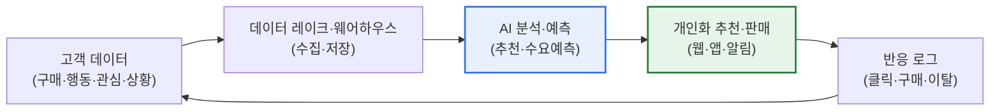
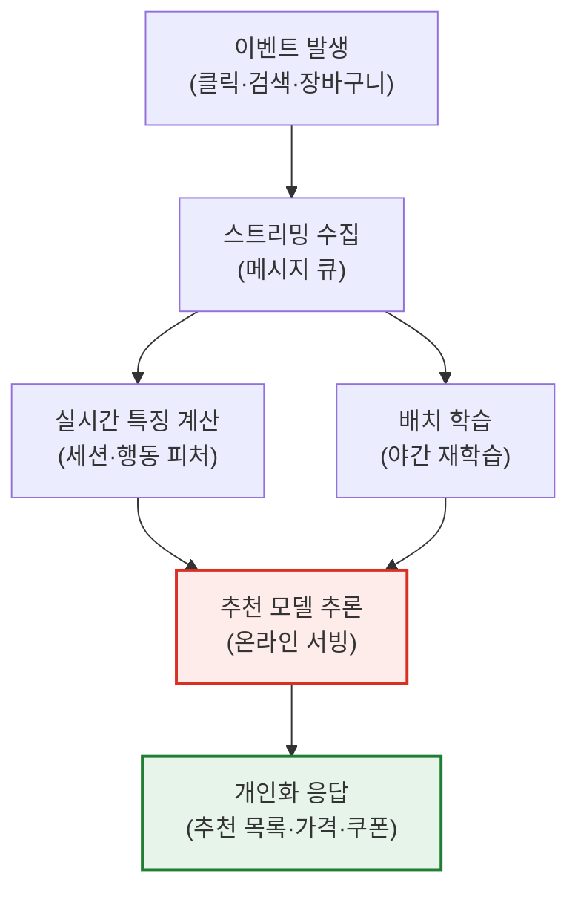

# 데이터 커머스(Data Commerce)

## 1. 개요

### 가. 개념

> **데이터 커머스(Data Commerce)** 는 고객의 **데이터(구매·행동·관심·상황)를 수집·분석해, 개인화된 상품·서비스를 원하는 순간에 추천·판매**하는 데이터 기반 상거래 방식이다. 데이터가 상품 진열대와 마케팅을 대체하는 핵심 자산이 되며, '무엇을 파느냐'보다 '누구에게 언제 무엇을 제안하느냐'가 경쟁력의 원천이 된다.

데이터 커머스의 핵심 발상은 '**데이터로 고객을 이해해 원하는 것을 원하는 순간에 제안하자**'는 것이다. 전통적 커머스는 모든 고객에게 동일한 상품을 동일한 진열 순서로 노출했다. 이 방식은 '평균적 고객'을 가정하지만, 실제로 평균 고객은 존재하지 않는다. 어떤 이는 가격에 민감하고 어떤 이는 브랜드 충성도가 높으며, 같은 사람도 아침과 저녁, 출근길과 주말에 원하는 것이 다르다. 데이터 커머스는 이 다양성을 정면으로 다룬다. 고객 한 명 한 명의 데이터를 분석해 "이 고객은 지금 무엇을 원하는가"를 예측하고 맞춤 제안한다.

이를 가능하게 하는 것이 빅데이터와 AI 기술이다. 방대한 고객 데이터를 수집·저장하고(빅데이터), 개인의 취향·수요를 예측하며(추천 알고리즘·머신러닝), 행동이 발생한 순간에 최적 제안을 내보낸다(실시간 처리). 그 결과 고객은 탐색 비용 없이 자신에게 맞는 경험을 얻고, 기업은 전환율·객단가·재구매율을 높인다. 즉 데이터 커머스는 '**데이터 분석력이 곧 판매력**'이 되는 상거래의 진화이며, 오늘날 이커머스·콘텐츠·금융·리테일 전반의 성장 엔진으로 자리 잡았다.

### 나. 등장 배경과 필요성

데이터 커머스가 부상한 배경에는 세 가지 구조적 변화가 겹친다. 첫째, **디지털 접점의 폭증**이다. 웹·앱·키오스크·IoT를 통해 고객의 클릭·체류·장바구니·검색어가 초 단위로 축적되면서, 과거에는 알 수 없던 '구매 이전의 의도'까지 데이터로 관찰 가능해졌다. 둘째, **선택 과잉의 역설**이다. 상품 수가 수백만 건에 이르면 고객은 오히려 무엇을 사야 할지 몰라 이탈한다. 이때 개인화 추천은 탐색 부담을 줄여 주는 '큐레이션'으로 기능한다. 셋째, **경쟁 심화**다. 가격·물류가 평준화되면서 차별화의 축이 '누가 더 잘 이해하고 잘 제안하는가'로 이동했다. 이 세 흐름이 맞물려 데이터는 부가 기능이 아니라 커머스의 중심 자산이 되었다.

### 다. 주요 기술

각 기술은 독립적으로 작동하지 않고 데이터 파이프라인 위에서 유기적으로 연결된다. 아래 표는 구성 요소를 정리한 것이며, 이어지는 3절에서 각 요소가 '왜' 필요한지를 문단으로 설명한다.

| 기술 | 내용 | 커머스에서의 역할 |
|---|---|---|
| **빅데이터 분석** | 대량 고객 데이터 수집·저장·분석 | 고객 이해의 원재료 확보 |
| **추천 시스템** | 협업 필터링·콘텐츠 기반·하이브리드 추천 | 개인별 상품 노출 결정 |
| **머신러닝·AI** | 수요 예측·이탈 예측·LTV 예측 | 선제적 제안·리텐션 |
| **실시간 처리** | 스트리밍·이벤트 기반 반응 | 행동 순간의 즉시 제안 |
| **다이내믹 프라이싱** | 수요·재고·경쟁가 기반 가격 최적화 | 수익·전환 동시 최적화 |

## 2. 데이터 커머스의 동작 구조

데이터 커머스는 '수집 → 저장·처리 → 분석·예측 → 개인화 제안 → 피드백 학습'의 순환 구조를 가진다. 이 순환이 빠르고 정확할수록 개인화 품질이 높아지고, 개인화가 잘될수록 더 풍부한 반응 데이터가 쌓이는 선순환(데이터 플라이휠)이 형성된다.

위 구조에서 가장 중요한 것은 **피드백 루프**다. 추천이 나간 뒤 고객이 클릭했는지, 구매했는지, 무시했는지가 다시 데이터로 회수되어 모델을 재학습시킨다. 초기에는 추천이 서툴러도, 이 루프가 반복되면서 정확도가 향상된다. 반대로 피드백 회수가 느리거나 왜곡되면(예: 인기 상품만 노출해 인기가 더 굳어지는 편향) 개인화가 오히려 퇴보한다. 따라서 데이터 커머스의 설계는 알고리즘 자체만큼이나 '피드백을 얼마나 정직하고 빠르게 학습에 반영하는가'에 좌우된다.

### 가. 추천 시스템의 세 갈래

추천 시스템은 데이터 커머스의 심장이다. 방식은 크게 세 가지로 나뉘는데, 각각 장단점이 뚜렷해 실무에서는 결합해 쓴다.

**협업 필터링(Collaborative Filtering)** 은 "나와 비슷한 사람들이 좋아한 것"을 추천한다. 사용자-아이템 상호작용 행렬에서 유사 사용자나 유사 아이템을 찾아 예측하며, 상품 내용을 몰라도 작동한다는 장점이 있다. 그러나 신규 고객·신규 상품은 상호작용 데이터가 없어 추천이 어려운 **콜드 스타트(cold start)** 문제가 생긴다. 넷플릭스·아마존 초기 추천의 근간이 이 방식이다.

**콘텐츠 기반 필터링(Content-based Filtering)** 은 "내가 좋아한 것과 비슷한 속성의 상품"을 추천한다. 상품의 장르·브랜드·가격대·키워드 같은 속성을 벡터화해 유사도를 계산한다. 콜드 스타트에 상대적으로 강하지만, 고객이 이미 본 것과 유사한 것만 반복 추천해 다양성이 떨어지는 **필터 버블** 위험이 있다.

**하이브리드·딥러닝 추천**은 두 방식을 결합하거나 신경망으로 복잡한 패턴을 학습한다. 최근에는 사용자의 행동 순서를 시계열로 학습하는 순차 추천, 그래프 신경망 기반 추천, 그리고 생성형 AI 기반 대화형 추천이 확산되고 있다. 실제 대형 커머스는 여러 모델의 결과를 앙상블하고, 비즈니스 규칙(재고·마진·프로모션)을 후처리로 반영해 최종 노출을 결정한다.

### 나. 실시간 개인화 아키텍처

추천이 아무리 정확해도 '늦으면' 소용이 없다. 고객이 특정 상품을 검색한 그 세션 안에서 관련 제안을 해야 전환이 일어난다. 아래는 실시간 개인화의 처리 흐름을 세부화한 것이다.

이 구조의 핵심은 **온라인 서빙과 배치 학습의 분리**다. 무거운 모델 학습은 야간 배치로 처리하되, 서비스 시점에는 밀리초 단위로 추론 결과를 반환해야 한다. 이를 위해 미리 계산해 둔 사용자·상품 임베딩을 캐시에 올려 두고, 세션 중 발생하는 실시간 피처(방금 본 카테고리, 현재 장바구니 금액)만 즉석에서 결합한다. 예컨대 장바구니 금액이 무료배송 기준에 근접하면 소액 상품을 끼워 추천해 객단가를 올리는 식이다. 지연이 100ms를 넘으면 체감 성능이 급격히 나빠지므로, 정확도와 응답 속도 사이의 트레이드오프를 아키텍처 단계에서 조율하는 것이 관건이다.

## 3. 활용 분야와 구체 사례

데이터 커머스는 특정 산업에 국한되지 않는다. 다만 산업마다 활용 초점이 다른데, 이는 각 산업의 수익 구조와 고객 접점의 성격이 다르기 때문이다.

| 분야 | 활용 | 대표 효과 |
|---|---|---|
| **이커머스** | 개인화 추천·다이내믹 프라이싱·장바구니 이탈 방지 | 전환율·객단가 상승 |
| **콘텐츠·미디어** | 콘텐츠 추천·썸네일 개인화·시청 유지 | 체류시간·구독 유지 |
| **금융** | 맞춤 상품 추천·신용평가·이상거래 탐지 | 교차판매·리스크 관리 |
| **리테일** | 수요 예측·재고 최적화·오프라인 연계 | 결품·과잉재고 감소 |

첫째, **아마존**은 매출의 상당 부분이 추천 엔진에서 발생한다고 알려져 있으며, "이 상품을 산 고객이 함께 구매한 상품" 같은 협업 필터링 기반 노출이 교차판매를 이끈다. 정확한 수치는 공개 자료마다 편차가 있으므로 단정하기 어렵지만, 추천이 매출의 핵심 축이라는 점은 업계에서 일관되게 관찰된다.

둘째, **넷플릭스**는 시청 이력으로 콘텐츠를 추천할 뿐 아니라, 같은 작품이라도 고객의 취향에 따라 썸네일 이미지를 다르게 노출하는 개인화를 적용한다. 콘텐츠 발견율을 높여 이탈(해지)을 낮추는 것이 목표이며, 추천 실패는 곧 구독 해지로 직결되기에 추천 정확도가 사업 존폐와 직접 연결된다.

셋째, **리테일·물류**에서는 수요 예측 데이터로 매장별·SKU별 재고를 최적화한다. 특정 지역·요일·날씨에 따라 잘 팔리는 상품이 다르다는 패턴을 학습해 결품과 과잉재고를 동시에 줄인다. 여기서는 개인화보다 '집계 수요 예측'이 핵심이라는 점에서 이커머스와 초점이 다르다.

## 4. 유사 개념과의 비교

데이터 커머스는 종종 '이커머스', '리테일 미디어'와 혼용되지만 초점이 다르다. 차이를 이해하면 각 개념이 답하려는 질문이 무엇인지 분명해진다.

| 구분 | 전통 이커머스 | 데이터 커머스 | 리테일 미디어 |
|---|---|---|---|
| **중심 자산** | 상품·물류 | 고객 데이터·모델 | 고객 데이터·광고 지면 |
| **핵심 질문** | 무엇을 파는가 | 누구에게 언제 무엇을 | 누구에게 무엇을 광고할까 |
| **수익 원천** | 상품 마진 | 전환·객단가·리텐션 | 광고 수수료 |
| **성패 요인** | 가격·배송 | 데이터 품질·추천 정확도 | 타깃팅·인벤토리 |

전통 이커머스가 '거래를 디지털로 옮긴 것'이라면, 데이터 커머스는 '거래를 데이터로 최적화한 것'이다. 차이가 생기는 근본 이유는 **데이터를 부산물로 보느냐 자산으로 보느냐**에 있다. 전통 이커머스도 데이터를 쌓지만 이를 사후 리포팅에 쓰는 데 그친다면, 데이터 커머스는 데이터를 실시간 의사결정의 입력으로 되먹인다. 한편 리테일 미디어는 축적된 고객 데이터를 자사 판매가 아니라 '광고 상품'으로 외부에 판매한다는 점에서 데이터 커머스의 수익 모델 확장으로 볼 수 있다. 아마존·쿠팡이 자사 플랫폼 광고로 큰 수익을 내는 것이 대표적이며, 이는 데이터 자산의 재활용이 새로운 수익원을 창출함을 보여준다.

## 5. 심화: 생성형 AI와 대화형 커머스로의 진화

최근 데이터 커머스의 가장 큰 변화는 **생성형 AI의 결합**이다. 기존 추천이 "정해진 상품 목록 중 무엇을 노출할까"였다면, 생성형 AI는 고객과 자연어로 대화하며 의도를 파악하고, 비교·요약·설명까지 생성해 제안한다. 예컨대 "50만 원대, 아이 둘 있는 가족용 캠핑 텐트 추천해 줘"라는 질문에 조건을 이해해 후보를 좁히고 장단점을 설명하는 **대화형 커머스(Conversational Commerce)** 가 부상하고 있다.

이 변화는 세 가지 함의를 갖는다. 첫째, **콜드 스타트 완화**다. 상호작용 이력이 없어도 대화만으로 의도를 파악할 수 있어, 신규 고객 개인화의 오랜 난제를 일부 해소한다. 둘째, **롱테일 발굴**이다. 자연어 질의는 정형 카테고리로는 표현하기 어려운 세밀한 니즈("소음 적고 알레르기 안전한 강아지 사료")를 담아내, 잘 안 팔리던 상품에도 도달 기회를 준다. 셋째, **환각(hallucination) 리스크**다. 생성형 AI가 존재하지 않는 상품 스펙이나 가격을 지어내면 신뢰가 무너지므로, 실제 상품 카탈로그를 근거로 답을 생성하는 검색증강생성(RAG) 방식으로 사실성을 통제하는 것이 실무 표준으로 자리 잡고 있다.

한편 규제 환경도 함께 진화한다. 개인정보 보호 강화로 서드파티 쿠키가 사라지면서, 자사가 직접 수집한 **퍼스트파티 데이터**의 가치가 급등했다. 동의 기반으로 수집한 자사 데이터를 안전하게 결합·분석하는 **데이터 클린룸(Data Clean Room)** 기술이 개인화와 프라이버시를 양립시키는 대안으로 주목받는다. 즉 데이터 커머스의 미래 경쟁력은 '더 많은 데이터'가 아니라 '동의받은 양질의 데이터를 얼마나 잘 활용하느냐'로 이동하고 있다.

## 6. 고려사항 및 시사점 (기술사 관점)

1. **데이터 품질·프라이버시의 균형이 성패를 가른다.** 정확한 개인화에는 풍부한 데이터가 필요하지만, 과도한 수집·활용은 개인정보보호법·GDPR 위반과 고객 이탈을 부른다. 최소 수집·목적 명시·명시적 동의·가명처리를 원칙으로 하고, 데이터 클린룸·프라이버시 강화 기술(PET)로 '개인화와 보호의 양립'을 설계해야 한다. 프라이버시는 규제 준수 비용이 아니라 신뢰 자산으로 접근하는 관점 전환이 필요하다.

2. **추천 정확도와 편향 관리가 곧 경쟁력이다.** 부정확한 추천은 오히려 거부감을 주고, 인기 상품만 반복 노출하는 편향은 롱테일을 죽여 장기적으로 다양성과 매출을 함께 훼손한다. A/B 테스트로 알고리즘을 지속 검증하고, 노출 다양성·공정성 지표를 병행 관리하며, 필터 버블을 완화하는 탐험(exploration) 로직을 의도적으로 심어야 한다.

3. **실시간 데이터 아키텍처와 MLOps 역량이 전제조건이다.** 개인화는 스트리밍 수집·온라인 서빙·모델 재학습이 안정적으로 돌아가야 성립한다. 모델 성능이 시간이 지나며 나빠지는 데이터 드리프트를 모니터링하고, 재학습·배포를 자동화하는 MLOps 체계가 없으면 초기 성과가 지속되지 않는다. 이는 기술 투자이자 조직 역량의 문제다.

4. **생성형 AI 결합 시 사실성·설명가능성을 통제해야 한다.** 대화형 커머스는 전환을 높이지만 환각·과장 리스크를 동반한다. 실제 카탈로그를 근거로 답을 생성하는 RAG, 추천 이유를 고객에게 설명하는 XAI, 그리고 부적절 추천을 걸러내는 가드레일을 갖춰 신뢰를 지켜야 한다.

5. **데이터 자산의 2차 수익화(리테일 미디어)를 전략적으로 검토한다.** 축적된 고객 데이터는 자사 판매뿐 아니라 광고·인사이트 상품으로 확장 가능한 자산이다. 다만 데이터 판매는 프라이버시·경쟁법 이슈를 동반하므로, 동의 범위·익명화 수준을 명확히 하고 거버넌스 하에 추진해야 지속 가능하다.

## 참고자료

- Netflix Research, "Recommendations" — https://research.netflix.com/research-area/recommendations
- Google Cloud, "What is a data clean room?" — https://cloud.google.com/bigquery/docs/data-clean-rooms
- 개인정보보호위원회, 가명정보 처리 가이드라인 — https://www.pipc.go.kr

---

> **한 줄 요약**: 데이터 커머스는 *고객 데이터를 AI로 분석해 개인화된 상품·서비스를 적시에 추천·판매* 하는 데이터 기반 상거래로, 빅데이터·추천·실시간 처리·다이내믹 프라이싱을 축으로 데이터 플라이휠을 돌리며, 최근 생성형 AI·데이터 클린룸과 결합해 진화하되 데이터 품질·프라이버시 균형과 추천 편향 관리가 성패를 가른다.
