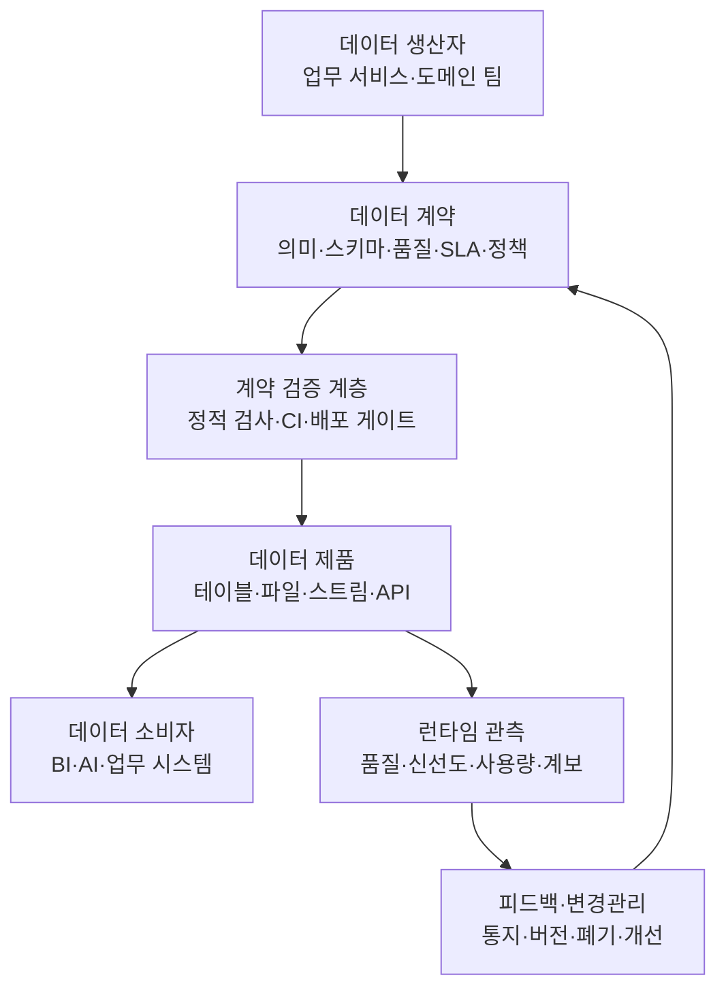
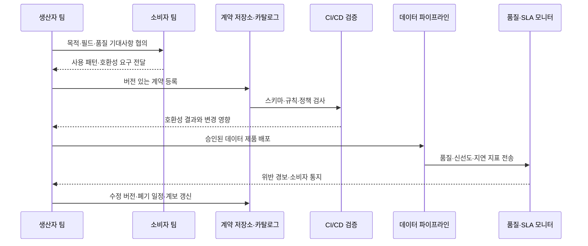
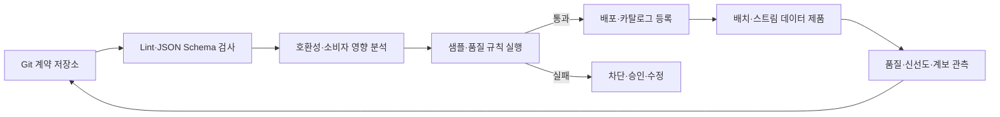

# 데이터 계약(Data Contract)과 데이터 제품 신뢰성

## 1. 개요

> **데이터 계약(Data Contract)**은 데이터 생산자와 소비자가 데이터의 의미, 구조, 품질, 갱신·가용성, 보안·접근 조건과 변경 절차를 명시적으로 합의하고, 이를 문서와 자동화된 검증으로 실행하는 데이터 제품의 인터페이스 규약이다.

데이터 플랫폼이 커질수록 데이터의 오류는 데이터베이스 한 곳의 문제가 아니라 여러 팀과 업무 프로세스로 전파된다.
주문 서비스가 `customer_id`를 문자열에서 정수로 바꾸거나, 매출 집계가 시간대를 UTC에서 현지 시간으로 바꾸면 생산 팀의 배포는 성공해도 대시보드·추천 모델·정산 시스템이 조용히 잘못된 결과를 낼 수 있다.
이처럼 분산된 데이터 파이프라인에서는 소비자가 생산자의 내부 구현을 알기 어렵고, 생산자는 누가 어떤 필드에 의존하는지 파악하기 어렵다.
데이터 계약은 이 경계에 “어떤 데이터를 어떤 의미와 품질로 제공하겠다”는 명시적인 약속을 둔다.

단순한 스키마 문서와 데이터 계약은 같지 않다.
스키마 문서는 컬럼 이름과 타입을 알려 주는 데 초점이 있지만, 계약은 그 필드가 무엇을 의미하고 언제 갱신되며 어떤 품질을 만족해야 하고 누가 장애를 책임지는지까지 포함한다.
따라서 데이터 계약은 기술적 인터페이스이면서 동시에 조직 간 운영 계약이다.
계약의 핵심은 문서를 작성하는 행위가 아니라, 배포 전에 위반을 발견하고 배포 후에도 품질과 신선도를 감시하며 변경을 호환성 정책에 따라 관리하는 실행 가능성이다.

데이터 계약이 필요한 배경은 데이터 소비 방식의 변화와도 관련된다.
중앙 데이터팀이 모든 변환을 통제하는 구조에서는 중앙 스키마와 ETL 규칙이 비교적 강한 통제점이 된다.
그러나 데이터 메시처럼 도메인 팀이 데이터 제품을 직접 소유하거나, 여러 클라우드·웨어하우스·스트리밍 플랫폼을 함께 사용하는 환경에서는 생산자와 소비자가 조직·기술적으로 분리된다.
이때 계약은 팀 사이의 의존성을 투명하게 만들고, 데이터 제품을 재사용 가능한 서비스처럼 다루게 하는 공통 언어가 된다.

논술 답안에서는 데이터 계약을 “스키마 고정”으로 축소하지 않는 것이 중요하다.
스키마·의미·품질·운영·거버넌스의 다섯 층을 함께 제시하고, 설계 시점의 계약 → CI 검증 → 배포 → 런타임 관측 → 변경·폐기의 폐쇄 루프를 연결해야 한다.
또한 계약이 강할수록 변경 안전성은 높아지지만 생산자 개발 속도와 운영 비용이 증가하므로, 모든 데이터에 동일한 강도로 적용하지 않는 위험 기반 전략이 필요하다.

### 가. 등장 배경과 필요성

첫째, 데이터 사일로와 인수인계 비용을 줄여야 한다.
생산 팀의 코드를 읽지 않고도 소비 팀이 데이터셋의 의미와 사용 조건을 이해할 수 있어야 분석·AI·업무 시스템의 개발 병목이 줄어든다.
계약은 데이터셋의 설명, 담당자, 예시, 접근 방법을 한 곳에 모아 발견 가능성을 높인다.

둘째, 파이프라인의 조용한 실패를 앞단에서 차단해야 한다.
컬럼이 누락되거나 타입이 바뀌었는데도 적재 작업 자체는 성공하는 경우가 있다.
계약 검증을 CI 또는 배포 전 단계에 넣으면 다운스트림 장애가 발생하기 전에 생산물의 형태가 계약과 맞는지 판단할 수 있다.

셋째, 데이터 품질의 책임을 소비자에게 떠넘기지 않아야 한다.
소비자가 매번 결측률·중복률·신선도를 다시 검사하면 같은 검사가 여러 팀에 중복되고, 품질 문제를 발견해도 원인 팀을 찾기 어렵다.
생산자가 품질 지표와 서비스 수준을 계약에 포함하면 품질의 소유권이 데이터가 생성되는 지점으로 이동한다.

넷째, 변경을 예측 가능한 방식으로 관리해야 한다.
필드 삭제나 의미 변경은 소비자에게 직접적인 영향을 주는 호환성 파괴 변경이다.
계약 버전, 변경 승인, 소비자 공지, 병행 제공과 폐기 기간을 운영 규칙으로 정의하면 “배포 후에야 깨지는” 상황을 줄일 수 있다.

## 2. 데이터 계약의 범위와 구성요소

데이터 계약은 하나의 YAML 파일이나 표 하나를 뜻하지 않는다.
조직의 합의가 실제 데이터 제품에 반영되도록, 비즈니스 의미부터 물리적 접속 정보까지 계층적으로 구성한다.
아래 구조는 생산자와 소비자 사이의 약속이 실행 경로에 어떻게 연결되는지를 나타낸다.



### 가. 비즈니스 의미와 데이터셋 식별자

계약의 첫 부분은 데이터셋이 무엇을 나타내는지 정의한다.
이름만 `orders`라고 쓰면 주문 생성 이벤트인지 결제 완료 주문인지, 취소 주문을 포함하는지 알 수 없다.
따라서 목적, 포함·제외 범위, 기준 시점, 금액의 통화와 세금 포함 여부처럼 해석 결과를 바꾸는 의미를 문장으로 명시해야 한다.
동일한 물리 테이블이라도 소비 목적이 다르면 별도의 논리 데이터 제품으로 분리하는 편이 안전하다.

식별자는 조직 안에서 데이터셋을 안정적으로 참조할 수 있도록 도메인, 제품명, 데이터셋명, 버전의 조합으로 설계한다.
예를 들어 `commerce.order.completed`는 주문 도메인의 완료 주문이라는 의미를 전달하고, 물리 저장소가 바뀌어도 논리 식별자는 유지할 수 있다.
계약에는 소유 팀, 기술 담당자, 문의 채널, 데이터 분류 등 책임과 통제에 필요한 메타데이터도 포함한다.
이 정보가 없으면 계약 위반이 발견되어도 누가 판단하고 복구할지 결정할 수 없다.

### 나. 스키마와 의미 제약

스키마 층은 필드명, 논리 타입, 물리 타입, 필수 여부, 기본키, 관계, 허용 코드값을 정의한다.
논리 타입은 “고객 식별자”와 같은 업무 의미를 표현하고, 물리 타입은 `string`, `integer`, `timestamp`처럼 저장·전송 형식을 표현한다.
두 타입을 분리하면 같은 업무 의미가 시스템별 물리 타입으로 매핑될 때 의미를 잃지 않는다.
예를 들어 주문번호는 숫자로만 구성되어도 산술 계산 대상이 아니므로 정수보다 문자열로 다루는 것이 안전할 수 있다.

필드 정의에는 설명과 예시를 함께 둔다.
`status`에 `P`, `C`, `X`만 허용한다고 적는 것과 “결제 대기·완료·취소를 의미한다”고 적는 것은 서로 다른 수준의 계약이다.
전자는 형식 검증을 가능하게 하고, 후자는 업무 해석의 일관성을 보장한다.
민감정보가 포함될 수 있다면 개인정보 등급, 마스킹 방법, 보존기간, 목적 외 이용 제한도 스키마 옆에 연결해야 한다.

### 다. 데이터 품질과 서비스 수준

데이터 품질은 정확성·완전성·일관성·유효성·유일성·적시성처럼 측정 가능한 규칙으로 바꾼다.
“정확한 데이터 제공”은 검증할 수 없지만, “완료 주문의 `order_id` 결측률은 0%이고 동일 주문번호의 중복률은 0.1% 미만”은 검증할 수 있다.
품질 규칙에는 측정 대상, 계산 창, 임계값, 심각도, 위반 시 조치와 예외 승인 주체를 함께 적어야 한다.

서비스 수준은 데이터의 운영 약속을 설명한다.
예를 들어 일 배치 데이터는 매일 06시까지 제공하고, 스트리밍 이벤트는 생성 후 5분 이내 도착해야 하며, 장애 시 마지막 정상 데이터의 시각과 복구 목표를 공지한다고 정할 수 있다.
가용성만 쓰면 데이터가 존재해도 오래된 상태인 문제를 놓치므로, 신선도·지연·완전성·지원시간을 목적에 맞게 함께 관리해야 한다.

다음 표는 계약의 대표 구성요소와 설계 질문을 정리한 것이다.
표에 열거된 항목을 실제 운영 문장과 검증 규칙으로 변환하는 것이 핵심이다.

| 영역 | 계약에 포함할 내용 | 검증·운영 질문 |
|---|---|---|
| 식별·소유 | 데이터셋 ID, 도메인, 버전, 생산자, 책임자 | 장애와 변경 승인 주체가 명확한가 |
| 비즈니스 의미 | 목적, 범위, 기준 시점, 용어, 포함·제외 규칙 | 생산자와 소비자가 같은 값을 같은 뜻으로 해석하는가 |
| 스키마 | 필드명, 논리·물리 타입, 필수, 키, 코드값 | 배포 결과가 선언된 구조와 호환되는가 |
| 품질 | 결측·중복·유효성·정확성 규칙, 임계값 | 어느 시점에 어떤 쿼리로 측정하는가 |
| 신선도·SLA | 갱신 주기, 지연, 가용성, 복구·공지 목표 | 늦거나 끊긴 데이터를 소비자가 알 수 있는가 |
| 접근·보안 | 인증, 권한, 암호화, 분류, 보존·삭제 | 최소권한과 목적 제한이 적용되는가 |
| 계보·지원 | 원천, 변환, 소비자, 문의·에스컬레이션 | 영향 분석과 장애 연락이 가능한가 |

## 3. 계약의 동작 원리와 수명주기

데이터 계약은 작성 후 보관하는 문서가 아니라 데이터 제품의 수명주기를 관통하는 통제점이다.
계약 초안이 만들어진 뒤 소비자 요구를 확인하고, 저장·전송 형식에 맞춰 검증 규칙을 구현하고, 배포 파이프라인과 런타임 감시에 연결한다.
아래 흐름은 계약을 변경할 때의 일반적인 폐쇄 루프를 보여 준다.



### 가. 발견과 협의

처음부터 전사 모든 데이터셋의 계약을 만들면 문서만 늘고 실질적 합의는 약해진다.
소비자가 많거나 장애 비용이 큰 공용 데이터 제품부터 후보를 선정하고, 실제 소비 SQL·대시보드·모델 입력을 조사한다.
생산자가 알고 있는 의도와 소비자가 기대하는 관행 사이에는 차이가 있기 때문에, 계약 작성은 일방적인 스키마 공지가 아니라 협의 과정이어야 한다.

협의 단계에서는 필드마다 “없을 수 있는가”, “값이 바뀌면 무엇이 깨지는가”, “과거 데이터를 재처리하는가”를 질문한다.
예를 들어 `customer_id`가 탈퇴 후에도 유지되는지, `created_at`이 이벤트 생성 시각인지 적재 시각인지, 금액이 원화인지 결제 통화인지가 불명확하면 계약이 있어도 잘못된 분석이 된다.
이 단계에서 도메인 용어집과 계보를 함께 연결하면 데이터 계약이 단순 스키마 파일을 넘어 공통 의미 모델로 발전한다.

### 나. 검증과 배포 게이트

계약 파일은 문법 검증, 스키마 검증, 호환성 검증, 데이터 샘플 검증의 순서로 확인한다.
문법 검증은 YAML·JSON 형식과 필수 키를 확인하고, 스키마 검증은 컬럼 타입·필수 여부·코드값을 확인한다.
호환성 검증은 새 버전이 기존 소비자의 질의를 깨는지 판단하며, 샘플 검증은 실제 레코드가 선언된 규칙을 만족하는지 확인한다.

검증은 개발자 노트북에서 끝나지 않고 CI/CD 파이프라인의 배포 게이트가 되어야 한다.
예를 들어 기존 필드의 삭제가 감지되면 실패시키고, 선택적 필드 추가는 소비자가 무시할 수 있을 때만 허용하며, 품질 임계값을 낮추는 변경은 승인 단계로 보낼 수 있다.
다만 데이터베이스 제약조건이 실제로 시행되는지는 저장 플랫폼마다 다르므로, “계약에 선언했다”와 “런타임에서 강제된다”를 구분해야 한다.

### 다. 버전과 호환성

계약의 버전 전략은 변경의 종류와 소비자 영향을 함께 본다.
기존 필드의 의미·타입 변경과 필드 삭제는 일반적으로 하위 호환되지 않는 파괴적 변경이다.
반면 선택적 필드 추가는 소비자가 알 수 없는 필드를 무시하고 생산자가 기본값을 보장한다면 하위 호환이 될 수 있다.
그러나 모든 포맷과 소비자가 이 원칙을 자동으로 보장하지는 않으므로 실제 소비 패턴을 확인해야 한다.

호환성은 생산자 관점과 소비자 관점이 다르다.
생산자는 새 필드 추가를 안전하다고 생각할 수 있지만, `SELECT *` 결과를 위치로 파싱하는 소비자는 열 수 증가로 깨질 수 있다.
따라서 계약 검증은 데이터 포맷만 보지 말고 등록된 소비자·쿼리·파이프라인과 연결해야 한다.
파괴적 변경이 불가피하면 새 버전을 병행 제공하고, 소비자 이전 현황과 폐기일을 추적한 뒤 구버전을 제거한다.

| 변경 예시 | 일반적 호환성 판단 | 안전한 대응 |
|---|---|---|
| 선택적 필드 추가 | 소비자가 미지 필드를 무시하면 호환 가능 | 기본값·문서·소비자 테스트 확인 |
| 필수 필드 추가 | 기존 레코드·소비자 입력이 실패할 수 있음 | 선택적 제공 후 단계적 필수화 |
| 필드 삭제 | 기존 질의와 모델이 실패할 수 있는 파괴적 변경 | 새 버전·병행 제공·폐기 공지 |
| 타입 변경 | 파싱·계산·저장 정밀도가 달라짐 | 새 필드 또는 새 버전으로 전환 |
| 의미·단위 변경 | 형식이 같아도 분석 결과가 변함 | 의미 변경을 파괴적 변경으로 취급 |
| 허용 코드값 축소 | 기존 데이터가 무효가 될 수 있음 | 소비 영향 분석과 유예기간 운영 |

### 라. 런타임 관측과 위반 대응

CI는 배포 시점의 구조를 검증하지만, 배포 후 발생하는 지연·결측·중복·분포 변화까지 보장하지는 않는다.
따라서 런타임에는 데이터 품질 모니터와 계약 모니터를 연결해야 한다.
계약의 각 규칙을 측정 지표로 바꾸고, 기준선과 임계값을 비교해 정상·경고·중대 상태를 판단한다.

위반이 감지되면 데이터 제품을 무조건 차단할지, 소비자에게 경고하고 마지막 정상 버전을 제공할지 정책을 미리 정한다.
결제·정산처럼 잘못된 값의 비용이 큰 데이터는 안전한 중단과 재처리가 우선이고, 탐색적 분석용 데이터는 지연을 알리면서 부분 제공하는 전략이 가능하다.
중요한 것은 소비자가 위반 사실과 영향 범위를 알 수 있어야 한다는 점이다.
경보에는 계약 ID, 위반 규칙, 최초 발생 시각, 영향 소비자, 마지막 정상 시점, 담당자와 복구 예상 시각을 포함한다.

## 4. 구현 아키텍처와 예시

데이터 계약 구현은 계약 저장소, 스키마·품질 검증기, 데이터 카탈로그, 파이프라인 오케스트레이터, 런타임 모니터가 연결된 형태로 설계할 수 있다.
계약 저장소는 Git으로 버전을 관리하고, 카탈로그는 계약과 계보·사용자·접근정책을 검색 가능하게 만든다.
검증기는 배포 전 정적 검사와 샘플·실데이터 검사를 수행하며, 오케스트레이터는 검증 통과 여부를 다음 단계 실행 조건으로 사용한다.



다음은 특정 표준의 완전한 예제가 아니라, 주문 완료 데이터 제품을 설명하기 위한 개념적 계약 예시다.
실제 조직에서는 사용하는 표준과 플랫폼의 필드명에 맞춰 변환하되, 의미·품질·운영 약속이 함께 표현되어야 한다.

```yaml
apiVersion: data.example/v1
kind: DataContract
id: commerce.order-completed
version: 2.1.0
owner:
  team: commerce-data
  contact: data-commerce@example.org
purpose: 결제가 완료된 주문의 분석·정산용 데이터 제품
schema:
  - name: order_id
    logicalType: string
    physicalType: varchar
    required: true
    unique: true
  - name: completed_at
    logicalType: timestamp
    physicalType: timestamp_tz
    required: true
  - name: amount
    logicalType: decimal
    physicalType: decimal(18,2)
    required: true
    description: 세금과 할인 반영 후 결제 통화 기준 금액
quality:
  - rule: not_null
    column: order_id
    threshold: 100%
  - rule: freshness
    maxDelay: 5m
serviceLevel:
  availability: 99.5%
  support: business-hours
```

위 예시에서 `order_id`의 유일성은 단순 타입으로 표현되지 않고 품질 규칙으로 검증된다.
`amount`는 숫자라는 형식뿐 아니라 세금·할인·통화 기준을 함께 명시해야 소비자가 매출을 올바르게 해석할 수 있다.
`freshness`는 데이터가 존재하는지와 별개로 마지막 이벤트가 얼마나 늦게 도착했는지를 측정한다.
이처럼 계약은 스키마, 품질, 운영 목표가 서로 보완되도록 설계해야 한다.

예를 들어 하루 100만 건의 주문 중 0.5%가 누락되면 5,000건의 분석·정산 대상이 사라진다.
생산 파이프라인이 “성공” 상태를 반환했다는 사실만으로는 이 손실을 발견할 수 없다.
계약에 완전성 임계값과 누락 감지 방식, 재처리 절차를 포함하면 배치 종료 후 품질 검증에서 문제를 드러내고 영향 범위를 계산할 수 있다.
정산 데이터라면 임계값 위반 시 소비 테이블을 갱신하지 않고 전일 정상 스냅샷을 유지하는 안전한 실패 전략도 계약의 운영 정책으로 연결할 수 있다.

## 5. 유사 개념과의 비교

데이터 계약은 데이터 품질 테스트나 데이터 카탈로그를 대체하는 단일 도구가 아니다.
각 기술은 데이터 생명주기의 서로 다른 문제를 다루며, 계약은 이들을 연결하는 합의와 인터페이스의 역할을 한다.
이를 구분하지 않으면 카탈로그에 문서를 올려 놓고 계약이 적용되었다고 오해하거나, 테스트를 많이 작성하고도 생산자 책임과 변경 절차를 놓치게 된다.

**스키마 레지스트리**는 주로 이벤트·메시지의 스키마와 직렬화 호환성을 관리한다.
반면 데이터 계약은 비즈니스 의미, 품질, SLA, 소유권과 접근정책까지 범위를 넓힌다.
스키마 레지스트리는 스트리밍 호환성의 기술적 기반이고, 데이터 계약은 스트림과 배치·테이블·파일을 아우르는 제품 수준의 운영 약속이라고 볼 수 있다.

**데이터 품질 테스트**는 실제 데이터의 내용과 분포를 검증하는 실행 규칙이다.
계약은 무엇을 보장해야 하는지 선언하고, 테스트는 그 보장을 어떤 쿼리·프로파일링·통계로 확인할지 구현한다.
계약에 선언된 품질 항목이 테스트로 연결되지 않으면 계약은 문서에 머물고, 테스트만 존재하면 왜 그 임계값이 필요한지와 책임자가 불명확해진다.

**데이터 카탈로그**는 데이터셋을 검색하고 메타데이터·계보·사용자를 탐색하는 지식 시스템이다.
계약은 카탈로그에 표시될 수 있지만, 카탈로그가 있다고 계약이 자동으로 강제되는 것은 아니다.
카탈로그는 발견성과 영향 분석을 높이고, 계약은 예측 가능한 제공 조건과 변경 통제를 정의한다.

**API 계약(OpenAPI 등)**은 요청·응답 중심의 동기 서비스 인터페이스를 정의한다.
데이터 계약도 인터페이스라는 점은 같지만, 대량 배치·이벤트 스트림·테이블의 품질·신선도·재처리·보존 특성까지 고려한다.
데이터 제품이 API로 노출되는 경우 API 계약과 데이터 계약을 연결하되, 어느 한쪽에만 모든 요구사항을 몰아넣지 않는 것이 좋다.

| 구분 | 데이터 계약 | 스키마 레지스트리 | 품질 테스트 | 데이터 카탈로그 | API 계약 |
|---|---|---|---|---|---|
| 주 대상 | 데이터 제품·생산자·소비자 합의 | 메시지 스키마 | 실제 데이터 상태 | 데이터 탐색·메타데이터 | 서비스 요청·응답 |
| 핵심 질문 | 무엇을 어떤 조건으로 제공하는가 | 이 메시지 형식이 호환되는가 | 데이터가 규칙을 만족하는가 | 어디에 어떤 데이터가 있는가 | API 호출 형식이 맞는가 |
| 범위 | 의미·구조·품질·SLA·책임 | 구조·직렬화 | 결측·분포·정합성 등 | 설명·계보·소유자 | 경로·메서드·응답 |
| 실행 시점 | 설계·CI·배포·런타임 | 생산·소비 시점 | 주기·배치·파이프라인 | 주로 조회·영향 분석 | 호출 시점 |
| 변경 관리 | 버전·호환성·폐기·통지 | 호환성 모드 | 규칙 변경 | 메타데이터 갱신 | API 버전·deprecated |

## 6. 사례와 적용 전략

### 가. 소매 주문 데이터 제품 사례

소매 기업이 주문 완료 데이터를 분석·정산·추천 팀에 제공한다고 가정한다.
초기에는 운영 DB를 분석팀이 직접 조회했기 때문에 스키마 변경이 곧바로 대시보드 오류로 이어졌고, 배송 취소가 매출 집계에 포함되는지 팀마다 해석이 달랐다.
데이터 제품 소유 팀은 주문 완료 이벤트와 정산용 테이블을 분리하고, 계약에 기준 시점·상태 정의·금액 산식·신선도·소유자·폐기 정책을 기록한다.

계약 버전 1에서는 `amount`가 원화만 지원되었지만, 해외 판매를 위해 통화 코드가 필요해졌다고 하자.
기존 `amount`의 의미를 외화 금액으로 바꾸면 형식은 같아도 의미가 변경되므로 파괴적 변경이다.
안전한 방식은 `amount_local`과 `currency_code`를 새로 추가하고, 환산 기준과 환율 시점을 별도 필드로 제공한 뒤 소비자를 전환시키는 것이다.
정산 소비자가 이전 버전의 원화 금액만 사용한다면 일정 기간 두 버전을 병행해 재무 마감 주기와 충돌하지 않도록 한다.

### 나. 머신러닝 피처 파이프라인 사례

추천 모델이 `customer_7d_order_count`를 입력으로 사용한다고 하자.
생산 팀이 집계 창을 “최근 7일”에서 “최근 달력 주”로 바꾸면 컬럼 타입과 이름은 같아도 모델의 의미가 달라진다.
따라서 계약에는 집계 창의 경계, 시간대, 미래 데이터가 섞이지 않아야 한다는 누수 방지 규칙, 결측 처리 방식, 생성 지연 목표를 명시해야 한다.
모델 성능 저하가 발생했을 때 스키마만 검사했다면 원인을 찾을 수 없지만, 의미와 분포 기준선을 함께 관측하면 변경 시점을 추적할 수 있다.

이 사례에서 계약은 모델팀의 개발을 막기 위한 문서가 아니다.
오히려 피처의 의미와 생성 조건을 합의하여 학습·서빙 간 불일치를 줄이고, 모델 재학습이나 롤백의 판단 근거를 제공한다.
다만 모든 피처에 동일한 SLA를 부여하면 비용이 커지므로, 실시간 추론에 쓰이는 핵심 피처와 실험용 피처를 분류해 검증 강도를 차등화한다.

### 다. 단계적 도입 로드맵

첫 단계에서는 가장 많이 공유되고 장애 비용이 큰 데이터 제품을 선정한다.
소유자와 소비자를 확인하고, 현재 스키마·품질·신선도·계보를 기준선으로 측정한다.
완벽한 목표값을 처음부터 선언하기보다 현 상태를 투명하게 기록한 뒤 개선 목표를 별도 버전으로 관리하는 편이 조직의 저항을 낮춘다.

두 번째 단계에서는 계약을 Git 저장소와 CI에 연결한다.
필수 필드·타입·기본 품질 규칙·호환성 검사를 자동화하고, 실패 시 어떤 소비자에 영향이 있는지 표시한다.
세 번째 단계에서는 카탈로그와 런타임 모니터를 연결하여 계약·계보·품질·사용량을 한 화면에서 확인한다.
마지막으로 표준 템플릿과 교육을 확산하되, 공용 데이터·민감 데이터·규제 대상 데이터에 우선순위를 둔다.

## 7. 심화: 데이터 메시·dbt·ODCS와의 연계

데이터 메시 환경에서 데이터 계약은 도메인별 데이터 제품의 경계를 명시하는 실무 장치다.
도메인 팀이 생산을 소유하더라도 조직 전체에서 사용할 수 있는 의미·품질·접근 규칙이 필요하기 때문이다.
계약을 셀프서비스 플랫폼의 템플릿으로 제공하면 팀마다 형식을 새로 설계하지 않고도 책임자·계보·품질·SLA를 일관되게 등록할 수 있다.
다만 연합 거버넌스는 중앙팀이 모든 필드를 승인하는 방식이 아니라, 공통 최소 규칙과 도메인별 확장 규칙을 조합해야 한다.

dbt의 모델 계약은 모델이 반환하는 데이터셋의 구조를 명시하고, 계약을 강제하면 빌드 전(preflight)에 컬럼 이름과 타입이 기대와 맞는지 확인한 뒤 불일치 시 빌드를 실패시키는 방식으로 활용된다.
dbt 문서도 다운스트림에서 의존하는 공개 모델에 계약을 정의하는 접근을 권장하지만, 제약조건의 실제 시행 여부는 데이터 플랫폼과 구체화 방식에 따라 달라질 수 있다고 설명한다.
따라서 dbt 계약을 도입할 때는 계약 선언, 데이터 테스트, 웨어하우스 제약조건의 차이를 확인해야 한다.

Open Data Contract Standard(ODCS)는 데이터 계약을 표현하는 개방형 YAML 구조로, 기본 정보·스키마·참조·데이터 품질·지원 채널·가격·팀·역할·SLA·서버·사용자 정의 속성 같은 범주를 정의한다.
이 표준을 적용하면 특정 카탈로그나 웨어하우스에 종속되지 않는 교환 형식을 만들 수 있지만, 표준 파일이 존재한다고 품질 검증이나 SLA 집행이 자동으로 완료되는 것은 아니다.
조직은 ODCS와 같은 표현 형식, dbt·Great Expectations와 같은 검증 도구, 카탈로그·모니터링 플랫폼을 역할에 맞게 조합해야 한다.

최신 데이터 플랫폼의 방향은 계약을 설계 문서에서 정책 코드와 제품 메타데이터로 확장하는 것이다.
계약 변경이 pull request로 제안되고, 자동 영향 분석·품질 샘플링·문서 생성·카탈로그 갱신·소비자 통지가 연쇄적으로 실행되면 데이터 제품의 배포 안전성이 높아진다.
반대로 자동화가 의미 변경을 완전히 판단할 수는 없으므로, 금액·개인정보·모델 피처처럼 업무 맥락이 중요한 변경에는 도메인 담당자의 승인을 남겨야 한다.

## 8. 고려사항 및 시사점

### 가. 계약의 강도와 개발 속도의 균형

계약을 엄격하게 만들수록 소비자 예측 가능성은 높아지지만 생산자의 실험과 변경 속도는 느려진다.
핵심 정산·규제 데이터에는 강한 차단과 승인 절차를 적용하고, 탐색·실험 데이터에는 경고 중심의 유연한 정책을 적용하는 위험 기반 구분이 필요하다.
계약의 목적은 변경을 금지하는 것이 아니라, 변경 비용과 영향을 사전에 보이게 하는 것이다.

### 나. 의미 계약과 형식 계약의 분리

타입과 컬럼을 검증해도 “매출”의 계산 기준이나 “활성 사용자”의 정의가 다르면 결과는 달라진다.
따라서 용어집, 예시 레코드, 계산식, 단위, 시간대, 포함·제외 조건을 계약의 설명 층에 포함해야 한다.
의미 변경은 코드 diff로 잡히지 않을 수 있으므로 생산자·소비자 협의와 승인 기록을 별도로 남긴다.

### 다. 품질 지표의 측정 가능성과 책임

품질 규칙은 측정 쿼리와 계산 창이 있어야 운영된다.
결측률의 분모가 전체 행인지 특정 상태의 행인지, 신선도의 기준 시각이 이벤트 생성인지 적재인지 합의하지 않으면 같은 데이터에서 서로 다른 결과가 나온다.
각 지표에 소유자·경보 수준·복구 목표·예외 승인자를 매핑하여 품질 대시보드를 책임 체계와 연결해야 한다.

### 라. 호환성과 폐기 정책

호환성 규칙은 포맷만으로 결정되지 않고 소비자의 사용 방식에 따라 달라진다.
`SELECT *`, 위치 기반 파싱, 하드코딩된 코드값을 사용하는 소비자는 선택적 필드 추가에도 영향을 받을 수 있다.
소비자 등록과 사용량 계측을 통해 실제 영향 범위를 파악하고, 새 버전 병행·이전 지원·명확한 폐기일을 운영한다.

### 마. 개인정보·보안·규제의 내재화

데이터 계약은 품질 계약인 동시에 보호조치의 시작점이 될 수 있다.
민감도, 접근 역할, 암호화, 마스킹, 보존기간, 삭제·정정 요청 처리, 국외 이전 제한을 데이터 제품 메타데이터에 연결한다.
그러나 계약에 “암호화됨”이라고 쓰는 것만으로 통제가 완료되지는 않으므로 IAM 정책·키 관리·접근 로그·감사 증적을 실제 시스템과 검증해야 한다.

### 바. 표준과 플랫폼의 분리

특정 도구의 설정 파일을 곧바로 전사 표준으로 채택하면 플랫폼을 바꿀 때 계약 자산을 잃을 수 있다.
논리 계약과 플랫폼별 실행 설정을 분리하고, 표준 필드에서 dbt·스트리밍 스키마·웨어하우스 제약조건으로 변환하는 어댑터 계층을 두는 것이 이식성에 유리하다.
다만 추상화가 지나치면 플랫폼의 실제 시행 한계를 숨길 수 있으므로, 어떤 규칙이 선언만 되고 어떤 규칙이 실제 차단되는지 명시해야 한다.

### 사. 기술사 관점의 도입 판단

기술사는 데이터 계약을 도구 도입 프로젝트가 아니라 데이터 운영모델의 변화로 판단해야 한다.
우선 데이터 제품 후보와 실패 비용을 평가하고, 표준 템플릿·소유권·변경관리·품질 측정·플랫폼 연계를 하나의 거버넌스 체계로 설계한다.
성과 지표는 계약 등록 수만 세지 말고, 스키마 변경으로 인한 장애 감소, 평균 복구시간, 품질 위반의 사전 탐지율, 소비자 온보딩 시간과 같은 결과 지표로 설정해야 한다.

## 참고자료

- dbt Developer Hub, “Model contracts”: https://docs.getdbt.com/docs/mesh/govern/model-contracts
- dbt Developer Hub, “contract configuration”: https://docs.getdbt.com/reference/resource-configs/contract
- Open Data Contract Standard v3.1.0: https://bitol-io.github.io/open-data-contract-standard/v3.1.0/
- Bitol Open Data Contract Standard repository: https://github.com/bitol-io/open-data-contract-standard

---

> **한 줄 요약**: 데이터 계약은 생산자와 소비자가 데이터의 의미·구조·품질·운영조건을 합의하고 CI·런타임 검증으로 실행하여, 분산 데이터 제품의 변경 안전성과 신뢰성을 높이는 인터페이스다.
