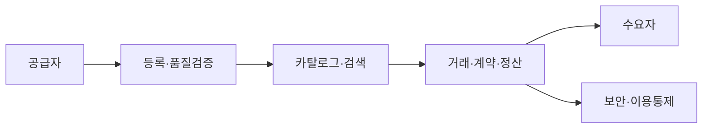

# 데이터 거래소(Data Exchange/Marketplace)

## 1. 개요

### 가. 정의
> 데이터 공급자와 수요자가 **데이터를 하나의 상품(자산)으로 거래**할 수 있도록 등록·검색·가격산정·유통·정산·이용통제를 일관되게 지원하는 **중개 플랫폼**.

데이터 거래소는 본질적으로 데이터를 대상으로 한 "시장(Market)"이다. 전통 시장이 재화의 탐색·가격형성·계약·결제를 한곳에 모아 거래비용을 낮추듯, 데이터 거래소도 흩어져 있는 데이터를 카탈로그로 모아 **탐색비용을 낮추고, 가치평가로 가격을 형성하며, 표준 계약·정산으로 거래를 완결**시킨다. 즉 데이터 거래소의 존재 이유는 개별 기업이 일일이 데이터 공급처를 찾고 협상·계약·정산하던 높은 거래비용을 플랫폼이 대신 흡수하는 데 있다.

### 나. 등장 배경 및 필요성
데이터가 "21세기의 원유"로 불릴 만큼 AI 학습·분석 수요가 폭증했지만, 정작 필요한 데이터는 개별 기업·기관 내부에 갇혀 있어 유통되지 못하는 **데이터 사일로(silo)** 문제가 컸다. 유통을 막던 결정적 장애는 두 가지였다. 첫째는 개인정보 보호와 소유권에 대한 법적 불확실성이고, 둘째는 "이 데이터가 얼마짜리인가"를 판단할 기준의 부재였다. 국내에서는 **데이터 3법 개정(2020)** 으로 가명정보 활용 근거가, **데이터산업진흥법(2022)** 으로 데이터 거래·분석제공·안심구역의 법적 근거가 마련되면서 유통의 제도적 토대가 생겼다. 그 결과 데이터 거래소는 파편화된 데이터를 시장 메커니즘으로 순환시키는 인프라로 부상했다.

## 2. 구성 요소

데이터 거래소는 상품 등록에서 정산까지의 흐름을 네 가지 축으로 지탱한다. **데이터 카탈로그**는 거래소의 심장으로, 데이터의 출처·스키마·갱신주기·품질지표 같은 메타데이터를 표준 양식으로 등록해 수요자가 실제 데이터를 열어보지 않고도 적합성을 판단하게 한다. 카탈로그가 부실하면 "무엇이 있는지 모르는" 탐색 실패로 거래 자체가 성립하지 않는다. **가격산정·정산**은 데이터의 가치를 화폐 단위로 환산하고, 다운로드·API 호출량 등에 따라 과금·정산하는 기능이다. **거래·계약**은 이용 목적·기간·재판매 금지 같은 조건을 라이선스로 명문화해 분쟁을 예방한다. **보안·이용통제**는 접근권한 관리, 가명·비식별 처리, 이용 이력 추적으로 계약 위반과 개인정보 유출을 막는다.

| 구성 | 역할 | 부실 시 문제 |
|---|---|---|
| **데이터 카탈로그** | 메타데이터·품질 정보 등록·검색 | 탐색 실패로 거래 불성립 |
| **가격산정·정산** | 가치평가, 과금·정산 | 가격 신뢰 저하, 거래 위축 |
| **거래·계약** | 이용 조건·라이선스 관리 | 오·남용, 소유권 분쟁 |
| **보안·통제** | 접근통제, 가명·비식별, 이용 추적 | 개인정보 유출·재식별 |

## 3. 거래 데이터 유형과 거래 방식

거래 대상은 정제 이전의 **원시(Raw) 데이터**부터 분석·라벨링을 거친 **가공 데이터셋**까지 스펙트럼이 넓으며, 가공도가 높을수록 수요자의 즉시 활용성이 커져 가격도 높게 형성된다. 거래 방식은 데이터의 민감도에 따라 달라진다. 비민감 데이터는 **파일 다운로드**나 **API 연계**로 실물을 그대로 넘기지만, 개인정보가 포함된 민감 데이터는 원본을 반출하지 않고 통제된 **데이터 안심구역** 안에서 분석만 수행하고 결과만 반출하는 방식을 쓴다. 가격은 데이터 구축에 든 비용을 근거로 하는 **원가 기반**, 유사 데이터의 시세를 참조하는 **시장 기반**, 그 데이터로 창출될 미래 수익을 추정하는 **수익 기반** 접근을 조합해 산정하는데, 무형·복제가능한 데이터 특성상 어느 하나도 완결적이지 않아 가치평가는 여전히 난제로 남아 있다.

## 4. 주요 이슈

데이터 거래소의 활성화를 가로막는 이슈는 서로 얽혀 있다. **프라이버시** 측면에서는, 개별적으로는 비식별된 데이터도 다른 데이터와 결합하면 개인이 다시 특정되는 **재식별 위험**이 있어 가명처리·PET(개인정보 보호강화기술) 적용이 전제되어야 한다. **가격·품질** 측면에서는, 공인된 가치평가 기준이 없어 같은 데이터도 거래소마다 값이 달라 신뢰를 얻기 어렵고, 데이터의 정확성·최신성을 보증할 품질 체계도 미흡하다. **신뢰·표준** 측면에서는, 데이터 소유권·저작권의 귀속과 라이선스 범위가 모호하고, 거래소 간 메타데이터 포맷이 달라 상호운용이 안 되는 문제가 있다. 예컨대 한국데이터거래소(KDX)나 금융데이터거래소 같은 국내 플랫폼도 초기 거래 실적 부진의 상당 부분이 이 가치평가·품질 신뢰 문제에서 비롯됐다.

| 이슈 | 원인 | 대응 |
|---|---|---|
| **프라이버시** | 결합에 의한 재식별 | 가명처리·PET·안심구역 |
| **가격·품질** | 평가기준 부재, 품질 미보증 | 가치평가 표준·품질인증 |
| **신뢰·표준** | 소유권·라이선스 모호 | 표준 메타데이터·계약 템플릿 |

## 5. 고려사항 및 시사점
- **가치평가·품질 표준화가 활성화의 관건**: 시장이 신뢰하는 공통 가격·품질 기준이 없으면 거래는 일어나지 않는다. 정부·업계 공동의 가치평가 가이드와 품질인증 체계 확립이 선행 과제다.
- **안전한 유통 아키텍처와 결합**: 가명정보 결합, 데이터 안심구역, PET(차분프라이버시·동형암호)와 연계해 "활용은 하되 원본은 내주지 않는" 구조를 기본값으로 삼아야 한다.
- **국가 데이터 생태계의 축**: 마이데이터(개인 주도 유통), 데이터 댐(공공 데이터 집적)과 함께 데이터 거래소는 데이터 경제의 순환을 완성하는 인프라이며, 향후 데이터 신탁·데이터 스페이스(EU Data Spaces)로 확장될 전망이다.

---

> **한 줄 요약**: 데이터 거래소는 *데이터를 상품으로 등록·검색·거래·정산* 하는 중개 플랫폼으로, 카탈로그·가치평가·계약·보안통제를 갖추고 재식별·품질·가치평가 표준화 문제를 풀어야 활성화되며 안심구역·PET·마이데이터와 연계되는 국가 데이터 생태계의 축이다.
