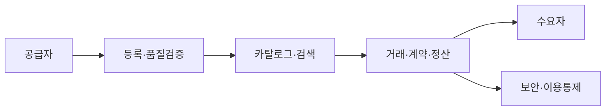

# 데이터 거래소(Data Exchange/Marketplace)

## 1. 개요

### 가. 정의
> 데이터 공급자와 수요자가 **데이터를 상품으로 거래**할 수 있도록 등록·검색·가격산정·유통·정산을 지원하는 중개 플랫폼.

### 나. 등장 배경
- 데이터 경제 활성화, **데이터 3법·데이터산업법**으로 유통 근거 마련
- 기업의 데이터 수요 급증(AI 학습·분석)

## 2. 구성 요소

| 구성 | 역할 |
|---|---|
| **데이터 카탈로그** | 메타데이터·품질 정보 등록·검색 |
| **가격산정·정산** | 가치평가, 과금·정산 |
| **거래·계약** | 이용 조건·라이선스 관리 |
| **보안·통제** | 접근통제, 가명·비식별, 이용 추적 |

## 3. 거래 데이터 유형·방식

| 구분 | 내용 |
|---|---|
| **원시/가공 데이터** | Raw, 정제·분석 데이터셋 |
| **거래 방식** | 파일 다운로드, API, **안심구역**(반출 통제) |
| **가치평가** | 원가·시장·수익 기반 산정 |

## 4. 주요 이슈

| 이슈 | 내용 |
|---|---|
| **프라이버시** | 개인정보 재식별 위험 → 가명·PET |
| **가격·품질** | 데이터 가치평가 기준 부재, 품질 보증 |
| **신뢰·표준** | 표준 포맷·메타데이터, 소유권·라이선스 |

## 5. 고려사항 및 시사점
- **데이터 품질·가치평가 표준화**가 활성화 관건
- 가명정보·데이터 안심구역·PET와 연계해 안전한 유통
- 마이데이터·데이터 댐 등 국가 데이터 유통 생태계의 축

---

> **한 줄 요약**: 데이터 거래소는 *데이터를 상품으로 등록·검색·거래·정산* 하는 중개 플랫폼으로, 카탈로그·가치평가·보안통제를 갖추고 프라이버시·품질·가치평가 표준화가 활성화의 관건이다.
