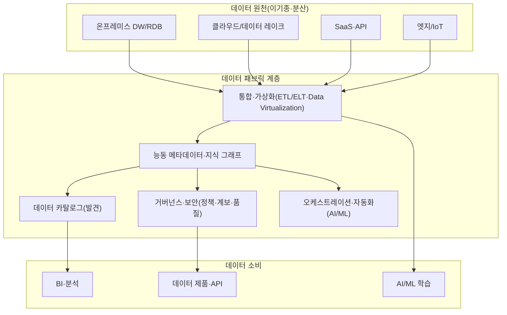
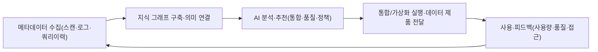

# 데이터 패브릭(Data Fabric)

## 1. 개요

### 가. 정의

> **데이터 패브릭(Data Fabric)**은 분산·이기종 환경에 흩어진 데이터 자산을 물리적으로 한곳에 모으지 않고, **능동 메타데이터(active metadata)와 지식 그래프, AI/ML 기반 자동화**를 활용해 발견·통합·거버넌스·전달을 하나의 일관된 논리 계층으로 엮어주는 데이터 관리 아키텍처이자 설계 개념이다.

데이터 패브릭은 특정 제품 하나를 지칭하는 것이 아니라, 여러 통합·카탈로그·거버넌스 기술을 메타데이터 중심으로 결합해 "어디에 어떤 데이터가 있고, 어떻게 신뢰·연결·사용할 수 있는가"를 자동으로 answer하도록 만드는 아키텍처 패턴이다.
전통적 데이터 통합은 원천마다 사람이 손으로 ETL 파이프라인을 설계하고, 데이터가 이동할 때마다 새 사본과 새 파이프라인이 늘어나는 구조였다.
데이터 패브릭은 이 반복 노동을 **메타데이터를 관찰·학습해 통합을 반자동으로 추천·실행**하는 방식으로 대체하려 한다.

핵심 관점은 "데이터를 더 많이 복제해 중앙 저장소를 키우자"가 아니라, **데이터는 원래 자리에 두되(가상화 우선) 메타데이터로 전체를 꿰뚫어 보고 필요할 때만 이동시키자**는 것이다.
따라서 데이터 패브릭은 저장 기술 문제가 아니라 메타데이터·자동화·거버넌스가 함께 설계되어야 하는 정보관리기술사형 주제이다.

### 나. 등장 배경과 필요성

첫째, 데이터의 폭발적 분산이다.
온프레미스 DW, 여러 퍼블릭 클라우드, SaaS, 데이터 레이크, 엣지 등으로 데이터가 흩어지면서 어느 한 저장소로 전부 모으는 중앙집중 전략은 비용·지연·규제 측면에서 한계에 부딪혔다.
데이터를 옮기지 않고도 통합적으로 다루는 논리 계층이 필요해졌다.

둘째, 수작업 통합의 비확장성이다.
원천·소비 조합이 늘어날수록 파이프라인 수는 조합적으로 증가하고, 소수 데이터 엔지니어가 모든 스키마 변경과 품질 이슈를 따라잡을 수 없다.
메타데이터를 분석해 통합을 자동 추천·자가치유하는 접근이 요구된다.

셋째, 거버넌스와 규제 준수 압박이다.
개인정보보호법·GDPR 등은 데이터의 계보(lineage)·목적·접근이력을 증명할 것을 요구한다.
데이터가 흩어질수록 계보 추적과 정책 일관 적용이 어려워지므로, 전역 메타데이터에 정책을 결합해 자동 집행하는 구조가 필요하다.

넷째, 셀프서비스와 데이터 가치 실현 속도(time-to-value) 요구다.
현업 분석가·AI 팀이 IT 부서를 거치지 않고도 신뢰할 수 있는 데이터를 스스로 찾아 쓰게 하려면, 검색 가능한 카탈로그와 자동화된 준비·전달 계층이 뒷받침되어야 한다.

## 2. 아키텍처와 핵심 구성요소

데이터 패브릭은 물리 계층(다양한 원천) 위에 메타데이터를 중심으로 한 여러 논리 계층을 쌓아 올린 구조로 이해할 수 있다.
아래 개념도는 원천부터 소비까지 데이터 패브릭이 어떤 계층으로 구성되는지를 보여준다.

### 가. 능동 메타데이터와 지식 그래프

데이터 패브릭의 심장은 **능동 메타데이터(active metadata)**다.
기존의 수동 메타데이터가 카탈로그에 정적으로 기록되어 사람이 조회만 하던 것이라면, 능동 메타데이터는 시스템 로그·쿼리 이력·파이프라인 실행·접근 패턴 등을 지속적으로 수집·분석해 **행동을 유발하는 살아있는 메타데이터**다.
예컨대 특정 테이블의 조인 패턴을 학습해 새로운 관계를 추천하거나, 사용량이 급증한 데이터셋의 성능을 자동으로 최적화한다.

이 메타데이터들은 **지식 그래프(knowledge graph)** 형태로 연결된다.
테이블·컬럼·용어·정책·사용자·파이프라인을 노드로, 그들 사이의 의미적 관계(파생·소속·유사·의존)를 엣지로 표현하면, "이 지표가 어떤 원천에서 왔고 어떤 변환을 거쳤는가"를 그래프 탐색만으로 답할 수 있다.
이 의미 계층(semantic layer)이 있어야 통합·거버넌스·추천이 문맥을 갖고 자동화된다.

### 나. 데이터 카탈로그와 발견

카탈로그는 조직의 모든 데이터 자산을 색인해 검색·탐색 가능하게 만드는 계층이다.
단순 목록이 아니라, 메타데이터를 기반으로 각 자산의 의미·소유자·품질 점수·계보·민감도 등급을 함께 제공해 소비자가 "믿고 쓸 데이터"를 스스로 판단하게 한다.
능동 메타데이터와 결합하면 실제 사용 빈도·신뢰도가 검색 순위에 반영되어, 조직 지식이 축적될수록 발견 품질이 좋아진다.

### 다. 통합과 데이터 가상화

데이터 패브릭은 상황에 맞는 통합 방식을 함께 지원한다.
대량 이력 데이터는 ETL/ELT로 물리 적재하지만, 실시간성이 중요하거나 이동 비용이 큰 경우에는 **데이터 가상화(data virtualization)**로 원천을 옮기지 않고 논리 뷰를 통해 즉시 조회한다.
스트리밍이 필요하면 CDC(변경 데이터 캡처)로 원천 변경을 실시간 반영한다.
어느 방식을 쓸지를 메타데이터 기반으로 자동 추천·전환하는 것이 패브릭의 지향점이다.

### 라. 거버넌스·보안과 오케스트레이션

전역 정책(마스킹·접근제어·보존기간·분류)을 메타데이터에 결합해, 데이터가 어디에 있든 일관되게 자동 집행한다.
계보(lineage)가 그래프로 관리되므로 규제 대응과 영향 분석(impact analysis)이 빨라진다.
오케스트레이션 계층은 AI/ML을 활용해 통합 파이프라인의 생성·스케줄링·자가치유를 자동화하고, 이상 징후(스키마 드리프트, 품질 저하)를 탐지해 대응한다.

## 3. 동작 절차(설계·운영 흐름)

데이터 패브릭이 실제로 가치를 만들어내는 과정은 메타데이터 수집에서 시작해 자동화된 전달·학습으로 순환하는 폐루프로 볼 수 있다.

먼저 조직 전반의 원천을 스캔해 기술·업무·운영 메타데이터를 수집하고, 이를 지식 그래프로 연결해 의미 계층을 만든다.
그 위에서 AI가 통합 방식·품질 규칙·보안 정책을 추천하고, 승인된 것을 자동 실행해 신뢰할 수 있는 데이터 제품으로 전달한다.
사용 과정에서 발생한 사용량·품질·접근 피드백은 다시 메타데이터로 흡수되어, 다음 추천의 정확도를 높이는 선순환을 이룬다.
이 폐루프가 반복될수록 사람 개입은 줄고 자동화 수준은 높아진다.

## 4. 데이터 패브릭 vs 데이터 메시 (비교)

데이터 패브릭과 데이터 메시는 "분산된 데이터를 어떻게 다룰 것인가"라는 같은 문제에 대한 서로 다른 답이라 자주 비교·혼동된다.
핵심 차이는 **문제를 기술로 푸는가, 조직으로 푸는가**에 있다.
데이터 패브릭은 메타데이터와 AI 자동화라는 **기술 중심** 접근으로 통합을 기계가 대신하게 하려 하고, 데이터 메시는 소유권을 도메인으로 분산하는 **조직·사회기술 중심** 접근으로 병목을 없애려 한다.

| 구분 | 데이터 패브릭 | 데이터 메시 |
|---|---|---|
| 본질 | 기술·아키텍처 중심 통합 계층 | 조직·운영 모델(사회기술) |
| 통합 방식 | 능동 메타데이터·AI로 자동 통합 | 도메인별 데이터 제품 자율 제공 |
| 거버넌스 | 중앙 집중형 자동 집행 | 연합(federated) 거버넌스 |
| 소유권 | 중앙/플랫폼 중심 | 도메인 분산 소유 |
| 핵심 동력 | 메타데이터·지식 그래프·자동화 | 도메인 오너십·데이터 제품화 |

중요한 것은 둘이 배타적이지 않다는 점이다.
데이터 메시가 요구하는 셀프서비스 플랫폼과 연합 거버넌스를 **데이터 패브릭의 자동화 기술로 구현**할 수 있으므로, 실제 조직에서는 "메시의 조직 원칙 + 패브릭의 기술 기반"을 결합하는 형태가 늘고 있다.
따라서 답안에서는 "무엇이 우월한가"가 아니라 "조직 성숙도·문제 성격에 따라 어떻게 조합하는가"로 마무리하는 것이 기술사 관점이다.

## 5. 적용 사례

글로벌 물류·제조 기업에서는 수십 개의 ERP·MES·창고관리 시스템이 국가별로 분산되어, 전사 재고 가시성 확보에 수 주가 걸리는 문제가 있었다.
데이터 패브릭을 도입해 각 시스템의 메타데이터를 지식 그래프로 연결하고, 대량 이력은 ELT로, 실시간 재고는 데이터 가상화로 통합하자, 데이터를 물리적으로 모으지 않고도 통합 재고 대시보드를 제공할 수 있었다.
그 결과 신규 데이터 소스 온보딩 기간이 수 주에서 수 일로 단축되고, 계보가 그래프로 관리되어 규제 감사 대응 시간이 크게 줄었다는 유형의 효과가 보고된다.
이처럼 데이터 패브릭의 가치는 "이동 최소화 + 메타데이터 기반 자동화 + 일관 거버넌스"의 결합에서 나타난다.

## 6. 고려사항 및 시사점

첫째, **메타데이터 품질이 성패를 좌우한다.** 데이터 패브릭의 모든 자동화는 능동 메타데이터의 정확성에 의존하므로, 메타데이터 수집·정제·관리 체계를 먼저 갖추지 않으면 자동 추천이 오히려 잘못된 통합을 확산시킨다. 카탈로그·계보 관리 성숙도가 선행 조건이다.

둘째, **가상화와 물리 적재의 트레이드오프를 설계해야 한다.** 가상화는 이동·복제 비용을 줄이지만 복잡한 조인·대용량 집계에서는 원천 부하와 지연이 커진다. 워크로드 특성(실시간성·볼륨·빈도)에 따라 물리/가상/스트리밍을 혼합하는 하이브리드 전략과 성능 모니터링이 필요하다.

셋째, **거버넌스 자동화의 신뢰성과 설명가능성을 확보해야 한다.** 정책이 메타데이터 기반으로 자동 집행될수록, 왜 특정 접근이 차단·마스킹되었는지 설명하고 감사할 수 있어야 하며, AI 추천 통합에는 사람 검증 게이트(human-in-the-loop)를 두어 오적용 위험을 통제해야 한다.

넷째, **점진적 도입과 기존 자산 연계 전략이 현실적이다.** 데이터 패브릭은 단번에 구축되는 제품이 아니라 카탈로그→계보→가상화→자동화 순으로 성숙시키는 여정이다. 기존 DW·레이크하우스·통합 도구를 대체가 아니라 메타데이터로 엮는 방향으로 접근하고, 도메인 소유권을 중시한다면 데이터 메시 원칙과 결합해 조직 성숙도에 맞춰 진화시키는 것이 바람직하다.

다섯째, **표준·상호운용성과 락인(lock-in) 위험을 함께 본다.** 특정 벤더의 메타데이터 모델에 종속되면 이식성이 떨어지므로, 개방형 메타데이터 표준·API를 우선하고 지식 그래프의 이식성을 확보하는 것이 장기 전략상 유리하다.

---

> **한 줄 요약**: 데이터 패브릭은 분산·이기종 데이터를 물리적으로 모으지 않고 능동 메타데이터·지식 그래프·AI 자동화로 발견·통합·거버넌스·전달을 일관되게 엮는 기술 중심 아키텍처로, 조직 중심의 데이터 메시와 상호보완적으로 결합할 때 실효를 낸다.
