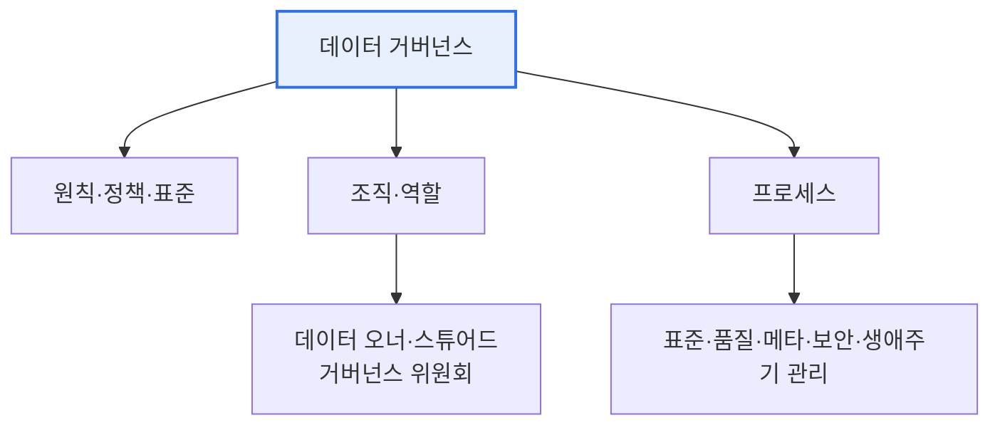

# 데이터 거버넌스(Data Governance)

## 1. 개요

### 가. 정의
> 데이터의 **가용성·유용성·무결성·보안을 확보**하기 위해 데이터 관리의 정책·표준·조직·프로세스를 정립하고 통제하는 체계. 데이터를 신뢰할 수 있는 전사 자산으로 관리한다.

데이터 거버넌스가 필요한 근본 이유는 데이터가 '**전사 공동 자산인데 주인이 불분명하다**'는 역설에 있다. 데이터는 부서마다 만들고 쓰지만 "누가 이 데이터의 정확성과 보안을 책임지는가"가 정해져 있지 않으면, 품질 저하·중복·불일치·보안 사고가 반복된다. 거버넌스는 "누가 데이터를 소유·책임지고, 어떤 규칙과 표준으로 관리하는가"를 명확히 정해 데이터 활용의 신뢰 기반을 만든다. 특히 데이터 3법·마이데이터·AI 확산으로 데이터가 핵심 자산이자 규제 대상이 되면서, 개별적·산발적 관리로는 한계가 드러나 통합 거버넌스의 중요성이 커졌다.

### 나. 필요성
시스템이 부서별·시기별로 따로 구축되며 데이터 사일로와 불일치가 누적되고, 데이터 기반 의사결정·AI의 신뢰성이 데이터 품질에 좌우되면서, 표준·품질·보안을 아우르는 통합 관리 체계가 요구된다.

## 2. 구성요소

데이터 거버넌스는 여러 요소가 유기적으로 맞물린다. **원칙·정책** 은 데이터를 어떻게 관리할지의 규칙과 표준을 정하고, **조직·역할** 은 이를 실행할 주체—데이터의 실질적 책임자인 오너, 실무 관리자인 스튜어드, 의사결정 기구인 거버넌스 위원회—를 세운다. **프로세스** 는 표준화·품질·메타데이터·보안을 실제로 관리하는 절차이며, **기술**(MDM·데이터 카탈로그·품질 도구)이 이를 지원한다. 특히 '누가 책임지는가'라는 조직·역할이 빠지면 정책과 도구가 아무리 좋아도 작동하지 않는다.

| 구성요소 | 내용 |
|---|---|
| **원칙·정책** | 데이터 관리 원칙, 표준·규칙 |
| **조직·역할** | 데이터 오너, 스튜어드, 거버넌스 위원회 |
| **프로세스** | 표준화·품질·메타데이터·보안 관리 절차 |
| **기술** | MDM, 데이터 카탈로그, 품질 도구 |

## 3. 관리 영역

데이터 거버넌스는 데이터 관리의 여러 영역을 포괄한다. 용어·코드를 통일하는 **표준 관리**, 정확성·일관성을 확보하는 **품질 관리**, 데이터의 정의·계보(어디서 와서 어떻게 변환됐는지)를 관리하는 **메타데이터 관리**, 접근통제·개인정보를 보호하는 **보안·프라이버시**, 수집부터 폐기까지의 **생애주기 관리** 가 그것이다. 이들이 개별적으로가 아니라 하나의 체계 안에서 통합 관리되는 것이 거버넌스의 핵심이다.

| 영역 | 내용 |
|---|---|
| **표준 관리** | 용어·도메인·코드 표준화 |
| **품질 관리** | 정확성·일관성·완전성 확보 |
| **메타데이터** | 데이터 정의·계보(Lineage) 관리 |
| **보안·프라이버시** | 접근통제·개인정보 보호 |
| **생애주기** | 수집~폐기 관리 |

## 4. 고려사항 및 시사점

1. **데이터 스튜어드십이 지속성의 핵심**이다. 명확한 책임 체계(오너·스튜어드) 없이는 거버넌스가 일회성 프로젝트로 끝난다. 사람에게 책임을 부여해야 데이터 품질이 지속 관리된다.
2. **표준화가 출발점**이다. 데이터 표준이 없으면 품질을 정의·측정할 수 없으므로, 표준화가 거버넌스의 기초가 된다.
3. **DataOps·데이터 메시로 진화**하고 있다. 중앙집중식 통제에서, 데이터를 도메인별로 분산 소유·관리하되 공통 거버넌스를 공유하는 데이터 메시, 파이프라인에 품질·거버넌스를 내재화하는 DataOps로 발전하고 있다.

---

> **한 줄 요약**: 데이터 거버넌스는 *정책·조직·프로세스·기술* 로 데이터의 표준·품질·메타데이터·보안·생애주기를 통합 관리해 데이터를 신뢰할 수 있는 전사 자산으로 만들며, 데이터 스튜어드십(책임 체계)과 표준화가 그 지속성의 핵심이다.
