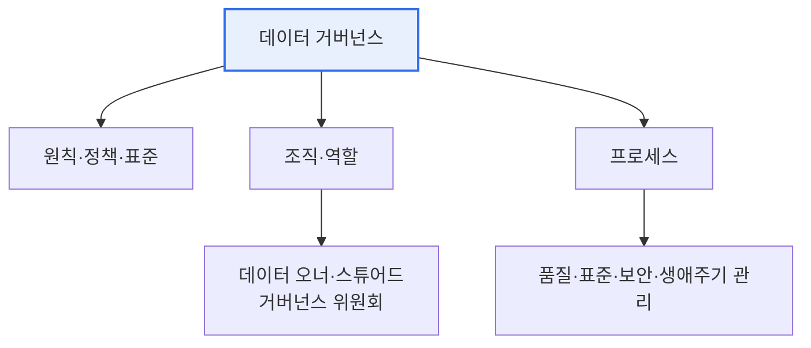

# 데이터 거버넌스(Data Governance)

## 1. 개요

### 가. 정의
> 데이터의 **가용성·유용성·무결성·보안을 확보**하기 위해 데이터 관리의 정책·표준·조직·프로세스를 정립하고 통제하는 체계. 데이터를 신뢰할 수 있는 자산으로 관리한다.

데이터 거버넌스가 필요한 이유는 데이터가 '**전사 자산**'인데 소유·책임이 불분명하면 품질 저하·중복·보안 사고가 반복되기 때문이다. 거버넌스는 "누가 데이터를 책임지고, 어떤 규칙으로 관리하는가"를 정해 데이터 활용의 신뢰 기반을 만든다. 특히 데이터 3법·마이데이터·AI 확산으로 그 중요성이 커졌다.

## 2. 구성요소

| 구성요소 | 내용 |
|---|---|
| **원칙·정책** | 데이터 관리 원칙, 표준·규칙 |
| **조직·역할** | 데이터 오너, 스튜어드, 거버넌스 위원회 |
| **프로세스** | 표준화·품질·메타데이터·보안 관리 절차 |
| **기술** | MDM, 데이터 카탈로그, 품질 도구 |

## 3. 관리 영역

| 영역 | 내용 |
|---|---|
| **표준 관리** | 용어·도메인·코드 표준화 |
| **품질 관리** | 정확성·일관성·완전성 확보 |
| **메타데이터** | 데이터 정의·계보(Lineage) 관리 |
| **보안·프라이버시** | 접근통제·개인정보 보호 |
| **생애주기** | 수집~폐기 관리 |

## 4. 시사점
- 데이터 표준·품질·보안을 아우르는 **통합 관리 체계** — 개별 관리의 한계 극복
- 데이터 스튜어드십(책임 체계)이 지속성의 핵심
- DataOps·데이터 메시(Data Mesh)로 분산 거버넌스 진화

---

> **한 줄 요약**: 데이터 거버넌스는 *정책·조직·프로세스·기술* 로 데이터의 표준·품질·메타데이터·보안·생애주기를 통합 관리하여 데이터를 신뢰할 수 있는 전사 자산으로 만드는 체계다.
