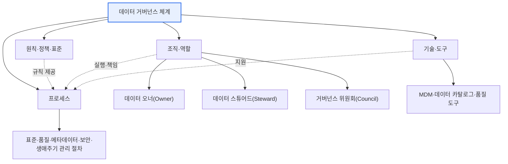
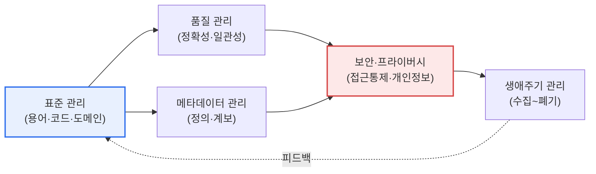

# 데이터 거버넌스(Data Governance)

## 1. 개요

### 가. 정의
> **데이터 거버넌스**는 데이터의 **가용성(Availability)·유용성(Usability)·무결성(Integrity)·보안(Security)을 확보**하기 위해 데이터 관리에 관한 **정책·표준·조직·프로세스를 정립하고 지속적으로 통제**하는 전사 관리 체계다. 데이터를 개별 부서의 부산물이 아니라 **신뢰할 수 있는 전사 공동 자산**으로 관리하는 것을 목표로 한다.

데이터 거버넌스가 필요한 근본 이유는 데이터가 '**전사 공동 자산인데 주인이 불분명하다**'는 역설에 있다. 데이터는 부서마다 만들고 쓰지만, "누가 이 데이터의 정확성과 보안을 최종 책임지는가"가 정해져 있지 않으면 품질 저하·중복·불일치·보안 사고가 반복된다. 예컨대 영업 부서의 '고객'과 재무 부서의 '고객'이 서로 다른 기준으로 집계되면, 같은 회사의 매출 보고서가 부서마다 달라지는 일이 생긴다. 거버넌스는 "누가 데이터를 소유·책임지고, 어떤 규칙과 표준으로 관리하는가"를 명확히 정의함으로써 데이터 활용의 신뢰 기반을 만든다.

특히 데이터 3법·마이데이터·생성형 AI의 확산으로 데이터가 핵심 경영 자산이자 강력한 규제 대상이 되면서, 개별적·산발적 관리로는 한계가 명확해졌다. AI 모델의 품질은 학습 데이터의 품질을 넘지 못하고("Garbage In, Garbage Out"), 개인정보 규제 위반은 막대한 과징금과 신뢰 상실로 이어진다. 이 때문에 데이터의 품질·표준·보안·규정 준수를 하나의 통합된 통제 체계로 관리하는 거버넌스가 기업 경쟁력과 리스크 관리의 핵심으로 부상했다.

### 나. 등장 배경과 필요성
데이터 거버넌스의 필요성은 세 가지 흐름이 겹치며 커졌다. 첫째, 시스템이 부서별·시기별로 따로 구축되면서 **데이터 사일로(Silo)와 불일치**가 누적되었다. 통합 표준 없이 각 시스템이 자체 코드·용어를 쓰다 보니, 전사 관점의 단일 진실 원천(Single Source of Truth)이 사라졌다. 둘째, **데이터 기반 의사결정과 AI의 신뢰성이 데이터 품질에 좌우**되면서, 품질을 정의·측정·개선하는 상시 체계가 요구되었다. 셋째, **개인정보보호·규제 강화**로 데이터의 수집·이용·보관·파기 전 과정에 대한 통제와 추적(계보)이 법적 의무가 되었다. 이 세 흐름이 표준·품질·보안을 아우르는 통합 관리 체계, 즉 데이터 거버넌스를 요구하게 되었다.

## 2. 구성요소

데이터 거버넌스는 몇 개의 요소가 유기적으로 맞물려 작동한다. 흔히 도구(MDM·카탈로그) 도입을 거버넌스로 오해하지만, 실제로는 '원칙-조직-프로세스-기술'이 서로를 지탱하는 구조여야 하며, 특히 '누가 책임지는가'라는 조직·역할이 빠지면 정책과 도구가 아무리 좋아도 작동하지 않는다.

```mermaid
flowchart TB
  G["데이터 거버넌스 체계"] --> P["원칙·정책·표준"]
  G --> O["조직·역할"]
  G --> PR["프로세스"]
  G --> T["기술·도구"]
  O --> O1["데이터 오너(Owner)"]
  O --> O2["데이터 스튜어드(Steward)"]
  O --> O3["거버넌스 위원회(Council)"]
  PR --> PR1["표준·품질·메타데이터·보안·생애주기 관리 절차"]
  T --> T1["MDM·데이터 카탈로그·품질 도구"]
  P -. 규칙 제공 .-> PR
  O -. 실행·책임 .-> PR
  T -. 지원 .-> PR
  style G fill:#e8f0fe,stroke:#2f6fed,stroke-width:2px
```

### 가. 원칙·정책·표준 — 관리의 규칙
원칙·정책은 "데이터를 어떻게 관리할 것인가"에 대한 규칙과 표준을 정한다. 여기에는 데이터 관리 원칙(예: 단일 원천 유지, 최소 수집·최소 보관), 용어·도메인·코드 표준, 데이터 등급 분류(공개/내부/민감) 정책이 포함된다. 정책은 추상적 선언에 그치면 안 되고, 실제 시스템 설계·운영 규칙으로 구체화되어야 실효가 있다. 예컨대 "고객 식별자는 전사 공통 키를 사용한다"는 원칙이 표준으로 문서화되고, 신규 시스템 검토(설계 리뷰) 단계에서 강제되어야 사일로 발생을 막을 수 있다.

### 나. 조직·역할 — 책임의 소재
조직·역할은 거버넌스를 실제로 실행할 주체를 세운다. **데이터 오너(Owner)** 는 특정 데이터 영역의 실질적 책임자(주로 현업 관리자)로, 데이터의 정의·품질·접근 권한에 대한 의사결정 권한과 책임을 가진다. **데이터 스튜어드(Steward)** 는 오너의 정책을 현장에서 집행하는 실무 관리자로, 표준 준수·품질 점검·이슈 조치를 담당한다. **거버넌스 위원회(Council)** 는 부서 간 이해가 충돌할 때 표준·우선순위를 결정하는 의사결정 기구다. 이 삼각 구조가 없으면 데이터 이슈가 발생해도 "그건 우리 부서 책임이 아니다"라며 방치되기 쉽다. 즉 거버넌스의 성패는 도구가 아니라 **책임 체계(스튜어드십)의 정착**에 달려 있다.

### 다. 프로세스 — 관리의 절차
프로세스는 표준화·품질·메타데이터·보안을 실제로 관리하는 반복 가능한 절차다. 신규 데이터 표준 등록·변경 승인 절차, 정기 품질 진단 및 개선 절차, 데이터 접근 권한 부여·회수 절차, 개인정보 영향평가 절차 등이 여기에 속한다. 프로세스가 없으면 거버넌스는 일회성 프로젝트로 끝나고, 시간이 지나면 다시 데이터 품질이 저하된다. 프로세스는 조직(누가)과 정책(무엇을)을 실제 업무 흐름(어떻게)으로 연결하는 역할을 한다.

### 라. 기술·도구 — 실행의 지원
기술은 앞의 세 요소를 확장·자동화한다. **MDM(Master Data Management)** 은 고객·상품 같은 핵심 기준정보를 단일하게 관리하고, **데이터 카탈로그** 는 어디에 어떤 데이터가 있고 무슨 의미인지를 검색 가능하게 하며, **데이터 품질 도구** 는 규칙 기반으로 오류를 자동 탐지한다. 다만 기술은 어디까지나 지원 수단이며, 명확한 정책과 책임 체계 없이 도구만 도입하면 '비싼 껍데기'가 된다는 점을 유의해야 한다.

| 구성요소 | 내용 | 실패 시 증상 |
|---|---|---|
| **원칙·정책** | 데이터 관리 원칙, 표준·규칙, 등급 정책 | 부서별 제각각 관리, 사일로 |
| **조직·역할** | 데이터 오너, 스튜어드, 거버넌스 위원회 | 책임 불명확, 이슈 방치 |
| **프로세스** | 표준·품질·메타데이터·보안 관리 절차 | 일회성 개선 후 재악화 |
| **기술** | MDM, 데이터 카탈로그, 품질 도구 | (정책 부재 시) 도구만 남고 무용 |

## 3. 관리 영역과 실행 프로세스

데이터 거버넌스는 데이터 관리의 여러 영역을 하나의 체계 안에서 통합 관리한다. 개별 영역이 각자 최적화되는 것이 아니라, 표준을 기초로 품질·메타데이터·보안·생애주기가 일관되게 연결되는 것이 핵심이다.

```mermaid
flowchart LR
  STD["표준 관리<br/>(용어·코드·도메인)"] --> QLT["품질 관리<br/>(정확성·일관성)"]
  STD --> META["메타데이터 관리<br/>(정의·계보)"]
  QLT --> SEC["보안·프라이버시<br/>(접근통제·개인정보)"]
  META --> SEC
  SEC --> LIFE["생애주기 관리<br/>(수집~폐기)"]
  LIFE -. 피드백 .-> STD
  style STD fill:#e8f0fe,stroke:#2f6fed,stroke-width:2px
  style SEC fill:#fde8e8,stroke:#d64545,stroke-width:2px
```

**표준 관리** 는 용어·도메인·코드를 통일하는 활동으로, 다른 모든 영역의 출발점이다. 표준이 없으면 품질을 정의할 수도, 데이터를 통합할 수도 없다. **품질 관리** 는 정확성·완전성·일관성·적시성을 확보하는 활동이며, 표준을 기준으로 오류를 진단·개선한다. **메타데이터 관리** 는 데이터의 정의와 계보(Lineage, 데이터가 어디서 와서 어떻게 변환·이동됐는지)를 관리해, 신뢰성과 규제 대응(추적성)의 근거를 제공한다. **보안·프라이버시** 는 접근통제와 개인정보 보호를 담당하며, 데이터 등급에 따라 암호화·비식별·접근 로깅을 적용한다. **생애주기 관리** 는 수집·저장·이용·보관·파기의 전 과정을 규정해, 불필요한 데이터를 방치하지 않고 규제(보유 기간 등)를 준수하게 한다.

| 영역 | 내용 | 대표 산출물·수단 |
|---|---|---|
| **표준 관리** | 용어·도메인·코드 표준화 | 데이터 표준 사전, 명명 규칙 |
| **품질 관리** | 정확성·일관성·완전성 확보 | 품질 규칙, 진단 리포트, 개선 지표 |
| **메타데이터** | 데이터 정의·계보(Lineage) 관리 | 데이터 카탈로그, 계보 맵 |
| **보안·프라이버시** | 접근통제·개인정보 보호 | 등급 분류, 비식별화, 접근 로그 |
| **생애주기** | 수집~폐기 관리 | 보유·파기 정책, 아카이빙 규칙 |

### 가. 데이터 품질의 차원 — 무엇을 측정할 것인가
관리 영역 중에서도 품질 관리는 거버넌스의 성과를 가장 직접적으로 보여주는 영역이므로, '무엇을 좋은 품질로 볼 것인가'를 차원으로 정의해 측정해야 한다. 통상 **정확성(Accuracy)** 은 데이터가 현실을 올바로 반영하는가, **완전성(Completeness)** 은 필요한 값이 빠짐없이 채워졌는가, **일관성(Consistency)** 은 여러 시스템 간 값이 서로 모순되지 않는가, **적시성(Timeliness)** 은 필요한 시점에 최신 데이터가 제공되는가, **유일성(Uniqueness)** 은 동일 개체가 중복 없이 관리되는가, **유효성(Validity)** 은 값이 정의된 형식·범위(도메인)를 지키는가로 나눈다.

이 차원들이 중요한 이유는, 품질을 막연히 "좋다/나쁘다"로 말하면 개선의 우선순위를 정할 수 없기 때문이다. 예컨대 '고객 이메일 완전성 92%, 유효성 97%'처럼 차원별 지표로 측정해야, 어느 항목을 어떤 규칙으로 개선할지 정할 수 있다. 스튜어드는 이 지표를 정기적으로 진단·리포팅하고, 목표치 미달 항목에 대해 원인(입력 오류·표준 미준수·시스템 결함)을 규명해 개선 조치를 실행한다. 즉 표준(무엇이 옳은가)이 있어야 규칙을 만들 수 있고, 규칙이 있어야 차원별로 측정할 수 있으며, 측정이 있어야 개선이 지속된다는 점에서 표준·규칙·측정·개선은 하나의 순환 고리를 이룬다.

### 나. 거버넌스 성숙도 — 단계적으로 정착시킨다
거버넌스는 한 번에 완성되지 않고 성숙 단계를 밟는다. 초기에는 관리가 개인·부서에 의존하는 비공식(Ad-hoc) 단계이고, 이후 정책·표준이 문서화되고 오너·스튜어드가 지정되는 정형화 단계를 거쳐, 프로세스가 조직 전반에 정착되고 지표로 관리되는 관리 단계, 마지막으로 지표 기반으로 지속 개선되고 자동화(DataOps)되는 최적화 단계로 나아간다. 자사의 현 성숙도를 진단하고 다음 단계로 가는 로드맵을 세우는 것이, 이상적 모델을 한꺼번에 도입하려다 형식주의에 빠지는 실패를 피하는 길이다.

## 4. 비교·사례 — 데이터 관리·MDM·데이터 아키텍처와의 관계

실무에서 데이터 거버넌스는 데이터 관리(Data Management)·MDM과 자주 혼동된다. 그 차이를 구분해야 역할을 오해하지 않는다. **데이터 관리** 가 데이터를 다루는 모든 실행 활동의 총칭이라면, **데이터 거버넌스** 는 그 실행을 규율하는 상위의 통제·의사결정 체계다. **MDM** 은 그중 기준정보(마스터 데이터)에 초점을 둔 구체적 실행 수단이다. 즉 거버넌스가 '규칙과 심판'이라면 MDM·품질 도구는 '선수와 장비'에 해당한다.

| 구분 | 데이터 거버넌스 | 데이터 관리 | MDM |
|---|---|---|---|
| 성격 | 통제·의사결정 체계 | 실행 활동 총칭 | 기준정보 실행 수단 |
| 관심 | 정책·표준·책임·규정 준수 | 저장·통합·처리·운영 | 고객·상품 등 마스터 일관성 |
| 산출 | 정책·표준·조직·프로세스 | 파이프라인·DB·서비스 | 단일 기준정보(Golden Record) |

구체 사례로, 한 금융사가 부서별로 고객 정보를 따로 관리해 동일 고객이 시스템마다 다른 등급으로 집계되던 문제를 거버넌스 도입으로 해결한 경우를 들 수 있다. 먼저 '고객'의 표준 정의와 공통 식별자를 확정(표준 관리)하고, 고객 데이터의 오너를 지정(조직)한 뒤, MDM으로 단일 기준정보를 구축(기술)하고, 신규 시스템은 이 기준정보를 참조하도록 설계 리뷰 프로세스에 강제(프로세스)했다. 이처럼 거버넌스는 특정 도구가 아니라 네 요소의 결합으로 작동한다는 점이 실무적 함의다.

## 5. 심화 — 데이터 메시·DataOps로의 진화와 AI 거버넌스

전통적 데이터 거버넌스는 중앙 조직이 표준과 통제를 독점하는 **중앙집중형** 이었다. 그러나 데이터 규모와 도메인이 폭증하면서 중앙 조직이 모든 도메인의 데이터를 깊이 이해하고 통제하기 어려워졌고, 이는 병목과 형식적 준수를 낳았다. 이에 대한 대안으로 **데이터 메시(Data Mesh)** 가 부상했다. 데이터 메시는 데이터를 도메인별로 분산 소유·관리하되('데이터를 제품처럼', Data as a Product), 상호운용을 위한 공통 표준·정책은 전사 차원에서 공유하는 **연합형(Federated) 거버넌스** 를 지향한다. 즉 자율(도메인 소유)과 통제(공통 표준)의 균형이 최신 흐름이다.

또한 **DataOps** 는 데이터 파이프라인에 품질 검증·거버넌스 규칙을 코드로 내재화하여, 사후 점검이 아니라 데이터가 흐르는 과정에서 자동으로 품질·정책을 강제한다. 이는 거버넌스를 문서·회의 중심에서 '자동화·상시화'로 전환시킨다.

가장 최근의 확장은 **AI/ML 거버넌스** 다. 생성형 AI 확산으로 학습 데이터의 출처·저작권·편향·개인정보가 새로운 규제·리스크 이슈가 되면서, 전통적 데이터 거버넌스가 다루던 품질·계보·보안을 AI 학습·추론 데이터까지 확장하는 흐름이 뚜렷하다. 특히 데이터 계보(Lineage)는 "이 AI가 어떤 데이터로 학습됐는가"를 추적하는 설명책임(Accountability)의 기반이 되어 중요성이 더 커지고 있다. 다만 관련 표준·규제(예: EU AI Act 등)는 계속 정비 중이므로, 세부 요건은 단정보다 '데이터 거버넌스의 범위가 AI 데이터로 확장되는 추세'로 이해하는 것이 정확하다.

## 6. 고려사항 및 시사점(기술사 관점)

1. **데이터 스튜어드십이 지속성의 핵심이다.** 명확한 책임 체계(오너·스튜어드)가 없으면 거버넌스는 도구 도입 프로젝트로 끝나고 곧 재악화된다. 사람에게 명시적 책임(R&R)을 부여하고 이를 평가·보상과 연계해야 데이터 품질이 상시 관리된다. 기술 도입보다 조직·책임 설계가 우선한다.
2. **표준화가 모든 것의 출발점이다.** 데이터 표준이 없으면 품질을 정의·측정할 수 없고 통합도 불가능하다. 용어·코드·도메인 표준을 먼저 정립하고, 이를 신규 시스템 설계 리뷰에서 강제해 사일로 재발을 원천 차단해야 한다.
3. **비즈니스 가치와 연계한 단계적 추진이 필요하다.** 전사 완전 거버넌스를 한 번에 구축하려다 형식주의에 빠지기 쉽다. 규제 리스크가 크거나 활용 가치가 높은 핵심 데이터 도메인부터 우선 적용하고, 성과(품질 지표·규제 대응)를 입증하며 확산하는 것이 현실적이다.
4. **중앙 통제와 도메인 자율의 균형(연합형 거버넌스)으로 진화해야 한다.** 규모가 커질수록 중앙 독점 통제는 병목이 되므로, 공통 표준·정책은 중앙이 정의하되 도메인이 데이터를 제품처럼 책임 소유하는 데이터 메시형 모델을 검토해야 한다. DataOps로 거버넌스를 파이프라인에 자동 내재화하는 것도 지속성 확보의 열쇠다.
5. **AI 시대의 계보·설명책임 대비.** AI 학습·추론 데이터의 출처·편향·개인정보를 추적할 수 있도록 메타데이터·계보 관리를 강화하고, 데이터 거버넌스의 범위를 AI 거버넌스로 확장하는 로드맵을 준비해야 한다.

## 참고자료
- DAMA International, DMBOK2(Data Management Body of Knowledge): https://www.dama.org/cpages/body-of-knowledge
- Zhamak Dehghani, Data Mesh Principles: https://martinfowler.com/articles/data-mesh-principles.html
- 한국데이터산업진흥원(K-DATA) 데이터 관리·거버넌스 자료: https://www.kdata.or.kr/

---

> **한 줄 요약**: 데이터 거버넌스는 *정책·조직·프로세스·기술* 로 데이터의 표준·품질·메타데이터·보안·생애주기를 통합 관리해 데이터를 신뢰할 수 있는 전사 자산으로 만드는 통제 체계로, 성패는 도구가 아니라 데이터 스튜어드십(책임 체계)과 표준화에 달려 있으며, 최근에는 데이터 메시·DataOps·AI 거버넌스로 진화하고 있다.
