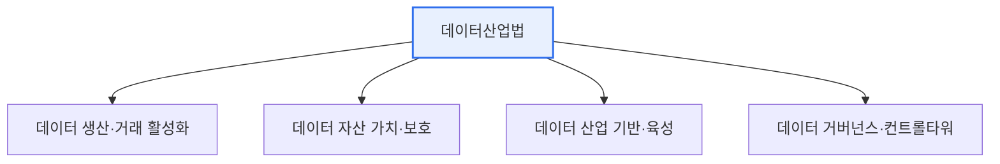

# 데이터 산업진흥 및 이용촉진에 관한 기본법(데이터산업법)

## 1. 개요

### 가. 목적
> **데이터산업법**은 데이터의 생산·거래·활용을 촉진하여 **데이터 산업을 진흥하고 국민 생활 향상과 국가 경제 발전에 기여**하기 위해 제정된 데이터 분야의 기본법이다.

데이터산업법이 제정된 근본 이유는 '**데이터가 핵심 자원이 된 시대에, 데이터를 자산으로 거래·활용할 제도적 기반이 필요했다**'는 데 있다. 데이터가 '21세기의 석유'로 불리며 경제의 핵심 자원이 되었지만, 정작 데이터를 하나의 자산으로 사고팔고 활용하는 법적 틀은 미비했다. 데이터의 가치를 어떻게 인정하고, 거래를 어떻게 보호하며, 산업을 어떻게 육성할지에 대한 근거가 없었다. 데이터산업법은 이 공백을 메운다. 개인정보보호법이 데이터의 '보호'에 초점을 둔다면, 데이터산업법은 데이터의 '**활용과 산업 진흥**'에 초점을 둔 기본법이다. 데이터를 자산으로 보아 생산·거래·유통을 촉진하고, 데이터 거래를 지원·보호하며, 데이터 산업 생태계(거래사·분석 제공사)를 육성하는 기반을 제공한다. 즉 데이터 경제를 뒷받침하는 제도적 토대다.

### 나. 등장 배경
데이터 경제의 부상과 데이터 거래·활용 수요 증가에도 관련 법제가 미비하여, 데이터 산업을 체계적으로 진흥할 기본법이 요구되었다.

## 2. 주요 내용

| 주요 내용 | 설명 |
|---|---|
| **데이터 생산·거래 활성화** | 데이터 거래 지원, 데이터 거래사 양성 |
| **데이터 자산 보호** | 데이터 자산의 부정 취득·사용 금지 |
| **데이터 가치 평가** | 데이터 자산 가치평가 지원 |
| **산업 기반 조성** | 데이터 표준화, 품질관리, 전문인력 양성 |
| **거버넌스** | 국가데이터정책위원회 등 추진 체계 |

## 3. 기대효과

| 효과 | 내용 |
|---|---|
| **데이터 거래 활성화** | 데이터를 자산으로 사고파는 시장 형성 |
| **신산업 창출** | 데이터 기반 서비스·일자리 |
| **데이터 활용 촉진** | 데이터 접근·이용 확대 |
| **데이터 주권** | 정보주체·기업의 데이터 권익 |

## 4. 고려사항 및 시사점

1. **보호와 활용의 조화**가 핵심이다. 데이터산업법(활용·진흥)과 개인정보보호법(보호)이 상호 보완적으로 작동해야 하며, 활용을 촉진하되 개인정보·프라이버시 보호와 균형을 맞춰야 한다.
2. **데이터 거래 생태계 육성**이 관건이다. 데이터를 안전하게 거래할 플랫폼·표준·가치평가 체계가 갖춰져야 실제 데이터 시장이 활성화되므로, 거래 인프라와 신뢰 체계 구축이 중요하다.
3. **마이데이터·데이터 3법과 연계**된다. 데이터 3법(가명정보 활용)·마이데이터(전송요구권)와 함께 데이터 경제의 법적 기반을 이루며, 데이터의 생산부터 활용까지 전주기를 지원한다.

---

> **한 줄 요약**: 데이터산업법은 *데이터의 생산·거래·활용을 촉진해 데이터 산업을 진흥* 하는 기본법으로, 데이터 자산 보호·가치평가·거래 활성화·산업 기반 조성을 담아 데이터 경제를 뒷받침하며 개인정보보호법과 보호·활용의 조화를 이룬다.
