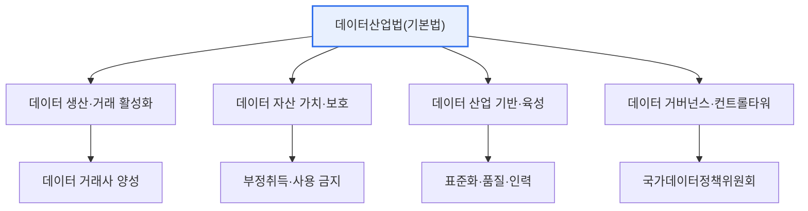

# 데이터 산업진흥 및 이용촉진에 관한 기본법(데이터산업법)

## 1. 개요

### 가. 목적
> **데이터산업법**은 데이터의 생산·거래·활용을 촉진하여 **데이터 산업을 진흥하고 국민 생활 향상과 국가 경제 발전에 기여**하기 위해 제정된 데이터 분야의 기본법이다.

데이터산업법이 제정된 근본 이유는 '**데이터가 핵심 생산요소가 된 시대에, 데이터를 하나의 자산으로 거래·활용할 제도적 기반이 필요했다**'는 데 있다. 데이터가 '21세기의 석유'로 불리며 경제의 핵심 자원이 되었지만, 정작 데이터를 자산으로 사고팔고 활용하는 법적 틀은 미비했다. 데이터의 경제적 가치를 어떻게 인정하고, 거래를 어떻게 보호하며, 데이터 기반 산업을 어떻게 육성할지에 대한 통합적 근거가 부재했던 것이다.

여기서 반드시 구분해야 할 것이 **'보호 법제'와 '진흥 법제'의 역할 분담**이다. 개인정보보호법이 데이터에 담긴 개인의 권리를 지키는 '보호'에 초점을 둔다면, 데이터산업법은 데이터의 '**활용과 산업 진흥**'에 초점을 둔 기본법(基本法)이다. 기본법이란 특정 분야의 정책 방향과 기본 원칙을 선언하고, 다른 개별법·정책이 따라야 할 상위 틀을 제공하는 법을 말한다. 즉 데이터산업법은 데이터 정책 전반의 헌법적 지위를 갖는 근거법으로, 데이터를 자산으로 보아 생산·거래·유통을 촉진하고, 데이터 거래를 지원·보호하며, 데이터 산업 생태계(거래사·분석 제공사·거래 플랫폼)를 육성하는 기반을 마련한다.

정리하면 데이터산업법은 데이터 경제(Data Economy)를 뒷받침하는 제도적 토대다. 데이터가 생산되어 유통되고, 결합·분석되어 새로운 가치를 만들며, 그 가치가 시장에서 거래되는 전주기(生産→流通→活用)를 법·정책·인프라 차원에서 촉진하려는 것이 이 법의 지향이다.

### 나. 등장 배경 및 필요성
등장 배경의 첫 축은 **데이터 경제의 급부상**이다. AI·클라우드·IoT의 확산으로 데이터의 양과 가치가 폭증했고, 데이터를 원료로 하는 서비스·산업이 경제성장의 새로운 동력으로 자리 잡았다. 그러나 데이터는 물건과 달리 무형·비경합·복제 용이라는 특성이 있어, 소유·거래·가치 인정의 방식을 기존 재산권 틀로는 온전히 다루기 어려웠다. 데이터 거래의 근거와 부정 취득에 대한 보호가 명확하지 않으면 시장 참여자가 안심하고 데이터를 사고팔 수 없다.

둘째 축은 **분절된 데이터 법제의 통합 필요성**이다. 그동안 데이터 관련 규율은 개인정보보호법(보호), 공공데이터법(공공데이터 개방), 데이터 3법 개정(가명정보 활용) 등으로 흩어져 있었고, '데이터 산업 그 자체를 어떻게 키울 것인가'를 총괄하는 상위 법이 없었다. 산업 육성·인력 양성·표준화·거래 지원을 아우르는 컨트롤타워와 기본 원칙이 요구되었고, 이에 데이터산업법이 데이터 분야의 기본법으로 제정되었다. 이는 데이터 정책의 콘트롤타워를 세우고 부처·기관에 흩어진 진흥 정책을 정렬하려는 목적도 담고 있다.

## 2. 주요 내용과 추진 체계

법의 전체 골격은 '진흥의 대상(데이터 자산)–진흥의 수단(거래·가치평가·인프라)–진흥의 주체(거버넌스)'로 구성된다. 큰 구조를 도식화하면 다음과 같다.

```mermaid
flowchart TB
  A["데이터산업법(기본법)"] --> P["데이터 생산·거래 활성화"]
  A --> V["데이터 자산 가치·보호"]
  A --> E["데이터 산업 기반·육성"]
  A --> G["데이터 거버넌스·컨트롤타워"]
  P --> P1["데이터 거래사 양성"]
  V --> V1["부정취득·사용 금지"]
  E --> E1["표준화·품질·인력"]
  G --> G1["국가데이터정책위원회"]
  style A fill:#e8f0fe,stroke:#2f6fed,stroke-width:2px
```

### 가. 데이터 생산·거래의 활성화
법은 데이터가 시장에서 원활히 유통되도록 거래 기반을 조성한다. 핵심 수단은 **데이터 거래를 중개·지원하는 전문 인력과 사업자(데이터거래사 등)를 육성**하고, 데이터 거래 표준계약서·거래 지원 사업을 통해 거래 비용과 분쟁 위험을 낮추는 것이다. 데이터는 품질·범위·이용조건이 제각각이라 거래 협상이 복잡한데, 표준화된 절차와 전문 중개가 있으면 거래가 활발해진다.

이 지점이 중요한 이유는 데이터 시장의 '신뢰' 문제 때문이다. 판매자는 데이터를 넘긴 뒤 무단 재유통을 걱정하고, 구매자는 데이터의 실제 품질·유용성을 사기 전에 확신하기 어렵다. 이 정보 비대칭을 완화하려면 거래를 지원·중개하고 이용조건을 명확히 하는 제도가 필요하며, 법은 그 근거를 제공한다. 예컨대 데이터 거래 플랫폼과 표준계약이 갖춰지면, 중소기업도 자체 협상력 없이 필요한 데이터를 합리적 조건으로 확보할 수 있다.

### 나. 데이터 자산의 가치와 보호
데이터를 거래하려면 먼저 '자산으로서의 지위'가 인정되어야 한다. 법은 데이터를 경제적 가치를 지닌 자산으로 보고, **데이터 자산의 부정 취득·사용·공개를 금지**하는 근거를 둔다. 아울러 데이터의 값을 매기는 **데이터 가치평가**를 지원한다. 데이터가 자산으로 회계·담보·투자 대상이 되려면 그 가치를 신뢰성 있게 산정하는 방법이 있어야 하기 때문이다.

여기서 발생하는 실무적 쟁점은 '데이터의 재산권적 성격'이다. 데이터는 복제·재사용이 쉬워 배타적 소유를 관철하기 어렵고, 저작권·영업비밀 등 기존 권리로 완전히 포섭되지 않는 회색지대가 넓다. 법은 이 공백에서 부정경쟁 방지에 가까운 방식으로 데이터의 부정 취득을 규율하여, "정당한 대가 없이 남의 데이터를 무단으로 취득·이용하는 행위"를 억제한다. 이는 데이터 생산자에게 투자 회수의 기대를 주어 데이터 생산을 촉진하는 유인이 된다.

데이터 가치평가는 아직 방법론이 확립되는 단계라 단정적으로 서술하기보다 '지원·촉진'의 관점에서 이해하는 것이 정확하다. 원가 접근(수집·가공 비용), 시장 접근(유사 거래 가격), 수익 접근(데이터가 창출할 미래 수익)의 관점이 논의되며, 이 평가 인프라가 성숙해야 데이터 담보 대출·데이터 자산화 같은 후속 금융이 가능해진다.

### 다. 데이터 산업 기반 조성
데이터 시장이 지속되려면 개별 거래를 넘어선 산업 인프라가 필요하다. 법은 **데이터 표준화, 데이터 품질관리, 전문인력 양성, 창업·중소기업 지원, 데이터 기반 기술 개발**을 국가가 뒷받침하도록 한다. 데이터의 형식·의미가 제각각이면 결합·분석이 어려우므로 표준화가 전제되고, 품질이 낮은 데이터는 거래·활용 가치가 없으므로 품질관리 체계가 함께 요구된다.

인력·중소기업 지원이 강조되는 배경에는 데이터 산업의 저변 확대라는 목표가 있다. 대기업은 자체 데이터와 인력을 갖추지만, 중소·창업 기업은 데이터 확보와 분석 역량 모두 부족하다. 국가가 데이터 바우처(데이터 구매·가공 비용 지원) 같은 사업으로 진입장벽을 낮추면, 데이터를 활용한 신규 서비스가 다양한 주체에서 창출될 수 있다. 이는 산업 생태계의 다양성과 회복력을 높인다.

### 라. 거버넌스와 추진 체계
법은 데이터 정책을 총괄·조정하는 컨트롤타워로서 **국가데이터정책위원회**(범부처 심의·조정 기구)를 두고, 데이터산업진흥 기본계획을 수립·추진하도록 한다. 데이터 정책이 여러 부처(과기정통부·개인정보보호위원회·산업·금융 등)에 걸쳐 있어, 조정 기구 없이는 정책이 중복·충돌하기 쉽기 때문이다.

거버넌스의 실효성은 '조정력'에 달려 있다. 위원회가 단순 협의체에 머물지 않고 기본계획·예산·표준을 실질적으로 정렬할 때, 흩어진 진흥 정책이 하나의 방향으로 수렴한다. 특히 보호 법제를 관장하는 개인정보보호위원회와의 협업이 관건인데, '활용을 촉진하는 진흥'과 '개인의 권리를 지키는 보호'가 충돌 없이 맞물려야 데이터 경제가 사회적 신뢰 위에서 성장할 수 있다.

### 마. 데이터 거래·활용 전주기
법이 촉진하려는 대상을 프로세스 관점에서 보면, 데이터는 생산에서 활용까지 하나의 수명주기(lifecycle)를 거친다. 각 단계마다 법·정책이 개입해 병목을 해소하는 구조다.

```mermaid
flowchart LR
  P["생산<br/>(수집·가공)"] --> Q["품질·표준화<br/>(정합성 확보)"]
  Q --> V["가치평가<br/>(가격 산정)"]
  V --> T["거래·유통<br/>(플랫폼·거래사)"]
  T --> U["결합·활용<br/>(분석·서비스)"]
  U --> R["재투자<br/>(신규 데이터 생산)"]
  R -.선순환.-> P
  style T fill:#e8f0fe,stroke:#2f6fed,stroke-width:2px
```

이 전주기 관점이 중요한 이유는, 데이터 산업의 병목이 특정 단계에 몰려 있기 때문이다. 생산은 활발해도 품질·표준이 낮으면 거래로 이어지지 못하고, 거래가 되더라도 가치평가 기준이 없으면 가격 협상이 무산된다. 법이 품질관리·표준화·가치평가·거래 지원을 두루 규정하는 까닭은, 어느 한 단계만 지원해서는 전체 흐름이 막히기 때문이다. 특히 마지막 '활용→재투자→재생산'의 선순환이 형성되어야 데이터 산업이 자생적으로 성장하며, 법은 그 순환을 마중물처럼 촉진하는 역할을 한다.

## 3. 기대효과와 사례

법의 기대효과는 데이터 거래 활성화, 신산업·일자리 창출, 데이터 활용 촉진, 데이터 주권 강화로 요약된다. 다만 표는 보조일 뿐, 각 효과가 실제 산업에서 어떻게 나타나는지가 핵심이다.

| 효과 | 내용 |
|---|---|
| **데이터 거래 활성화** | 데이터를 자산으로 사고파는 시장 형성 |
| **신산업·일자리 창출** | 데이터 기반 서비스·분석·중개업 |
| **데이터 활용 촉진** | 데이터 접근·결합·이용 확대 |
| **데이터 주권** | 정보주체·기업의 데이터 권익 강화 |

구체적 흐름을 보면, 데이터 거래 플랫폼이 활성화되면 금융·유통·의료 등 각 분야의 데이터가 결합되어 새로운 서비스가 나온다. 예컨대 카드 소비 데이터와 상권 데이터를 결합하면 상권 분석·입지 추천 서비스가 가능해지고, 이는 마이데이터·데이터 커머스 같은 후속 산업으로 이어진다. 데이터 바우처 사업으로 중소기업이 외부 데이터를 저비용으로 확보하면, 자체 데이터가 부족한 기업도 데이터 기반 신제품을 실험할 수 있다.

또한 데이터의 부정 취득 금지가 명문화되면, 데이터 생산자는 무단 복제·재판매 위험이 줄어 데이터에 투자할 유인이 커진다. 이는 "질 좋은 데이터가 더 많이 생산→시장에 더 많이 공급→활용이 늘어 다시 생산을 촉진"하는 선순환의 제도적 마중물이 된다.

### 가. 보호–개방–진흥 법제 비교
데이터산업법의 위치를 명확히 하려면 인접 법제와의 역할 차이를 이해해야 한다. 세 법은 규율 대상과 목적이 다르며, 서로 대체가 아니라 보완 관계다.

| 구분 | 개인정보보호법 | 공공데이터법 | 데이터산업법 |
|---|---|---|---|
| 초점 | 보호(개인 권리) | 개방(공공데이터 이용) | 진흥(산업 육성) |
| 대상 | 개인정보 | 공공기관 보유 데이터 | 데이터 전반(민간 포함) |
| 핵심 수단 | 동의·안전조치 | 개방 목록·제공 | 거래·가치평가·인프라 |

이 비교에서 드러나는 실무적 함의는, 하나의 데이터 서비스가 세 법의 교차점에 놓인다는 점이다. 예컨대 공공데이터(개방)와 민간 데이터를 결합해 개인 대상 서비스(보호)를 만들어 시장에 파는(진흥) 경우, 세 법의 요건을 동시에 충족해야 한다. 따라서 데이터산업법만 따로 이해해서는 실제 사업의 규제 지형을 그릴 수 없고, 보호·개방 법제와의 접점을 함께 설계해야 한다. 차이가 생기는 근본 이유는 각 법이 서로 다른 위험(프라이버시 침해, 공공정보 독점, 산업 저발전)을 겨냥해 만들어졌기 때문이다.

## 4. 심화 — 데이터 법제 지형과 관련 주제 연계

기술사 답안에서 데이터산업법은 단독으로 서술하기보다 **데이터 법제 전체 지형 안에서 위치를 잡는 것**이 고득점 포인트다. 데이터 법제는 크게 세 축으로 이해할 수 있다. 첫째는 **보호 축**으로 개인정보보호법과 그 개정(가명정보·마이데이터의 근거), 둘째는 **개방 축**으로 공공데이터법(공공데이터 개방·이용), 셋째는 **진흥 축**으로 데이터산업법이다. 이 셋이 보호–개방–진흥의 삼각 구도를 이룬다.

이 지형에서 데이터산업법은 진흥의 총괄 근거로 기능하며, 데이터 3법(개인정보보호법·정보통신망법·신용정보법 개정)의 가명정보 활용, 신용정보법의 마이데이터(본인신용정보관리업·전송요구권)와 유기적으로 연결된다. 즉 "가명정보로 안전하게 활용 가능한 데이터"와 "정보주체가 전송을 요구해 이동시키는 데이터"가 실제 거래·산업으로 이어지는 출구를 데이터산업법이 제도적으로 열어 준다고 볼 수 있다.

예상 출제 방향으로는 ① 데이터산업법과 개인정보보호법의 관계(진흥 vs 보호)와 조화 방안, ② 데이터 자산의 재산권적 성격과 부정취득 금지의 의의, ③ 데이터 거래 활성화를 위한 가치평가·표준화·거버넌스 과제, ④ 마이데이터·데이터 3법과의 연계 및 데이터 경제 전략이 자주 다뤄진다. 답안 구성 시 '왜 필요했는가(배경)→무엇을 담았는가(주요 내용)→어떻게 작동하는가(거버넌스·연계)→과제와 전망(고려사항)'의 흐름으로 전개하면 논리가 탄탄해진다. 다만 조문 번호·개정 시점 등 세부 사실은 변동·불확실성이 있으므로, 단정 대신 원칙과 취지 중심으로 서술하는 편이 안전하다.

## 5. 고려사항 및 시사점(기술사 관점)

1. **보호와 활용의 조화가 최우선 과제다.** 데이터산업법(활용·진흥)과 개인정보보호법(보호)은 상호 보완적으로 작동해야 한다. 활용을 촉진하되 개인정보·프라이버시 보호와 균형을 맞춰야 하며, 가명처리·개인정보 보호강화기술(PET)·프라이버시 강화 연산(연합학습·동형암호 등)을 결합해 '보호하면서 활용하는' 기술적 토대를 함께 갖춰야 한다.

2. **데이터 거래 생태계의 신뢰 인프라 구축이 관건이다.** 데이터를 안전하게 거래할 플랫폼·표준계약·가치평가·품질관리 체계가 갖춰져야 실제 시장이 활성화된다. 특히 정보 비대칭(품질·재유통 위험)을 해소할 거래 지원·중개·분쟁 조정 체계가 성숙해야 한다.

3. **데이터 자산의 재산권적 성격이라는 난제.** 데이터는 무형·비경합·복제 용이라는 특성 때문에 배타적 소유·거래가 기존 재산권 틀과 충돌한다. 부정취득 금지가 생산 유인을 주지만, 지나친 배타성은 데이터의 공유·활용을 저해할 수 있어, 보호와 개방의 적정 지점을 지속적으로 조정해야 한다.

4. **마이데이터·데이터 3법·공공데이터와의 정합적 연계.** 데이터 경제의 법적 기반은 여러 법의 협업으로 완성된다. 전송요구권(마이데이터)·가명정보 활용(데이터 3법)·공공데이터 개방과 데이터산업법의 진흥 정책이 서로 정렬되어야 생산부터 활용까지 전주기가 매끄럽게 작동한다.

5. **거버넌스의 실행력과 국제 정합성.** 국가데이터정책위원회 같은 컨트롤타워가 부처 간 정책을 실질적으로 조정해야 한다. 나아가 데이터의 국경 간 이동(cross-border)·데이터 주권·소버린 클라우드 등 국제 규범과의 정합성까지 고려해야 국내 데이터 산업이 글로벌 시장에서 경쟁력을 갖는다.

---

> **한 줄 요약**: 데이터산업법은 *데이터의 생산·거래·활용을 촉진해 데이터 산업을 진흥하는 데이터 분야 기본법* 으로, 데이터 자산의 가치·보호(부정취득 금지)·거래 활성화·산업 기반 조성·거버넌스(국가데이터정책위원회)를 담아 데이터 경제를 뒷받침하며, 개인정보보호법(보호)·데이터 3법·마이데이터와 보호–개방–진흥의 조화를 이룬다.
