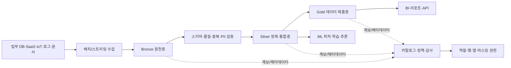
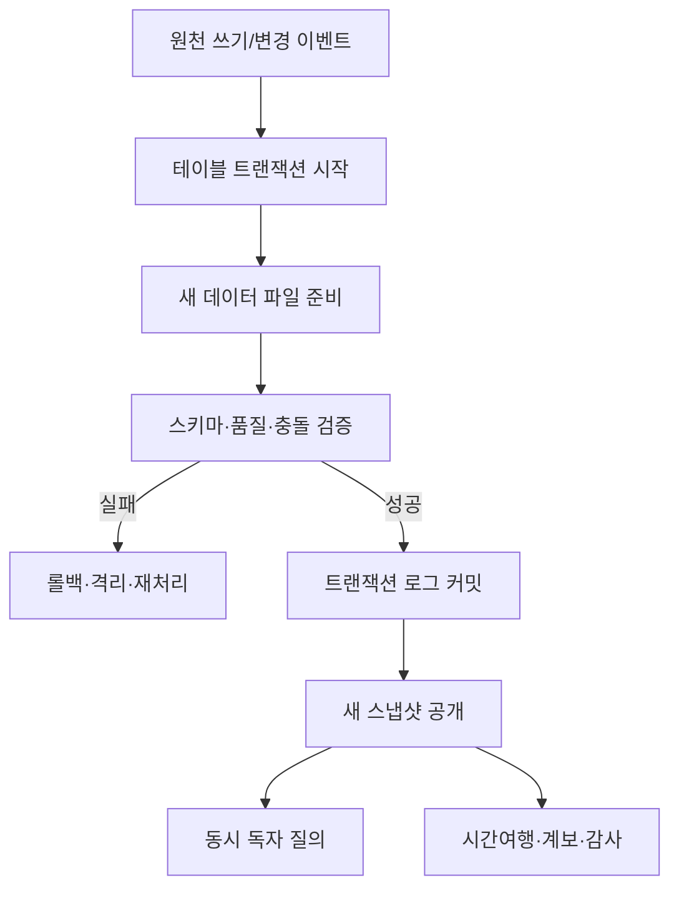

# 데이터 레이크하우스(Data Lakehouse) 아키텍처와 거버넌스

## 1. 개요

### 가. 정의

> **데이터 레이크하우스(Data Lakehouse)**는 객체 스토리지 기반 데이터 레이크의 확장성·개방성과 데이터 웨어하우스의 정합성·관리성·분석 성능을 결합하여, 배치·스트리밍·BI·AI·머신러닝이 공통 데이터를 활용하도록 설계한 데이터 관리 아키텍처이다.

데이터 레이크는 원천 데이터를 다양한 형식으로 저렴하게 보관할 수 있지만, 스키마·품질·동시성 관리가 약하면 데이터 늪(Data Swamp)으로 변질될 수 있다.
반대로 전통적인 데이터 웨어하우스는 정형화된 데이터와 보고서에는 강하지만, 비정형 데이터와 대규모 원천 보관, 빠른 실험에는 비용과 유연성의 제약이 있다.
레이크하우스는 이 둘을 단순히 붙이는 저장소가 아니라, 공통 저장 계층 위에 트랜잭션·메타데이터·카탈로그·권한·계보를 결합하는 통합 운영 모델이다.

핵심은 “모든 데이터를 한곳에 쌓는다”가 아니다.
원천 데이터의 재처리 가능성을 보존하면서도, 소비자가 신뢰할 수 있는 품질·의미·접근 정책을 단계적으로 부여하고, 분석 목적에 맞는 컴퓨팅을 분리하는 데 있다.
따라서 레이크하우스는 데이터 플랫폼, 데이터 엔지니어링, 분석·AI, 거버넌스를 함께 설계해야 하는 정보관리기술사형 주제이다.

### 나. 등장 배경과 필요성

첫째, 기업 데이터가 정형 테이블만으로 설명되지 않는다.
업무 데이터베이스, 모바일 이벤트, 센서 스트림, 애플리케이션 로그, 문서·이미지·음성, 외부 공개 데이터가 동시에 유입된다.
이 데이터를 원천 형식마다 다른 저장소로 분리하면 복제본이 증가하고, 동일 고객·상품의 정의가 시스템마다 달라져 분석 결과가 충돌한다.

둘째, BI와 AI의 데이터 요구가 한 플랫폼에서 만난다.
BI는 안정된 차원·측정값과 빠른 질의를 원하지만, AI·머신러닝은 대량의 원천 이력과 피처 재현성, 비정형 자료를 요구한다.
레이크하우스는 공통 데이터 사본을 바탕으로 워크로드별 엔진과 서빙 모델을 선택하게 하여 중복 이동을 줄인다.

셋째, 데이터의 신뢰성이 비즈니스 의사결정의 선행 조건이 되었다.
파일이 저장되어 있다는 사실은 데이터가 정확하거나 최신이라는 뜻이 아니다.
스키마 변경, 중복, 늦게 도착한 이벤트, 삭제 요청, 개인정보 마스킹, 파이프라인 실패를 관리하려면 트랜잭션 로그와 품질 규칙, 계보가 필요하다.

넷째, 클라우드 객체 스토리지와 분리형 컴퓨팅이 보편화되면서 저장과 처리의 독립성이 중요해졌다.
데이터를 여러 클러스터가 함께 읽고 써도 테이블 상태가 깨지지 않아야 하며, 사용량에 따라 SQL·스트리밍·ML 연산 자원을 별도로 확장해야 한다.

### 다. 목표와 특징

레이크하우스의 목표는 데이터 레이크의 유연성과 웨어하우스의 신뢰성을 균형 있게 달성하는 것이다.
이를 위해 개방형 파일 형식, 트랜잭션 가능한 테이블 포맷, 중앙 카탈로그, 세분화된 접근통제, 품질 자동화, 이력·계보 추적을 결합한다.
특정 제품의 기능 목록보다 중요한 것은 “저장·처리·거버넌스 책임을 어떤 경계로 나누는가”라는 설계 원칙이다.

아래 표는 레이크하우스의 설계 목표를 답안에서 빠르게 정리하는 데 유용하지만, 각 목표는 서로 trade-off를 가진다.
예를 들어 원천 데이터를 오래 보존하면 재현성과 감사성은 좋아지지만 저장·보존·삭제 비용과 개인정보 관리 부담이 커진다.

| 목표 | 설계 방향 | 얻는 효과 | 주의할 trade-off |
|---|---|---|---|
| 개방성 | 표준 파일·카탈로그·커넥터 활용 | 엔진 종속 완화 | 호환성 검증과 기능 차이 관리 |
| 신뢰성 | ACID, 스키마 검증, 품질 규칙 | 동시 처리와 재현성 | 트랜잭션 로그·컴퓨팅 비용 |
| 확장성 | 객체 스토리지와 분리형 컴퓨팅 | 데이터·사용자 증가 대응 | 네트워크·파일 수·메타데이터 병목 |
| 통합성 | BI·AI·스트리밍 공통 데이터 | 중복 복제 감소 | 워크로드 간 자원·정책 충돌 |
| 거버넌스 | 카탈로그·권한·계보·감사 | 책임성과 규제 대응 | 중앙 통제와 도메인 자율성의 균형 |

## 2. 전체 아키텍처와 데이터 흐름

### 가. 구성 계층

레이크하우스는 일반적으로 데이터 소스, 수집, 저장·테이블, 처리·품질, 카탈로그·거버넌스, 소비 계층으로 나눈다.
이 계층은 반드시 물리적으로 분리된 제품을 뜻하지 않으며, 책임과 인터페이스를 명확히 하기 위한 논리적 분해이다.

### 나. 데이터 소스와 수집 계층

소스는 관계형 업무 DB, SaaS, 파일·오브젝트 스토리지, 메시지 브로커, IoT 장치, 외부 API 등으로 구분한다.
소스마다 변경 감지 방식이 다르므로 단순히 “하루 한 번 파일 복사”로 통일하면 최신성·중복·삭제 반영에서 문제가 생긴다.
관계형 시스템은 변경 데이터 캡처(CDC), 이벤트 시스템은 오프셋·파티션, 파일은 도착 이벤트와 체크섬, API는 커서와 재시도 정책을 함께 설계해야 한다.

수집 단계에서 원천 데이터를 즉시 완벽하게 정제하려 하면 장애가 원천 시스템과 분석 시스템 사이에 전파된다.
따라서 원본 페이로드, 수집 시각, 소스 식별자, 이벤트 키, 파티션, 스키마 버전을 보존하고, 최소한의 포맷·바이러스·접근 검사를 거친 뒤 원천층에 적재한다.
원천 보존은 품질이 낮다는 뜻이 아니라, 나중에 규칙이 바뀌어도 다시 계산할 수 있는 증거와 재처리 기반을 확보한다는 뜻이다.

| 수집 패턴 | 적합한 상황 | 핵심 제어 | 대표 위험 |
|---|---|---|---|
| 배치 | 일·시간 단위 업무 추출 | 워터마크, 재실행, 파티션 | 지연과 중복 |
| CDC | DB 변경을 거의 실시간 반영 | 로그 위치, 순서, 삭제 이벤트 | 소스 부하와 스키마 변경 |
| 이벤트 스트리밍 | 클릭·센서·주문 이벤트 | 오프셋, 파티션 키, 재처리 | 중복·순서 뒤바뀜 |
| 파일 도착 기반 | 대용량 파일·외부 전달 | 체크섬, 원자적 완료 표시 | 반쪽 파일과 재전송 |
| API 수집 | 파트너·공공 API | 커서, rate limit, 백오프 | 누락·호출 제한 |

### 다. 저장·컴퓨팅 분리

데이터 파일은 확장 가능한 객체 스토리지에 두고, SQL·스트리밍·노트북·ML 작업은 필요한 시점에 컴퓨팅 클러스터를 사용하도록 분리할 수 있다.
이 구조는 저장 데이터와 질의 수요가 서로 다른 속도로 증가할 때 유리하다.
그러나 컴퓨팅을 분리했다고 해서 네트워크 지연과 파일 관리 문제가 사라지는 것은 아니다.
작은 파일이 과도하게 생기거나 파티션이 편중되면 메타데이터 조회와 파일 열기 비용이 커져 전체 질의가 느려질 수 있다.

테이블 형식은 데이터 파일과 트랜잭션 로그의 결합으로 “현재 유효한 파일 집합”을 정의한다.
쓰기 작업은 새 파일을 준비한 뒤 로그에 원자적으로 커밋하고, 독자는 커밋된 스냅샷을 읽는다.
이때 오래된 파일 정리와 시간여행 보존기간을 함께 관리해야 한다.
정리 작업이 너무 공격적이면 과거 버전 조회나 재현성, 삭제 감사에 필요한 파일이 사라질 수 있다.

## 3. 메달리온 아키텍처와 데이터 제품

### 가. Bronze 원천층

Bronze는 원천 데이터의 충실도를 보존하는 층이다.
원천 시스템의 필드와 이벤트를 가능한 한 그대로 저장하고, 수집 시각·소스·파일명·메시지 오프셋·스키마 버전 등 provenance를 붙인다.
여기서 중요한 것은 “아무 검사도 하지 않는다”가 아니라 원천 훼손을 막는 최소한의 유효성 검사와 격리 정책을 두는 것이다.

잘못된 레코드를 모두 버리면 나중에 누락 원인을 설명할 수 없으므로, 정상·오류·미확정 레코드를 구분해 보존하는 편이 재처리와 감사에 유리하다.
예를 들어 결제 이벤트의 금액 필드가 문자열로 들어오면 원문은 Bronze에 남기고, 파싱 실패 사유와 격리 위치를 메타데이터로 기록한다.
그 뒤 규칙이 수정되면 전체 원천 이력을 다시 Silver로 투입할 수 있다.

### 나. Silver 정제·통합층

Silver는 분석과 모델링에 사용할 수 있도록 품질과 의미를 부여하는 층이다.
타입 변환, 중복 제거, 결측·이상값 처리, 코드 표준화, 키 매핑, 늦게 도착한 데이터 보정, 여러 소스의 조인을 수행한다.
다만 Silver에서 비즈니스 집계까지 모두 수행하면 재사용성이 떨어지므로, 원자적이고 비집계된 정제 레코드를 우선 보존하는 것이 좋다.

Silver의 품질 규칙은 파이프라인 코드 속에만 숨기지 않고 규칙 ID, 기대 범위, 실패율, 검사 시각, 담당 도메인과 함께 관리해야 한다.
품질 실패가 발생하면 파이프라인 전체를 무조건 중단할지, 오류 격리 후 부분 성공을 허용할지 업무 중요도에 따라 정한다.
금융 원장처럼 정합성이 최우선인 데이터와 광고 클릭처럼 일부 손실을 감수할 수 있는 데이터의 정책은 달라야 한다.

### 다. Gold 데이터 제품층

Gold는 특정 업무 질문에 답하도록 의미를 정리한 데이터 제품층이다.
매출, 고객활성도, 재고회전율처럼 정의가 합의된 지표와 차원·집계를 제공하고, BI·경영진·업무 API·ML 피처가 바로 활용하도록 성능을 최적화한다.
Gold는 데이터가 “더 좋은 것”이라는 계층이 아니라, 목적과 소비자에 맞게 게시된 계약(contract)이라는 관점이 중요하다.

Gold 데이터 제품에는 소유자, 설명, 갱신 주기, 품질 SLO, 허용 지연, 접근 대상, 계보, 변경 호환성 정책을 명시한다.
예를 들어 “일 매출”은 주문일 기준인지 결제완료일 기준인지, 환불을 언제 차감하는지, 시간대는 무엇인지가 정의되지 않으면 숫자가 있어도 의사결정에 쓸 수 없다.
따라서 기술 메타데이터와 비즈니스 용어집을 함께 운영해야 한다.

| 계층 | 데이터 성격 | 주요 처리 | 소비자 | 품질 기준 |
|---|---|---|---|---|
| Bronze | 원천·재현 가능 | 수집·최소 검증·원문 보존 | 엔지니어·감사 | 수집 누락·파일 무결성 |
| Silver | 정제·통합·비집계 | 타입·중복·키·결측·지연 처리 | 분석가·데이터 과학자 | 정확성·유일성·참조무결성 |
| Gold | 업무 의미·집계·게시 | 지표·차원·보안뷰·성능 최적화 | 경영·BI·서비스·ML | 신선도·정의 일관성·응답시간 |

## 4. 트랜잭션·스키마·품질 설계

### 가. ACID와 동시성

레이크하우스의 테이블 트랜잭션은 여러 작성자가 동시에 작업해도 독자가 불완전한 파일 집합을 보지 않게 하는 기반이다.
원자성은 작업 전체가 성공하거나 실패하게 하고, 일관성은 정의된 스키마·제약·품질 조건을 벗어난 상태를 방지한다.
격리성은 동시 작업이 서로의 중간 상태를 오염시키지 않게 하며, 내구성은 커밋한 결과가 장애 이후에도 재구성되도록 한다.

다만 ACID가 원천 시스템부터 BI 화면까지 모든 분산 시스템의 업무 트랜잭션을 자동으로 보장하는 것은 아니다.
두 개의 외부 시스템을 동시에 갱신하는 분산 트랜잭션, 모델 서빙 캐시, 메시지 브로커의 전달 보장은 별도 설계가 필요하다.
레이크하우스 안에서 테이블 커밋이 원자적이어도, 외부 결제 승인과 데이터 적재 사이에는 중복·지연·보상처리 문제가 남는다.

### 나. 스키마 관리와 진화

스키마는 컬럼 이름과 타입만이 아니라 필수성, 코드체계, 의미, 허용 범위, 개인정보 분류, 호환성 규칙을 포함한다.
원천층은 예기치 않은 변경을 수용할 여지를 두되, Silver·Gold는 계약을 엄격하게 적용해야 하며, 변경을 발견하면 영향도 분석과 소비자 통지가 이어져야 한다.

하위 호환 가능한 컬럼 추가와 달리 컬럼 삭제·타입 축소·코드 의미 변경은 소비자를 깨뜨릴 수 있다.
스키마 레지스트리, 데이터 계약, 자동 검증, 버전 필드, 폐기 예고 기간을 사용하면 파이프라인 간 암묵적 의존을 줄일 수 있다.
“스키마 진화 지원”은 아무 변경이나 허용한다는 뜻이 아니라, 허용·경고·차단의 경계를 명시한다는 뜻이다.

| 변경 유형 | 예 | 기본 판정 | 대응 |
|---|---|---|---|
| 하위 호환 | 선택적 컬럼 추가 | 허용 가능 | 소비자 영향·문서 확인 |
| 비호환 | 필수 컬럼 삭제 | 차단 | 새 버전 계약·마이그레이션 |
| 의미 변경 | 코드값의 정의 변경 | 매우 위험 | 용어집·변환 규칙·재계산 |
| 타입 변경 | 정수→문자열 | 조건부 | 정밀도·파서·샘플 검증 |
| 개인정보 변화 | 일반값→민감정보 분류 | 즉시 통제 | 마스킹·권한·보존정책 재검토 |

### 다. 데이터 품질과 관측성

품질은 정확성 하나로 끝나지 않는다.
완전성은 필요한 레코드가 빠짐없이 있는지, 유일성은 중복이 없는지, 유효성은 형식·범위가 맞는지, 일관성은 시스템·기간 간 정의가 같은지, 적시성은 약속한 시간 안에 도착했는지를 뜻한다.
업무에 따라 품질 차원의 중요도와 임계치가 달라지므로 모든 데이터를 동일한 100점 기준으로 관리해서는 안 된다.

데이터 관측성은 파이프라인 실행 성공 여부를 넘어 데이터의 상태를 감시한다.
신선도 지연, 행 수 급변, 분포 변화, 스키마 변화, null 비율, 참조키 실패, Gold 지표 변동을 추적하고, 이상이 발생하면 어느 소스·변환·소비자에 영향을 주는지 계보로 연결한다.
이를 통해 “작업은 성공했지만 데이터는 틀린” 조용한 실패를 발견할 수 있다.

## 5. 거버넌스·보안·개인정보 보호

### 가. 카탈로그와 계보

카탈로그는 테이블 이름을 모아 놓는 목록이 아니라 데이터의 발견·이해·접근·책임을 지원하는 운영 체계다.
기술 메타데이터에는 스키마, 위치, 파티션, 소유자, 갱신 시각, 품질 결과를 기록하고, 비즈니스 메타데이터에는 용어 정의, 지표 계산식, 데이터 분류, 사용 목적을 기록한다.

계보는 데이터가 어느 소스에서 와서 어떤 변환을 거쳐 어느 보고서·모델에 사용되었는지를 연결한다.
개인정보 삭제나 지표 오류가 발생했을 때 영향 범위를 빨리 파악하고, 모델 학습 데이터의 재현성과 감사 증거를 확보하려면 열·행 수준의 계보가 유용하다.
다만 계보 수집 자체가 운영 부담이므로 모든 임시 산출물까지 동일한 수준으로 관리하기보다는 중요 데이터 제품부터 우선순위를 둔다.

### 나. 접근제어와 개인정보

레이크하우스는 원천층에 민감한 원문이 있을 수 있으므로 계층별 공개 범위를 동일하게 두면 안 된다.
역할 기반 접근제어(RBAC), 속성 기반 정책(ABAC), 행·열 수준 필터, 동적 마스킹, 토큰화, 암호화, 네트워크 경계를 조합해 최소권한을 구현한다.
데이터 과학자가 모델 학습에 주민등록번호 원문을 필요로 하지 않는다면 비식별 식별자와 필요한 파생 특성만 제공해야 한다.

보존기간과 삭제 요청은 시간여행·백업·파생 Gold·학습 데이터까지 고려해야 한다.
원천 보존이 감사에 유리하다는 이유로 목적을 벗어난 무기한 보관을 정당화할 수는 없다.
분류→목적·근거 확인→접근 승인→마스킹·암호화→보존·파기→감사로그의 생명주기를 데이터 제품 설계에 포함해야 한다.

| 통제 영역 | 적용 예 | 검증 증거 |
|---|---|---|
| 신원·권한 | SSO, MFA, RBAC, ABAC | 권한 매트릭스·접근 로그 |
| 기밀성 | 저장·전송 암호화, 마스킹 | 키 관리 로그·샘플 점검 |
| 최소수집 | 필요한 컬럼·기간만 적재 | 목적·필드 매핑 |
| 계보·감사 | 데이터·쿼리·정책 이력 | 변경·조회 감사로그 |
| 보존·파기 | 보존기간, 삭제 전파 | 파기 작업과 예외 기록 |
| 공급망 | 커넥터·라이브러리 검증 | SBOM·취약점 조치 이력 |

## 6. 데이터 레이크·웨어하우스와의 비교

데이터 레이크는 원천 형식과 규모에 대한 유연성이 가장 큰 대신, 소비자가 직접 품질과 의미를 판단해야 하는 부담이 커지기 쉽다.
웨어하우스는 통합 스키마와 질의 최적화로 반복 보고서에 강하지만, 비정형 원천과 장기 이력, 대규모 실험 데이터의 보관·처리에 제약이 생길 수 있다.
레이크하우스는 공통 저장과 테이블 관리로 간극을 줄이지만, 웨어하우스의 모든 성능과 레이크의 모든 유연성을 자동으로 얻는 것은 아니다.

선택은 유행이 아니라 업무의 지연 요구, 데이터 형식, 규제, 운영 역량, 질의 패턴으로 결정해야 한다.
예를 들어 월말 재무 결산은 강한 정합성과 승인된 의미가 중요하므로 Gold 웨어하우스형 모델을 우선할 수 있고, 센서 원천의 이상탐지 연구는 Bronze·Silver의 긴 이력과 스트리밍 처리가 중요하다.
하나의 플랫폼 안에서도 계층별로 다른 모델을 병행하는 것이 현실적인 접근이다.

| 구분 | 데이터 레이크 | 데이터 웨어하우스 | 데이터 레이크하우스 |
|---|---|---|---|
| 주요 목적 | 원천·대규모·다양 데이터 보존 | 정형 분석·보고 | BI·AI·스트리밍 통합 |
| 스키마 | 주로 schema-on-read | 주로 schema-on-write | 층별로 유연·엄격 병행 |
| 트랜잭션 | 파일·구현에 따라 상이 | 강한 테이블 관리 | 테이블 포맷·로그로 강화 |
| 사용자 | 엔지니어·연구자 | 분석가·경영 사용자 | 역할별 공동 활용 |
| 장점 | 저비용·개방성 | 일관성·질의 성능 | 사본·플랫폼 통합 |
| 위험 | 데이터 늪·품질 불명 | 복제·이동·고비용 | 복잡한 운영·벤더 종속 |

## 7. 구현 절차와 운영 모델

### 가. 단계별 구축

1단계는 업무 목표와 데이터 제품 후보를 정의하는 것이다.
“호수 하나를 만들자”가 아니라 고객 360, 실시간 재고, 부정거래 탐지처럼 소비자와 의사결정, 허용 지연, 품질 SLO를 명시한다.
2단계는 소스 목록·분류·소유자·법적 근거·보존기간을 파악하고, Bronze 적재와 메타데이터 표준을 만든다.

3단계는 CDC·스트리밍·배치 수집을 데이터 특성에 맞게 선택하고, 재실행·중복·순서·지연·실패 격리 정책을 구현한다.
4단계는 Silver의 공통 키와 품질 규칙, Gold의 지표 계약을 도메인과 합의한다.
5단계는 카탈로그·권한·계보·감사·비용 태그를 파이프라인 배포 과정에 내장한다.

운영 전환 후에는 데이터 제품별 신선도·품질·비용·사용량을 관찰하고, 장애 대응 런북과 소비자 공지를 검증한다.
데이터 플랫폼을 구축한 뒤 운영팀에 넘기는 방식보다, 엔지니어·도메인 전문가·보안·감사·분석 소비자가 제품 수명주기 동안 공동 책임지는 모델이 적합하다.

### 나. 데이터 제품 운영지표

| 영역 | 지표 예 | 의미 |
|---|---|---|
| 신선도 | 마지막 성공 적재 시각, 지연 p95 | 약속된 갱신을 지켰는가 |
| 품질 | null율, 중복율, 유효성 실패율 | 데이터가 사용 가능한가 |
| 신뢰성 | 파이프라인 성공률, 재처리율 | 운영이 안정적인가 |
| 성능 | 질의 p95, 파일 수, 스캔량 | 소비자가 충분히 빠르게 쓰는가 |
| 비용 | 저장·컴퓨팅·전송 비용/제품 | 가치 대비 비용이 합리적인가 |
| 거버넌스 | 미분류 자산, 과도 권한, 계보 커버리지 | 통제가 실제로 적용되는가 |
| 활용 | 활성 사용자, 재사용 쿼리, 제품 채택률 | 투자 가치가 실현되는가 |

### 다. 비용과 성능 최적화

객체 스토리지는 저렴하지만 저장 포맷·압축·파티션·파일 크기·스캔 범위에 따라 질의 비용과 시간이 크게 달라진다.
시간·지역·업무키로 무조건 잘게 파티션하면 파티션 수가 폭증하고, 반대로 파티션을 너무 크게 만들면 불필요한 데이터 스캔이 늘어난다.
실제 필터 패턴과 데이터 분포를 관찰해 파티션과 클러스터링을 정하고, 작은 파일을 주기적으로 통합하되 동시 쓰기와 시간여행 보존을 해치지 않도록 한다.

비용 최적화는 단순 삭제가 아니다.
미사용 Gold 뷰를 찾아 계산을 줄이고, 반복 질의는 캐시·머티리얼라이즈드 결과를 활용하며, 개발·검증·운영 환경을 분리하고, 스트리밍이 정말 필요한 데이터와 주기 배치로 충분한 데이터를 구분한다.
데이터 제품의 신선도 SLO를 낮추면 비용이 줄 수 있지만, 그 trade-off를 사업 담당자가 동의하도록 지표와 예산으로 투명하게 제시해야 한다.

## 8. 비교 사례와 실무 적용

### 가. 사례 1: 이커머스 고객·주문 분석

이커머스는 주문 DB, 결제 이벤트, 앱 클릭, 상품 카탈로그, 배송 상태가 서로 다른 속도로 갱신된다.
Bronze에는 원천 이벤트와 CDC 로그를 보존하고, Silver에서 주문·고객·상품 키를 정합화하며, Gold에서 일매출·전환율·재구매율 데이터 제품을 제공한다.
결제 승인과 주문 상태가 늦게 도착할 수 있으므로 Silver는 이벤트 시간과 수집 시간을 모두 보존하고, 늦은 이벤트의 재계산 정책을 가져야 한다.

경영진 대시보드는 Gold의 승인된 매출 정의를 사용하고, 추천 모델은 Silver의 행동 이력과 별도의 피처 뷰를 사용한다.
같은 원천을 공유하므로 채널별 숫자가 달라지는 문제를 줄일 수 있지만, 개인정보 접근과 마케팅 목적의 사용을 분리해야 한다.
실패한 파이프라인은 마지막 성공 스냅샷을 표시하고, 소비자에게 데이터 지연을 알리는 운영 규칙까지 제품에 포함한다.

### 나. 사례 2: 제조 설비 예지정비

센서 데이터는 초당 여러 건 발생하고, 설비 마스터와 정비 이력은 배치로 변경된다.
Bronze는 센서 원문·장치 식별자·수집 시각·메시지 순서를 보존하고, Silver는 단위 변환·이상 범위·결측 보간·설비 마스터 조인을 수행한다.
Gold는 설비별 고장률, 최근 진동 특징, 정비 예정, 모델 입력 피처를 제공한다.

센서의 늦은 도착이나 장치 시계 오류를 단순히 폐기하면 고장 전조가 사라질 수 있다.
이벤트 시간 창과 워터마크, 재처리 범위를 설계하고, 모델 학습 데이터의 생성 버전과 품질 결과를 기록해야 한다.
현장 운영자는 최신 알람을 요구하지만, 분석가는 원천 이력과 재현성을 요구하므로 스트리밍 서빙과 장기 Silver 보존을 병행한다.

## 9. 심화: 데이터 메시·MLOps와의 연계

레이크하우스는 중앙 플랫폼의 기술 기반이고, 데이터 메시(Data Mesh)는 도메인 중심 소유와 데이터 제품 관점을 강조하는 조직·운영 원칙이다.
레이크하우스만 도입해도 소유자·품질 책임·용어 합의가 자동으로 생기지 않으며, 중앙팀이 모든 파이프라인의 병목이 될 수 있다.
반대로 도메인 자율성만 강조하면 공통 식별자·보안·계보·품질 기준이 분리될 수 있다.

현실적인 모델은 중앙 플랫폼팀이 저장·카탈로그·권한·관측성·템플릿을 제공하고, 도메인팀이 Gold 데이터 제품의 의미·품질 SLO·변경 계약을 책임지는 방식이다.
이를 federated governance로 운영하면 공통 정책은 강제하되 업무 의미와 우선순위는 도메인이 결정할 수 있다.

MLOps와 연계할 때는 Silver·Gold의 데이터 버전만 저장하는 데 그치지 말고, 학습 스냅샷, 피처 정의, 코드 버전, 파라미터, 평가 결과, 승인 상태를 함께 기록해야 한다.
그래야 모델의 예측 결과를 재현하고, 데이터 드리프트가 발생했을 때 어느 소스·변환·기간에서 문제가 시작되었는지 추적할 수 있다.
특히 개인정보·저작권·민감 속성이 포함된 학습 데이터는 접근권한과 삭제 전파를 모델 아티팩트까지 연결해야 한다.

## 10. 고려사항 및 시사점

### 가. 목적·가치 중심의 단계적 도입

레이크하우스를 기술 플랫폼 교체 사업으로 추진하면 사용자가 체감하는 데이터 제품과 투자 효과가 늦어진다.
우선순위가 높은 업무 한두 개를 선택하고, 현재 복제 비용·지연·품질 오류·보고서 불일치의 기준선을 측정한 뒤 개선 효과를 검증해야 한다.
그 결과를 기반으로 공통 템플릿과 표준을 확장하는 것이 빅뱅식 전환보다 위험이 낮다.

### 나. 트랜잭션의 경계와 일관성 수준 명시

테이블 ACID와 업무 프로세스의 전체 일관성을 혼동하지 말아야 한다.
원천 시스템·브로커·레이크하우스·대시보드 사이에서 어떤 구간이 exactly-once에 가까운지, 어디서 중복 제거·멱등성이 필요한지, 오류 시 보상처리를 어떻게 하는지 문서화해야 한다.
재처리 가능한 키와 스냅샷을 설계하지 않으면 장애 때 중복 집계와 수동 수정이 반복된다.

### 다. 보안·개인정보를 사후 통제하지 않기

원천층의 민감정보를 넓게 공개한 뒤 Gold에서만 마스킹하는 방식은 위험하다.
수집 시점의 분류와 최소수집, 목적별 접근, 개발 데이터의 비식별화, 키 관리, 감사 로그, 보존·파기 전파를 아키텍처의 기본 경로로 둬야 한다.
카탈로그에 등록되지 않은 임시 파일과 파생 모델도 통제 사각지대가 되지 않도록 자산 등록과 자동 정책 검사를 적용한다.

### 라. 데이터 계약과 품질 SLO를 운영 계약으로 만들기

품질 규칙을 “좋은 데이터”라는 선언으로 남기지 말고, 지표·임계치·측정주기·소유자·위반 시 조치로 구체화한다.
Gold 제품의 신선도와 정의가 변경되면 소비자에게 영향과 적용 시점을 알리고, 호환성이 깨지는 경우 버전 전환 기간을 제공해야 한다.
이는 소프트웨어 API의 계약 테스트와 같은 방식으로 데이터 소비자 신뢰를 보호한다.

### 마. 비용·성능·환경 영향의 균형

모든 데이터를 실시간·무기한·최고 해상도로 처리하는 것이 최선은 아니다.
업무 가치가 낮은 데이터는 배치·저비용 저장·짧은 보존으로 설계하고, 핵심 제품만 고성능 컴퓨팅과 빠른 갱신을 제공한다.
저장·스캔·전송·학습 비용을 제품별로 배분하면 최적화의 책임이 명확해지고, 불필요한 복제와 과도한 재학습을 줄일 수 있다.

### 바. 개방성과 플랫폼 종속의 균형

개방형 파일과 표준 인터페이스를 사용해도 카탈로그, 최적화, 권한, 워크플로, ML 기능이 특정 플랫폼에 묶일 수 있다.
핵심 데이터의 이식성, 메타데이터 내보내기, 재해복구, 계약 종료 시 탈출 계획을 조달·아키텍처 심사 단계에서 확인해야 한다.
반대로 모든 기능을 추상화하면 현재 플랫폼의 성능·보안 이점을 놓칠 수 있으므로, 업무 중요도에 따라 종속을 허용할 영역과 금지할 영역을 나눈다.

## 11. 참고자료

- Databricks, “What is the medallion lakehouse architecture?”: https://docs.databricks.com/aws/en/lakehouse/medallion
- Delta Lake Documentation, “Welcome to the Delta Lake documentation”: https://docs.delta.io/
- Microsoft Learn, “What is a data lakehouse?”: https://learn.microsoft.com/en-us/azure/databricks/lakehouse/
- Databricks, “What are ACID guarantees on Databricks?”: https://docs.databricks.com/aws/en/lakehouse/acid
- Databricks, “Phase 6: Design Delta Lake architecture”: https://docs.databricks.com/aws/en/lakehouse-architecture/deployment-guide/delta-lake

---

> **한 줄 요약**: 데이터 레이크하우스는 공통 객체 스토리지 위에 ACID 테이블·메달리온 품질 계층·카탈로그·계보·세분화된 보안을 결합하여, BI·AI·스트리밍이 신뢰 가능한 데이터 제품을 함께 사용하도록 만드는 통합 데이터 아키텍처이다.
