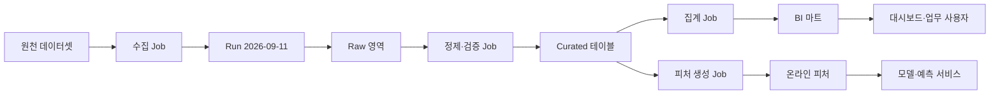
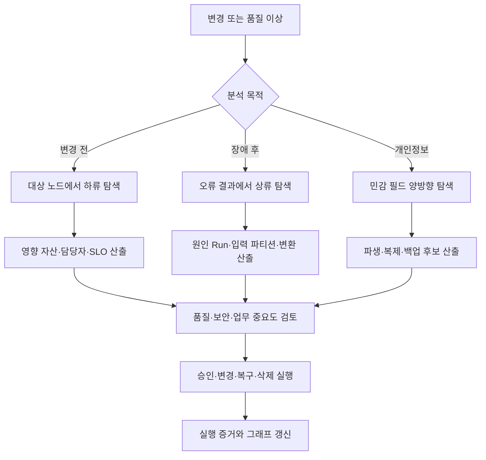

# 데이터 리니지(Data Lineage)와 영향 분석

## 1. 개요

> **데이터 리니지(Data Lineage)**란 데이터가 생성된 출처에서부터 수집·변환·저장·분석·서비스·폐기에 이르기까지 어떤 처리와 시스템을 거쳐 이동했는지를 메타데이터와 관계 그래프로 추적하는 체계이다.

데이터는 원천 시스템에 머무르지 않고 ETL·ELT, 스트리밍, 데이터 웨어하우스, 데이터 레이크하우스, BI, 머신러닝 파이프라인을 통과하며 여러 형태로 재생산된다. 결과 테이블이나 대시보드만 보면 값은 확인할 수 있어도 그 값이 어느 원천에서 왔는지, 어떤 변환 규칙과 실행 버전을 거쳤는지, 어느 소비자가 영향을 받는지는 알기 어렵다. 리니지는 이 단절을 메타데이터로 연결한다.

리니지는 단순한 화면 기능이 아니다. 데이터 자산, 처리 작업, 실행 인스턴스, 스키마, 소유자, 품질 지표, 보안 분류를 공통 식별자로 묶고, 그 관계를 수집·저장·조회·검증하는 데이터 거버넌스 운영 능력이다. 따라서 카탈로그가 자산을 “찾게” 한다면 리니지는 자산이 “어떻게 만들어지고 어디에 쓰이는지”를 설명한다.

실무에서 리니지가 특히 필요한 이유는 변경의 파급효과가 커졌기 때문이다. 원천 컬럼의 이름을 바꾸거나 개인정보 보존정책을 변경하면 수십 개의 파이프라인, 보고서, 추천 피처, 학습 데이터가 동시에 영향을 받을 수 있다. 영향 분석(impact analysis)은 특정 데이터 자산 또는 컬럼에서 하류 방향으로 그래프를 탐색하여 변경·장애·삭제의 영향 범위를 식별하는 활동이다.

반대로 근본 원인 분석(root-cause analysis)은 오류가 발생한 결과에서 상류 방향으로 이동하여 최초 오염·누락·변환 오류가 어디에서 시작되었는지 찾는다. 한 시스템의 리니지를 양방향으로 운영해야 변경 전 영향 분석과 장애 후 원인 분석을 모두 수행할 수 있다.

데이터 리니지의 목표는 모든 관계를 예쁘게 그리는 것이 아니라 의사결정에 필요한 신뢰와 추적성을 확보하는 것이다. 그러므로 계보의 범위, 수준, 최신성, 수집 누락, 보안 노출 가능성을 함께 관리해야 한다.

### 가. 등장 배경과 필요성

첫째, 데이터 플랫폼이 분산되면서 처리 경로가 복잡해졌다. 온프레미스 DB, SaaS, 메시지 브로커, 오브젝트 스토리지, 클라우드 DW가 연결되면 단일 도구의 로그만으로 전체 흐름을 설명할 수 없다. 서로 다른 시스템이 공통 메타데이터 모델과 식별 규칙을 사용해야 종단 간 계보가 이어진다.

둘째, 규제·감사·개인정보 보호 요구가 데이터의 출처와 이용 목적까지 확장되었다. 특정 개인정보가 어느 보고서와 모델에 사용되었는지, 보존기간이 끝난 데이터가 어디에 복제되었는지 확인하려면 데이터 분류와 리니지가 연결되어야 한다. 다만 리니지만으로 모든 복제본을 증명할 수는 없으므로 접근 로그·자산 목록·백업 목록과 보완해야 한다.

셋째, 분석과 AI 운영에서는 데이터 품질과 모델 결과의 신뢰성이 연결된다. 학습 데이터의 일부가 잘못된 조인이나 지연된 파티션에서 만들어졌다면 모델 성능 저하의 원인은 모델 코드가 아니라 데이터 계보에 있을 수 있다. 피처·학습 데이터·모델·예측 결과의 관계를 기록하면 MLOps의 재현성과 감사 가능성이 높아진다.

넷째, 변경관리와 장애대응의 속도가 중요해졌다. 영향받는 대시보드를 수작업으로 조사하면 배포 승인과 장애 복구가 늦어진다. 계보 그래프에서 변경 대상의 하류 자산과 담당자를 바로 조회할 수 있으면 검토 범위와 커뮤니케이션 비용을 줄일 수 있다.

### 나. 리니지와 인접 개념의 구분

데이터 카탈로그는 데이터 자산의 이름·설명·소유자·분류·검색 정보를 제공하는 자산 목록이다. 리니지는 자산 사이의 생성·변환·사용 관계를 제공하므로 카탈로그의 관계 정보로 결합되는 경우가 많지만, 카탈로그와 리니지는 동일하지 않다.

데이터 프로비넌스(provenance)는 데이터의 출처, 생성 과정, 책임 주체, 시점과 같은 증거를 넓게 표현하는 개념이다. 리니지는 프로비넌스의 데이터 흐름 측면을 운영적으로 수집·조회하는 구현이라고 볼 수 있다. W3C PROV-O는 Entity·Activity·Agent를 중심으로 이러한 출처와 책임 관계를 표현할 수 있는 온톨로지 모델을 제공한다.

데이터 계약(data contract)은 데이터 생산자와 소비자가 스키마·품질·신선도·변경 규칙을 합의한 설계 시점의 약속이다. 리니지는 실제 작업 실행과 데이터 이동의 사실을 기록하므로 둘을 결합하면 “어떻게 되어야 하는가”와 “실제로 어떻게 되었는가”를 비교할 수 있다.

데이터 옵저버빌리티는 신선도·볼륨·분포·스키마·품질 이상을 감시하는 운영 관점이고, 리니지는 그 데이터가 어떤 경로로 생성·소비되는지 설명하는 관계 관점이다. 품질 이상 이벤트를 리니지 그래프에 연결하면 오류가 발생한 자산과 영향받는 소비자를 함께 파악할 수 있다.

| 구분 | 핵심 질문 | 대표 산출물 | 리니지와의 관계 |
|---|---|---|---|
| 데이터 카탈로그 | 무엇이 존재하고 누가 책임지는가? | 자산 목록·정의·소유자 | 리니지의 노드와 메타데이터를 제공 |
| 데이터 리니지 | 어디에서 와서 어디로 가는가? | 흐름 그래프·실행 이력 | 자산·작업·실행 관계를 연결 |
| 데이터 프로비넌스 | 어떤 증거와 책임으로 만들어졌는가? | 출처·시점·행위자 기록 | 리니지의 의미·감사 범위를 확장 |
| 데이터 계약 | 어떤 품질·스키마를 지켜야 하는가? | 계약·검증 규칙 | 설계 계보와 실행 계보를 비교 |
| 데이터 옵저버빌리티 | 지금 정상적으로 도착하는가? | 품질·신선도·볼륨 지표 | 이상 이벤트를 그래프에 연결 |

## 2. 데이터 리니지의 구조와 모델

### 가. 그래프 기반 구성

리니지는 일반적으로 데이터 자산을 노드로, 변환 작업과 실행을 관계 또는 중간 노드로 표현하는 방향성 그래프다. 입력 데이터셋이 작업을 통해 출력 데이터셋으로 이어지는 구조를 보존하면 상류·하류 탐색이 가능해진다. 실제 구현에서는 작업 자체와 작업의 한 번 실행을 구분해야 실행 실패, 재처리, 버전별 결과를 구별할 수 있다.

가장 단순한 그래프는 `입력 데이터셋 → 작업 → 출력 데이터셋`의 삼항 관계를 갖는다. 그러나 운영 가능한 모델은 여기에 실행 시각, 실행 ID, 코드 버전, 스키마 버전, 품질 결과, 소유자와 보안 분류를 함께 기록한다. 동일한 작업이라도 매일 다른 파티션을 처리하고 실행 결과가 다를 수 있으므로 작업(Job)과 실행(Run)을 합치면 재현성이 떨어진다.

OpenLineage의 객체 모델은 Job, Run, Dataset을 핵심 엔터티로 보고 Facet으로 추가 메타데이터를 확장한다. Job은 데이터를 소비·생성하는 처리 단위이고, Run은 해당 Job의 특정 실행이며, Dataset은 테이블·파일·객체와 같은 데이터 단위의 추상 표현이다. 이 모델은 특정 저장소 제품이 아니라 여러 오케스트레이터와 처리 엔진 사이에서 계보 이벤트를 교환하기 위한 공통 언어로 활용된다.

W3C PROV-O의 Entity·Activity·Agent 모델은 리니지의 의미를 더 넓게 표현한다. Dataset은 Entity, 변환은 Activity, 실행 주체나 조직은 Agent로 대응시킬 수 있다. `wasDerivedFrom`, `wasGeneratedBy`, `used`, `wasAttributedTo`와 같은 관계를 통해 변환·책임·사용의 근거를 모델링한다. 제품의 데이터 모델과 표준 온톨로지는 목적이 다르므로 무조건 하나로 통일하기보다 필요한 상호운용 범위를 정해야 한다.

### 나. 메타데이터의 계층

기술 리니지는 데이터베이스·파일·토픽·테이블·컬럼과 같은 물리 자산의 연결을 나타낸다. 예를 들어 `orders_raw`가 SQL 변환을 거쳐 `sales_daily`가 되었다는 사실은 기술 리니지다. 시스템이 자동 수집하기 쉬워 초기 구축에 적합하지만, 비즈니스 의미까지 자동으로 보장하지는 않는다.

컬럼 수준 리니지는 특정 출력 컬럼이 어떤 입력 컬럼과 표현식에서 유래했는지를 나타낸다. `customer_grade`가 `customer.score`와 `rule_table.grade_code`의 조합으로 생성되었다면 테이블 수준 연결만으로는 이 관계를 알 수 없다. 개인정보 필드의 전파와 스키마 변경 영향 분석에는 컬럼 수준이 유용하지만 SQL 파싱, UDF 분석, 동적 쿼리 해석 때문에 수집 비용과 누락 가능성이 커진다.

비즈니스 리니지는 “매출”, “활성 고객”, “위험등급”처럼 업무 용어와 지표가 어떤 데이터 자산·계산 규칙에 연결되는지를 설명한다. 기술 리니지가 있어도 같은 이름의 지표가 부서마다 다른 정의로 계산될 수 있으므로, 업무 용어집과 지표 정의를 그래프에 연결해야 의사결정자가 이해할 수 있다.

실행 리니지는 실제 Run에서 읽은 입력 파티션, 기록한 출력 파티션, 실행 시각, 상태와 품질 결과를 기록한다. 설계 리니지가 “이 Job은 A를 읽고 B를 쓴다”는 선언이라면 실행 리니지는 “이번 실행에서 A의 9월 10일 파티션을 읽고 B의 특정 버전을 만들었다”는 증거다. 사고 분석에서는 두 계층의 차이를 보여주는 것이 중요하다.

| 계층 | 예시 | 강점 | 주요 한계 |
|---|---|---|---|
| 시스템·자산 수준 | DB A의 테이블이 DW B로 이동 | 범위가 넓고 자동화가 쉬움 | 세부 컬럼·변환식이 보이지 않음 |
| 테이블·파일 수준 | `orders_raw` → `sales_daily` | 운영 영향 분석의 기본 단위 | 부분 컬럼 변경을 과대평가할 수 있음 |
| 컬럼 수준 | `orders.amount` → `sales.revenue` | 개인정보 전파·정밀 영향 분석 | SQL·UDF·동적 쿼리 해석 비용이 큼 |
| 비즈니스 수준 | 매출지표 → 경영 대시보드 | 사용자 이해와 책임소재가 높음 | 정의 합의와 수작업 큐레이션 필요 |
| 실행 수준 | Run·파티션·스냅샷·품질 결과 | 재현성과 장애 원인 분석 | 이벤트 누락·보존기간 관리가 필요 |

### 다. 노드·엣지에 담을 속성

데이터셋 노드에는 이름과 위치만 넣지 않고 시스템, 환경, 스키마 버전, 소유자, 분류, 보존기간, 품질 SLO, 생성·수정 시각을 넣는다. 식별자는 이름을 사람이 읽기 쉽게 만드는 것보다 여러 환경에서 충돌하지 않도록 설계하는 것이 우선이다. OpenLineage도 namespace와 name의 조합으로 Job과 Dataset을 식별하는 방식을 사용한다.

Job 노드에는 코드 저장소와 커밋, 오케스트레이터의 DAG·태스크, 실행 주체, 사용한 SQL 또는 모델 버전을 연결할 수 있다. Run에는 고유 실행 ID, 시작·종료 시각, 상태, 오류 메시지, 입력·출력의 파티션, 품질 지표를 기록한다. 이 정보가 있으면 같은 DAG의 정상 실행과 재처리 실행을 구분할 수 있다.

엣지에는 방향뿐 아니라 변환 유형과 신뢰도를 담을 수 있다. 예를 들어 `DERIVES`, `COPIES`, `AGGREGATES`, `FILTERS`, `JOINS`를 구분하면 영향 분석 결과를 사람이 해석하기 쉽다. 파서가 추정한 관계인지 실행 로그로 확인된 관계인지 출처와 수집 시각을 기록하면 그래프의 신뢰도를 평가할 수 있다.

민감 데이터의 분류는 노드와 엣지를 통해 전파될 수 있지만 자동 전파 결과를 확정 사실로 취급해서는 안 된다. 마스킹·집계·익명화가 실제로 식별 가능성을 제거했는지 검토하고, 분류 전파 규칙과 예외 승인 기록을 함께 관리해야 한다.

## 3. 수집·저장·활용 절차

### 가. 수집 방식

첫 번째 방식은 설계 기반 수집이다. 파이프라인 정의서, SQL, DAG, 데이터 계약, IaC를 분석하여 예정된 입력과 출력을 등록한다. 배포 전에 영향 범위를 검토할 수 있다는 장점이 있지만, 런타임의 조건 분기·동적 테이블명·예외 경로를 완전히 알기 어렵다.

두 번째 방식은 실행 기반 수집이다. 작업 실행 이벤트, 쿼리 감사 로그, 오케스트레이터 콜백, DB CDC, 스토리지 이벤트를 이용해 실제 입력과 출력을 기록한다. 실제성은 높지만 로그 보존기간, 샘플링, 권한, 실패한 실행의 처리와 같은 운영 문제가 생긴다.

세 번째 방식은 파싱·추론 기반 수집이다. SQL AST, 코드, 스키마 변경, 쿼리 계획을 분석해 컬럼 관계를 추정한다. 정형 SQL에서는 유용하지만 UDF, 외부 API, 문자열로 조립되는 동적 SQL은 추론이 불완전할 수 있다. 따라서 “자동 생성된 관계”와 “검토된 관계”의 상태를 구분해야 한다.

네 번째 방식은 애플리케이션 계측이다. 처리 코드가 시작·완료·입출력 Dataset 정보를 표준 이벤트로 발행하도록 SDK나 에이전트를 삽입한다. 표준 이벤트는 도구 간 상호운용성을 높이지만, 모든 팀이 동일한 식별 규칙과 버전 정책을 지키도록 플랫폼 가드레일이 필요하다.

수집 방법은 하나만 선택하기보다 설계 계보와 실행 계보를 함께 운영하는 것이 바람직하다. 설계 계보로 변경 전 영향 범위를 빠르게 계산하고, 실행 계보로 실제 실행과 품질 이상을 검증한다. 수집 누락이 있는 경우 그래프에 빈 연결을 조용히 남기지 말고 커버리지와 신뢰도 상태를 표시해야 한다.

### 나. 표준 이벤트와 저장

표준 이벤트의 최소 구조는 작업을 의미하는 Job, 작업의 한 실행인 Run, 입력·출력 데이터셋인 Dataset의 관계다. OpenLineage는 실행 상태를 나타내는 RunEvent와 설계 시점 메타데이터를 나타내는 JobEvent·DatasetEvent를 구분한다. 동일 Run의 여러 상태 이벤트에는 동일한 runId를 사용해야 하며, Dataset의 정적 스키마와 실행별 파티션 정보처럼 성격이 다른 메타데이터는 적절한 Facet으로 분리한다.

이벤트 수집기는 메시지 브로커나 HTTP API를 통해 중앙 메타데이터 서비스로 전달할 수 있다. 네트워크 장애가 발생해도 파이프라인 자체가 중단되지 않도록 비동기 버퍼와 재전송 정책을 둔다. 다만 이벤트가 유실된 상태에서 그래프가 완전한 것처럼 보이면 잘못된 영향 분석을 낳으므로 전송 실패율과 지연을 별도 지표로 관리한다.

저장 모델은 그래프 DB, 관계형 메타스토어, 검색 인덱스의 조합으로 구성할 수 있다. 그래프 질의가 많고 관계 탐색이 핵심이면 그래프 모델이 편리하지만, 대규모 실행 이력과 시계열 품질 지표는 컬럼형·관계형 저장이 효율적일 수 있다. 중요한 것은 제품 선택보다 노드 식별자, 이벤트 멱등성, 시간·버전 모델, 보존정책을 먼저 확정하는 것이다.

이벤트는 재전송될 수 있으므로 `event_id`, `run_id`, Dataset 버전과 같은 키로 멱등 처리를 구현한다. 동일 이벤트의 중복 저장은 그래프를 부풀리고 하류 영향 수를 잘못 계산한다. 반대로 같은 이름의 자산이 스키마나 파티션 버전을 달리해 생성되는 경우에는 단순 중복 제거가 아니라 버전 관계를 보존해야 한다.

### 다. 영향 분석과 근본 원인 분석

영향 분석은 변경 대상 노드에서 하류 방향으로 그래프를 순회하는 작업이다. 컬럼을 삭제하거나 의미를 변경할 때 어떤 테이블·피처·모델·리포트·외부 전송이 영향을 받는지, 각 자산의 소유자와 업무 중요도가 무엇인지 함께 출력한다. 단순히 도달 가능한 노드 수를 세기보다 중요도·신선도·규제 분류·실행 최신성을 함께 평가해야 한다.

근본 원인 분석은 이상 결과에서 상류 방향으로 순회한다. 데이터 품질 경보가 `sales_daily`에서 발생하면 최근 성공 Run, 입력 파티션, 스키마 변경, upstream 품질 결과를 시간 순으로 확인한다. 그래프에 실행 시각과 버전이 없으면 상류 연결은 존재해도 해당 장애를 일으킨 실행을 특정하기 어렵다.

개인정보 삭제 요청은 양방향 활용 사례다. 먼저 민감 컬럼의 상류 출처와 하류 파생 자산을 조회하고, 온라인 캐시·모델 학습 데이터·백업·외부 제공 파일을 별도 자산으로 확인한다. 리니지는 후보 범위를 좁히는 근거이지 삭제 완료를 자동으로 증명하는 장치가 아니므로 실제 삭제 로그와 검증 결과를 보존해야 한다.

그래프 탐색에는 깊이 제한, 시간 범위, 버전 조건, 자산 유형 필터가 필요하다. 모든 과거 실행을 무제한으로 순회하면 결과가 너무 커지고 현재 운영과 관계없는 폐기 자산이 섞인다. “최근 30일의 성공 Run”, “운영 환경”, “컬럼 수준 확정 관계”처럼 질문을 구체화해야 분석 결과가 실행 가능한 목록이 된다.

### 라. 리니지 품질 관리

리니지 자체도 데이터 제품으로 보고 품질 지표를 운영해야 한다. 대표 지표는 핵심 파이프라인의 계보 커버리지, 이벤트 수집 지연, 고립 노드 비율, 미식별 Dataset 비율, 설계 계보와 실행 계보의 일치율, 컬럼 관계 검증률이다. 계보 화면에 노드가 많다는 사실은 품질의 증거가 아니다.

커버리지는 “전체 자산 수 대비 연결된 자산 수”만으로 계산하면 왜곡될 수 있다. 업무 중요도가 높은 핵심 데이터 제품과 규제 데이터에 가중치를 주고, 자산 수준·컬럼 수준·실행 수준을 나누어 측정한다. 자동 추정 관계와 담당자가 승인한 관계를 구분해 신뢰도 등급을 표시하는 것도 필요하다.

계보 최신성은 마지막 이벤트 시각과 실제 데이터 변경 시각의 차이로 점검할 수 있다. 이벤트가 수집되지 않는 동안에도 파이프라인이 실행되면 화면은 오래된 관계를 보여준다. 따라서 메타데이터 수집 지연 자체를 SLO로 설정하고, 위반 시 영향 분석 결과에 경고를 붙인다.

## 4. 비교와 적용 사례

### 가. 수동 문서와 자동 리니지의 비교

수동 문서는 업무 의미와 예외 규칙을 잘 설명하지만 변경 때마다 갱신해야 하고 실제 실행과 어긋나기 쉽다. 자동 리니지는 실행 사실을 빠르게 반영하지만, 코드 밖의 업무 규칙·수기 파일·외부 전달을 놓칠 수 있다. 따라서 자동화를 수동 큐레이션의 대체재로 보지 말고, 자동 수집을 기본선으로 삼아 핵심 의미와 예외를 사람이 보완하는 방식이 현실적이다.

| 구분 | 수동 데이터 흐름 문서 | 자동 리니지 |
|---|---|---|
| 최신성 | 변경 반영이 늦어질 수 있음 | 이벤트·로그에 따라 빠르게 반영 |
| 의미 수준 | 업무 규칙과 예외를 상세히 표현 | 기술 관계 중심, 의미 보강 필요 |
| 범위 | 문서 작성자가 선택한 핵심 흐름 | 수집 가능한 시스템 범위 |
| 신뢰성 | 승인 절차가 있으면 높음 | 누락·파싱 오류·중복 검증 필요 |
| 운영 비용 | 초기 작성과 지속 갱신 비용 | 플랫폼 구축·계측·관측 비용 |
| 적합 용도 | 정책·업무 정의·예외 설명 | 영향 분석·장애 대응·재현성 |

두 방식의 차이는 자동화 수준이 아니라 증거의 성격에서 생긴다. 문서는 의도와 의미를 담고, 실행 이벤트는 실제 발생한 사실을 담는다. 기술사 관점에서는 둘 중 하나를 선택하기보다 데이터 계약·카탈로그·표준 이벤트·승인 워크플로를 연결하여 의도와 사실의 불일치를 발견하는 체계를 설계해야 한다.

### 나. 테이블 수준과 컬럼 수준의 비교

테이블 수준 리니지는 수집 범위가 넓고 시스템 간 연결을 빠르게 보여준다. 초기 구축이나 대규모 플랫폼의 운영 흐름 파악에는 충분할 수 있다. 그러나 특정 개인정보 컬럼이 어디로 전파되는지, 한 컬럼의 타입 변경이 어느 소비자에 영향을 주는지는 테이블 수준만으로 판단하기 어렵다.

컬럼 수준 리니지는 더 정밀하지만 모든 변환을 정확히 해석해야 한다. 단순 컬럼 매핑은 자동화하기 쉽지만, 집계·조인·조건부 분기·UDF에서는 “어떤 입력이 결과에 기여하는가”의 의미가 달라진다. 너무 정밀한 관계를 부정확하게 제공하면 오히려 사용자가 잘못된 확신을 가지므로 확정·추정·미수집 상태를 명시해야 한다.

### 다. 사례: 커머스 매출 대시보드 변경

가상의 커머스 기업이 주문 원천의 `discount_amount` 타입을 정수에서 소수로 변경한다고 가정한다. 먼저 영향 분석은 원천 컬럼에서 출발해 정제 테이블, 일별 매출 집계, 재무 대시보드, 프로모션 분석 모델까지 하류로 탐색한다. 테이블 수준만 사용하면 관련 없는 주문 컬럼까지 모두 영향 대상으로 잡지만, 컬럼 수준과 변환식을 결합하면 실제로 금액 계산에 참여하는 소비자만 우선 검토할 수 있다.

변경 승인자는 하류 자산의 SLO와 소유자를 확인하고, 과거 Run에서 새 타입을 처리할 수 있는지 회귀 테스트를 수행한다. 대시보드가 반올림을 수행하는지, 재무 시스템이 정수 단위를 기대하는지, 모델 학습 데이터의 스키마 계약이 고정되어 있는지 확인한다. 이처럼 리니지는 변경을 자동 승인하는 도구가 아니라 검토해야 할 질문과 담당자를 빠르게 제시하는 도구다.

### 라. 사례: AI 학습 데이터 이상

추천 모델의 최근 AUC가 하락했는데 모델 코드는 바뀌지 않았다고 가정한다. 모델 입력 피처에서 상류로 이동하면 최근 Run의 입력 파티션이 평소보다 늦게 도착했고, 정제 Job이 빈 값을 0으로 대체한 사실을 찾을 수 있다. 품질 Facet의 null 비율과 실행 리니지의 파티션 정보를 연결하면 모델 성능 저하와 데이터 이상을 하나의 증거 사슬로 설명할 수 있다.

이때 원인 후보가 여러 개라면 단순히 가장 가까운 상류 노드를 원인으로 확정해서는 안 된다. 파이프라인의 실행 시각, 데이터 품질 경보, 코드 커밋, 모델 버전, 피처 스토어의 온라인·오프라인 일치 여부를 함께 대조해야 한다. 리니지는 원인 후보와 영향 범위를 좁히지만, 원인 확정에는 품질 검증과 운영자의 판단이 필요하다.

## 5. 심화: 표준·AI·데이터 거버넌스 연계

OpenLineage는 특정 데이터베이스 제품이 아니라 계보 메타데이터의 공통 이벤트 모델과 통합 생태계를 지향한다. Job·Run·Dataset과 Facet을 이용하면 스케줄러와 처리 엔진이 서로 다른 환경에서도 기본 관계를 교환할 수 있다. 표준을 도입할 때는 버전 고정, namespace 규칙, 이벤트 멱등성, 사용자 정의 Facet의 거버넌스를 먼저 정해야 장기적인 상호운용성이 유지된다.

PROV-O 같은 provenance 모델은 단순 데이터 이동을 넘어 책임 주체와 활동의 의미를 표현하는 기반이 된다. 예를 들어 모델 학습 데이터가 어떤 승인된 데이터 제품에서 유래했고 어느 조직이 파이프라인을 운영했는지를 기록하면 AI 감사와 재현성 검토에 활용할 수 있다. 다만 온톨로지 표현을 도입한다고 업무 정의가 자동으로 합의되는 것은 아니므로 데이터 용어집과 책임 매트릭스가 함께 필요하다.

생성형 AI와 에이전트 시스템에서는 프롬프트, 검색된 문서, 도구 호출, 모델 버전, 출력의 근거가 새로운 리니지 대상이 된다. 이 정보는 전통적인 테이블 계보보다 이벤트와 실행 맥락이 중요하며, 민감한 프롬프트나 응답을 그대로 저장하면 개인정보·영업비밀이 노출될 수 있다. 따라서 입력·출력 원문 대신 해시·분류·보존기간·접근권한을 기록하는 최소수집 원칙을 검토해야 한다.

데이터 메시·데이터 제품 환경에서는 도메인 팀이 데이터 자산을 소유하고 중앙 플랫폼은 표준과 검색·관측 기능을 제공한다. 이때 리니지는 중앙팀이 모든 연결을 수작업으로 관리하는 방식보다, 각 도메인이 표준 이벤트를 발행하고 중앙 카탈로그가 공통 식별자와 품질 정책을 집행하는 연합 모델에 적합하다. 분산 소유권이 분산된 책임으로 변하지 않도록 계보 커버리지와 운영 SLO를 도메인 평가 지표에 포함한다.

예상 출제에서는 데이터 거버넌스의 구성요소, 메타데이터 관리, 영향 분석, 개인정보 전파, AI 데이터 신뢰성을 한 답안에 연결할 수 있다. 답안은 정의만 제시하지 말고 `수집→표준화→저장→탐색→영향 분석→품질 검증→거버넌스 환류`의 선순환과 기술·조직·보안의 트레이드오프를 함께 설명하는 것이 좋다.

## 6. 고려사항 및 시사점

### 가. 범위와 우선순위를 정한다

모든 시스템과 모든 컬럼의 완전한 리니지를 한 번에 구축하려 하면 비용과 복잡도가 폭증한다. 매출·고객·개인정보·AI 학습 데이터처럼 업무·규제 중요도가 높은 도메인부터 핵심 경로를 선정하고, 자산·컬럼·실행 수준의 목표를 단계적으로 정한다. 구축 범위와 미수집 범위를 문서화하는 것이 과도한 완전성 주장보다 중요하다.

### 나. 식별자와 버전을 표준화한다

이름이 같은 테이블이 개발·검증·운영 환경에 동시에 존재할 수 있으므로 namespace, 환경, 시스템, 데이터셋 버전의 규칙을 정한다. 파티션·스냅샷·코드 커밋·모델 버전을 이벤트에 연결해야 재실행과 롤백을 구분할 수 있다. 식별 규칙이 흔들리면 그래프가 분절되거나 서로 다른 자산이 합쳐진다.

### 다. 신뢰도와 최신성을 공개한다

자동 파싱 관계, 실행 로그 관계, 담당자 승인 관계를 같은 색으로 보여주면 사용자가 모든 연결을 확정 사실로 오해한다. 수집 시각, 출처, 커버리지, 추정 여부, 마지막 성공 Run을 표시하고 메타데이터 수집 SLO를 운영한다. 그래프의 빈틈을 숨기지 않고 불확실성 자체를 정보로 제공해야 한다.

### 라. 보안과 개인정보를 리니지에도 적용한다

리니지 메타데이터에는 테이블명, 컬럼명, SQL, 사용자, 파일 경로가 포함될 수 있어 원본 데이터가 없어도 민감한 업무 정보가 노출될 수 있다. 역할 기반 접근제어, 컬럼명 마스킹, 테넌트 격리, 감사 로그, 보존기간을 적용하고, 운영자에게 필요한 최소 수준만 공개한다. 데이터 접근 권한과 리니지 조회 권한은 같은 것으로 가정하지 말고 별도 정책으로 설계한다.

### 마. 변경관리와 SLO를 연결한다

영향 분석 결과는 단순 그래프가 아니라 변경 승인·테스트·공지·롤백 계획으로 이어져야 한다. 핵심 소비자의 신선도·가용성·정확성 SLO와 변경 대상의 중요도를 결합하여 위험 기반 검토 순서를 만든다. 계보가 있다고 무조건 변경을 막으면 혁신이 늦어지므로 위험이 낮은 변경은 자동 검증과 표준 배포로 통과시키고 고위험 변경에 사람의 승인을 집중한다.

### 바. 조직 책임과 운영 역량을 확보한다

플랫폼 팀이 도구를 설치하는 것만으로 리니지가 정착되지 않는다. 데이터 생산자·소비자·스튜어드·보안·감사 담당자의 책임을 RACI로 정의하고, 이벤트 발행과 예외 수정의 책임을 제품 수명주기에 포함한다. 계보 품질을 정기적으로 검토하고 누락된 파이프라인을 온보딩하는 운영 프로세스가 기술 구현보다 오래 지속되어야 한다.

## 참고자료

- OpenLineage, “About OpenLineage” — https://openlineage.io/docs/
- OpenLineage, “Object Model” — https://openlineage.io/docs/spec/object-model/
- Apache Atlas, “Data Governance and Metadata framework” — https://atlas.apache.org/
- W3C, “PROV-O: The PROV Ontology” — https://www.w3.org/TR/prov-o/
- OpenLineage GitHub, “An Open Standard for lineage metadata collection” — https://github.com/OpenLineage/OpenLineage

---

> **한 줄 요약**: 데이터 리니지는 Dataset·Job·Run과 실행 증거를 연결해 데이터의 출처와 영향 범위를 설명하는 기반이며, 표준화·품질·보안·조직 책임을 함께 운영할 때 변경관리와 AI 신뢰성을 높인다.
