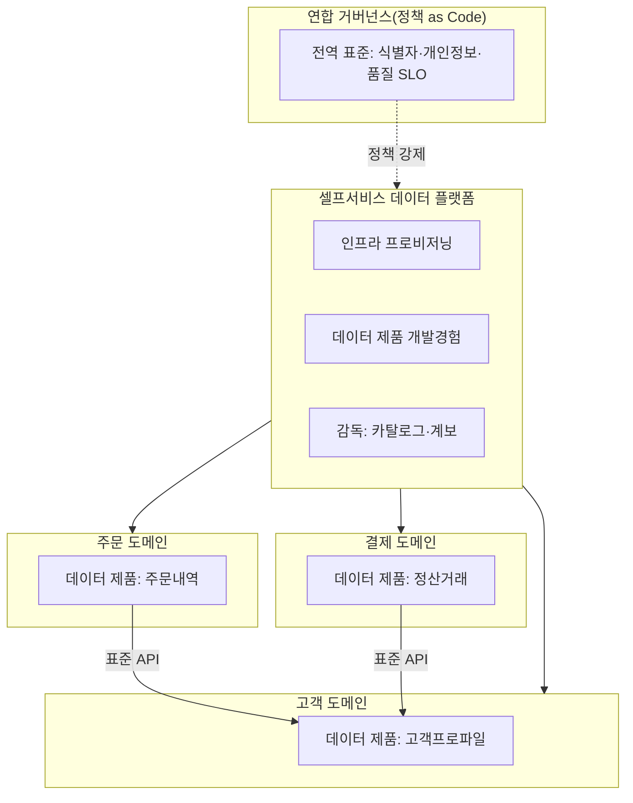
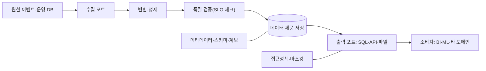

# 데이터 메시(Data Mesh)와 분산 데이터 아키텍처

## 1. 개요

### 가. 정의

> **데이터 메시(Data Mesh)**는 데이터의 소유·생산·품질 책임을 중앙 데이터팀에서 각 업무 도메인으로 이관하고, 데이터를 하나의 관리 대상 파일이 아니라 소비자에게 제공되는 **제품(Data as a Product)**으로 취급하며, 이를 셀프서비스 플랫폼과 연합 거버넌스로 뒷받침하는 **분산·사회기술적(sociotechnical) 데이터 아키텍처 패러다임**이다.

데이터 메시는 특정 제품이나 저장소가 아니라 조직 운영 모델과 아키텍처 원칙의 결합이다.
전통적인 중앙집중 데이터 아키텍처(데이터 웨어하우스, 이후의 데이터 레이크)는 모든 원천 데이터를 하나의 플랫폼으로 끌어모아 소수의 중앙 데이터팀이 수집·정제·모델링·서빙을 전담하는 구조였다.
이 구조는 데이터 규모와 원천이 적을 때는 효율적이지만, 도메인과 소비 사례가 폭발적으로 늘어나면 중앙팀이 병목이 된다.
데이터 메시는 이 병목을 조직 구조 문제로 규정하고, 마이크로서비스가 애플리케이션 개발에서 이룬 분권화를 데이터 영역으로 확장한다.

핵심은 "데이터를 한곳에 더 잘 모으자"가 아니라, **데이터를 가장 잘 아는 도메인이 스스로 책임지고 제품처럼 제공하게 하자**는 관점 전환이다.
따라서 데이터 메시는 저장 기술만의 문제가 아니라 조직·거버넌스·플랫폼·문화가 함께 설계되어야 하는 정보관리기술사형 주제이다.

### 나. 등장 배경과 필요성

첫째, 중앙 데이터팀의 구조적 병목이다.
모든 도메인의 데이터 요청이 중앙팀 하나로 수렴하면, 도메인 지식이 없는 엔지니어가 원천의 의미를 해석해야 하고 우선순위 경쟁으로 대기 시간이 길어진다.
데이터 소비 요구가 조직 성장보다 빠르게 늘어나는 환경에서는 인력 증원만으로 이 병목을 해소하기 어렵다.

둘째, 책임과 지식의 분리 문제다.
원천 시스템을 운영하는 도메인은 데이터의 의미를 가장 잘 알지만 분석 데이터 품질에는 책임이 없고, 중앙팀은 책임은 지지만 원천 맥락을 모른다.
그 결과 스키마 변경이 소리 없이 파이프라인을 깨뜨리고, 데이터 품질 문제의 원인 규명과 수정이 지연된다.

셋째, 확장성의 한계다.
단일 레이크·웨어하우스로 모든 도메인을 담으면 파이프라인이 거대한 단일체(monolith)가 되어, 한 도메인의 변경이 전체에 영향을 주고 배포·테스트가 어려워진다.
이는 마이크로서비스가 해결하려 했던 모놀리스 문제와 동형이다.

넷째, 데이터 가치 실현 속도(time-to-value) 요구다.
AI·데이터 기반 의사결정이 보편화되면서, 데이터를 발견하고 신뢰하고 사용하기까지의 리드타임을 줄이는 것이 경쟁력이 되었다.
데이터 메시는 소유권을 분산해 병렬로 가치를 창출하되, 표준과 거버넌스로 상호운용성을 유지하려는 시도이다.

### 다. 4대 원칙과 특징

데이터 메시는 Zhamak Dehghani가 제시한 네 가지 원칙으로 요약된다.
이 원칙들은 개별적으로 존재하는 것이 아니라 서로를 보완하며, 하나만 도입하면 오히려 혼란을 키운다는 점이 중요하다.

| 원칙 | 핵심 내용 | 얻는 효과 | 주의할 trade-off |
|---|---|---|---|
| 도메인 소유권 | 분석 데이터의 책임을 도메인에 귀속 | 맥락 기반 품질·빠른 대응 | 도메인 간 중복·사일로 위험 |
| 데이터 제품화 | 데이터를 발견·신뢰 가능한 제품으로 제공 | 재사용성·소비자 경험 향상 | 제품 오너십·운영 부담 증가 |
| 셀프서비스 플랫폼 | 공통 인프라를 셀프서비스로 추상화 | 도메인 자율성·중복 개발 감소 | 플랫폼팀 역량·초기 투자 필요 |
| 연합 거버넌스 | 전역 표준을 자동화로 강제 | 상호운용성·규제 준수 | 중앙 통제와 자율성의 균형 |

## 2. 4대 원칙 상세

### 가. 도메인 지향 분권 소유권(Domain Ownership)

데이터 메시의 출발점은 분석 데이터의 소유권과 책임을 원천을 잘 아는 업무 도메인(예: 주문, 결제, 물류, 고객)으로 이관하는 것이다.
각 도메인은 자신이 생산하는 데이터에 대해 수집·변환·품질·서빙·수명주기를 end-to-end로 책임진다.
이는 콘웨이 법칙(Conway's Law)을 역이용하는 설계로, 조직 경계와 데이터 경계를 일치시켜 커뮤니케이션 비용을 줄인다.

도메인 소유권은 세 가지 데이터 유형으로 나눠 이해하면 명확하다.
원천 정렬(source-aligned) 데이터는 운영 시스템에서 직접 파생된 사실 데이터이고, 소비자 정렬(consumer-aligned) 데이터는 특정 사용 사례(예: 추천, 리포팅)에 맞춰 가공된 데이터이며, 총합(aggregate) 데이터는 여러 도메인을 결합한 데이터이다.
소유권 분산의 함정은 사일로화이므로, 도메인 간 데이터를 표준 인터페이스로 노출해 다른 도메인이 소비할 수 있게 하는 것이 전제이다.

### 나. 제품으로서의 데이터(Data as a Product)

데이터를 파이프라인의 부산물이 아니라 명확한 소비자를 가진 제품으로 취급한다.
제품에는 데이터 프로덕트 오너가 있고, SLA·SLO(신선도, 정확도, 가용성)와 문서·계약이 따른다.
좋은 데이터 제품이 갖춰야 할 속성은 흔히 **DATSIS**로 요약된다.

- 발견 가능(Discoverable): 카탈로그에서 검색·탐색 가능
- 주소 지정 가능(Addressable): 표준화된 고유 경로로 접근
- 신뢰 가능(Trustworthy): 품질 지표·SLO를 명시하고 준수
- 자기 기술적(Self-describing): 스키마·의미·예시를 문서로 제공
- 상호운용 가능(Interoperable): 전역 표준(식별자·형식)을 준수
- 보안(Secure): 접근통제·정책이 데이터에 내장

데이터 제품은 단순한 테이블이 아니라 데이터, 메타데이터, 접근 API, 품질 검증 코드, 인프라 정의를 함께 캡슐화한 **아키텍처 퀀텀(architectural quantum)**으로 설계한다.
예컨대 결제 도메인이 "정산 완료 거래" 데이터 제품을 제공한다면, 스키마·SLO·샘플·소비 방법을 포함해 다른 도메인이 코드 변경 없이 소비하도록 한다.

### 다. 셀프서비스 데이터 플랫폼(Self-serve Data Platform)

도메인마다 데이터 인프라를 처음부터 구축하게 하면 중복과 비효율이 발생한다.
이를 막기 위해 플랫폼팀이 저장·처리·카탈로그·모니터링·접근통제 같은 공통 역량을 셀프서비스 형태로 추상화해 제공한다.
목표는 데이터 엔지니어가 아닌 도메인 개발자도 데이터 제품을 손쉽게 만들고 배포·운영할 수 있게 하여, 도메인의 인지 부하(cognitive load)를 낮추는 것이다.

플랫폼은 크게 세 평면으로 나눠 설계한다.
데이터 인프라 프로비저닝 평면은 스토리지·컴퓨팅·계정을 자동 할당하고, 데이터 프로덕트 개발자 경험 평면은 데이터 제품 생성·테스트·배포 워크플로를 제공하며, 데이터 메시 감독 평면은 전역 카탈로그·계보·정책 준수 현황을 가시화한다.
플랫폼은 "정책을 문서로 강제"하는 것이 아니라 "정책을 코드와 템플릿으로 기본 내장"해 도메인이 올바른 길을 쉽게 가도록 만든다.

### 라. 연합 컴퓨팅 거버넌스(Federated Computational Governance)

완전한 분권은 상호운용성을 파괴한다.
연합 거버넌스는 각 도메인 대표와 플랫폼·보안 전문가가 모여 전역 표준(식별자 체계, 데이터 형식, 개인정보 정책, 품질 기준)을 정하고, 이를 사람이 매번 검사하는 대신 플랫폼에 **자동화된 정책(policy as code)**으로 내장해 강제한다.
"컴퓨팅"이라는 표현은 거버넌스가 회의체의 문서가 아니라 파이프라인에서 자동 실행·검증되는 코드임을 강조한다.

핵심 균형은 전역 표준(무엇을 통일할 것인가)과 도메인 자율(무엇을 위임할 것인가)의 경계 설정이다.
개인정보 마스킹, 접근 정책, 상호운용 식별자는 전역으로 강제하되, 내부 모델링·기술 선택은 도메인에 위임하는 것이 일반적이다.

## 3. 데이터 제품의 내부 구조와 상호작용

개별 데이터 제품은 소비 인터페이스, 데이터 저장, 변환 로직, 품질 검증, 메타데이터·정책을 하나의 배포 단위로 캡슐화한다.
아래 다이어그램은 하나의 데이터 제품이 원천 입력을 받아 검증을 거쳐 소비자에게 계약된 출력 포트로 제공하는 과정을 보여준다.

품질 검증 단계는 데이터 제품이 계약(SLO)을 만족하지 못하면 소비자에게 발행하지 않도록 게이트 역할을 한다.
예를 들어 신선도 SLO가 "1시간 이내"인데 지연이 발생하면, 오래된 데이터를 그대로 노출하는 대신 소비자에게 지연 상태를 알리도록 설계할 수 있다.
이처럼 데이터 제품은 소비자와의 명시적 계약(data contract)을 코드로 강제하는 것이 특징이다.

## 4. 데이터 레이크/웨어하우스 및 데이터 패브릭과의 비교

데이터 메시는 기존 아키텍처를 대체한다기보다 **조직·소유권 모델의 차이**로 이해해야 한다.
데이터 레이크하우스가 "무엇으로 저장·처리하는가(기술 계층)"에 대한 답이라면, 데이터 메시는 "누가 책임지고 어떻게 조직하는가(운영 모델)"에 대한 답이다.
실제로 각 도메인의 데이터 제품이 내부적으로 레이크하우스나 웨어하우스를 저장 기술로 사용할 수 있어, 둘은 배타적이지 않고 결합 가능하다.

| 구분 | 중앙 레이크/웨어하우스 | 데이터 패브릭 | 데이터 메시 |
|---|---|---|---|
| 접근 관점 | 중앙 집중 저장 | 메타데이터·자동화 중심 통합 | 도메인 분권 소유 |
| 소유권 | 중앙 데이터팀 | 중앙+자동화 계층 | 각 업무 도메인 |
| 핵심 축 | 기술 플랫폼 | 지능형 메타데이터·AI | 조직·프로세스 |
| 확장 방식 | 인력·클러스터 증설 | 자동화 확장 | 도메인 병렬 확장 |
| 주된 리스크 | 중앙 병목 | 메타데이터 품질 의존 | 사일로·중복·거버넌스 복잡 |

데이터 패브릭과의 차이가 자주 혼동된다.
데이터 패브릭은 메타데이터와 자동화(능동 메타데이터, AI 기반 통합)로 분산된 데이터를 **기술적으로** 연결하는 데 초점을 두는 반면, 데이터 메시는 소유권과 책임의 **조직적** 분권에 초점을 둔다.
즉 패브릭은 "기술이 통합을 자동화"하고, 메시는 "사람과 조직이 분권을 책임"진다는 점에서 상보적으로 결합할 수 있다.

## 5. 심화: 도입 전략과 실무 적용

데이터 메시는 조직 성숙도가 낮은 상태에서 전면 도입하면 실패 위험이 크다.
Netflix, Zalando, JPMorgan Chase 등 대규모 데이터 도메인을 가진 조직이 병목 해소를 위해 선도적으로 적용했는데, 공통적으로 **점진적 도입**과 **플랫폼 선(先)투자**를 강조한다.

실무 도입은 다음 순서를 권장한다.
첫째, 가치가 높고 경계가 명확한 소수 도메인에서 데이터 제품 파일럿을 시작해 성공 사례를 만든다.
둘째, 반복되는 인프라 작업을 셀프서비스 플랫폼으로 추상화해 도메인의 진입 장벽을 낮춘다.
셋째, 최소한의 전역 표준(식별자·개인정보·품질)부터 정책 as code로 자동화하고, 표준을 점진적으로 확장한다.
넷째, 데이터 프로덕트 오너 역할과 성과 지표(제품 채택률, SLO 준수율, 리드타임)를 제도화한다.

주의할 점은 조직 규모와 데이터 복잡도가 낮으면 오히려 중앙집중 방식이 효율적이라는 것이다.
데이터 메시는 도메인·소비 사례가 많아 중앙팀이 병목이 될 때 정당화되며, 무분별한 도입은 중복 인프라와 거버넌스 혼란만 초래할 수 있다.
따라서 "메시가 필요한가"에 대한 판단(조직 규모, 도메인 수, 데이터 성숙도)이 선행되어야 한다.

## 6. 고려사항 및 시사점

기술사 관점에서 데이터 메시는 다음을 종합적으로 고려해야 한다.

- **조직·문화 선결 조건**: 데이터 메시는 기술 도입이 아니라 소유권 재배치이므로, 도메인의 데이터 책임 수용과 데이터 프로덕트 오너 양성이 없으면 원칙만 남고 실패한다. 조직 개편·역할 정의·인센티브 설계가 아키텍처보다 먼저 검토되어야 한다.
- **플랫폼 성숙도와의 트레이드오프**: 셀프서비스 플랫폼이 미성숙한 상태에서 소유권만 분산하면 도메인마다 중복 파이프라인과 품질 편차가 발생한다. 플랫폼 투자와 분권 속도를 맞추는 단계적 로드맵이 필요하다.
- **거버넌스와 자율성의 균형**: 전역 표준을 과도하게 강제하면 분권의 이점이 사라지고, 너무 느슨하면 상호운용성이 붕괴한다. 개인정보·보안·식별자는 정책 as code로 강제하되 모델링·기술 선택은 도메인에 위임하는 경계 설계가 핵심이다.
- **비용·중복 관리**: 도메인별 인프라와 데이터 제품이 늘면 저장·컴퓨팅 비용과 중복 데이터가 증가할 수 있어, FinOps 관점의 비용 가시성과 공통 플랫폼 재사용이 병행되어야 한다.
- **적용 판단 기준**: 소규모·저복잡도 조직에는 중앙집중이 유리하므로, 도메인 수·소비 사례·중앙팀 병목 정도를 진단해 도입 여부를 결정하고, 필요 시 레이크하우스·데이터 패브릭과 결합하는 하이브리드 전략을 선택한다.

## 참고자료

- Zhamak Dehghani, "Data Mesh Principles and Logical Architecture", martinfowler.com — https://martinfowler.com/articles/data-mesh-principles.html
- Zhamak Dehghani, "How to Move Beyond a Monolithic Data Lake to a Distributed Data Mesh", martinfowler.com — https://martinfowler.com/articles/data-monolith-to-mesh.html
- AWS, "What is a Data Mesh?" — https://aws.amazon.com/what-is/data-mesh/

---

> **한 줄 요약**: 데이터 메시는 분석 데이터의 소유권을 도메인으로 분권하고 데이터를 제품으로 다루며, 셀프서비스 플랫폼과 정책 as code 기반 연합 거버넌스로 상호운용성을 유지하는 사회기술적 분산 데이터 아키텍처로, 조직·플랫폼 성숙도를 갖춘 대규모 데이터 환경에서 중앙 병목을 해소하는 전략이다.
