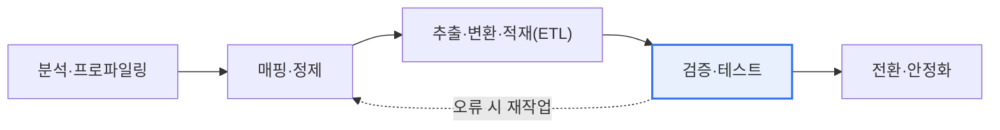
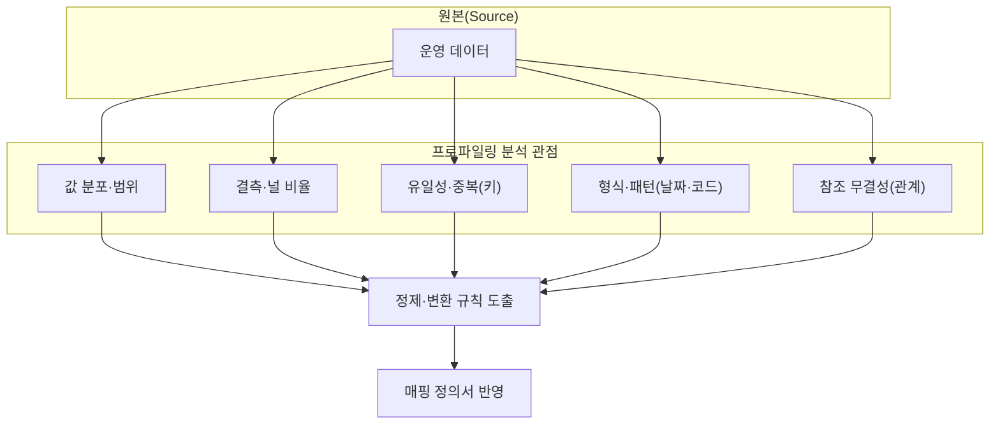

# 데이터 통합 및 마이그레이션 — 무결성·정합성 확보

## 1. 개요

### 가. 정의와 등장 배경
> **데이터 마이그레이션(Data Migration)** 은 노후 시스템 교체·시스템 통합·클라우드 전환 등의 과정에서 원본(Source) 데이터를 대상(Target) 시스템으로 옮기는 일련의 활동이며, 그 성패는 데이터가 유실·왜곡 없이 정확히 이관되도록 **무결성(Integrity)과 정합성(Consistency)을 확보**하는 데 달려 있다. 데이터가 곧 기업의 핵심 자산인 만큼, 이관 오류는 서비스 신뢰를 직접 훼손한다.

데이터 마이그레이션이 여느 개발 작업보다 까다로운 근본 이유는 '**한 번 잘못 옮기면 되돌리기 어렵고, 그 오류가 계속 서비스에 영향을 미친다**'는 비가역성에 있다. 신규 개발은 결함이 발견되면 코드를 고쳐 다시 배포하면 되지만, 마이그레이션은 이미 옮겨진 데이터가 운영에 사용되기 시작하면 원본과의 시차가 벌어져 단순 재이관으로는 복구가 불가능해진다. 수년간 쌓인 대용량 데이터를 새 시스템 구조로 옮길 때는, 원본과 대상의 데이터 형식·규칙(스키마·코드체계·인코딩)이 달라 값이 잘리거나 왜곡되고, 일부가 누락되며, 서로 연결된 데이터의 관계가 깨지기 쉽다.

특히 관계형 데이터는 서로 참조하는 구조이기 때문에 부분적 오류가 연쇄적으로 확산된다. 예를 들어 주문(Order) 데이터는 옮겼는데 연결된 고객(Customer) 데이터가 누락되면, 주문이 참조하는 고객이 존재하지 않는 '고아 레코드(orphan record)'가 생겨 참조 무결성이 깨진다. 이런 데이터는 조회 화면에서 오류를 내거나, 배치 집계에서 금액이 틀어지는 형태로 오픈 이후 뒤늦게 드러난다. 그래서 마이그레이션은 단순히 데이터를 복사하는 것이 아니라, 이관 전후로 **데이터가 정확하고 완전하며 서로 일관됨을 검증**하는 체계적 과정이 되어야 한다.

이러한 검증 없이 오픈을 강행하면 대규모 시스템 장애의 주요 원인이 된다. 대형 금융권 차세대 시스템이나 공공 정보시스템의 오픈 지연·장애 사례에서 상당수가 데이터 이관 품질 문제에서 비롯된다는 점은, 마이그레이션이 프로젝트 후반의 부수 작업이 아니라 별도의 방법론과 검증 체계를 갖춘 독립 과제로 다뤄져야 함을 시사한다.

### 나. 무결성과 정합성의 차이
두 개념은 자주 혼동되지만 초점이 다르다. **무결성**은 데이터가 그 자체로 정확하고 유효하며 규칙(제약조건)을 만족하는 '**세로 방향**'의 품질이고, **정합성**은 여러 곳에 있는 데이터가 서로 모순 없이 일치하는 '**가로 방향**'의 품질이다. 무결성이 "이 값 하나가 올바른가?"를 묻는다면, 정합성은 "원본과 대상이, 또는 서로 연결된 테이블들이 서로 어긋나지 않는가?"를 묻는다.

무결성 위반의 전형은 값 자체의 오류다. 나이 컬럼에 음수가 들어가거나, NOT NULL 이어야 할 필수값이 비어 있거나, 코드 도메인에 정의되지 않은 값이 섞이는 경우다. 반면 정합성 위반은 값 하나하나는 규칙을 지키더라도 데이터 간 관계에서 모순이 생기는 경우로, 원본 100만 건이 대상에는 99만 8천 건만 들어가 건수가 어긋나거나, 원본과 대상의 합계 금액이 다른 상황이 이에 해당한다. 마이그레이션 검증이 어려운 이유는 이 두 축을 모두 지켜야 하기 때문이며, 무결성만 보면 건수 누락을 놓치고 정합성만 보면 잘못된 값을 놓친다.

| 구분 | 무결성(Integrity) | 정합성(Consistency) |
|---|---|---|
| **초점** | 데이터 자체의 정확·유효성 | 데이터 간 일치·모순 없음 |
| **방향** | 세로(개별 값·레코드) | 가로(원본↔대상, 테이블 간) |
| **예** | 나이가 음수 아님, 필수값 존재, 도메인 준수 | 원본과 대상 건수·합계 일치, 참조 유효 |
| **위반 시** | 잘못된 값·규칙 위반 | 데이터 불일치·모순·고아 레코드 |
| **검증 수단** | 제약조건·도메인 체크 | 건수/집계/체크섬 대조 |

## 2. 마이그레이션 절차와 아키텍처

마이그레이션은 통상 '분석 → 매핑·정제 → ETL → 검증 → 전환·안정화'의 단계를 거치며, 검증에서 오류가 발견되면 매핑·정제 단계로 되돌아가 반복(iteration)한다. 각 단계는 다음 단계의 품질을 좌우하는 선행 조건이므로, 앞 단계를 부실하게 하면 뒤에서 몇 배의 비용으로 되돌아온다.

**분석·프로파일링** 단계에서는 원본 데이터의 실제 상태를 진단하고 이관 범위를 확정한다. 흔히 원본 시스템의 문서화된 스키마와 실제 저장된 값이 일치하지 않으므로(예: 문서상 날짜 컬럼에 문자열 'N/A'가 섞여 있음), 문서가 아니라 실데이터를 근거로 계획을 세워야 한다. **매핑·정제** 단계는 원본 컬럼과 대상 컬럼의 대응 관계(1:1, 1:N, 코드 변환)를 정의하고, 프로파일링에서 발견한 오류 데이터의 정제·변환 규칙을 수립하는 설계의 핵심이다.

**ETL(추출·변환·적재)** 은 정의된 규칙에 따라 실제로 데이터를 옮기는 실행 단계다. 대용량일수록 전체 정지 시간(downtime)을 줄이기 위해, 오픈 전 대부분을 미리 옮기는 초기 적재와 변경분만 따라잡는 증분(CDC, Change Data Capture) 방식을 병행하기도 한다. **검증·테스트** 는 뒤에서 상술하듯 다층으로 진행하며, 마지막 **전환·안정화** 는 실제 서비스를 새 시스템으로 넘기고(cut-over) 초기 오류를 모니터링하며 안정화하는 구간이다.

## 3. 데이터 값 진단 — 프로파일링의 중점 분석 관점

이관 전 원본 데이터의 실제 상태를 진단하는 **데이터 프로파일링(Data Profiling)** 은, 옮기기 전에 '무엇이 더러운지'를 정량적으로 파악해 정제·변환 계획의 근거를 마련하는 활동이다. 프로파일링을 생략하면 오류 데이터를 그대로 옮긴 뒤 검증 단계에서 뒤늦게 발견하게 되어 재작업 비용이 폭증한다. 프로파일링은 다음과 같이 서로 다른 관점에서 값을 분석한다.

**값 분포·범위 분석**은 컬럼값의 최소·최대·분포를 보아 이상치와 범위 초과 값을 찾는다. 예컨대 나이 컬럼에 999가 섞여 있거나, 금액에 음수가 존재하는지를 확인해 도메인 규칙 위반을 사전에 걸러낸다. **결측·널 분석**은 컬럼별 NULL·빈 값 비율을 측정한다. 필수여야 할 컬럼의 결측률이 높다면 이관 후 무결성 제약을 걸 수 없으므로, 기본값 대체·업무 확인 등 정제 방침을 미리 정해야 한다.

**유일성·중복 분석**은 기본키·업무키의 중복 여부와 유일성 위반을 확인한다. 원본에서 논리적으로 유일해야 할 사업자번호가 중복 저장돼 있으면, 대상에서 유니크 제약을 걸 때 적재가 실패하므로 병합·정리 규칙이 필요하다. **형식·패턴 분석**은 날짜('2026-09-16' vs '20260916' vs '2026.9.16')나 코드체계의 표기 일관성을 점검해 변환 규칙을 도출한다. 마지막으로 **참조 무결성 분석**은 외래키로 연결된 데이터의 관계가 실제로 유효한지, 즉 참조 대상이 존재하는지를 확인해 고아 레코드를 사전에 식별한다.

이처럼 프로파일링은 '**옮기기 전에 원본을 정직하게 마주 보는**' 단계로, 여기서 나온 수치(예: "고객 코드 결측률 3.2%, 주문-고객 고아 레코드 1만 2천 건")가 정제·변환 규칙과 검증 기준선의 근거가 된다.

## 4. 마이그레이션 검증 테스트 방법

검증은 이관 후 데이터가 무결성·정합성을 만족하는지를 여러 층위에서 교차 확인하는 과정이다. 한 가지 방법만으로는 특정 유형의 오류를 놓치므로, 다층 검증(defense in depth)이 원칙이다. 예를 들어 건수만 맞추면 값 왜곡을 놓치고, 값만 비교하면 관계 붕괴를 놓친다.

| 방법 | 내용 | 잡아내는 오류 유형 |
|---|---|---|
| **건수 검증** | 원본-대상 레코드 수 일치 확인 | 누락·중복 적재 |
| **값 비교** | 샘플·전수 값 대조(체크섬·해시) | 값 왜곡·잘림·인코딩 오류 |
| **집계 검증** | 합계·평균 등 집계값 일치 | 부분 누락·변환 오류 |
| **참조 무결성** | 관계·외래키 유효성 검증 | 고아 레코드·관계 붕괴 |
| **업무 검증** | 실제 업무 시나리오로 결과 확인 | 업무 규칙 관점의 이상 |

**건수 검증**은 가장 기본적이면서 강력하다. 원본 테이블과 대상 테이블의 레코드 수가 일치하는지를 비교하며, 필터·조인 조건별로 나눠 세면 어느 구간에서 누락이 생겼는지까지 짚어낸다. **값 비교**는 개별 값이 정확히 옮겨졌는지를 확인하는데, 전수 비교가 부담스러운 대용량에서는 컬럼·행 단위로 체크섬(MD5 등 해시)을 산출해 원본과 대상의 해시가 일치하는지를 대조함으로써 전수 검증의 효과를 효율적으로 낸다. 한 글자라도 다르면 해시가 달라지므로 미세한 잘림·인코딩 오류까지 검출된다.

**집계 검증**은 합계·평균·건수 같은 집계값을 원본과 대상에서 각각 산출해 비교한다. 특히 금액·수량처럼 업무적으로 총량이 보존돼야 하는 데이터에서, 총합이 일치하면 부분 누락·중복이 없다는 강한 근거가 된다. **참조 무결성 검증**은 외래키로 연결된 데이터가 모두 유효한 부모를 갖는지 확인해 고아 레코드를 색출한다. 마지막으로 **업무 검증**은 기술적 일치를 넘어, 실제 업무 시나리오(예: 특정 고객의 최근 6개월 거래 내역 조회, 월 마감 정산)를 돌려 현업이 눈으로 결과를 확인하는 단계로, 기술 검증이 통과해도 업무적으로 어색한 데이터를 최종적으로 걸러낸다.

## 5. 심화 — 실무 전환 전략과 최신 동향

마이그레이션의 실무 난제는 '**무중단에 가까운 전환을 어떻게 안전하게 하느냐**'로 수렴한다. 소규모라면 서비스를 잠시 멈추고 한 번에 옮기는 빅뱅(Big-bang) 전환이 단순하지만, 24시간 서비스나 대용량에서는 허용 정지 시간이 짧아 다른 접근이 필요하다. 이때 초기 적재 후 원본의 변경분만 실시간으로 따라잡는 **CDC(Change Data Capture)** 기반 병행 운영이 널리 쓰인다. 원본 DB의 트랜잭션 로그(redo/binlog)를 읽어 변경분을 대상에 반영하면, 오픈 직전의 정지 시간을 분 단위로 단축할 수 있다.

또 다른 실무 전략은 **병행 가동(parallel run)** 이다. 신·구 시스템을 일정 기간 동시에 돌려 두 시스템의 산출물(예: 일 마감 리포트)을 대조하고, 결과가 일치함이 확인되면 구 시스템을 폐기한다. 금융권 차세대 프로젝트에서 흔히 채택하는 방식으로, 검증 신뢰도를 높이는 대신 운영 비용과 기간이 늘어나는 트레이드오프가 있다. 클라우드 전환이 보편화되면서 AWS DMS, GCP Database Migration Service 같은 관리형 마이그레이션 서비스가 CDC·스키마 변환을 기본 제공하고, dbt·Great Expectations 같은 도구로 검증 규칙(assertion)을 코드로 관리하는 '데이터 품질의 코드화' 흐름도 확산되고 있다. 다만 특정 도구·버전의 세부 기능은 계속 변하므로, 도입 시점에 공식 문서로 재확인하는 것이 바람직하다.

관점을 넓히면 마이그레이션은 데이터 거버넌스·표준화와 맞닿는다. 이관을 기회 삼아 데이터 표준(코드체계·명명규칙)을 정비하고 마스터 데이터를 정리하면, 단순 이전을 넘어 데이터 품질 자체를 끌어올리는 계기가 된다.

## 6. 고려사항 및 시사점 (기술사 관점)

1. **검증이 마이그레이션의 성패를 좌우한다.** 이관 실행 자체보다 이관 후 무결성·정합성 검증이 핵심이며, 건수·값·집계·참조 무결성·업무 시나리오를 다층으로 교차 검증해야 특정 유형에 치우쳐 오류를 놓치는 일을 막을 수 있다. 검증 기준선은 프로파일링 수치에 근거해 정량적으로 설정한다.
2. **리허설과 롤백 계획은 선택이 아니라 필수다.** 실제 전환 전에 운영과 동일한 조건으로 리허설을 반복해 절차·소요 시간·오류를 점검하고, 정해진 정지 시간 안에 끝나는지 검증해야 한다. 문제 발생 시 즉시 되돌릴 롤백 계획과 롤백 판단 기준(go/no-go)을 사전에 합의해 위험을 통제한다.
3. **원본 데이터 정제가 반드시 선행되어야 한다.** 프로파일링으로 발견한 더러운 데이터를 정제하지 않고 옮기면 문제가 그대로 신규 시스템으로 이전되어 '쓰레기를 옮기면 쓰레기가 된다(Garbage In, Garbage Out)'. 이관은 곧 데이터 품질을 높이는 기회이므로, 정제·표준화를 이관 과업에 포함한다.
4. **비가역성과 감사 추적을 고려한다.** 마이그레이션은 되돌리기 어려운 작업이므로, 어떤 규칙으로 어떤 값을 어떻게 변환했는지 매핑·변환 이력을 감사 로그로 남겨 추후 문제 발생 시 원인 추적과 소명이 가능하도록 해야 한다.
5. **성능·정지 시간과 검증 강도의 트레이드오프를 관리한다.** 전수 검증은 신뢰도가 높지만 시간이 오래 걸리고, CDC·병행 가동은 정지 시간을 줄이지만 운영 복잡도와 비용을 높인다. 데이터의 중요도·규모·허용 정지 시간에 맞춰 검증 강도와 전환 방식을 균형 있게 선택하는 것이 기술사의 판단 영역이다.

## 참고자료
- AWS Database Migration Service 개요 — https://aws.amazon.com/dms/
- Google Cloud Database Migration Service — https://cloud.google.com/database-migration
- Great Expectations (데이터 검증 프레임워크) — https://greatexpectations.io/

---

> **한 줄 요약**: 데이터 마이그레이션은 *무결성(값의 정확성)과 정합성(데이터 간 일치)* 을 확보하는 것이 핵심으로, 프로파일링으로 원본을 정직하게 진단하고 건수·값(체크섬)·집계·참조 무결성·업무 시나리오를 다층 검증하며 리허설·롤백·CDC·병행 가동으로 안전하게 전환한다.
