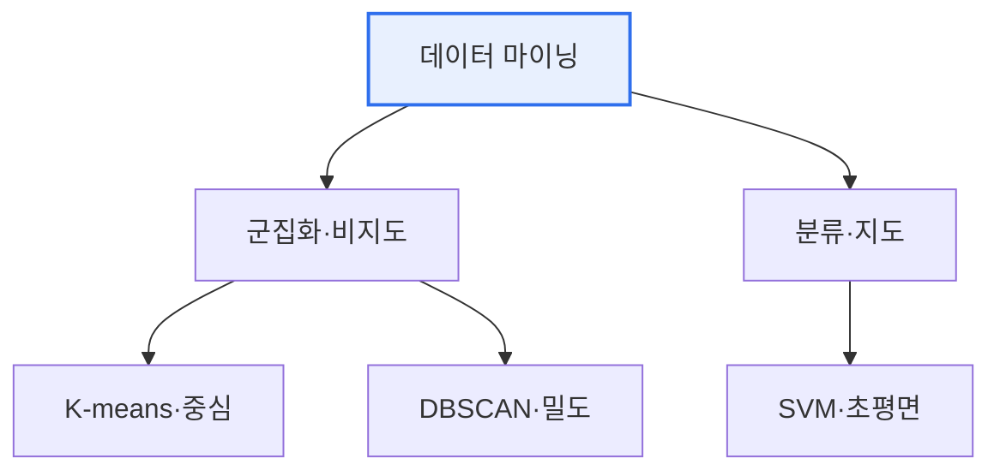

# 데이터 마이닝 기법: K-means · DBSCAN · SVM

## 1. 개요

### 가. 정의
> 데이터 마이닝은 대량 데이터에서 **패턴·규칙·지식을 발견**하는 기법으로, 여기서는 대표적 **군집화(K-means·DBSCAN)** 와 **분류(SVM)** 기법을 다룬다.

세 기법은 목적과 접근이 다르다. K-means·DBSCAN은 정답 없이 데이터를 묶는 **비지도 군집화**이고, SVM은 정답으로 경계를 학습하는 **지도 분류**다. 군집화 안에서도 K-means는 '중심 기반', DBSCAN은 '밀도 기반'으로 접근이 갈린다.

## 2. K-means Clustering (1)
> 데이터를 **K개 군집으로 나누고, 각 군집 중심(centroid)과의 거리를 최소화**하도록 반복 갱신하는 중심 기반 군집화.
- **절차**: 초기 중심 K개 지정 → 각 점을 최근접 중심에 할당 → 중심 재계산 → 수렴까지 반복
- **특징**: 단순·빠름, K를 미리 지정해야 함, 구형 군집·이상치에 민감

## 3. DBSCAN (2)
> **밀도(이웃 점의 개수)를 기준으로 군집을 형성**하는 밀도 기반 군집화. 밀도가 높은 영역을 군집으로, 낮은 점을 노이즈로 분류한다.
- **파라미터**: ε(반경), MinPts(최소 이웃 수)
- **특징**: K 지정 불필요, **임의 형태 군집·이상치(노이즈) 탐지** 가능, 밀도 편차·고차원에 취약

## 4. SVM (3)
> 두 클래스를 나누는 **최적 초평면(마진 최대)** 을 찾는 지도 분류 기법. 커널 트릭으로 비선형 분류도 가능하다.
- **핵심**: 마진(경계와 가장 가까운 점의 거리) 최대화, 서포트 벡터
- **특징**: 고차원·소규모에 강함, 커널(RBF 등)로 비선형, 대용량엔 느림

## 5. 비교

| 구분 | K-means | DBSCAN | SVM |
|---|---|---|---|
| **학습** | 비지도(군집) | 비지도(군집) | 지도(분류) |
| **기준** | 중심 거리 | 밀도 | 마진(초평면) |
| **군집 수** | K 사전 지정 | 자동 | — |
| **이상치** | 민감 | 노이즈로 분리 | 소프트마진 처리 |

## 6. 시사점
- 데이터 특성에 맞게 선택: 구형·군집수 알면 K-means, 임의형태·이상치는 DBSCAN
- SVM은 명확한 경계·고차원 분류에 강함(딥러닝 이전 강력 기법)
- 실무는 여러 기법 비교·앙상블로 견고성 확보

---

> **한 줄 요약**: K-means(중심 기반)·DBSCAN(밀도 기반)은 비지도 군집화, SVM(마진 최대 초평면)은 지도 분류이며, 데이터 형태·군집 수·이상치 특성에 맞게 선택한다.
