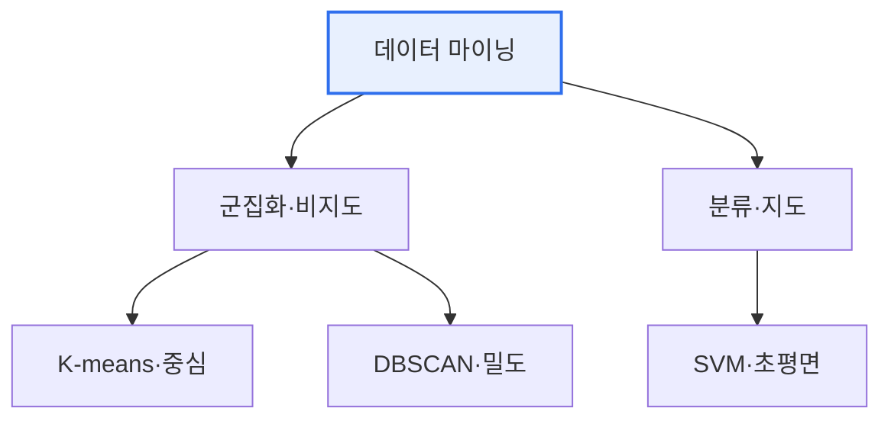

# 데이터 마이닝 기법: K-means · DBSCAN · SVM

## 1. 개요

### 가. 정의
> 데이터 마이닝은 대량의 데이터에서 **의미 있는 패턴·규칙·지식을 발견**하는 기법이며, 여기서는 대표적인 **군집화(K-means·DBSCAN)** 와 **분류(SVM)** 기법을 다룬다.

세 기법을 함께 이해하는 핵심은 '**정답의 유무와 접근 방식의 차이**'다. K-means와 DBSCAN은 정답(레이블) 없이 데이터를 비슷한 것끼리 묶는 **비지도 군집화** 이고, SVM은 정답을 학습해 경계를 긋는 **지도 분류** 다. 나아가 군집화 안에서도 접근이 갈린다. K-means는 '중심에서 가까운 것끼리'라는 **거리 기반**, DBSCAN은 '빽빽하게 모인 것끼리'라는 **밀도 기반** 이다. 이 차이 때문에 K-means는 둥근 군집을 잘 찾지만 이상치에 흔들리고, DBSCAN은 임의 형태의 군집과 이상치까지 구별한다. 데이터의 모양과 목적에 따라 적합한 기법이 달라진다.

## 2. K-means Clustering

> 데이터를 **K개의 군집으로 나누고, 각 군집의 중심(centroid)과 데이터 간 거리를 최소화**하도록 반복 갱신하는 중심 기반 군집화 기법이다.

동작은 직관적이다. 먼저 K개의 중심을 임의로 정하고, 각 데이터를 가장 가까운 중심에 할당한 뒤, 할당된 데이터들의 평균으로 중심을 다시 계산한다. 이 과정을 중심이 더 이상 움직이지 않을 때까지 반복한다. 단순하고 빠르지만, K를 미리 정해야 하고 초기 중심에 따라 결과가 달라지며, 둥근(구형) 군집을 가정해 길쭉하거나 복잡한 형태와 이상치에 약하다.

## 3. DBSCAN

> **밀도(특정 반경 안의 이웃 점 개수)를 기준으로 군집을 형성**하는 밀도 기반 군집화 기법으로, 밀도가 높은 영역을 군집으로 묶고 밀도가 낮은 점은 노이즈(이상치)로 분류한다.

DBSCAN은 두 파라미터, 반경 ε과 최소 이웃 수 MinPts로 동작한다. 어떤 점 주변 ε 안에 MinPts 이상의 점이 있으면 그것을 핵심점으로 보고 군집을 확장한다. 이 방식의 장점은 K를 정할 필요가 없고, 초승달처럼 **임의 형태의 군집**을 찾으며, 어디에도 속하지 않는 점을 **이상치로 자연스럽게 분리**한다는 것이다. 다만 밀도 편차가 크거나 고차원인 데이터에서는 성능이 떨어진다.

## 4. SVM(Support Vector Machine)

> 두 클래스를 나누는 **최적의 초평면(경계)** 을 찾되, 경계와 가장 가까운 데이터(서포트 벡터) 사이의 여백인 **마진을 최대화**하는 지도 분류 기법이다.

마진을 최대화하는 이유는 경계가 데이터에서 멀수록 새로운 데이터에 대한 일반화 성능이 좋기 때문이다. 선형으로 나눌 수 없는 데이터는 **커널 트릭**(RBF 등)으로 고차원에 사상해 분류한다. 고차원·소규모 데이터에서 강력하지만 대용량에서는 학습이 느리다.

## 5. 비교

| 구분 | K-means | DBSCAN | SVM |
|---|---|---|---|
| **학습** | 비지도(군집) | 비지도(군집) | 지도(분류) |
| **기준** | 중심 거리 | 밀도 | 마진(초평면) |
| **군집 수** | K 사전 지정 | 자동 결정 | — |
| **이상치** | 민감 | 노이즈로 분리 | 소프트마진 처리 |
| **형태** | 구형 가정 | 임의 형태 | 커널로 비선형 |

## 6. 고려사항 및 시사점

1. **데이터 특성에 맞는 선택**이 핵심이다. 군집 수를 알고 둥근 군집이면 K-means, 임의 형태·이상치 탐지가 필요하면 DBSCAN, 명확한 경계의 고차원 분류면 SVM이 적합하다.
2. **SVM은 딥러닝 이전의 강력한 분류기**로, 소규모·고차원에서 여전히 경쟁력이 있고 해석·이론적 근거가 탄탄하다.
3. **실무에서는 여러 기법 비교·앙상블**로 견고성을 확보한다. 하나의 기법에 의존하지 않고 결과를 교차 검증하며, 전처리(정규화·차원 축소)가 성능을 크게 좌우한다.

---

> **한 줄 요약**: K-means(중심 기반)·DBSCAN(밀도 기반)은 비지도 군집화, SVM(마진 최대 초평면)은 지도 분류이며, 데이터의 형태·군집 수·이상치 특성에 맞게 선택하고 전처리·앙상블로 견고성을 높인다.
