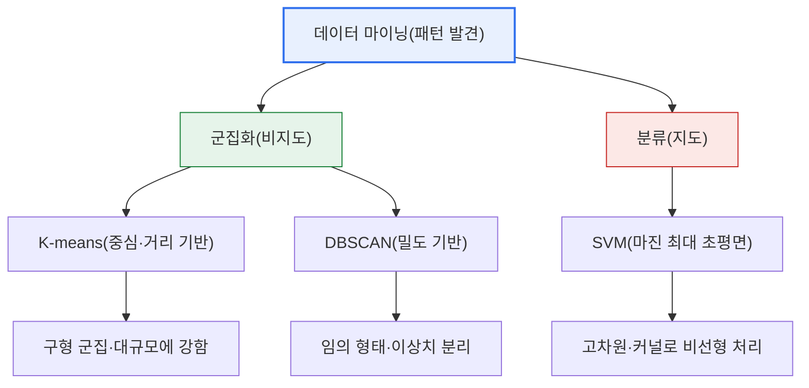
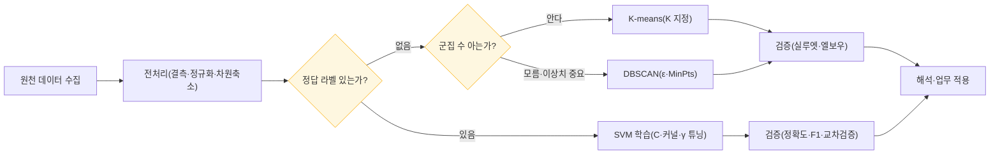

# 데이터 마이닝 기법: K-means · DBSCAN · SVM

## 1. 개요

### 가. 정의
> 데이터 마이닝(Data Mining)은 대량의 데이터에서 **사람이 미리 알기 어려운 의미 있는 패턴·규칙·지식을 발견**하는 지식 발견(KDD, Knowledge Discovery in Databases) 과정의 핵심 단계이며, 본 주제에서는 대표적인 **군집화(Clustering: K-means·DBSCAN)** 와 **분류(Classification: SVM)** 알고리즘을 다룬다.

데이터 마이닝을 이해하는 첫 관문은 '**정답(레이블)의 유무**'라는 축이다. 학습 데이터에 정답이 붙어 있으면 그 정답을 흉내 내도록 경계를 학습하는 **지도 학습(Supervised Learning)** 이고, 정답 없이 데이터 자체의 유사성만으로 구조를 발견하면 **비지도 학습(Unsupervised Learning)** 이다. K-means와 DBSCAN은 정답 없이 비슷한 것끼리 묶는 비지도 군집화이고, SVM은 정답을 학습해 두 부류를 가르는 경계를 긋는 지도 분류다. 세 기법을 한 주제로 묶어 학습하면 '정답이 있을 때와 없을 때, 그리고 유사성을 무엇으로 정의하느냐'에 따라 알고리즘이 어떻게 갈라지는지를 한눈에 정리할 수 있다.

두 번째 관문은 군집화 내부에서 다시 갈라지는 '**유사성의 정의**'다. K-means는 "군집 중심에서 가까운 것끼리"라는 **거리(distance) 기반** 사고를 따르고, DBSCAN은 "빽빽하게 모여 있는 것끼리"라는 **밀도(density) 기반** 사고를 따른다. 이 근본 차이가 두 알고리즘의 강약점을 결정한다. K-means는 중심 주변으로 둥글게 퍼진 군집을 잘 찾지만 길쭉하거나 초승달 모양의 군집과 이상치(outlier)에 취약하고, DBSCAN은 임의 형태의 군집과 이상치를 함께 구별해 낸다. 결국 어떤 기법이 옳은가는 데이터의 모양·규모·목적에 따라 달라지므로, 기술사 관점에서는 "언제 무엇을 쓰는가"를 판단하는 안목이 핵심이다.

### 나. 등장 배경과 필요성
군집화와 분류 기법이 부상한 배경에는 데이터 폭증이 있다. 기업이 축적한 고객·거래·로그 데이터는 사람이 눈으로 훑어 규칙을 찾기에는 너무 방대하고, 사전에 분석 가설을 세우기도 어렵다. 이때 비지도 군집화는 "우선 데이터가 스스로 어떤 덩어리로 나뉘는지 보자"는 **탐색적(exploratory) 접근**을 제공하고, 지도 분류는 "이미 아는 정답을 근거로 새 데이터의 부류를 예측하자"는 **예측적(predictive) 접근**을 제공한다. 예컨대 통신사가 수천만 가입자를 마케팅 세그먼트로 나눌 때는 정답이 없으므로 군집화를, 신용카드 거래가 정상인지 사기인지 판정할 때는 과거 라벨을 학습한 분류를 쓴다.

## 2. K-means Clustering

> 데이터를 사전에 정한 **K개의 군집으로 나누고, 각 군집 중심(centroid)과 소속 데이터 간 거리 제곱합(SSE, Sum of Squared Errors)을 최소화**하도록 중심을 반복 갱신하는 중심 기반(centroid-based) 군집화 기법이다.

K-means의 동작은 직관적이며 네 단계의 반복으로 요약된다. 먼저 K개의 초기 중심을 임의로 배치하고(초기화), 각 데이터를 가장 가까운 중심에 배정하며(할당), 배정된 데이터들의 평균 좌표로 중심을 다시 계산하고(갱신), 중심이 더 이상 움직이지 않을 때까지 할당과 갱신을 되풀이한다(수렴). 이 과정은 SSE를 단조 감소시키므로 반드시 수렴하지만, 그 수렴점이 전역 최적이라는 보장은 없다는 점이 핵심 한계다.

K-means의 가장 큰 약점은 **초기 중심 의존성과 K의 사전 지정**이다. 초기 중심을 잘못 잡으면 지역 최적(local optimum)에 갇혀 엉뚱한 군집이 나오고, K를 몇으로 둘지도 분석가가 미리 결정해야 한다. 이를 완화하기 위해 초기 중심을 서로 멀리 퍼뜨려 잡는 **K-means++** 초기화가 널리 쓰이며, 오늘날 scikit-learn 등 주요 라이브러리는 이를 기본값으로 채택한다. 적정 K를 찾는 실무 기법으로는 K를 늘려가며 SSE 감소가 꺾이는 지점을 찾는 **엘보우(Elbow) 기법**과, 군집 응집도·분리도를 함께 보는 **실루엣(Silhouette) 계수**가 대표적이다.

K-means는 계산이 O(n·K·반복수)로 가볍고 대규모 데이터에도 확장이 쉬워, 실무에서 가장 먼저 시도되는 군집화다. 예를 들어 이커머스에서 고객을 구매 빈도·금액·최근성(RFM) 3개 축으로 5개 세그먼트(K=5)로 나눠 우량·이탈 위험 고객을 구분하는 캠페인이 전형적이다. 다만 K-means는 각 군집이 구형(spherical)이고 크기가 비슷하다고 암묵적으로 가정하므로, 길쭉하거나 밀도가 크게 다른 군집, 이상치가 섞인 데이터에서는 중심이 왜곡되어 성능이 떨어진다. 또한 거리 척도에 민감하므로 **특성 스케일 정규화(표준화)** 가 사실상 필수다.

수치로 보면 이해가 분명해진다. 예컨대 월 구매액이 수백만 원 단위인 축과 구매 횟수가 한 자릿수인 축을 정규화 없이 함께 쓰면, 유클리드 거리는 사실상 구매액 축 하나만 반영해 횟수 정보를 무시한다. 그래서 두 축을 평균 0·표준편차 1로 표준화한 뒤에야 두 특성이 균형 있게 군집에 기여한다. 또한 K를 3·4·5·6으로 바꿔가며 SSE를 그려보면 대개 특정 K에서 감소폭이 급격히 완만해지는 '팔꿈치'가 나타나는데, 이 지점을 적정 K의 후보로 삼고 실루엣 계수(보통 0.5 이상이면 양호)로 교차 확인하는 것이 실무 절차다.

## 3. DBSCAN

> **밀도(특정 반경 안에 존재하는 이웃 점의 개수)를 기준으로 군집을 형성**하는 밀도 기반 군집화 기법으로, 밀도가 높은 영역을 하나의 군집으로 확장하고 어디에도 속하지 못한 저밀도 점을 노이즈(이상치)로 분리한다. DBSCAN은 Density-Based Spatial Clustering of Applications with Noise의 약자다.

DBSCAN은 두 개의 파라미터, 즉 이웃을 규정하는 반경 **ε(epsilon)** 과 핵심점이 되기 위한 최소 이웃 수 **MinPts** 로 동작한다. 어떤 점의 ε 반경 안에 MinPts 이상의 점이 있으면 그 점을 **핵심점(core point)** 으로 보고, 그 이웃들을 같은 군집으로 흡수하며 연쇄적으로 군집을 확장한다. 핵심점의 이웃이지만 자신은 핵심점이 못 되는 점은 **경계점(border point)**, 어느 핵심점의 이웃도 아닌 점은 **노이즈(noise)** 로 분류된다. 이렇게 밀도가 이어지는 한 계속 뻗어 나가므로, 초승달·나선처럼 **임의 형태의 군집**도 자연스럽게 찾아낸다.

DBSCAN의 강점은 세 가지로 요약된다. 첫째, K를 미리 정할 필요 없이 군집 수가 데이터로부터 자동 결정된다. 둘째, 이상치를 별도 처리 없이 노이즈로 걸러내므로 **이상 탐지(anomaly detection)** 에 그대로 활용된다. 셋째, 볼록하지 않은 임의 형태를 잡는다. 실무에서는 GPS 좌표 기반으로 매장 밀집 상권을 자동 도출하거나, 라이다(LiDAR) 점군에서 물체를 분할하고 잡음을 제거하는 데 쓰인다. 예컨대 배달 주문 위치를 DBSCAN으로 묶으면 K를 몰라도 밀집 배달 권역이 자동으로 드러난다.

반면 DBSCAN의 약점은 **파라미터 민감성과 밀도 편차**다. ε과 MinPts를 잘못 잡으면 군집이 하나로 뭉치거나 전부 노이즈가 되며, 한 데이터 안에 밀도가 크게 다른 군집이 섞여 있으면 하나의 ε으로 모두를 잡기 어렵다. 이 문제를 완화하기 위해 밀도 계층 구조를 반영하는 **HDBSCAN**(Hierarchical DBSCAN)이 제안되어 실무 활용이 늘고 있다. 또한 고차원 데이터에서는 '차원의 저주'로 거리 개념이 희석되어 밀도 기반 접근의 효용이 떨어진다.

ε 값을 정하는 실무 기법으로는 **k-거리 그래프(k-distance plot)** 가 널리 쓰인다. 각 점에서 k번째로 가까운 이웃까지의 거리를 계산해 오름차순으로 정렬하면, 대부분의 점은 완만하다가 노이즈 구간에서 급격히 치솟는 '무릎(knee)' 지점이 나타나는데, 그 무릎에 해당하는 거리를 ε 후보로 삼는다. MinPts는 통상 데이터 차원 수의 두 배 안팎(예: 2차원이면 4 내외)을 출발점으로 두고 조정한다. 이처럼 DBSCAN은 K를 정하지 않는 대신 ε·MinPts 튜닝이라는 다른 비용을 치르며, 그 대가로 임의 형태 군집과 이상치 분리라는 K-means가 못 하는 능력을 얻는다.

## 4. SVM(Support Vector Machine)

> 두 클래스를 나누는 **최적의 초평면(hyperplane)** 을 찾되, 경계와 가장 가까운 데이터 점(서포트 벡터)과의 여백인 **마진(margin)을 최대화**하여 일반화 성능을 높이는 지도 분류 기법이다.

SVM이 단순히 두 부류를 가르는 아무 경계가 아니라 굳이 '마진 최대' 경계를 찾는 이유는 **일반화 성능** 때문이다. 경계가 학습 데이터에서 멀리 떨어져 여유(마진)가 클수록, 학습 때 보지 못한 새 데이터가 조금 흔들려도 경계를 넘지 않아 오분류가 줄어든다. 이 경계를 결정하는 것은 전체 데이터가 아니라 경계에 가장 가까운 소수의 점, 즉 **서포트 벡터(support vector)** 뿐이라는 점이 SVM의 우아함이자 효율의 근원이다. 현실 데이터는 완벽히 나뉘지 않으므로, 약간의 오분류를 허용하되 그 정도를 하이퍼파라미터 **C** 로 조절하는 **소프트 마진(soft margin)** 을 사용한다. C가 크면 오분류를 강하게 벌해 마진이 좁아지고, 작으면 마진을 넓히되 오분류를 관대하게 본다.

선형으로 나눌 수 없는 데이터는 **커널 트릭(kernel trick)** 으로 해결한다. 원래 공간에서 뒤엉킨 데이터를 고차원 특성 공간으로 사상하면 선형 초평면으로 분리 가능해지는데, 실제로 고차원 좌표를 계산하지 않고 커널 함수(내적)만으로 그 효과를 얻는 것이 핵심이다. 대표적으로 방사형 기저 함수인 **RBF 커널**은 비선형 경계를 유연하게 만들어 실무 기본값으로 자주 쓰이며, 다항식·시그모이드 커널도 쓰인다. RBF의 폭을 정하는 γ(gamma)와 앞의 C를 함께 튜닝(그리드 서치·교차검증)하는 것이 SVM 실무의 핵심이다.

SVM은 특성 수가 표본 수보다 많은 **고차원·소규모 데이터**에서 특히 강력하다. 유전자 발현 데이터로 암 여부를 분류하거나(수천 개 유전자 대비 수백 명 샘플), 텍스트를 스팸/정상으로 가르는 문제에서 오랫동안 강력한 성능을 보였다. 딥러닝 이전 시대의 최강 분류기 중 하나였으며, 이론적 근거(구조적 위험 최소화)가 탄탄하고 과적합에 비교적 강하다는 장점이 있다. 다만 표본이 수십만 이상으로 커지면 학습 비용이 급격히 늘고, 확률 출력을 직접 주지 않으며(별도 보정 필요), 커널·C·γ 튜닝에 손이 많이 간다는 한계가 있다.

SVM은 본래 두 클래스를 나누는 이진 분류기이므로, 세 개 이상의 부류를 다룰 때는 **일대다(One-vs-Rest)** 또는 **일대일(One-vs-One)** 전략으로 여러 개의 이진 분류기를 조합한다. 또한 회귀 문제로 확장한 **SVR(Support Vector Regression)** 도 존재해, 마진 개념을 여백 허용 오차(ε-tube)로 바꿔 연속값을 예측한다. 이처럼 SVM은 단일 알고리즘이 아니라 마진 최대화라는 사상을 공유하는 계열로 이해하는 것이 정확하며, 커널 선택과 하이퍼파라미터 튜닝의 자유도가 곧 유연성이자 운영 부담이 된다.

## 5. 비교

세 기법의 차이는 단순히 표의 항목 나열이 아니라 '**정답의 유무와 유사성의 정의**'라는 두 축에서 필연적으로 갈라진다. K-means와 DBSCAN은 정답이 없다는 점에서 같지만 유사성을 거리로 보느냐 밀도로 보느냐가 달라 이상치 처리와 군집 형태에서 정반대 성향을 보인다. SVM은 아예 정답을 학습한다는 점에서 앞의 둘과 층위가 다르며, 군집을 만드는 것이 아니라 이미 정의된 부류의 경계를 긋는다. 따라서 "군집 수를 아는가, 이상치를 걸러야 하는가, 정답 라벨이 있는가"라는 세 질문이 곧 기법 선택의 의사결정 트리가 된다.

| 구분 | K-means | DBSCAN | SVM |
|---|---|---|---|
| **학습 유형** | 비지도(군집) | 비지도(군집) | 지도(분류) |
| **핵심 기준** | 중심과의 거리(SSE) | 밀도(ε·MinPts) | 마진 최대 초평면 |
| **군집·부류 수** | K 사전 지정 | 자동 결정 | 라벨로 주어짐 |
| **이상치** | 민감(중심 왜곡) | 노이즈로 자동 분리 | 소프트마진(C)으로 흡수 |
| **군집 형태** | 구형 가정 | 임의 형태 | 커널로 비선형 경계 |
| **주요 파라미터** | K, 초기화 | ε, MinPts | C, 커널, γ |
| **강점 영역** | 대규모·빠름 | 이상탐지·임의형태 | 고차원·소규모 |
| **대표 약점** | 초기값·K 민감 | 밀도 편차·고차원 | 대용량 학습 느림 |

```mermaid
flowchart TB
  D["데이터 마이닝(패턴 발견)"] --> C["군집화(비지도)"]
  D --> CL["분류(지도)"]
  C --> K["K-means(중심·거리 기반)"]
  C --> DB["DBSCAN(밀도 기반)"]
  CL --> S["SVM(마진 최대 초평면)"]
  K --> K1["구형 군집·대규모에 강함"]
  DB --> D1["임의 형태·이상치 분리"]
  S --> S1["고차원·커널로 비선형 처리"]
  style D fill:#e8f0fe,stroke:#2f6fed,stroke-width:2px
  style C fill:#e6f4ea,stroke:#188038,stroke-width:1px
  style CL fill:#fce8e6,stroke:#c5221f,stroke-width:1px
```

아래는 세 기법이 실제 분석 파이프라인에서 어떻게 선택·적용되는지를 나타낸 절차도다. 원 데이터를 정제·정규화한 뒤, 목적과 라벨 유무에 따라 분기하며, 결과는 반드시 정량 지표로 검증한다.

```mermaid
flowchart LR
  A["원천 데이터 수집"] --> B["전처리(결측·정규화·차원축소)"]
  B --> Q{"정답 라벨 있는가?"}
  Q -->|"없음"| G{"군집 수 아는가?"}
  Q -->|"있음"| H["SVM 학습(C·커널·γ 튜닝)"]
  G -->|"안다"| E["K-means(K 지정)"]
  G -->|"모름·이상치 중요"| F["DBSCAN(ε·MinPts)"]
  E --> V["검증(실루엣·엘보우)"]
  F --> V
  H --> W["검증(정확도·F1·교차검증)"]
  V --> R["해석·업무 적용"]
  W --> R
  style Q fill:#fef7e0,stroke:#f9ab00
  style G fill:#fef7e0,stroke:#f9ab00
```

## 6. 심화: 실무 적용과 최신 동향

실무에서 이 세 기법은 단독으로 쓰이기보다 **파이프라인의 한 단계**로 결합된다. 대표적 흐름은 '비지도 군집화로 데이터 구조를 먼저 파악 → 얻은 군집 라벨을 특성으로 삼거나 이상치를 제거 → 지도 분류로 예측 모델을 구축'하는 방식이다. 예컨대 금융 이상거래 탐지에서는 DBSCAN이나 밀도 기반 이상탐지로 명백한 노이즈를 먼저 걸러내고, 남은 데이터에 SVM·트리 계열 분류기를 학습시켜 정밀도를 높인다. 제조 품질관리에서는 센서 로그를 K-means로 정상 운전 패턴 군집으로 나눈 뒤, 어느 군집에도 멀리 떨어진 관측을 이상 신호로 경보한다.

기법 발전의 최신 흐름도 짚을 필요가 있다. 첫째, DBSCAN의 밀도 편차 약점을 보완한 **HDBSCAN**이 라이브러리(hdbscan, scikit-learn 1.3+ 내장)로 보급되어, 파라미터 민감성이 낮은 밀도 군집화로 자리 잡고 있다. 둘째, 고차원·비정형 데이터에서는 원 데이터를 바로 군집화하기보다 **오토인코더·임베딩으로 저차원 표현을 학습한 뒤 K-means를 적용**하는 딥 클러스터링이 표준이 되었다. 셋째, SVM은 초대형 데이터에서 딥러닝·그래디언트 부스팅에 자리를 내주었지만, 표본이 적고 특성이 많은 바이오·텍스트 도메인과 경량 임베디드 환경에서는 여전히 효율적 선택지로 남아 있다. 기술사 답안에서는 "만능 알고리즘은 없으며(No Free Lunch), 데이터 특성에 맞춘 기법 선택과 검증이 본질"이라는 관점을 견지하는 것이 유효하다.

## 7. 고려사항 및 시사점

1. **데이터 특성 기반 선택이 최우선이다.** 군집 수를 알고 대체로 둥근 군집이면 K-means, 군집 수를 모르거나 임의 형태·이상치 탐지가 필요하면 DBSCAN, 정답 라벨이 있고 명확한 경계의 고차원 분류면 SVM이 적합하다. '어떤 기법이 최고인가'가 아니라 '이 문제에 어떤 가정이 맞는가'로 접근해야 한다.

2. **전처리와 정규화가 성능을 좌우한다.** 세 기법 모두 거리·내적에 기반하므로, 특성 스케일이 다르면 큰 값을 가진 축이 결과를 지배한다. 표준화(z-score)·차원 축소(PCA)·결측 처리가 알고리즘 선택만큼 중요하며, 특히 고차원에서는 차원의 저주를 완화하는 특성 선택이 필수다.

3. **결과는 반드시 정량·정성 검증으로 뒷받침한다.** 군집화는 실루엣 계수·엘보우로 적정 군집을 확인하고 업무 전문가의 해석으로 타당성을 검증하며, 분류는 정확도만이 아니라 정밀도·재현율·F1과 교차검증으로 과적합을 경계한다. 단일 지표·단일 실행에 의존하지 않는다.

4. **앙상블과 조합으로 견고성을 확보한다.** 하나의 기법에 의존하기보다 군집화 결과를 분류의 입력 특성으로 쓰거나, 여러 알고리즘 결과를 교차 확인해 신뢰도를 높인다. 비지도(구조 발견)와 지도(예측)를 결합한 파이프라인이 실무의 표준이다.

5. **해석 가능성과 운영 비용의 트레이드오프를 고려한다.** SVM의 커널 결정은 해석이 어렵고, K-means는 K 설정이 자의적일 수 있으며, DBSCAN은 파라미터 튜닝 비용이 든다. 규제·감사 대상 도메인에서는 정확도뿐 아니라 설명 가능성과 재현성까지 함께 평가해 기법을 선택해야 한다.

## 참고자료

- scikit-learn User Guide — Clustering(K-means·DBSCAN): https://scikit-learn.org/stable/modules/clustering.html
- scikit-learn User Guide — Support Vector Machines: https://scikit-learn.org/stable/modules/svm.html
- HDBSCAN documentation: https://hdbscan.readthedocs.io/

---

> **한 줄 요약**: K-means(중심·거리 기반)와 DBSCAN(밀도 기반)은 정답 없는 비지도 군집화, SVM(마진 최대 초평면)은 정답을 학습하는 지도 분류이며, 데이터의 형태·군집 수·이상치·라벨 유무에 맞게 선택하고 전처리·검증·앙상블로 견고성을 높이는 것이 핵심이다.
