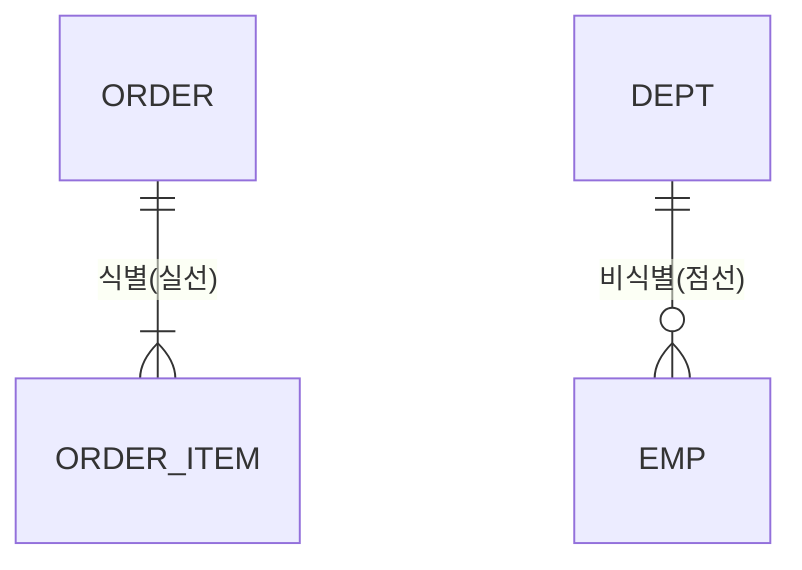

# RDBMS 데이터 모델링(식별·비식별 관계)

## 1. 개요

### 가. 정의
> 현실 세계의 업무·데이터를 관계형 DB 구조로 **추상화·구조화**하여, 데이터의 **무결성·일관성·재사용성**을 확보하도록 설계하는 과정.

데이터 모델링은 단순히 테이블을 그리는 작업이 아니라, 업무 규칙을 데이터 구조에 녹여 넣어 **잘못된 데이터가 애초에 들어올 수 없게** 만드는 일이다. 구조가 곧 규칙이므로, 모델링 품질이 이후 애플리케이션의 복잡도·성능·유지보수성을 결정한다.

### 나. 모델링 단계별 수행내용
모델링은 추상적 관점에서 구체적 구현으로 **개념→논리→물리** 3단계를 거친다. 이렇게 단계를 나누는 이유는, 초기에 특정 DBMS 제약에 얽매이지 않고 업무 본질을 먼저 포착한 뒤 점진적으로 구체화해야 재사용성·이식성이 높아지기 때문이다.

| 단계 | 수행 내용 | 산출물 |
|---|---|---|
| **개념적** | 핵심 엔터티·관계 식별, 업무 규칙 반영(DBMS 독립) | 개념 ERD |
| **논리적** | 속성·식별자 정의, **정규화**, 관계·카디널리티 설정 | 논리 ERD |
| **물리적** | DBMS 특성 반영(자료형·인덱스·파티션·반정규화) | 테이블 스키마 |

개념 단계는 "무엇을 관리하는가"에 답하고, 논리 단계는 정규화로 데이터를 이상현상 없는 구조로 정제하며, 물리 단계에서 비로소 성능·저장 특성을 고려해 인덱스·파티션·반정규화를 적용한다.

## 2. 식별 관계 vs 비식별 관계

관계형 모델링에서 부모의 기본키(PK)가 자식에게 상속될 때, 그 키를 **자식의 PK 일부로 쓰느냐(식별) 일반 외래키로만 쓰느냐(비식별)** 가 갈린다. 이 선택은 표기법의 문제가 아니라 **두 엔터티의 존재 종속성**을 어떻게 규정하느냐의 문제다.

### 가. 식별 관계(Identifying)
부모 PK가 자식 PK에 포함되는 관계로, 자식은 **부모 없이는 존재 자체가 불가능**하다. 예컨대 `주문상세`는 반드시 어떤 `주문`에 속해야만 의미가 있으므로, `주문상세`의 PK는 `(주문번호 + 상세순번)`처럼 부모 키를 포함한 복합키가 된다. 부모 키가 자식으로 계속 전파되어 조인 조건이 자연스러워지는 장점이 있지만, 상속이 여러 단계로 이어지면 **하위 테이블의 PK가 계속 비대해지는** 단점이 있다. ERD에서 실선으로 표기한다.

### 나. 비식별 관계(Non-Identifying)
부모 PK가 자식의 **일반 속성(FK)** 으로만 상속되고, 자식은 자체 PK를 갖는 관계다. 자식이 부모와 **독립적으로 존재**할 수 있을 때 쓴다. 예컨대 `사원`은 자신의 `사원번호`를 PK로 갖고 `부서번호`는 FK로만 참조하므로, 부서가 미배정이거나 바뀌어도 사원 레코드는 독립적으로 존재한다. PK가 단순하게 유지되는 장점이 있고, ERD에서 점선으로 표기한다.

| 구분 | 식별(Identifying) | 비식별(Non-Identifying) |
|---|---|---|
| **개념** | 부모 PK가 자식 **PK 일부로 상속** | 부모 PK가 자식 **일반 FK로 상속** |
| **표기(ERD)** | 실선 | 점선 |
| **종속성** | 강한 종속 — 부모 없이 자식 불가 | 약한 종속 — 자식 독립 존재 가능 |
| **PK 구성** | 부모 키 포함(복합키) | 자식 자체 PK 보유 |
| **예** | 주문 ↔ 주문상세 | 부서 ↔ 사원 |
| **영향** | 조인 단순화, PK 비대화 위험 | PK 단순, 조인 시 FK 사용 |

선택 기준은 결국 **업무상 자식이 부모 없이 성립하는가**이다. 성립할 수 없으면(강한 종속) 식별, 성립할 수 있으면(약한 종속) 비식별을 택하는 것이 원칙이며, 무분별한 식별 관계 남용은 하위 PK 비대화와 조인 성능 저하를 부른다.

## 3. 데이터 모델링 시 고려사항

정규화와 반정규화는 **무결성과 성능의 트레이드오프**를 조율하는 대표 도구다. 정규화는 중복을 제거해 이상현상(삽입·갱신·삭제 시 데이터 불일치)을 막지만 조인이 늘어 조회 성능이 떨어질 수 있고, 반정규화는 의도적 중복으로 조회를 빠르게 하지만 갱신 무결성 관리 부담을 늘린다.

| 구분 | 고려 내용 |
|---|---|
| **정규화** | 이상현상(삽입·갱신·삭제) 제거, 1NF~BCNF로 중복 최소화 |
| **반정규화** | 조회 빈번 구간에 의도적 중복 허용, 정규화와 **균형** |
| **무결성** | 개체·참조·도메인·업무 무결성을 제약조건으로 강제 |
| **키 설계** | 인조키(Surrogate) vs 본질키, 식별자 안정성·불변성 |
| **표준화·이력** | 명명 표준, 이력·변경관리, 확장성 확보 |

키 설계에서 인조키(예: 자동증가 ID)를 쓰면 본질키가 바뀌어도 관계가 안정적으로 유지되지만, 업무적 의미가 없어 별도 유일성 제약이 필요하다. 안정적이고 변하지 않는 식별자를 고르는 것이 조인·참조 무결성의 토대가 된다.

## 4. 고려사항 및 시사점
실무 설계 원칙은 **정규화로 무결성을 먼저 확보한 뒤, 실제 성능 요구가 확인되는 구간에 한해 선택적으로 반정규화**를 적용하는 것이다. 처음부터 성능을 이유로 반정규화하면 무결성 위험만 커진다. 식별/비식별 관계 역시 종속성·PK 전파·조인 성능을 종합해 판단해야 하며, 습관적으로 한쪽만 쓰는 것을 경계해야 한다. 나아가 대용량·분산 환경에서는 단일 RDBMS의 한계를 넘어 **파티셔닝·샤딩**으로 수평 확장하거나, 비정형·초대용량 영역에는 **NoSQL을 혼용**하는 폴리글랏 설계로 확장하는 것이 기술사 관점의 방향이다.

---

> **한 줄 요약**: 데이터 모델링은 *개념→논리→물리* 단계로 진행되며, 식별관계는 부모 PK가 자식 PK에 상속(강한 종속·실선)·비식별관계는 일반 FK(약한 종속·점선)로 존재 종속성에 따라 선택하고, 정규화·반정규화·무결성·키 설계를 트레이드오프 관점에서 균형 있게 다룬다.
