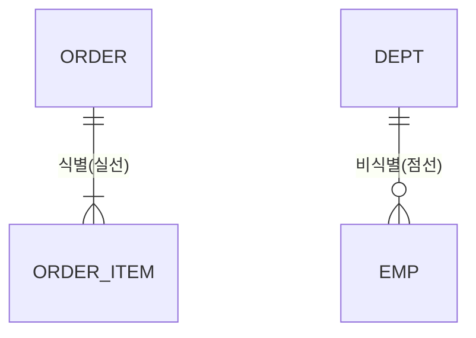

# RDBMS 데이터 모델링

## 1. 개요

### 가. 개념
> 현실 세계의 업무·데이터를 관계형 DB 구조로 **추상화·구조화**하여, 데이터의 **무결성·일관성·재사용성**을 확보하도록 설계하는 과정.

### 나. 모델링 단계별 수행내용

| 단계 | 수행 내용 | 산출물 |
|---|---|---|
| **개념적** | 핵심 엔터티·관계 식별, 업무 규칙 반영 | 개념 ERD |
| **논리적** | 속성·식별자 정의, **정규화**, 관계·카디널리티 설정 | 논리 ERD |
| **물리적** | DBMS 특성 반영(자료형·인덱스·파티션·반정규화) | 테이블 스키마 |

## 2. 식별 관계 vs 비식별 관계

| 구분 | 식별(Identifying) 관계 | 비식별(Non-Identifying) 관계 |
|---|---|---|
| **개념** | 부모 PK가 자식의 **PK 일부로 상속** | 부모 PK가 자식의 **일반 속성(FK)** 으로 상속 |
| **표기(ERD)** | **실선** | **점선** |
| **종속성** | 강한 종속 — 부모 없이 자식 존재 불가 | 약한 종속 — 자식 독립 존재 가능 |
| **PK 구성** | 부모 키가 자식 PK에 포함(복합키) | 자식은 자체 PK 보유 |
| **예** | 주문 ↔ 주문상세 | 부서 ↔ 사원 |
| **영향** | PK 전파로 조인 단순화, PK 비대화 위험 | PK 단순, 조인 시 FK 사용 |

## 3. 데이터 모델링 시 고려사항

| 구분 | 고려 내용 |
|---|---|
| **정규화** | 이상현상(삽입·갱신·삭제) 제거, 1NF~BCNF |
| **반정규화** | 성능을 위한 의도적 중복(조회 빈번 시), 정규화와 **균형** |
| **무결성** | 개체·참조·도메인·업무 무결성 확보 |
| **키 설계** | 인조키(Surrogate) vs 본질키, 식별자 안정성 |
| **표준화·이력** | 명명 표준, 이력·변경관리, 확장성 |

## 4. 시사점
- **정규화로 무결성 확보 후, 성능 요구에 따라 선택적 반정규화** 적용이 원칙
- 식별/비식별 관계 선택은 **종속성·PK 전파·조인 성능**을 종합 고려
- 대용량·분산 환경에서는 파티셔닝·샤딩·NoSQL 혼용 설계로 확장

---

> **한 줄 요약**: 데이터 모델링은 *개념→논리→물리* 단계로 진행되며, 식별관계는 부모 PK가 자식 PK에 상속(강한 종속·실선)·비식별관계는 일반 FK(약한 종속·점선)로 구분하고, 정규화·반정규화·무결성·키 설계를 균형 있게 고려한다.
