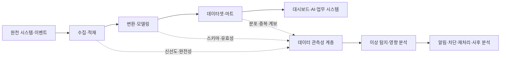
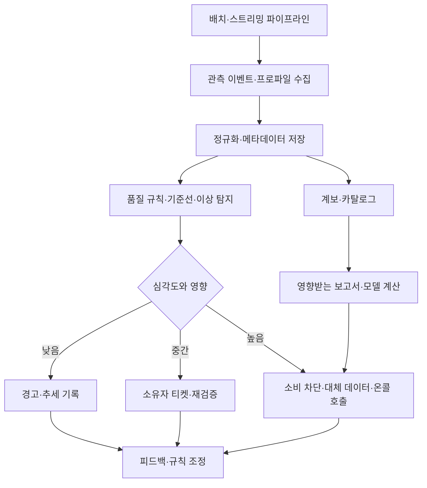

# 데이터 관측성(Data Observability)과 데이터 신뢰성 관리

## 1. 개요

> **정의**: 데이터 관측성(Data Observability)은 데이터 파이프라인과 데이터셋의 현재 상태를 신선도·완전성·유효성·일관성·분포·계보 등의 신호로 지속적으로 추론하고, 이상 발생 시 영향 범위와 원인을 찾아 복구하는 운영 능력이다.

데이터웨어하우스, 데이터레이크, 레이크하우스와 실시간 스트리밍이 확산되면서 데이터는 한 번 저장하고 끝나는 자산이 아니라 계속 생성·변환·소비되는 제품이 되었다.
애플리케이션 운영에서는 서비스가 살아 있는지, 응답이 느린지, 오류가 증가했는지를 모니터링하지만, 데이터 파이프라인이 정상 종료했다고 해서 그 결과가 분석에 쓸 수 있다는 보장은 없다.
예를 들어 배치 작업이 성공으로 끝났더라도 원천 시스템의 시간대 오류로 전일 데이터가 중복 적재되거나, 스키마 변경으로 매출 컬럼이 모두 null이 될 수 있다.

이 문제를 단순한 데이터 품질 검사만으로 해결하기 어려운 이유는 데이터의 상태가 시간과 맥락에 따라 변하기 때문이다.
어제와 오늘의 행 수가 다를 수 있고, 특정 캠페인 기간에는 평소보다 결측률이 높아도 정상일 수 있다.
따라서 관측성은 정적인 규칙의 통과·실패만 표시하는 것이 아니라, 기대 범위와 계보를 바탕으로 이상을 탐지하고 업무 영향까지 설명해야 한다.

기술사 관점에서 데이터 관측성은 도구 도입 문제가 아니라 데이터 신뢰성(Data Reliability)을 서비스 수준으로 관리하는 거버넌스 문제다.
데이터 소유자, 플랫폼 운영자, 분석가, 개인정보보호 담당자가 누가 어떤 품질 신호를 책임지는지 합의하고, 장애 탐지부터 재처리·사후 분석까지 운영 절차를 설계해야 한다.

### 1.1 등장 배경과 필요성

첫째, 데이터 파이프라인의 분산과 복잡성 때문이다.
하나의 지표가 API 수집, 메시지 큐, 스트리밍 처리, 오브젝트 스토리지, 변환 모델, 데이터마트를 거치면 어느 단계에서 문제가 발생했는지 단순한 성공·실패 로그만으로 알기 어렵다.
다단계 파이프라인에서 하류 대시보드의 이상을 발견했을 때 상류 원천까지 역추적할 수 없다면 장애 복구 시간이 길어진다.

둘째, 데이터의 변동성이 커졌기 때문이다.
스키마와 분포는 원천 애플리케이션 배포, 정책 변경, 계절성, 이벤트, 사용자 행동 변화에 따라 달라진다.
고정된 임계치만 사용하면 정상적인 변동을 장애로 오인하거나, 천천히 진행되는 품질 저하를 놓칠 수 있다.
데이터 관측성은 시간적 맥락과 업무적 기대를 함께 사용하여 이러한 오탐과 미탐을 줄인다.

셋째, AI와 경영 의사결정의 실패 비용이 커졌기 때문이다.
학습 데이터의 누락이나 분포 변화는 모델 성능과 공정성에 영향을 주고, 재무·규제 보고 데이터의 오류는 법적·평판 위험으로 이어진다.
데이터가 신뢰할 수 있는지 확인하지 않고 대시보드와 모델의 결과만 검증하면 문제의 원인을 찾을 수 없으므로, 데이터 자체를 운영 대상에 포함해야 한다.

## 2. 데이터 관측성의 구성 개념

데이터 관측성을 설명할 때는 다섯 가지 핵심 질문을 사용하면 좋다.
첫째, 데이터가 제때 도착했는가를 묻는 신선도(Freshness)다.
둘째, 필요한 데이터가 빠짐없이 존재하는가를 보는 완전성(Completeness)이다.
셋째, 값이 업무 규칙과 타입에 맞는가를 확인하는 유효성(Validity)이다.
넷째, 시간·조직·원천별 분포가 평소와 비교해 비정상적으로 변했는지를 보는 분포 안정성(Distribution)이다.
다섯째, 이 데이터가 어디에서 왔고 어떤 소비자에게 영향을 주는지를 보여 주는 계보(Lineage)다.

### 2.1 신선도와 적시성

신선도는 데이터가 마지막으로 갱신된 시점 또는 이벤트 발생 시각과 현재 시각의 차이를 의미한다.
일별 매출 배치라면 전일 마감 후 일정 시간 안에 데이터가 도착해야 하고, 실시간 거래라면 지연 시간이 초·분 단위 목표로 관리될 수 있다.
단순히 파일의 수정 시각만 보면 원천에서 오래된 데이터가 재전송된 상황을 놓칠 수 있으므로 이벤트 시간과 처리 시간을 분리해서 기록해야 한다.

신선도 규칙은 업무 중요도에 따라 달라진다.
법정 보고 데이터는 마감 시점의 완결성이 중요하고, 추천 서비스의 클릭 이벤트는 지연보다 지속적인 흐름이 중요할 수 있다.
그러므로 모든 파이프라인에 같은 임계치를 적용하기보다 데이터 제품별 SLO와 허용 지연을 합의한다.

### 2.2 완전성과 유효성

완전성은 예상된 레코드·필드·파티션이 누락되지 않았는지를 확인하는 품질 축이다.
행 수 비교, 필수 컬럼 null 비율, 날짜별 파티션 존재 여부, 원천과 목적지의 건수 대조가 대표적인 방법이다.
그러나 행 수가 같아도 동일한 레코드가 중복되었을 수 있으므로 키 중복률과 고유성도 함께 보아야 한다.

유효성은 값이 정해진 타입·도메인·업무 규칙을 만족하는지 평가한다.
금액이 숫자이고 음수가 허용되지 않는지, 국가 코드가 허용 목록에 포함되는지, 종료일이 시작일보다 빠르지 않은지와 같은 규칙이 여기에 해당한다.
유효성 검사는 파이프라인 전체를 중단할지, 문제가 있는 행만 격리할지, 경고 후 계속할지를 데이터 제품의 위험 등급에 따라 결정해야 한다.

### 2.3 분포와 볼륨 변화

볼륨은 일정 기간에 유입·처리된 레코드 수와 크기의 변화다.
평균 주문량이 갑자기 절반이 되면 원천 장애일 수도 있지만, 영업정책 변경이나 휴일 효과일 수도 있다.
따라서 볼륨 경보는 단일 절대값보다 요일·시간대·계절성을 고려한 기준선과 함께 설계한다.

분포 관측은 특정 컬럼의 평균, 분위수, 최솟값·최댓값, 고유값 수, null 비율 등의 통계적 특징을 추적한다.
예를 들어 고객 연령의 평균이 조금 바뀌는 것보다, 원래 다양하던 상태값이 하나의 값으로 수렴하는 것이 스키마 매핑 오류의 강한 신호일 수 있다.
분포 통계는 원시 개인정보를 노출하지 않는 집계 수준으로 수집하고, 민감한 속성은 접근권한과 보존기간을 별도로 관리한다.

### 2.4 스키마와 계보

스키마 관측은 컬럼 추가·삭제·이름 변경·타입 변경·널 허용성 변경을 탐지한다.
스키마 변경은 기술적으로는 배포 성공이지만 하류 쿼리의 의미를 바꿀 수 있으므로, 호환성 정책과 변경 승인 절차를 데이터 계약과 연결해야 한다.
하류 소비자가 발견된 뒤에야 변경 사실을 알게 되면 데이터 플랫폼의 신뢰성이 떨어지므로, 사전 통지와 계약 테스트를 운영한다.

계보는 데이터가 어느 원천에서 출발하여 어떤 작업과 변환을 거쳐 현재 테이블과 보고서에 도달했는지를 표현한다.
계보가 있으면 장애 발생 시 영향을 받는 대시보드·모델·조직을 계산하고, 변경 전에 영향 분석을 수행할 수 있다.
OpenLineage는 작업과 데이터셋의 실행 메타데이터를 수집하고 교환하기 위한 개방형 접근으로, 서로 다른 도구 사이에 계보 정보를 연결하는 데 활용할 수 있다.

## 3. 데이터 관측성 아키텍처와 처리 흐름

데이터 관측성 계층은 수집 대상, 프로파일러, 규칙 엔진, 메타데이터 저장소, 알림·영향 분석, 대응 자동화로 구성된다.
파이프라인 코드와 관측성 코드를 분리하면 도구를 바꾸기 쉽지만, 업무 의미가 있는 검사는 데이터 제품 소유자가 관리할 수 있도록 선언적으로 정의하는 편이 좋다.

### 3.1 수집과 프로파일링

관측 이벤트에는 데이터셋 식별자, 파이프라인 실행 ID, 스키마 버전, 처리 시작·종료 시각, 레코드 수, 품질 검사 결과, 계보 식별자를 포함한다.
실행 ID가 없으면 재시도와 중복 실행을 구분하기 어렵고, 서로 다른 배치 결과를 합쳐 잘못된 경보를 만들 수 있다.
스트리밍에서는 윈도우별 지연·처리량·늦게 도착한 이벤트 비율을 함께 기록한다.

프로파일링은 데이터의 통계적 특징을 계산하여 현재 상태를 요약한다.
모든 원시 값을 관측 플랫폼으로 복사하기보다 카운트, null 비율, 해시된 스키마, 분포 요약처럼 목적에 맞는 메타데이터만 전송하는 것이 개인정보와 비용 측면에서 안전하다.
프로파일링 빈도는 데이터의 변경 주기와 위험도에 맞춰 정하고, 고비용의 전체 검사는 주기적으로 샘플링할 수 있다.

### 3.2 규칙 엔진과 기준선

규칙 엔진은 명시적 데이터 품질 규칙과 통계 기반 이상 탐지를 함께 실행한다.
`주문 ID는 유일해야 한다`와 같은 결정론적 규칙은 재현성이 높지만 새로운 유형의 이상을 찾는 데 한계가 있다.
반대로 기준선 기반 탐지는 과거의 시간대·계절성을 반영할 수 있으나 설명이 어렵고 충분한 정상 이력이 필요하다.

따라서 규칙 결과는 단순한 통과·실패보다 관측값, 기대 범위, 기준선 기간, 심각도, 근거를 함께 남겨야 한다.
데이터 소유자가 경보를 검토하고 실제 장애인지 업무 변화인지 분류하면 기준선의 품질도 개선된다.
임계치를 자동으로 학습하더라도 중요한 재무·규제 데이터의 차단 결정은 승인 가능한 정책과 사람의 검토를 남겨야 한다.

### 3.3 알림과 대응 자동화

모든 이상을 동일하게 알리면 경보 피로가 발생한다.
영향받는 소비자 수, 업무 중요도, 데이터 지연, 오류 지속시간, 개인정보·규제 관련성을 조합하여 심각도를 계산하고, 중복 경보는 하나의 사건으로 묶는다.
낮은 심각도는 추세 대시보드로 보내고, 높은 심각도는 담당자 호출과 소비 차단을 연결한다.

자동 대응은 되돌릴 수 있고 안전한 작업부터 시작한다.
실패한 파티션의 재시도, 캐시된 최신 정상 데이터 제공, 문제가 있는 레코드의 격리, 하류 작업의 일시 중지가 대표적이다.
원천 데이터를 자동 삭제하거나 승인 없이 보정하는 작업은 잘못된 복구가 원본 증거를 훼손할 수 있으므로 별도 승인과 감사 로그를 요구한다.

## 4. 핵심 지표와 서비스 수준

데이터 신뢰성을 운영하려면 기술 지표와 업무 지표를 연결해야 한다.
파이프라인 성공률만 높아도 데이터가 늦거나 틀리면 소비자는 실패한 것으로 느끼므로, 데이터셋 단위의 신선도·품질·영향 범위를 SLO에 포함한다.

|구분|대표 지표|해석과 운영 질문|
|---|---|---|
|신선도|최종 갱신 지연, 이벤트 지연 p95|약속된 시점 안에 사용할 수 있는가?|
|완전성|필수 컬럼 null률, 누락 파티션 비율|필요한 데이터가 빠짐없이 도착했는가?|
|유효성|도메인 위반률, 타입 오류율|값이 업무 규칙과 계약을 지키는가?|
|일관성|원천-목적지 건수 차이, 참조 무결성 위반|서로 다른 데이터셋이 같은 사실을 말하는가?|
|분포|평균·분위수·고유값·볼륨의 기준선 이탈|데이터 생성 과정이 평소와 같은가?|
|계보|영향 자산 수, 미연결 데이터셋 비율|문제의 원천과 하류를 추적할 수 있는가?|
|대응|탐지시간, 복구시간, 재발률|이상을 얼마나 빨리 알아채고 고치는가?|

예를 들어 매일 오전 7시까지 갱신되는 영업 대시보드의 SLO를 정한다면, 단순히 배치 성공 여부만 기록하지 않는다.
오전 7시 이전 갱신률, 핵심 매출 컬럼의 null률, 전일 대비 허용 가능한 볼륨 변화, 오류 발생 후 담당자 인지 시간과 복구 시간을 함께 정의한다.
이 지표들을 데이터 제품의 중요도에 따라 분리하면 플랫폼 팀이 모든 데이터에 과도한 통제를 적용하는 문제를 줄일 수 있다.

## 5. 데이터 관측성·데이터 품질·파이프라인 모니터링 비교

데이터 품질은 데이터가 요구사항을 만족하는지 평가하는 속성·활동이고, 파이프라인 모니터링은 작업이 실행되고 자원을 사용하는지를 감시하는 운영 활동이다.
데이터 관측성은 이 둘을 포함하면서, 시간적 변화와 계보를 이용해 원인·영향·대응까지 연결하는 상위 운영 능력에 가깝다.
셋 중 하나만 구축하면 사각지대가 남는다.

|구분|데이터 품질관리|파이프라인 모니터링|데이터 관측성|
|---|---|---|---|
|주요 질문|값이 요구사항을 만족하는가?|작업이 실행되고 끝났는가?|왜 이상하며 누구에게 영향을 주는가?|
|대상|레코드·컬럼·규칙|잡 실행·자원·오류 로그|데이터·파이프라인·계보·소비자|
|시간 관점|검사 시점의 품질|실행 상태·지연|기준선·변화·누적 영향|
|대응|실패 보고·격리|재시도·운영 알림|원인 추적·영향 차단·복구·학습|
|한계|운영 맥락과 원인 부족|데이터 의미와 값 오류를 놓침|메타데이터 품질과 비용 관리 필요|

예를 들어 변환 작업이 정상 종료되었지만 입력 파일의 한 컬럼이 모두 빈 문자열인 경우를 생각해 보자.
파이프라인 모니터링은 성공을 보고할 수 있고, 단일 null 검사만 있으면 문제를 발견할 수 있다.
데이터 관측성은 여기에 더해 해당 컬럼을 사용하는 재무 대시보드와 추천 모델을 찾아 담당자에게 영향 범위를 알려 주고, 필요하다면 소비를 차단한다.

## 6. 적용 절차

### 6.1 데이터 제품과 중요도 분류

첫 단계는 테이블 목록을 만드는 것이 아니라 소비자와 의사결정을 기준으로 데이터 제품을 정의하는 것이다.
월간 재무 보고, 고객 알림, 추천 모델, 내부 탐색용 샌드박스는 허용 가능한 지연과 오류 비용이 다르다.
제품별 소유자, 소비자, 갱신 주기, 민감도, 보존기간, 장애 시 대체수단을 카탈로그에 기록한다.

중요도 분류가 끝나면 모든 컬럼에 같은 검사를 적용하지 않고 핵심 데이터셋부터 최소한의 신호를 수집한다.
핵심 데이터에는 신선도·완전성·유효성·계보를 우선 적용하고, 안정화된 뒤 분포와 비용 최적화를 확장한다.
이렇게 단계적으로 도입하면 관측성 자체가 데이터 플랫폼의 또 다른 대규모 장애원이 되는 것을 막을 수 있다.

### 6.2 기대 상태와 데이터 계약 정의

데이터 계약은 스키마만 고정하는 문서가 아니라 생산자와 소비자가 합의한 의미, 품질, 변경 통지, 책임을 포함한다.
계약에는 컬럼의 의미와 단위, 허용 null, 갱신 주기, 키, 유효 범위, 호환성 규칙, 품질 SLO를 명시한다.
계약이 있어야 관측성 규칙이 업무적 기대를 반영하고, 경보가 단순한 숫자 비교에 그치지 않는다.

생산자가 계약을 검증하고 소비자가 변경을 사전에 확인하는 양방향 절차를 마련한다.
하위 호환 변경은 자동 배포할 수 있지만, 컬럼 삭제나 의미 변경은 영향 분석과 승인 후 진행한다.
계약 위반을 무조건 파이프라인 실패로 취급하지 않고, 소비자 중요도와 오류 유형에 따라 차단·격리·경고 정책을 구분한다.

### 6.3 탐지·조치·사후 분석

운영 절차는 탐지, 분류, 원인 분석, 대응, 검증, 사후 분석의 순환으로 정의한다.
탐지 시 실행 ID와 마지막 정상 시점, 변경 이력을 함께 확보하고, 계보를 통해 영향을 받는 데이터셋과 보고서를 계산한다.
담당자는 원천 장애인지, 스키마 변경인지, 변환 로직 버그인지, 정상적인 업무 변화인지 분류한다.

조치 후에는 동일한 품질 검사를 재실행하여 복구가 실제 소비자 상태를 회복했는지 검증한다.
재처리로 중복이 생기지 않도록 멱등성 키와 처리 구간을 관리하고, 보정된 데이터에는 원본·보정자·보정사유·시각을 기록한다.
사후 분석에서는 탐지 누락, 경보 지연, 잘못된 임계치, 소유권 불명확성, 재발 방지 항목을 개선 백로그에 등록한다.

## 7. 산업 적용 사례

### 7.1 금융·재무 보고 데이터

금융기관이나 기업 재무팀은 거래 원천, 계정계, 데이터웨어하우스, 보고 마트 사이의 정합성이 중요하다.
하루 거래 건수와 금액 합계, 통화 단위, 기준일, 중복 거래 여부를 관측하고, 마감 시점의 데이터 신선도 SLO를 운영한다.
핵심 보고 테이블에서 계약 위반이 발생하면 보고서 생성을 자동으로 차단하고 담당 회계·데이터 소유자에게 증적을 전달하는 방식이 적합하다.

이때 단순 행 수 검사는 취소·환불·분할 거래의 업무 의미를 반영하지 못한다.
원천 시스템의 업무 규칙과 회계 기준을 품질 규칙으로 모델링하고, 대사 결과와 변경 이력을 함께 보존해야 한다.
관측성은 재무 통제의 대체물이 아니라 통제 수행 여부를 빠르게 확인하고 예외를 추적하는 기술적 기반이다.

### 7.2 추천·개인화 모델

추천 시스템은 사용자 이벤트가 늦거나 특정 채널에서 누락되면 모델 입력의 분포가 변하고, 추천 품질과 공정성에 영향을 받는다.
이벤트 수집 지연, 사용자별 기여 상한, 주요 피처의 null률, 신규·기존 사용자 비율, 학습·서빙 분포 차이를 함께 관측해야 한다.
모델 성능이 떨어진 뒤에만 데이터를 조사하면 원인 구분이 어려우므로 피처 계보와 학습 데이터 버전을 연결한다.

개인정보가 포함된 이벤트의 프로파일링은 원시 식별자를 노출하지 않는 집계와 가명화를 우선한다.
분포 통계가 소수 집단을 재식별할 가능성이 있는지 평가하고, 관측 메타데이터의 접근권한과 보존기간을 제한한다.
데이터 관측성의 목적은 더 많은 개인정보를 수집하는 것이 아니라 최소한의 메타데이터로 신뢰성을 판단하는 것이다.

### 7.3 제조·IoT 스트리밍

공장 센서 데이터는 장비별 수집 주기와 네트워크 상태에 따라 늦게 도착하거나 일시적으로 끊길 수 있다.
센서별 수집률, 이벤트 시간과 처리 시간의 차이, 결측 구간, 값의 물리적 범위, 장비 펌웨어 변경 시점을 관측한다.
갑작스러운 값의 고정은 설비 고장일 수도 있고 센서 연결 문제일 수도 있으므로, 데이터 계보와 장비 상태 이벤트를 함께 분석한다.

실시간 운영에서는 모든 이상에 대해 스트림을 중단하면 생산에 더 큰 손실이 생길 수 있다.
안전 임계치를 벗어난 값은 격리하고 대체값을 사용하되, 예측정비 모델의 학습 데이터에는 격리 사실을 표시하는 정책이 필요하다.
관측성 설계는 지연·정확도·안전의 우선순위를 현장 운영자와 합의해야 한다.

## 8. 심화: 데이터 계약·계보·AI 운영의 결합

최근 데이터 플랫폼은 데이터 품질 검사를 파이프라인 마지막 단계의 배치 작업으로만 두지 않고, 생산자·소비자 계약과 계보 이벤트를 통해 변경의 영향을 사전에 계산하는 방향으로 발전하고 있다.
스키마가 바뀌면 어떤 모델과 보고서가 영향을 받는지 자동으로 보여 주고, 품질 SLO가 깨지면 단순 알림을 넘어 소비를 제한하거나 대체 데이터로 전환한다.
이 구조는 데이터 메시의 도메인 소유권, 데이터 제품의 책임, 플랫폼의 공통 표준과 결합할 때 효과가 높다.

생성형 AI와 자연어 분석이 확산되면 데이터 관측성 메타데이터 자체가 질의 대상이 된다.
사용자가 “이번 주 매출이 왜 감소했는가?”라고 물었을 때 답변 시스템은 값만 보여 주지 않고, 갱신 지연·원천 변경·품질 경보·계보를 근거로 제시해야 한다.
AI가 원인으로 추정한 내용을 사실처럼 확정하지 않도록 관측 이벤트와 추론 결과를 구분하고, 사람이 재현할 수 있는 링크와 실행 ID를 제공한다.

기술사 답안에서는 데이터 관측성을 데이터 품질, DataOps, 데이터 계약, 데이터 리니지, MLOps와 연계해 제시하면 체계성이 높아진다.
다만 관측성 도구가 많아질수록 메타데이터 표준, 이벤트 중복, 저장비용, 개인정보 노출, 소유권 불명확성도 커진다.
따라서 공통 식별자와 최소 수집 원칙, 데이터 제품별 SLO, 자동화의 승인 경계를 함께 설계해야 한다.

## 9. 고려사항 및 시사점

### 9.1 업무 SLO 중심 설계

기술 지표를 많이 수집하는 것보다 데이터 소비자가 언제 어떤 품질을 필요로 하는지 먼저 정해야 한다.
신선도와 정확도의 우선순위가 다른 제품에 같은 규칙을 적용하면 비용과 경보 피로가 증가한다.
데이터 제품별 SLO와 오류 예산을 정하고, 반복적으로 위반되는 항목은 파이프라인 구조와 소유권을 개선한다.

### 9.2 원인·영향 분석 가능성

경보만 울리고 계보와 실행 ID가 없다면 운영자는 여러 시스템을 수동으로 확인해야 한다.
메타데이터에 원천, 변환 작업, 버전, 소비자, 마지막 정상 시점을 연결하여 평균 복구 시간을 줄여야 한다.
계보가 불완전한 경우에는 “영향 없음”으로 결론 내리지 말고 미확인 범위를 표시하는 보수적 정책이 필요하다.

### 9.3 개인정보와 보안

데이터 관측성 플랫폼은 원시 데이터를 복제하지 않고도 상태를 판단하도록 최소한의 프로파일과 집계를 사용해야 한다.
컬럼명·값 통계·샘플 데이터에도 개인정보나 영업비밀이 포함될 수 있으므로 마스킹, 역할 기반 접근제어, 암호화, 보존기간을 적용한다.
관측성 로그의 접근 자체를 감사하고, 개발·운영·외부 도구 간 데이터 이동 경계를 명확히 한다.

### 9.4 자동화의 안전 경계

자동 재시도와 격리는 복구 시간을 줄이지만, 잘못된 규칙이 정상 업무를 차단할 위험이 있다.
차단·대체·보정과 같은 고영향 조치는 승인, 롤백, 단계적 적용, 사후 검증을 포함해야 한다.
AI 기반 이상 탐지는 보조 판단으로 사용하고, 원인과 조치의 증거를 사람이 확인할 수 있게 한다.

### 9.5 비용과 확장성

모든 컬럼의 모든 값을 매 실행마다 프로파일링하면 관측성 비용이 데이터 처리 비용을 넘어설 수 있다.
데이터 중요도에 따른 검사 빈도, 샘플링, 집계 메타데이터, 보존기간을 설계하고 고카디널리티 태그를 제한한다.
비용을 줄이기 위해 신호를 버릴 때는 장애 진단에 필요한 최소 정보가 남는지 영향 평가를 수행한다.

### 9.6 조직과 운영문화

품질 경보를 플랫폼 팀의 실패로만 취급하면 생산자는 계약과 원인 개선에 참여하지 않는다.
데이터 제품 소유자와 플랫폼 운영자의 RACI를 정하고, 경보 대응과 사후 분석을 공동 책임으로 운영한다.
품질 지표를 평가·보상과 연결할 때는 데이터 결함을 숨기지 않도록 개선 활동과 투명한 예외 기록을 함께 인정해야 한다.

### 9.7 표준과 연계 기술

데이터 카탈로그, 데이터 계약, 계보 이벤트, 품질 규칙, 파이프라인 실행 메타데이터에 공통 식별자를 적용하면 도구가 달라도 관측 정보를 연결할 수 있다.
OpenLineage와 같은 계보 표준, DataOps·MLOps 파이프라인, 접근통제·개인정보보호 체계를 함께 고려한다.
특정 제품의 대시보드에 종속되기보다 메타데이터를 이식 가능한 형태로 보관하고, 백엔드 교체와 재현성을 확보한다.

## 참고자료

1. OpenLineage, “OpenLineage Documentation,” https://openlineage.io/docs/
2. OpenLineage, “About OpenLineage,” https://openlineage.io/
3. Great Expectations, “What is GX Core?”, https://docs.greatexpectations.io/docs/core/introduction/
4. Apache Airflow Documentation, “Best Practices,” https://airflow.apache.org/docs/apache-airflow/stable/best-practices.html
5. dbt Labs, “Data tests,” https://docs.getdbt.com/docs/build/data-tests

---

> **한 줄 요약**: 데이터 관측성은 신선도·완전성·유효성·분포·계보 신호를 지속적으로 수집해 데이터 이상을 조기에 발견하고 영향 분석·복구·학습까지 연결함으로써 데이터 제품의 신뢰성을 운영하는 체계다.
