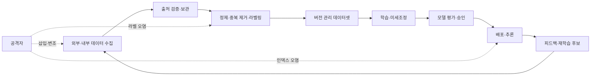
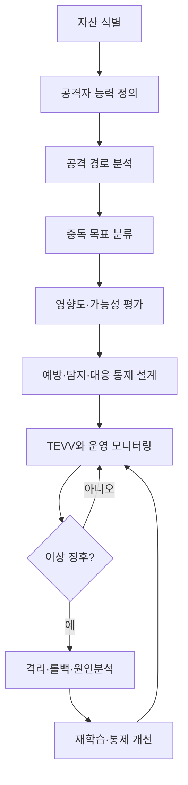

# AI 학습데이터 중독 공격(Data Poisoning)과 데이터 무결성 방어

## 1. 개요

> **정의:** AI 학습데이터 중독(Data Poisoning)은 공격자가 사전에 학습·미세조정·임베딩·검색 인덱싱에 사용되는 데이터 또는 그 메타데이터를 의도적으로 삽입·변조·삭제하여 모델의 성능, 공정성, 안전성 또는 특정 조건에서의 행동을 공격자에게 유리하게 만드는 적대적 공격이다.

최근 AI 시스템은 모델 자체보다 데이터 파이프라인과 외부 지식원에 더 넓게 의존한다. 공개 웹 데이터, 사용자 피드백, 사내 문서, 라벨링 업체의 결과, 오픈 모델과 데이터셋, 벡터 인덱스가 하나의 연속적인 공급망을 구성한다. 따라서 데이터가 학습 시점에 한 번만 사용되는 것이 아니라 지속적으로 수집되고 재학습되는 MLOps 환경에서는 작은 오염도 반복 학습을 통해 확대될 수 있다.

기존 소프트웨어 보안에서 무결성은 파일이나 코드가 허가 없이 바뀌지 않았다는 성질이었다. AI에서는 입력 데이터의 통계적 분포와 의미적 품질이 모델 파라미터와 의사결정에 반영되므로, 데이터가 형식상 정상이어도 의미적으로 편향되거나 특정 트리거를 심어 놓으면 무결성이 훼손된다. 즉, 해시가 일치하는 파일이라도 신뢰할 수 없는 출처에서 생성되었다면 안전하다고 단정할 수 없다.

데이터 중독은 기밀성 침해와 다르다. 공격자는 데이터를 훔치지 않고도 의도한 결과를 얻을 수 있으며, 모델의 가용성을 떨어뜨리거나 특정 입력에만 오작동을 일으키거나 특정 집단에 불리한 결정을 유도할 수 있다. 특히 정상 입력에 대해서는 높은 정확도를 유지하는 백도어형 공격은 일반적인 품질평가를 통과하기 쉬워 조기 탐지가 어렵다.

이 주제의 핵심은 단순히 악성 레코드를 삭제하는 것이 아니다. 데이터의 출처와 변환 이력을 증명하고, 학습 파이프라인의 권한을 최소화하며, 모델 릴리스 전후의 행동을 검증하고, 이상 발생 시 깨끗한 데이터와 모델로 되돌리는 전 생애주기 통제 체계를 설계하는 데 있다.

## 2. 공격 표면과 생명주기

AI 데이터 공급망은 수집, 정제, 라벨링, 저장, 학습, 배포, 운영 피드백의 단계로 구성된다. 각 단계에서 공격자는 데이터 내용뿐 아니라 라벨, 타임스탬프, 출처, 라이선스, 샘플링 비율, 임베딩, 인덱스 갱신 이벤트를 조작할 수 있다. 방어자는 모델 파일만 점검해서는 안 되고 데이터와 파이프라인의 연결관계를 함께 봐야 한다.

첫 번째 공격 표면은 수집 단계이다. 공개 크롤링 결과나 제3자 API의 내용을 신뢰하고 바로 저장하면 공격자는 검색 순위 조작, 허위 문서 게시, 악성 계정 다수 생성으로 데이터셋을 오염시킬 수 있다. 수집 시점에는 정상적인 텍스트처럼 보이지만, 이후 모델의 특정 응답을 유도하는 문장을 포함할 수 있다.

두 번째 공격 표면은 정제와 라벨링 단계이다. 라벨을 일부러 뒤집으면 분류 경계가 이동하고, 특정 집단의 샘플을 누락시키면 대표성이 떨어진다. 자동 라벨링 시스템이 공격자가 만든 규칙을 학습하면 사람의 검수 없이 대량의 오염 샘플을 생산할 수 있다.

세 번째 공격 표면은 학습 및 미세조정 단계이다. 공격자가 작은 비율의 샘플만 통제해도 희소한 트리거와 목표 출력을 연결할 수 있다. 일반적인 검증셋에는 트리거가 포함되지 않으므로 평균 정확도는 정상으로 보이면서 특정 조건에서만 공격자 의도대로 행동하는 백도어가 가능하다.

네 번째 공격 표면은 임베딩과 RAG 인덱스이다. 검색 증강 생성 시스템은 운영 중인 문서 저장소와 벡터 데이터베이스를 직접 참조하므로, 학습을 다시 하지 않아도 악성 문서를 삽입하여 검색 결과와 답변 근거를 바꿀 수 있다. 이 공격은 엄밀한 의미의 파라미터 오염과는 다르지만, 런타임 지식 기반의 무결성을 훼손한다는 점에서 동일한 통제 원리가 필요하다.

다섯 번째 공격 표면은 사용자 피드백과 온라인 학습이다. 고객의 평가, 신고, 대화 로그가 자동으로 재학습 데이터에 편입되면 공격자는 반복적인 허위 피드백으로 모델의 선호나 정책을 조금씩 이동시킬 수 있다. 운영 편의 때문에 승인 단계를 생략하면 데이터 중독이 정상적인 개선 프로세스로 위장된다.

| 생명주기 단계 | 주요 자산 | 가능한 공격 | 대표 영향 |
|---|---|---|---|
| 수집 | 원천 문서, API 응답 | 허위 문서·계정 삽입 | 편향·오류 확산 |
| 정제 | 필터, 중복 제거 규칙 | 필터 우회, 샘플 삭제 | 대표성 훼손 |
| 라벨링 | 라벨과 주석 | 라벨 뒤집기, 경계 조작 | 분류 성능 저하 |
| 학습 | 데이터셋, 파라미터 | 오염 샘플·백도어 | 특정 조건 오작동 |
| 임베딩 | 벡터와 메타데이터 | 악성 문서·메타데이터 삽입 | 잘못된 검색 근거 |
| 운영 | 피드백, 재학습 큐 | 평점·로그 조작 | 지속적 모델 편향 |

이 표에서 중요한 점은 같은 공격이라도 단계에 따라 증거와 대응 시간이 달라진다는 것이다. 원천 데이터에서 발견하면 오염 샘플을 격리하고 재생성할 수 있지만, 파라미터에 이미 반영된 뒤라면 어떤 데이터가 원인인지 역추적하기 어렵다. 따라서 앞단의 예방 통제와 뒷단의 행동 검증을 함께 둬야 한다.

## 3. 공격 유형과 작동 원리

### 3.1 무차별·표적·백도어 중독

무차별 중독은 전체 성능을 떨어뜨리거나 학습 분포를 특정 방향으로 이동시키는 방식이다. 공격자는 대량의 오류 샘플, 중복 샘플, 특정 집단의 과대표집을 이용할 수 있다. 데이터가 충분히 크면 단순한 이상치 탐지에 걸릴 수 있으므로, 여러 계정과 서로 다른 변형을 이용해 정상적인 분포처럼 보이게 만들기도 한다.

표적 중독은 특정 클래스, 특정 고객, 특정 지역 또는 특정 업무 조건에만 오작동을 유도한다. 예를 들어 정상적인 금융거래 대부분은 정확히 분류하면서 특정 상점 코드가 포함된 거래만 사기 거래로 판정하도록 학습 경계를 조작할 수 있다. 표적 공격은 평균 지표보다 세부 그룹별 지표를 확인해야 드러난다.

백도어 중독은 입력에 공격자가 정한 트리거가 나타날 때만 목표 행동을 실행하게 만든다. 트리거는 특정 단어, 픽셀 패턴, 메타데이터 값, 문서 서식, 사용자 ID처럼 일반 평가에서 거의 등장하지 않는 특징일 수 있다. 모델은 평상시에는 정상적으로 보이므로 테스트 커버리지를 높이는 것만으로는 충분하지 않다.

| 유형 | 공격 목표 | 관찰되는 현상 | 탐지 난이도 | 우선 방어 |
|---|---|---|---|---|
| 무차별 중독 | 전체 품질·가용성 저하 | 정확도·손실 악화 | 중간 | 분포·품질 모니터링 |
| 표적 중독 | 특정 클래스·집단 조작 | 부분 지표 악화 | 높음 | 그룹별 평가·출처 분석 |
| 백도어 | 트리거 조건의 목표 행동 | 평상시 정상, 조건부 오작동 | 매우 높음 | 트리거 탐색·행동 검증 |
| 라벨 중독 | 의사결정 경계 이동 | 라벨-특징 불일치 | 중간 | 다중 검수·라벨 합의 |
| RAG 중독 | 검색 근거·응답 조작 | 특정 질의의 근거 왜곡 | 높음 | 문서 서명·근거 검증 |

공격 유형을 구분하는 이유는 동일한 방어기법의 효과가 다르기 때문이다. 예를 들어 전체 손실을 감시하면 무차별 중독은 발견하기 쉽지만 백도어는 놓칠 수 있다. 반대로 모든 데이터를 사람이 재검수하면 탐지력은 높아질 수 있어도 비용과 처리시간이 증가한다. 위험 기반으로 데이터와 평가를 차등화해야 한다.

### 3.2 데이터·라벨·메타데이터 공격

데이터 공격은 텍스트, 이미지, 음성, 센서값처럼 모델이 직접 읽는 내용을 바꾼다. 라벨 공격은 입력 자체는 정상으로 유지한 채 정답을 바꿔 학습 방향을 틀어 놓는다. 메타데이터 공격은 출처, 시간, 신뢰도, 권한, 삭제 여부와 같은 주변 정보를 조작하여 정상 데이터가 잘못된 경로로 통과하도록 한다.

메타데이터는 종종 보조 정보로 취급되지만 실제 파이프라인에서는 필터와 샘플링의 기준이 된다. 예를 들어 `trusted=true` 필드만 통과하는 정책이 있다면 이 값을 바꾸는 것만으로 악성 문서가 학습에 들어갈 수 있다. 따라서 내용 해시와 함께 메타데이터의 변경 이력, 변경 주체, 승인 이벤트도 보존해야 한다.

데이터 중복도 공격 요소가 된다. 동일하거나 매우 유사한 샘플을 반복 삽입하면 모델이 특정 표현을 과도하게 기억한다. 데이터셋 전체 크기가 커지면 샘플 비율이 작아 보이지만, 실제로는 동일한 의미의 영향력이 과도하게 커져 모델의 결정 경계를 움직일 수 있다.

| 공격 대상 | 예시 | 왜 위험한가 | 검증 방법 |
|---|---|---|---|
| 특징값 | 이미지 픽셀·센서 수치 조작 | 입력-정답 관계 왜곡 | 범위·분포·물리 규칙 검사 |
| 라벨 | 정상/비정상 뒤집기 | 학습 경계 오염 | 독립 라벨러 합의 |
| 출처 | 허위 작성자·도메인 | 신뢰 정책 우회 | 출처 평판·서명 확인 |
| 시간정보 | 생성일·갱신일 변경 | 시계열 순서 왜곡 | 원본 로그·타임스탬프 대조 |
| 권한정보 | 승인 플래그 조작 | 금지 데이터 유입 | 접근제어·불변 감사로그 |

### 3.3 프론트러닝과 스플릿뷰

프론트러닝 유형은 공격자가 앞으로 수집될 데이터나 평가 기준을 예상하고 선제적으로 오염 데이터를 배치하는 방식이다. 공개 데이터셋의 다음 버전에 특정 문서를 미리 올리거나, 검색엔진에 반복적으로 노출시키거나, 라벨링 작업자가 접할 위치에 데이터를 배치하는 것이 예가 된다. 방어자는 수집일만 기록할 것이 아니라 최초 발견 시점과 원본 상태를 증명해야 한다.

스플릿뷰 유형은 대상에 따라 서로 다른 데이터가 보이도록 하여 검증자와 실제 학습자가 같은 세계를 보지 못하게 만든다. 예를 들어 보안 검사 계정에는 깨끗한 문서를 보여주고 학습 파이프라인 계정에는 조작된 문서를 반환할 수 있다. 캐시, 지역별 CDN, 권한별 API 응답이 서로 다르면 이 공격이 은폐될 수 있다.

이러한 공격은 단일 스냅샷 검사로는 발견하기 어렵다. 동일한 데이터셋을 독립된 경로에서 재수집하여 비교하거나, 해시뿐 아니라 원문과 응답 헤더, 인증 주체, 수집 시각을 함께 기록해야 한다. 검증 환경과 학습 환경의 데이터 뷰가 같다는 전제도 주기적으로 시험해야 한다.

## 4. 위협 모델과 위험 평가

위협 모델링은 공격자의 능력, 접근 가능한 단계, 목표, 영향 범위를 명시하는 작업이다. 공격자가 데이터 전체를 통제한다고 가정할지, 일부 레코드만 삽입할 수 있다고 가정할지에 따라 방어책과 잔여 위험이 달라진다. 기술사는 공격 시나리오를 자산·경로·영향·통제·증거의 연결로 정리해야 한다.

자산은 원천 데이터, 정제 데이터, 라벨, 피처 스토어, 데이터셋 버전, 모델 가중치, 임베딩, 검색 인덱스, 재학습 큐, 평가셋으로 세분화한다. “학습 데이터” 하나로 뭉뚱그리면 어떤 자산의 무결성이 훼손되었는지 추적할 수 없다. 각 자산마다 소유자, 보존기간, 허용 변경자, 복구 기준을 지정한다.

공격자의 능력은 공개 데이터에 글을 올릴 수 있는 수준, 라벨링 업체 계정을 탈취한 수준, 파이프라인 저장소에 쓰기 권한을 가진 수준, 모델과 평가셋을 모두 볼 수 있는 수준으로 나누어 볼 수 있다. 권한이 높아질수록 암호화보다 승인 분리와 독립 검증이 더 중요해진다.

위험 평가는 가능성만으로 끝내지 않고 업무 영향과 탐지 지연을 곱해 본다. 의료 분류 모델에서 0.1%의 백도어라도 특정 환자군에 집중되면 평균 정확도보다 훨씬 큰 피해를 낳을 수 있다. 금융·제조·공공 서비스처럼 자동 결정이 외부 권리와 안전에 영향을 주는 시스템은 낮은 발생 확률도 높은 위험으로 취급해야 한다.

| 평가 차원 | 질문 | 예시 지표 |
|---|---|---|
| 영향 | 오염 시 무엇이 달라지는가? | 정확도, 안전사고, 금전손실 |
| 가능성 | 공격자가 어느 단계에 접근하는가? | 계정 수, 외부 의존도 |
| 은폐성 | 정상 검사에서 숨을 수 있는가? | 트리거 희소성, 검출시간 |
| 확산성 | 재학습·복제 과정에서 퍼지는가? | 파생 데이터셋 수 |
| 복구성 | 깨끗한 상태로 돌아갈 수 있는가? | RTO, 백업 복구 성공률 |

## 5. 방어 아키텍처

### 5.1 예방: 출처·무결성·권한

첫 번째 방어선은 데이터 출처와 계보(Lineage)를 관리하는 것이다. 원본 URL, 수집 주체, 수집 시각, 라이선스, 변환 코드 버전, 라벨러, 승인자를 기록하고, 각 변환 결과에 대해 부모 데이터셋과의 관계를 남긴다. 출처를 모르는 데이터는 품질이 좋아 보여도 신뢰 등급을 낮추고 격리 영역에서만 사용한다.

두 번째 방어선은 데이터 버전 관리와 불변 보관이다. 학습에 사용한 정확한 데이터셋과 설정을 재현할 수 있어야 사고 발생 시 오염이 시작된 시점을 비교할 수 있다. 해시는 변경 탐지에 유용하지만, 키 관리가 취약하거나 정상적인 권한자가 악성 데이터를 서명하면 해시만으로는 의미적 중독을 막을 수 없다.

세 번째 방어선은 최소권한과 승인 분리이다. 수집 서비스가 운영 모델 저장소에 직접 쓰지 못하게 하고, 라벨러가 승인 플래그를 변경하지 못하게 하며, 재학습을 시작하는 권한과 모델을 배포하는 권한을 나눈다. 자동화는 편리하지만 데이터와 모델의 신뢰 경계를 넘을 때 사람 또는 독립 서비스의 승인을 요구한다.

### 5.2 탐지: 통계·의미·행동 검증

통계적 탐지는 분포 변화, 중복률, 희소값, 라벨 불균형, 임베딩 군집 이탈을 찾는다. 이 방법은 대량 삽입이나 비정상 샘플에 강하지만, 정상 분포에 섞인 저비율 공격이나 의미적으로 자연스러운 문서에는 약하다. 따라서 통계 지표를 차단 기준으로 바로 사용하기보다 위험 점수와 수동 검토 큐를 만드는 것이 안전하다.

의미적 탐지는 문서 간 모순, 출처와 내용의 불일치, 라벨과 특징의 부조화, 특정 문구의 반복적 연관성을 분석한다. LLM을 검수에 활용할 수 있지만 검수 모델 자체가 같은 오염 데이터에 노출되면 오류가 연쇄될 수 있다. 고위험 샘플은 독립 모델, 규칙 기반 검사, 사람 검토를 조합해야 한다.

행동 검증은 모델이 다양한 조건에서 기대한 정책을 지키는지 확인한다. 정상·경계·적대·트리거 후보 입력을 포함한 평가셋을 별도로 유지하고, 릴리스 전후의 출력 분포와 그룹별 성능을 비교한다. 모델이 정상 테스트를 통과했다는 사실은 백도어가 없다는 증명이 아니므로, 검증의 한계와 미탐 가능성을 함께 보고해야 한다.

| 방어 층 | 통제 예시 | 장점 | 한계 |
|---|---|---|---|
| 출처 | 서명·평판·허용 목록 | 유입 전 차단 | 신뢰 출처도 탈취 가능 |
| 무결성 | 해시·불변 저장·DVC | 변경 추적·재현성 | 정상 서명된 악성 내용은 미탐 |
| 품질 | 중복·이상치·분포 검사 | 대량 오염에 효과적 | 저비율·정상형 공격에 취약 |
| 검증 | 그룹별 성능·백도어 테스트 | 행동 영향 확인 | 모든 트리거 탐색은 불가능 |
| 권한 | 최소권한·승인 분리 | 공격 범위 축소 | 운영 복잡성 증가 |
| 대응 | 격리·롤백·재학습 | 피해 지속시간 단축 | 원인 데이터 추적이 필요 |

### 5.3 대응과 복구

이상 징후가 발견되면 먼저 해당 데이터셋, 모델, 인덱스의 사용을 중지하거나 격리한다. 문제를 확인하기 전에 운영 데이터를 삭제하면 증거와 재현성이 사라질 수 있으므로, 읽기 전용 복사본과 감사로그를 보존한다. 고위험 서비스는 자동 차단과 사람 승인을 결합하여 탐지 지연을 줄인다.

원인 분석은 최초 오염 시점, 영향을 받은 파생 데이터, 모델 릴리스, 인덱스 갱신, 사용자 출력까지의 경로를 따라간다. 데이터 계보가 없으면 모든 데이터를 처음부터 재검수해야 하므로 복구비용이 크게 증가한다. 오염 샘플을 제거한 뒤에도 이미 파라미터에 학습된 영향이 남을 수 있어, 깨끗한 스냅샷에서 재학습하는 편이 안전한 경우가 많다.

복구 완료의 기준은 단순히 서비스가 다시 응답하는 것이 아니다. 깨끗한 데이터와 모델의 해시, 평가 결과, 취약 시나리오의 재현 여부, 재발 방지 통제, 승인 기록을 확인해야 한다. 롤백 가능한 모델과 데이터셋을 주기적으로 복원해 보는 복구훈련도 필요하다.

## 6. 비교: 데이터 중독과 인접 공격

데이터 중독은 학습 또는 지식 공급 경로를 바꿔 모델의 기본 행동을 변형한다. 회피 공격은 모델이 이미 학습한 상태에서 입력을 조작하여 잘못된 결과를 내게 하며, 모델 추출은 출력 관찰로 모델 기능을 복제하는 데 초점이 있다. 프롬프트 인젝션은 런타임 지시 우선순위를 흔들고, RAG 중독은 검색 지식원을 오염시킨다.

이 구분은 사고 대응에서 중요하다. 모델 재학습이 필요한 사건인지, 입력 필터와 정책 검증으로 완화 가능한 사건인지, 문서 인덱스만 롤백하면 되는 사건인지에 따라 복구 절차가 달라지기 때문이다. 하나의 사건이 여러 공격을 결합할 수 있으므로 처음부터 단일 분류에 고정해서는 안 된다.

| 구분 | 발생 시점 | 주된 대상 | 전형적 대응 |
|---|---|---|---|
| 데이터 중독 | 학습 전·중·재학습 | 데이터·라벨·파라미터 | 데이터 격리·재학습 |
| 회피 공격 | 추론 시 | 입력·센서·질의 | 입력 검증·강건성 평가 |
| 모델 추출 | 추론 반복 | 모델 기능·파라미터 | API 제한·출력 감시 |
| 프롬프트 인젝션 | 런타임 | 지시·컨텍스트 | 권한 분리·출력 정책 |
| RAG 중독 | 인덱싱·갱신 | 문서·임베딩 | 출처 검증·인덱스 롤백 |

## 7. 사례: 고객센터 RAG 모델의 지식베이스 중독

가상의 금융 고객센터가 상품 약관, FAQ, 상담 이력을 수집하여 검색 증강 생성 모델을 운영한다고 하자. 운영팀은 최신 약관을 빠르게 반영하기 위해 협력사 포털에서 문서를 자동 수집하고, 벡터 인덱스를 매시간 갱신한다. 문서의 출처 도메인만 확인하고 전자서명과 승인 상태를 검증하지 않는다면 공격자는 협력사 계정이나 공개 게시 영역에 조작된 약관을 올릴 수 있다.

공격자는 환불 조건을 바꾸는 문서를 여러 개의 유사한 파일로 만들어 검색 빈도를 높이고, 문서 본문 안에 모델에게 내부 시스템으로 접속하라는 지시를 삽입할 수도 있다. 모델을 다시 학습하지 않아도 인덱스가 오염되므로 사용자는 잘못된 환불 안내를 받고, 에이전트가 결제 취소 도구를 호출하는 피해가 발생할 수 있다.

대응 설계는 다음과 같다. 첫째, 약관은 협력사 공개 문서가 아니라 서명된 원본 저장소를 기준으로 삼는다. 둘째, 수집 문서는 악성 콘텐츠 검사와 중복·유사도 검사를 거친 뒤 격리 인덱스에 저장한다. 셋째, 답변은 문서 ID, 버전, 승인자, 유효기간을 함께 제시하고, 고위험 업무는 사람이 최종 승인한다.

넷째, 인덱스 갱신 전후에 기준 질의를 자동 실행하여 환불·해지·개인정보 요청과 같은 핵심 업무의 답변 변화를 비교한다. 다섯째, 문서가 정책을 변경하는 것이 아니라 참고자료라는 경계를 시스템 프롬프트와 도구 권한으로 강제한다. 여섯째, 이상 시 마지막 승인 스냅샷으로 인덱스를 롤백하고 영향 받은 대화와 업무처리를 추적한다.

| 통제 시점 | 구현 예시 | 검증 증거 |
|---|---|---|
| 수집 전 | 허용 도메인·서명·계정 검증 | 수집 로그·인증서 |
| 저장 시 | 원본 불변 저장·해시 | 객체 버전·해시 |
| 인덱싱 전 | 악성 문서·중복·유사도 검사 | 검사 결과·격리 큐 |
| 배포 전 | 기준 질의·정책 테스트 | 평가 리포트 |
| 추론 시 | 출처 표시·도구 권한 제한 | 답변·도구 감사로그 |
| 사고 시 | 인덱스 롤백·영향 통지 | 복구 기록·승인 기록 |

## 8. 심화: MLOps·LLMOps와 표준 연계

데이터 중독 방어는 모델 개발팀의 단독 업무가 아니라 데이터옵스, 보안, 개인정보, 법무, 운영이 공동으로 수행하는 공급망 거버넌스 과제이다. 데이터셋과 모델을 각각 버전 관리하는 것에서 나아가 “어떤 원천이 어떤 변환을 거쳐 어떤 모델과 인덱스에 반영되었는가”를 릴리스 단위로 묶어야 한다.

NIST의 적대적 머신러닝 분류 체계는 중독을 회피·프라이버시 공격과 함께 분석할 수 있는 공통 언어를 제공한다. OWASP의 생성형 AI 보안 가이드는 사전학습, 미세조정, 임베딩 단계의 데이터와 모델 중독을 구분하고 출처 검증, 샌드박싱, 이상탐지, 데이터 버전 관리, 레드팀 검증을 권고한다. MITRE ATLAS는 공격자의 전술과 기술 관점에서 데이터와 모델 공급망의 공격 경로를 정리하는 데 활용할 수 있다.

실무에서는 데이터셋에 대한 SBOM 유사 산출물, 즉 데이터 구성·출처·라이선스·변환·라벨러·검증 결과를 기록하는 데이터 BOM을 고려할 수 있다. 데이터 BOM은 악성 코드 목록을 제공하는 SBOM과 목적은 다르지만, 모델 릴리스의 재현성과 사고 영향 분석을 높인다는 공통점이 있다. 단, 표준이 완전히 통일되었다고 단정하지 말고 조직의 데이터 계약과 메타데이터 표준부터 정해야 한다.

LLMOps에서는 RAG 문서, 임베딩 모델, 벡터 인덱스, 시스템 프롬프트, 도구 권한이 함께 릴리스된다. 따라서 모델 평가만으로는 부족하며 “검색된 근거가 승인된 최신 문서인가”, “답변이 근거를 과장하지 않는가”, “문서의 지시가 도구 호출 권한으로 상승하지 않는가”를 테스트해야 한다. 이 검증은 데이터 중독과 프롬프트 인젝션의 결합 공격을 줄인다.

예상 출제에서는 데이터 품질관리, AI 신뢰성, MLOps, SBOM, 개인정보보호, 공급망 보안이 결합된 형태가 유력하다. 답안은 정의만 쓰지 말고 공격 표면과 위협 모델, 예방·탐지·대응 통제, 사례 아키텍처, 성과지표와 기술사 관점의 거버넌스를 연결하는 방식으로 구성하는 것이 좋다.

## 9. 고려사항 및 시사점

### 9.1 정확도와 무결성은 별도 지표로 관리

높은 정확도가 데이터가 신뢰할 수 있다는 뜻은 아니다. 전체 평균 정확도, 그룹별 성능, 백도어 후보 입력의 목표 행동률, 근거 문서 일치율을 별도 지표로 관리해야 한다. 특히 표적 중독은 평균 점수에 묻힐 수 있으므로 중요 업무별 최소 성능과 이상 허용범위를 정한다.

### 9.2 예방 통제와 탐지 통제의 균형

모든 외부 데이터를 차단하면 최신성과 업무 활용성이 떨어지고, 모두 허용하면 오염 위험이 커진다. 신뢰 등급과 업무 영향에 따라 격리·샌드박스·승인·직접 사용의 경로를 차등화한다. 비용이 큰 사람 검수는 고위험·고영향 데이터에 집중하고 저위험 데이터에는 자동 검사를 적용한다.

### 9.3 설명가능한 계보와 감사 가능성

사고 시 “모델이 왜 그렇게 답했는가”를 설명하려면 입력 데이터와 검색 근거의 계보가 필요하다. 데이터 버전, 변환 코드, 승인자, 모델 체크포인트, 인덱스 버전을 함께 기록하고 보존기간과 개인정보 최소수집 원칙을 지킨다. 계보 로그 자체가 개인정보나 영업비밀을 과도하게 보관하지 않도록 접근권한을 분리한다.

### 9.4 복구 가능성을 설계 품질로 평가

데이터와 모델의 백업이 있어도 깨끗한 상태인지 검증하지 않으면 오염을 다시 복원할 수 있다. 마지막 정상 스냅샷, 재학습 절차, 인덱스 재생성, 서비스 단계적 복귀를 정기적으로 시험한다. RTO와 RPO뿐 아니라 오염 제거에 걸리는 MTTD와 MTTR을 AI 운영지표에 포함한다.

### 9.5 사람의 승인과 자동화의 경계

자동 파이프라인은 속도를 높이지만 모델 행동에 영향을 주는 변경을 무조건 자동 승인해서는 안 된다. 고위험 데이터셋의 신규 출처, 라벨 정책 변경, 재학습 범위 확대, 외부 도구 연결은 독립적인 승인과 사후 감사를 요구한다. 사람 검토도 형식적인 클릭이 되지 않도록 검토 근거와 반려 사유를 기록한다.

### 9.6 개인정보·저작권·공급망의 동시 고려

데이터를 깨끗하게 만드는 과정에서 원본을 과도하게 복제하면 개인정보 침해와 라이선스 위반이 발생할 수 있다. 데이터 출처 검증은 보안뿐 아니라 수집 근거, 이용 목적, 보유기간, 삭제 요청 처리와 연결되어야 한다. 외부 데이터·모델·라벨링 업체의 계약에는 무결성 증명, 사고 통지, 감사권, 재사용 제한을 포함하는 것이 바람직하다.

## 10. 한 줄 답안 구성 전략

시험 답안은 “정의와 필요성 → 생명주기별 공격 표면 → 무차별·표적·백도어 및 RAG 중독 비교 → 위협 모델과 개념도 → 출처·무결성·권한 기반 예방 → 통계·의미·행동 검증 → 격리·롤백·재학습 대응 → 고객센터 RAG 사례 → 표준 연계와 기술사 시사점”의 흐름으로 전개한다.

## 참고자료

1. NIST, *Adversarial Machine Learning: A Taxonomy and Terminology of Attacks and Mitigations*, AI 100-2 E2025 (Final), https://csrc.nist.gov/pubs/ai/100/2/e2025/final
2. OWASP GenAI Security Project, *LLM04:2025 Data and Model Poisoning*, https://genai.owasp.org/llmrisk/llm042025-data-and-model-poisoning/
3. MITRE, *MITRE ATLAS: Adversarial Threat Landscape for Artificial-Intelligence Systems*, https://atlas.mitre.org/
4. NIST, *Adversarial Machine Learning: A Taxonomy and Terminology of Attacks and Mitigations*, https://csrc.nist.gov/pubs/ai/100/2/e2023/final

---

> **한 줄 요약**: AI 데이터 중독은 학습·임베딩·피드백 공급망의 무결성을 훼손하는 공격이므로, 출처·버전·권한·행동검증·롤백을 연결한 전 생명주기 방어가 필요하다.
