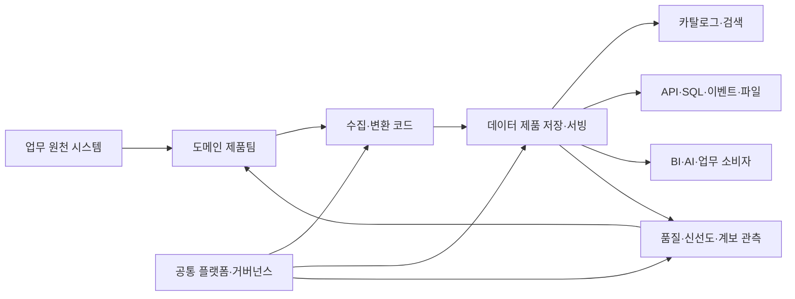
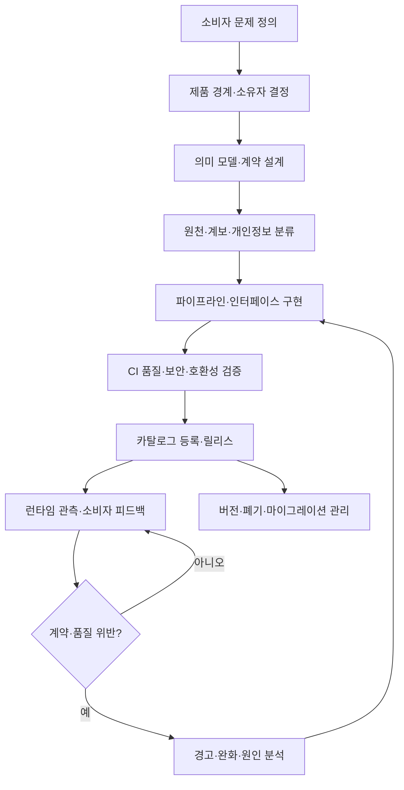

# 데이터 제품(Data Product) 설계와 운영

## 1. 개요

> **정의**: 데이터 제품(Data Product)은 특정 소비자와 업무 목적을 위해 데이터, 메타데이터, 의미 모델, 처리 코드, 접근 인터페이스, 품질·보안·운영 책임을 하나의 배포·관리 단위로 묶어 지속적으로 가치를 제공하는 데이터 자산이다.

데이터 제품은 단순히 잘 정리된 테이블이나 데이터베이스의 별칭이 아니다.
소비자가 의미를 해석할 수 있는 설명, 안전하게 사용할 수 있는 접근 방법, 품질을 확인할 수 있는 지표, 변경을 예측할 수 있는 버전 정책, 문제가 생겼을 때 연락할 소유자를 함께 제공한다.
따라서 데이터 제품은 데이터 자체와 데이터를 생산·검증·배포·관찰하는 주변 능력을 함께 포함하는 제품 단위로 이해해야 한다.

전통적인 중앙집중형 데이터웨어하우스에서는 중앙 데이터팀이 여러 업무 시스템의 데이터를 수집하고 소비자의 요청에 따라 테이블과 리포트를 만들어 주는 방식이 흔했다.
이 구조는 표준화와 통제를 확보하기 쉽지만 도메인 지식이 중앙팀에 모이고, 요청 대기열이 길어지며, 원천 시스템의 의미 변화가 분석 데이터에 늦게 반영되는 문제가 발생한다.
데이터 제품 접근은 주문·고객·결제·물류처럼 데이터를 가장 잘 이해하는 도메인 팀이 분석용 데이터를 제품으로 책임지고, 중앙 플랫폼팀은 공통 실행 기반과 가드레일을 제공하는 방식으로 이 병목을 줄인다.

데이터 제품은 데이터 메시(Data Mesh)의 핵심 구현 단위로 자주 논의되지만 두 개념을 동일시해서는 안 된다.
데이터 메시는 도메인 지향 소유권, 데이터를 제품으로 취급하는 사고방식, 셀프서비스 데이터 플랫폼, 연합형 계산 거버넌스라는 조직·아키텍처 원칙의 조합이다.
데이터 제품은 그 원칙을 소비 가능한 결과물로 구체화한 단위다.
중앙집중형 환경에서도 데이터 제품을 만들 수 있고, 데이터 메시를 도입하더라도 제품 기준이 없으면 도메인별 테이블만 늘어날 수 있다.

기술사 답안에서는 “데이터를 제품처럼 관리한다”는 구호를 반복하기보다 제품의 고객, 가치, 인터페이스, 품질 약속, 책임, 수명주기를 연결해서 설명해야 한다.
특히 데이터는 일반 소프트웨어와 달리 복사·조합이 쉽고 사용 맥락에 따라 의미가 달라지므로, 스키마 호환성만으로 제품 품질을 보장할 수 없다.
업무 정의와 시간 기준, 집계 규칙, 개인정보 처리 목적, 원천 추적성까지 함께 관리해야 신뢰 가능한 데이터 제품이 된다.

### 가. 등장 배경과 필요성

첫째, 데이터 소비자와 생산자의 거리가 멀어졌다.
마이크로서비스, SaaS, 멀티클라우드, 스트리밍 플랫폼을 사용하면 한 도메인의 운영 데이터가 여러 분석 파이프라인을 거쳐 다양한 소비자에게 전달된다.
생산 팀이 어떤 필드가 중요한지 알고 있어도 소비자는 그 의미를 추측하거나 별도 문서와 담당자를 찾아야 한다.
제품화는 발견, 이해, 접근, 사용, 피드백의 흐름을 하나의 책임으로 묶는다.

둘째, 데이터의 조용한 실패가 비즈니스 손실로 이어진다.
파이프라인 작업이 성공했더라도 전일 대비 매출이 비정상적으로 줄거나 고객 식별자가 중복되면 의사결정과 정산 결과가 틀릴 수 있다.
제품은 가용성뿐 아니라 완전성, 유효성, 신선도, 중복률, 분포 변화 같은 품질 목표를 명시하고 이를 지속적으로 측정해야 한다.

셋째, AI 활용이 확대되면서 학습·평가·추론에 적합한 데이터 공급이 경쟁력이 되었다.
모델 성능은 알고리즘만으로 결정되지 않고 라벨 정의, 시간 누수 방지, 데이터 계보, 편향 점검, 재현 가능한 추출 조건에 좌우된다.
재사용 가능한 학습 데이터셋이나 피처 집합도 소유자와 품질 기준을 가진 데이터 제품으로 운영할 수 있다.

### 나. 데이터셋·데이터 서비스와의 구분

데이터셋은 데이터의 묶음이라는 기술적 결과를 가리키며, 데이터 제품은 소비자 가치와 운영 책임을 포함하는 관리 개념이다.
예를 들어 `orders_daily` 테이블이 존재한다고 해서 자동으로 데이터 제품이 되는 것은 아니다.
정의된 매출 인식 규칙, 갱신 완료 시각, 품질 검증, 접근정책, 변경 알림, 지원 채널이 있어야 소비자가 업무에 안전하게 사용할 수 있다.

데이터 서비스는 API나 쿼리처럼 데이터를 제공하는 접점에 초점을 둔다.
반면 데이터 제품은 API를 사용할지 파일·테이블·이벤트·대시보드를 사용할지에 관계없이 결과의 의미와 품질을 책임진다.
즉 데이터 서비스는 데이터 제품의 인터페이스가 될 수 있지만 데이터 제품 전체와 동일하지는 않다.

| 구분 | 데이터셋 | 데이터 서비스 | 데이터 제품 |
|---|---|---|---|
| 중심 | 저장된 데이터 묶음 | 제공 인터페이스 | 소비자 가치와 전체 수명주기 |
| 구성 | 행·열·파일·이벤트 | API·쿼리·스트림 | 데이터·메타데이터·코드·인프라·정책 |
| 품질 약속 | 문서화되지 않을 수 있음 | 응답성 중심 | 정확성·신선도·가용성·의미·보안 |
| 책임 | 저장 관리자 중심 | 서비스 운영자 중심 | 도메인 제품팀의 종단 책임 |
| 변경 방식 | 임의 변경 위험 | API 버전 정책 | 계약·영향분석·공지·폐기 절차 |

## 2. 데이터 제품의 개념 모델과 구성요소

데이터 제품은 특정 도메인 안에서 독립적으로 이해 가능한 정보 개념을 제공해야 한다.
고객 도메인이 고객의 현재 상태와 동의 이력을 제공하고, 결제 도메인이 승인·취소·환불 사실을 제공하는 식으로 경계를 설정한다.
소비자는 데이터의 원천 시스템 구조가 아니라 제품의 업무 의미를 기준으로 접근해야 한다.

### 가. 논리적 구성요소

**데이터**는 배치 테이블, 변경 이벤트, 시계열, 문서, 그래프, 특성 벡터 등 여러 형태가 될 수 있다.
형식보다 중요한 것은 제품의 목적에 맞는 데이터가 선별되고, 시간·단위·키·결측 표현이 일관되게 정의되는가이다.
원천 복사본을 그대로 노출하는 것보다 소비자가 사용할 수 있는 안정적인 공개 모델과 원천 추적성을 함께 제공하는 편이 안전하다.

**메타데이터와 의미**는 제품의 사용 설명서이자 검색 색인이다.
필드 설명만 나열하지 말고 고객의 정의, 주문 확정 시점, 매출 인식 기준, 금액의 통화와 세금 포함 여부처럼 판단에 영향을 주는 업무 의미를 명시해야 한다.
기술 메타데이터에는 스키마, 파티션, 포맷, 위치, 소유자, 갱신주기, 계보, 품질지표를 포함한다.

**코드**는 수집·변환·검증·서비스·접근정책을 실행한다.
제품 코드는 버전 관리 저장소에서 관리하고, 스키마와 품질 규칙을 코드로 선언하여 배포 전에 자동 검증한다.
코드와 데이터의 버전을 함께 기록하면 동일한 결과를 재현하고 장애 원인을 추적하기 쉽다.

**인프라**는 저장소, 처리엔진, 카탈로그, 오케스트레이터, 인증·인가, 모니터링, 비용 추적을 포함한다.
도메인 팀이 모든 인프라를 독립적으로 구축한다는 뜻이 아니라, 셀프서비스 플랫폼이 표준 템플릿과 안전한 기본값을 제공하고 제품팀이 필요한 구성을 선택하게 한다는 뜻이다.

### 나. 참조 개념도

원천 시스템은 업무 처리를 위한 정합성을 우선하지만, 분석 소비자가 바로 사용하기에는 조인·코드값·변경 이력이 불편할 수 있다.
도메인 제품팀은 원천의 의미를 이해한 상태에서 분석용 표현을 만들고, 제품 인터페이스를 통해 소비자에게 공개한다.
공통 플랫폼은 배포·인증·카탈로그·관측 기능을 제공하여 도메인 팀이 매번 바닥부터 구축하지 않도록 한다.

품질 관측 결과는 중앙 대시보드에만 쌓여서는 안 된다.
신선도 저하나 계약 위반이 발견되면 제품 소유자에게 자동으로 전달되고, 심각도에 따라 소비자 경고·배포 차단·대체 데이터 제공이 이어져야 한다.
이 폐루프가 있어야 데이터 제품이 정적인 파일이 아니라 운영되는 제품이 된다.

### 다. 데이터 제품의 품질 특성

데이터 제품은 **발견 가능성**을 가져야 한다.
소비자는 제품 카탈로그에서 업무 용어, 도메인, 태그, 예시, 소유자, 상태로 제품을 찾고, 유사 제품과 중복 제품을 비교할 수 있어야 한다.
검색 결과에 기술 테이블명만 노출하면 제품화의 효과가 줄어드므로 비즈니스 용어와 기술 용어를 연결하는 용어집이 필요하다.

**주소 지정 가능성**은 제품을 찾은 뒤 안정적인 방법으로 접근할 수 있다는 뜻이다.
환경별 엔드포인트, 데이터 공유 영역, API 경로, 인증 방식, 사용 예시를 제공하고 권한이 없는 경우 접근 신청 절차를 안내한다.
접근 경로가 담당자의 개인 계정이나 임시 파일 링크에 의존하면 제품의 재현성과 운영성이 떨어진다.

**이해 가능성과 상호운용성**은 소비자가 별도 생산자에게 매번 질문하지 않고 사용할 수 있게 한다.
날짜·시간대·통화·코드값·식별자 규칙을 명시하고, 표준 포맷과 공통 도메인 모델을 활용한다.
다만 모든 도메인에 하나의 거대 스키마를 강제하면 변화 속도가 느려질 수 있으므로 의미의 핵심만 연합하고 세부 표현은 제품 계약으로 관리한다.

**신뢰성과 보안성**은 숫자 하나의 정확도보다 넓은 개념이다.
품질 측정 방법과 결과, 원천 계보, 알려진 제한사항, 개인정보 등급, 사용 목적, 보존기간을 확인할 수 있어야 한다.
신뢰성은 데이터가 항상 완벽하다는 약속이 아니라, 품질 상태와 불확실성을 소비자가 판단할 수 있게 하는 투명성까지 포함한다.

| 품질 특성 | 제품이 제공할 증거 | 대표 지표 |
|---|---|---|
| 발견 가능 | 카탈로그·용어집·예시 | 검색 성공률, 미등록 자산 비율 |
| 이해 가능 | 의미·단위·시간 기준·샘플 | 문의 건수, 문서 완성도 |
| 주소 지정 | 안정적 엔드포인트와 권한 절차 | 접근 성공률, 평균 승인시간 |
| 신뢰 가능 | 계보·품질 결과·제한사항 | 완전성, 유효성, 중복률 |
| 최신성 | 갱신주기와 지연 알림 | freshness 지연, 정시 배포율 |
| 상호운용 | 표준 타입·키·계약 | 호환 소비자 수, 변환 횟수 |
| 보안·준법 | 등급·정책·감사 로그 | 정책 위반, 과다권한, 감사 누락 |

## 3. 설계 절차와 아키텍처

### 가. 제품 발견과 경계 설정

첫 단계는 기술팀이 만들고 싶은 테이블을 정하는 것이 아니라, 해결하려는 소비자 문제를 정의하는 것이다.
“마케팅 분석용 모든 고객 데이터”처럼 범위가 넓은 요구보다 “캠페인 성과를 고객 동의 상태와 함께 주 단위로 평가”처럼 의사결정과 시간 범위를 명확히 해야 한다.
제품의 성공지표는 조회량만이 아니라 의사결정 시간 단축, 수작업 감소, 모델 성능, 정산 오류 감소처럼 소비자 가치로 설정한다.

경계는 도메인과 정보 개념을 기준으로 잡는다.
한 제품이 고객의 개인정보, 주문의 상태, 배송의 위치를 모두 소유하면 변경 책임과 개인정보 목적이 뒤섞인다.
반대로 지나치게 작은 제품을 만들면 소비자가 수십 개 제품을 조합해야 하므로 조합 비용이 커진다.
독립적인 가치와 응집도, 변경 이유, 접근권한, 운영 책임을 기준으로 적절한 크기를 정한다.

제품 소유자는 기술 담당자 한 명의 별칭이 아니라 제품의 의미와 품질 약속을 결정할 책임 주체다.
도메인 전문가, 데이터 엔지니어, 분석가, 보안·개인정보 담당자, 주요 소비자를 포함한 제품팀을 구성하고 의사결정 권한을 명시한다.
중앙 데이터팀은 정책과 플랫폼을 지원하되 도메인 지식이 필요한 품질 판단을 대신하지 않는다.

### 나. 데이터 계약과 공개 인터페이스

데이터 계약은 필드명과 타입뿐 아니라 의미, 필수성, 허용값, 시간 기준, 품질 규칙, 갱신주기, 접근정책, 변경·폐기 절차를 포함한다.
예를 들어 `order_status`의 `COMPLETED`가 결제 승인 시점인지 배송 완료 시점인지 다르면 같은 코드값도 서로 다른 결론을 만든다.
계약에는 정의와 예시 레코드, 금지된 사용, 알려진 지연과 결측 처리 방법도 기록한다.

인터페이스는 소비자 유형에 따라 선택한다.
대시보드와 정기 분석은 테이블·파일·SQL 뷰가 편리하고, 실시간 사기 탐지나 상태 전파는 이벤트 스트림이 적합하다.
모델 학습은 재현 가능한 스냅샷과 버전 고정이 중요하며, 외부 서비스는 인증된 API와 사용량 정책이 필요하다.
하나의 제품이 여러 인터페이스를 제공하더라도 의미와 품질 기준은 공통으로 유지해야 한다.

호환성 정책은 변경의 위험도에 따라 정한다.
새로운 선택적 필드를 추가하는 것은 많은 소비자에게 호환되지만, 기존 필드의 의미나 단위를 바꾸는 것은 논리적 파괴 변경이다.
파괴 변경은 새 버전 발행, 병행 제공, 소비자 확인, 마이그레이션 기간, 폐기 공지를 거쳐야 한다.
계약 검증은 CI에서 샘플·스키마·품질 규칙을 검사하고, 운영 중에는 실제 분포와 지연을 관찰한다.

### 다. 배포와 운영 흐름

설계 단계에서 개인정보와 민감정보를 분류하지 않으면 제품이 완성된 뒤 접근정책을 덧붙이기 어렵다.
수집 목적, 최소 수집, 가명·익명 처리, 보존기간, 국외 이전 여부, 소비자별 허용 목적을 제품 속성으로 기록한다.
민감한 원천을 모든 소비자에게 복제하기보다 필요한 집계·가명화 결과를 별도 제품으로 제공하는 것이 노출 면적과 오남용 가능성을 줄인다.

배포는 애플리케이션 릴리스와 같은 수준으로 다룬다.
코드와 계약 변경을 검토하고, 백필(backfill)이나 재처리 시 기존 결과가 바뀌는지 확인하며, 카탈로그와 변경 로그를 함께 갱신한다.
데이터 품질 검증은 배포 차단 조건과 경고 조건을 분리해야 한다.
일시적 지연을 무조건 차단하면 업무가 멈출 수 있고, 심각한 식별자 중복을 경고만 하면 잘못된 정산이 확산될 수 있다.

운영 중에는 데이터 관측성과 서비스 관측성을 함께 본다.
파이프라인 성공 여부, 처리시간, 비용, 저장량뿐 아니라 최신성, 행 수 변화, 값의 분포, NULL 비율, 참조 무결성, 소비자 조회 오류를 연결한다.
소비자 영향이 큰 제품은 장애 등급과 연락망, 대체 데이터, 재처리 목표시간, 사후 분석 절차를 선언한다.

## 4. 거버넌스와 조직 운영

### 가. 중앙집중형과 도메인 분산형의 비교

중앙집중형은 공통 표준과 통제에 강하다.
소규모 조직이나 규제가 강한 환경에서는 한 팀이 표준 모델과 품질 검사를 일관되게 운영하는 편이 효율적일 수 있다.
그러나 도메인 수와 소비자 수가 증가하면 중앙팀이 모든 요구를 처리하기 어렵고, 도메인 변화가 제품에 반영되는 시간이 길어진다.

도메인 분산형은 데이터와 업무 지식이 가까운 팀에서 지속적으로 관리되는 장점이 있다.
대신 팀마다 품질 기준·도구·용어가 달라지고, 비용과 책임이 분산되며, 전사적 통합 분석이 어려워질 수 있다.
따라서 분산은 무규칙을 뜻하지 않고, 전역 원칙과 자동화된 정책을 공유하는 연합형 모델이어야 한다.

| 판단축 | 중앙집중형 데이터팀 | 도메인 중심 데이터 제품 | 실무적 절충 |
|---|---|---|---|
| 의미 책임 | 중앙팀 | 도메인팀 | 도메인 정의·전사 용어집 연계 |
| 표준화 | 빠르고 일관됨 | 편차 가능 | 최소 표준과 자동 검사 |
| 변화 대응 | 요청 대기 가능 | 도메인 변화에 가까움 | 제품 로드맵과 플랫폼 지원 |
| 운영 부담 | 중앙팀 집중 | 도메인팀 분산 | 골든패스·공통 템플릿 |
| 통합 분석 | 쉬움 | 조합 계약 필요 | 공통 키·의미 모델·카탈로그 |
| 책임소재 | 비교적 명확 | 경계 협의 필요 | 제품 오너와 데이터 스튜어드 지정 |

### 나. 연합 거버넌스의 통제 지점

전사 거버넌스는 모든 제품의 내부 구현을 승인하는 방식보다 상호운용과 위험을 통제하는 방식이 적합하다.
필수 메타데이터, 개인정보 처리, 접근통제, 감사로그, 보존, 암호화, 공통 데이터 타입, 계약 형식은 전역 정책으로 정한다.
제품의 내부 파이프라인이나 저장 엔진까지 획일화하면 도메인 자율성과 혁신을 훼손할 수 있다.

정책은 사람이 읽는 문서로만 남기지 말고 플랫폼에서 실행한다.
카탈로그 미등록 제품의 배포를 막고, 개인정보 등급이 높은 필드에는 자동으로 마스킹 정책을 적용하며, 계약에 없는 파괴 변경은 CI에서 실패시킨다.
접근 승인·철회, 데이터 사용 목적, 쿼리 감사, 정책 예외의 만료일도 자동 기록해야 사후 감사가 가능하다.

제품 포트폴리오 관리는 중복과 방치를 줄인다.
사용량이 없는 제품, 최신성 약속을 지키지 못하는 제품, 같은 의미를 서로 다르게 제공하는 제품은 소비자와 협의하여 통합하거나 폐기한다.
제품 수를 늘리는 것이 성숙도의 증거가 아니라, 소비자가 신뢰하고 재사용하는 제품의 비율과 업무 가치가 성과의 핵심이다.

### 다. 지표와 책임 체계

품질지표는 제품의 계약과 연결되어야 한다.
완전성은 필수 필드의 채움 비율, 유효성은 허용 범위·참조 규칙 통과율, 최신성은 약속 시각 대비 지연, 유일성은 업무 키 중복률로 측정할 수 있다.
정확성은 정답 데이터나 업무 검증 표본이 필요하므로 단일 자동지표로 단정하지 않고 표본 검수·대조·소비자 피드백을 함께 사용한다.

SLA는 제품의 중요도에 맞게 현실적으로 정한다.
실시간 사기 탐지 제품은 초 단위 지연과 높은 가용성을 요구할 수 있지만, 월간 경영보고 제품은 영업일 아침까지의 정시 배포가 더 중요한 목표일 수 있다.
지표를 지나치게 많이 선언하면 측정·운영 비용만 커지므로 소비자 영향이 큰 핵심 지표부터 시작한다.

## 5. 비교·사례

### 가. 데이터 제품과 데이터 계약의 관계

데이터 계약은 데이터 제품의 인터페이스와 품질 약속을 정의하는 핵심 구성요소지만, 계약만으로 제품 전체가 완성되지는 않는다.
계약은 생산자와 소비자가 무엇을 기대할지 정하고, 제품은 그 약속을 실제 파이프라인·저장·서빙·관측·지원 체계로 이행한다.
반대로 제품 카탈로그가 있어도 계약이 없으면 설명과 품질이 사람의 기억에 의존한다.

주문 제품이 `order_id`, `customer_id`, `ordered_at`, `status`, `amount`를 제공한다고 하자.
계약은 `ordered_at`이 UTC ISO 8601 형식이고 `amount`가 부가세 포함 원화이며, `status=COMPLETED`는 배송 완료가 아니라 결제 승인 완료라는 사실을 명시할 수 있다.
또한 매일 06시까지 전일 데이터를 제공하고 `order_id` 유일성 99.99% 이상을 보장하며, 의미 변경은 30일 전에 공지한다고 선언할 수 있다.
이러한 계약이 있어야 마케팅·재무·물류 소비자가 같은 데이터를 서로 다르게 해석하는 위험이 줄어든다.

### 나. 제조·금융·공공 사례

제조 도메인은 설비 이벤트와 품질검사 결과를 결합한 예지정비 제품을 제공할 수 있다.
제품에는 설비 식별자, 센서 관측값, 정비 이력, 결측·보정 플래그, 잔여수명 추정값, 모델 버전이 포함된다.
분석팀은 원천 PLC 포맷을 알지 않고도 고장 위험을 조회할 수 있지만, 추정값을 확정 사실로 오해하지 않도록 신뢰구간과 모델 적용 범위를 함께 확인해야 한다.

금융의 결제 도메인은 승인·취소·환불 이벤트를 기반으로 일별 거래 제품과 실시간 이상거래 신호 제품을 분리할 수 있다.
일별 제품은 정산 재현성과 계정과목 매핑을 중시하고, 실시간 제품은 수 초 이내 전달과 중복 이벤트 제거를 중시한다.
같은 거래 원천을 쓰더라도 소비 목적이 다르면 하나의 거대 제품으로 묶기보다 계약과 운영 특성이 다른 제품으로 분리하는 편이 적절하다.

공공기관은 민원·복지·시설 데이터를 연계할 때 업무 목적과 개인정보 최소화를 우선해야 한다.
기관 간 원문 개인정보를 대량 공유하기보다 가명 식별자, 필요한 속성의 집계, 사용 목적별 접근 제품을 제공하고, 이용기관·조회 사유·보존기간을 감사 로그로 남긴다.
제품 카탈로그에는 데이터 개방 범위와 제한사항을 함께 표시하여 “검색 가능”과 “무조건 접근 가능”을 구분해야 한다.

### 다. 실패 사례와 개선 방향

첫 번째 실패는 제품 이름만 붙인 데이터 덤프다.
소유자·정의·품질지표·갱신 약속이 없으면 소비자는 결국 원천 담당자에게 문의하고 개인별 복사본을 만든다.
개선하려면 최소 제품 템플릿으로 목적, 소비자, 핵심 용어, 품질 기준, 지원 채널을 배포 전에 채우게 해야 한다.

두 번째 실패는 도메인 자율성을 도구 선택의 자유로 오해하는 것이다.
팀마다 시간대와 식별자 규칙이 달라지면 통합 분석이 불가능해진다.
전사 표준을 모든 내부 스키마에 강제하기보다 핵심 공통 의미, 계약 형식, 보안정책, 카탈로그 필수 항목을 연합 규칙으로 정하고 자동 검증한다.

세 번째 실패는 품질을 생산자만 측정하는 것이다.
생산 파이프라인이 성공해도 소비자의 조인 결과나 업무 분류에서 오류가 날 수 있다.
중요 제품은 생산 지표와 소비자 결과 검증을 함께 운영하고, 품질 이슈를 제품 백로그와 릴리스 계획에 반영해야 한다.

## 6. 심화: 데이터 제품과 AI·데이터 메시의 연계

데이터 제품은 AI 수명주기의 재현성과 책임성을 높이는 기반이 될 수 있다.
학습 데이터 제품은 원천 계보, 추출 시점, 라벨 규칙, 제외 조건, 개인정보 처리, 데이터 분할 방식, 품질 검증 결과를 버전과 함께 보존한다.
모델 제품은 입력 데이터 제품의 계약 버전과 모델 파일, 평가 세트, 편향·안전성 결과, 추론 인터페이스를 연결한다.
이렇게 하면 모델 성능 저하가 데이터 분포 변화 때문인지 모델 코드 변화 때문인지 분리해 조사할 수 있다.

검색증강생성 시스템에서는 문서 수집·청킹·임베딩·권한 필터가 포함된 지식 제품과 검색 결과 계약을 정의할 수 있다.
문서가 최신인지, 어떤 출처에서 왔는지, 사용자가 접근 가능한 문서만 반환되는지, 삭제 요청이 임베딩 저장소에도 반영되는지를 제품 품질과 보안 기준으로 관리해야 한다.
단순히 벡터 데이터베이스를 운영하는 것과 권한·계보·갱신·평가를 갖춘 검색 데이터 제품을 운영하는 것은 다르다.

데이터 제품의 비용도 제품 지표에 포함할 필요가 있다.
고해상도 원천을 모든 소비자에게 복제하면 저장·처리·송신 비용과 개인정보 노출 면적이 커진다.
사용량·가치·지연 요구를 분석하여 원천 보존, 집계 제품, 캐시, 스트림, 배치 제품을 조합하고, 소비자에게 비용과 품질의 트레이드오프를 공개한다.

향후에는 데이터 제품 카탈로그가 단순 자산 목록을 넘어 정책·계약·관측·사용량을 연결하는 제어면이 될 가능성이 크다.
그러나 자동화가 업무 의미를 대신 결정할 수는 없으므로, 자동 품질 판정의 한계와 사람의 승인 지점을 명확히 남겨야 한다.
AI가 생성한 스키마 설명이나 분류 결과도 원천 담당자의 검토와 변경 이력 없이는 확정된 거버넌스로 취급해서는 안 된다.

## 7. 고려사항 및 시사점

### 가. 제품 전략과 투자 우선순위

모든 데이터를 한 번에 제품화하지 말고 소비자 영향과 재사용성이 큰 데이터부터 선정한다.
핵심 고객·매출·안전·규제 데이터는 높은 품질과 강한 접근통제가 필요하고, 실험용 데이터는 더 가벼운 문서화로 시작할 수 있다.
제품 포트폴리오와 로드맵을 만들 때 구축 난이도뿐 아니라 실패 시 업무 손실과 소비자 수를 함께 평가해야 한다.

### 나. 품질과 의미의 동시 관리

스키마 검증만 통과했다고 데이터가 올바른 것은 아니다.
업무 정의, 시간대, 코드값, 집계 규칙, 원천 계보를 품질 기준에 포함하고, 의미 변경을 기술적 변경과 동일한 수준으로 관리한다.
소비자와 함께 대표 질의를 검증하고 실제 업무 결과와 대조하는 절차를 도입해야 한다.

### 다. 보안·개인정보와 사용성의 균형

과도한 개방은 개인정보 침해와 목적 외 이용으로 이어지고, 과도한 제한은 데이터 제품의 활용 가치를 떨어뜨린다.
최소권한, 목적 기반 접근, 필드·행 수준 통제, 가명화, 보존·파기, 감사 로그를 제품 계약과 플랫폼에 내장한다.
권한 신청과 철회가 빠르고 투명해야 사용자가 우회 복사본을 만들지 않는다.

### 라. 플랫폼 표준과 도메인 자율성

셀프서비스 플랫폼은 저장 엔진을 하나로 통일하는 사업이 아니라 제품팀이 안전한 기본값으로 빠르게 배포하게 하는 능력이다.
표준 템플릿, 계약 검사, 카탈로그 등록, 관측 대시보드, 비용 추적을 골든패스로 제공하되 도메인별 처리 방식의 차이를 수용한다.
플랫폼이 제품팀의 병목이 되지 않도록 개발자 경험과 예외 처리 절차를 함께 개선한다.

### 마. 변화·폐기·책임의 지속성

데이터 제품은 한 번 공개하고 끝나는 결과물이 아니라 사용량과 품질을 보며 진화하는 서비스다.
버전, 하위 호환 기간, 소비자 영향분석, 폐기 공지, 대체 제품, 재처리와 복구 목표를 명시한다.
제품 오너가 바뀌거나 조직이 개편되어도 카탈로그·코드·계약·운영 기록이 이어지도록 팀 단위 책임과 개인 의존성을 분리한다.

### 바. 기술사 관점의 출제·답안 전략

답안 서론에서는 데이터 제품의 정의와 데이터셋과의 차이를 제시하고, 본론에서는 구성요소·품질 특성·설계 절차·거버넌스를 개념도로 연결한다.
비교 문제에서는 중앙집중형과 도메인 분산형의 장단점만 나열하지 말고 조직 규모·규제·데이터 변경 빈도에 따른 선택 이유를 설명한다.
결론에서는 단계적 도입, 품질·보안 자동화, 소비자 가치 측정, 폐기까지 포함한 수명주기 관점을 강조하는 것이 기술사 관점의 시사점이 된다.

## 참고자료

- Martin Fowler, “Designing data products”, https://martinfowler.com/articles/designing-data-products.html
- Google Cloud, “Architecture and functions in a data mesh”, https://docs.cloud.google.com/architecture/data-mesh
- IBM, “What Is a Data Product?”, https://www.ibm.com/think/topics/data-product
- AWS, “What is a Data Mesh?”, https://aws.amazon.com/what-is/data-mesh/
- Martin Fowler, “Data Mesh Principles and Logical Architecture”, https://martinfowler.com/articles/data-mesh-principles.html

---

> **한 줄 요약**: 데이터 제품은 데이터셋을 넘어 의미·품질·보안·인터페이스·운영책임을 하나로 묶어 도메인이 지속적으로 신뢰 가능한 업무 가치를 제공하게 하는 제품 단위다.
