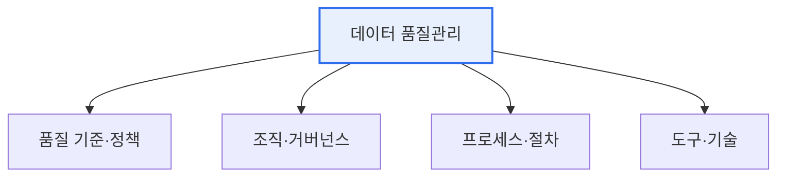

# 데이터 품질관리(Data Quality Management)

## 1. 개요

### 가. 정의
> 데이터의 **정확성·완전성·일관성·적시성 등 품질을 지속적으로 확보·관리**하는 체계적 활동. 데이터를 신뢰할 수 있는 의사결정·AI 자산으로 만드는 기반이다.

데이터 품질관리가 중요한 이유는 '**품질 나쁜 데이터는 잘못된 의사결정으로 직결**'되기 때문이다. 특히 AI·데이터 기반 경영이 확산되며, 데이터 품질은 분석·모델의 신뢰성을 좌우하는 핵심 요소가 되었다. 품질은 우연히 확보되지 않으며 아키텍처·프로세스·조직이 결합된 관리 체계로만 지속된다.

## 2. 데이터 품질관리 아키텍처 (가)

| 계층 | 구성 |
|---|---|
| **정책·기준** | 품질 기준·지표·표준 정의 |
| **조직·거버넌스** | 데이터 오너·스튜어드, 책임 체계 |
| **프로세스** | 프로파일링·정제·검증·모니터링 |
| **도구·기술** | 품질 진단·MDM·메타데이터 관리 |

## 3. 데이터 품질관리 성숙도 (나)

| 단계 | 특징 |
|---|---|
| **1 초기** | 품질관리 미흡, 개인 의존 |
| **2 정형화** | 부분적 절차·기준 존재 |
| **3 표준화** | 전사 표준·프로세스 정착 |
| **4 최적화** | 정량 측정·지속 개선, 자동화 |

## 4. 정형/비정형 데이터 품질기준 (다)

| 구분 | 정형 데이터 | 비정형 데이터 |
|---|---|---|
| **기준** | 정확성·완전성·일관성·유효성·유일성 | 신뢰성·적합성·이해가능성·활용성 |
| **대상** | 테이블·코드값 | 문서·이미지·로그 |
| **방법** | 규칙 기반 프로파일링 | 메타데이터·라벨링 품질 |

## 5. 데이터 품질관리 전략 (라)
- **표준화 우선**: 데이터 표준·거버넌스로 품질의 기반 마련
- **예방 중심**: 원천(입력) 단계 품질 통제(사후 정제보다 효율적)
- **측정·지표화**: 품질 지표(KPI) 정의·모니터링, 성숙도 향상
- **책임 체계**: 데이터 오너·스튜어드십으로 지속 관리

## 6. 시사점
- 데이터 품질은 **AI·분석 신뢰성의 전제**(Data-centric AI)
- 실시간·대량 데이터는 자동 품질 모니터링(파이프라인 내재화)
- 데이터 3법·마이데이터 등 규제 대응과도 연계

---

> **한 줄 요약**: 데이터 품질관리는 *정책·조직·프로세스·도구 아키텍처* 로 성숙도를 높이며, 정형·비정형별 품질기준을 적용하고 표준화·예방·측정·책임 체계 전략으로 데이터 신뢰성을 확보한다.
