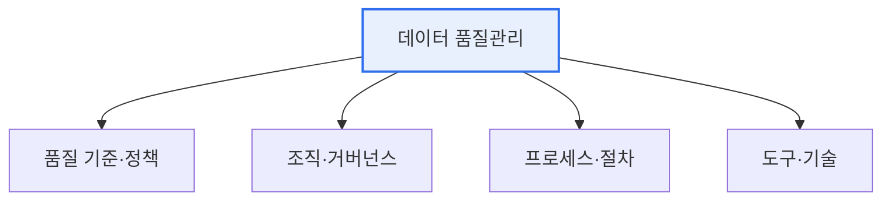

# 데이터 품질관리(Data Quality Management)

## 1. 개요

### 가. 정의
> 데이터의 **정확성·완전성·일관성·적시성 등 품질을 지속적으로 확보·관리**하는 체계적 활동. 데이터를 신뢰할 수 있는 의사결정·AI 자산으로 만드는 기반이 된다.

데이터 품질관리가 결정적으로 중요한 이유는 '**품질 나쁜 데이터는 잘못된 의사결정으로 직결**'되기 때문이다. 틀린 고객 주소로 배송이 실패하고, 중복된 매출 데이터로 실적이 왜곡되며, 편향된 데이터로 학습한 AI가 잘못된 예측을 낸다. 특히 데이터·AI 기반 경영이 확산되면서 데이터 품질은 분석과 모델의 신뢰성을 좌우하는 핵심 요소가 되었다. 중요한 것은 데이터 품질이 우연히 좋아지지 않는다는 점이다. 품질은 아키텍처·프로세스·조직·기술이 결합된 관리 체계를 통해서만 지속적으로 확보된다. 한 번 정제한다고 끝이 아니라, 계속 유입되는 데이터를 지속적으로 관리해야 한다.

### 나. 필요성
데이터가 여러 시스템에 흩어져 서로 다른 기준으로 쌓이면 불일치·중복·오류가 누적된다. 이를 방치하면 데이터 활용의 신뢰가 무너지므로, 표준·품질·거버넌스를 갖춘 관리 체계가 필요하다.

## 2. 데이터 품질관리 아키텍처

품질관리 아키텍처는 네 계층이 유기적으로 맞물린다. 최상위에 무엇을 품질로 볼지 정하는 **정책·기준**(품질 지표·표준)이 있고, 이를 책임지고 실행할 **조직·거버넌스**(데이터 오너·스튜어드)가 있다. 그 아래 실제 품질을 확보하는 **프로세스**(프로파일링·정제·검증·모니터링)가 돌아가고, 이를 지원하는 **도구·기술**(품질 진단 도구·MDM·메타데이터 관리)이 뒷받침한다. 특히 '누가 데이터 품질을 책임지는가'라는 조직·거버넌스가 빠지면 아무리 좋은 도구도 무용지물이 된다.

| 계층 | 구성 |
|---|---|
| **정책·기준** | 품질 기준·지표·표준 정의 |
| **조직·거버넌스** | 데이터 오너·스튜어드, 책임 체계 |
| **프로세스** | 프로파일링·정제·검증·모니터링 |
| **도구·기술** | 품질 진단·MDM·메타데이터 관리 |

## 3. 데이터 품질관리 성숙도

품질관리 수준은 조직마다 다르며, 성숙도 모델로 현재 위치를 진단하고 개선 방향을 잡는다. 초기 단계는 품질관리가 개인 역량에 의존하고, 정형화 단계는 부분적 절차가 생기며, 표준화 단계는 전사 표준·프로세스가 정착되고, 최적화 단계는 정량 측정과 지속 개선·자동화가 이뤄진다.

| 단계 | 특징 |
|---|---|
| **1 초기** | 품질관리 미흡, 개인 의존 |
| **2 정형화** | 부분적 절차·기준 존재 |
| **3 표준화** | 전사 표준·프로세스 정착 |
| **4 최적화** | 정량 측정·지속 개선, 자동화 |

## 4. 정형/비정형 데이터 품질기준

품질 기준은 데이터 유형에 따라 다르다. 테이블·코드값 같은 **정형 데이터** 는 규칙이 명확해 정확성·완전성·일관성·유효성·유일성 같은 정량 기준으로 검증한다. 문서·이미지·로그 같은 **비정형 데이터** 는 정형화된 규칙 적용이 어려워, 신뢰성·적합성·이해가능성·활용성 등 상대적으로 정성적인 기준과 메타데이터·라벨링 품질로 관리한다.

| 구분 | 정형 데이터 | 비정형 데이터 |
|---|---|---|
| **기준** | 정확성·완전성·일관성·유효성·유일성 | 신뢰성·적합성·이해가능성·활용성 |
| **대상** | 테이블·코드값 | 문서·이미지·로그 |
| **방법** | 규칙 기반 프로파일링 | 메타데이터·라벨링 품질 |

## 5. 데이터 품질관리 전략

효과적인 품질관리 전략은 네 방향이다. 첫째, 데이터 **표준화** 로 품질의 기반을 마련한다(표준 없이 품질 없다). 둘째, 사후 정제보다 원천(입력) 단계에서 품질을 통제하는 **예방 중심** 접근이 훨씬 효율적이다. 셋째, 품질을 정량 **지표(KPI)로 측정·모니터링** 해 성숙도를 높인다. 넷째, 데이터 오너·스튜어드십으로 **책임 체계** 를 세워 지속성을 확보한다.

## 6. 고려사항 및 시사점

1. **데이터 품질은 AI·분석 신뢰성의 전제**다. 데이터 중심 AI(Data-centric AI) 관점에서 품질관리가 모델 성능보다 우선하는 경우가 많다.
2. **실시간·대량 데이터는 자동 품질 모니터링**을 파이프라인에 내재화한다. 데이터가 들어올 때마다 자동으로 품질을 검증하고 이상을 감지해야 한다.
3. **규제 대응과 연계**된다. 데이터 3법·마이데이터 등은 정확하고 신뢰할 수 있는 개인정보·데이터 관리를 요구하므로, 품질관리가 컴플라이언스와 직결된다.

---

> **한 줄 요약**: 데이터 품질관리는 *정책·조직·프로세스·도구 아키텍처* 로 성숙도를 높이며, 정형·비정형별 품질기준을 적용하고 표준화·예방·측정·책임 전략으로 데이터를 신뢰할 수 있는 AI·의사결정 자산으로 만든다.
