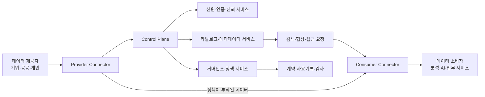
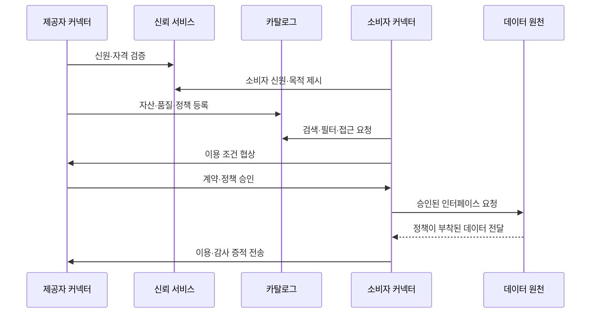

# 데이터 스페이스(Data Space)와 데이터 주권 기반 신뢰 데이터 공유

## 1. 개요

### 1.1 정의

> **데이터 스페이스(Data Space)**란 특정 산업·공공 분야의 참여자가 공통 규칙, 신뢰할 수 있는 신원, 상호운용 가능한 의미체계와 기술적 통제를 바탕으로 데이터를 공유·재사용하는 연합형 생태계이다.

데이터 스페이스는 데이터를 한 곳에 모아 중앙 플랫폼이 독점하는 방식과 다르다. 데이터 제공자는 원천 데이터를 계속 보유하면서 누가 어떤 목적으로 어떤 기간 동안 사용할 수 있는지를 정하고, 소비자는 그 조건에 동의한 뒤 필요한 데이터에 접근한다. 따라서 핵심은 단순한 데이터 전송이 아니라 신뢰, 규칙, 의미, 사용정책을 함께 교환하는 것이다.

데이터 거래소가 상품의 등록·검색·가격·정산을 중심으로 한다면, 데이터 스페이스는 서로 다른 조직이 지속적으로 협업할 수 있는 참여 규칙과 기술적 신뢰 기반을 더 넓게 다룬다. 데이터 레이크나 데이터 웨어하우스가 조직 내부의 저장·분석 최적화에 초점을 둔다면, 데이터 스페이스는 조직 경계를 넘어 데이터가 이동하고 사용되는 상황의 권리와 책임을 설계한다.

### 1.2 등장 배경과 필요성

첫째, 기업과 공공기관의 데이터가 부서·기업·국가별로 분절되어 데이터의 사회적 가치가 충분히 실현되지 못하고 있다. 제조사는 설비 데이터를 가지고 있고 물류사는 운송 데이터를 가지고 있지만, 서로의 품질·보안·책임 기준을 신뢰하지 못하면 공급망 최적화가 어려워진다.

둘째, 중앙집중형 플랫폼은 빠른 통합에는 유리하지만 데이터 주권, 벤더 종속, 단일 장애점, 목적 외 이용이라는 위험을 동반한다. 데이터 스페이스는 데이터를 반드시 중앙 저장소로 복제하지 않고도 분산된 주체 사이의 표준화된 교환을 가능하게 하여 이 위험을 줄인다.

셋째, AI와 분석 서비스의 품질은 모델 자체뿐 아니라 학습·추론에 사용되는 데이터의 정확성, 최신성, 출처와 사용권에 좌우된다. 데이터 스페이스는 데이터 자산의 메타데이터와 사용 조건을 함께 전달하여 재사용 가능한 데이터 공급망을 만든다.

넷째, 개인정보, 영업비밀, 산업기밀, 국가별 규제를 지키면서 데이터를 활용해야 한다. 따라서 접근 허용 여부만 판단하는 인증을 넘어, 허용된 데이터가 어떤 목적으로 어떻게 재사용되는지까지 관리하는 사용 통제가 요구된다.

### 1.3 목표와 특징

데이터 스페이스의 목표는 참여자의 자율성을 유지하면서 생태계 수준의 데이터 활용을 가능하게 하는 것이다. 여기서 자율성은 데이터를 무조건 공개하지 않는다는 뜻이 아니라, 데이터 제공자가 공유 범위와 이용 조건을 협상하고 이를 계약·정책·기술로 집행할 수 있다는 뜻이다.

주요 특징은 다음과 같다.

| 특징 | 의미 | 기술사 관점의 설계 질문 |
|---|---|---|
| 연합성 | 데이터와 운영 주체가 여러 조직에 분산됨 | 중앙집중 없이 어떻게 신뢰를 조성할 것인가 |
| 데이터 주권 | 제공자가 접근·이용·재공유 조건을 통제함 | 정책이 계약과 실행 계층에서 일치하는가 |
| 신뢰성 | 참여자·커넥터·데이터 출처를 검증함 | 어떤 신원과 인증 수준을 적용할 것인가 |
| 의미 상호운용성 | 같은 데이터가 같은 의미로 해석됨 | 공통 어휘·식별자·온톨로지를 어떻게 운영할 것인가 |
| 정책 집행성 | 이용 조건을 기술적으로 확인·기록함 | 위반을 예방·탐지·감사할 수 있는가 |
| 도메인 개방성 | 제조·보건·금융·모빌리티 등에 적용 가능 | 공통 기반과 분야별 규칙을 어떻게 분리할 것인가 |

## 2. 데이터 스페이스 참조 구조

### 2.1 전체 개념도

데이터 스페이스에는 데이터 평면과 제어 평면을 구분하는 것이 중요하다. 데이터 평면은 실제 데이터 또는 데이터에 대한 접근을 전달하고, 제어 평면은 누가 참여할 수 있는지, 어떤 자산이 있는지, 어떤 정책으로 거래할지를 관리한다. 이 분리를 통해 대용량 원천 데이터는 제공자의 저장소에 남겨 두면서도 표준화된 협상 절차를 적용할 수 있다.

### 2.2 참여자와 역할

**데이터 제공자**는 데이터의 생성 또는 관리 책임을 가진 주체다. 제공자는 데이터 자산의 품질, 출처, 갱신 주기, 개인정보 포함 여부, 이용 목적과 보상 조건을 정의한다. 제공자는 데이터를 제공한다고 해서 소유권과 모든 통제권을 포기하는 것이 아니므로, 계약과 정책의 경계를 명확히 해야 한다.

**데이터 소비자**는 데이터로 분석, AI 학습, 서비스 운영 또는 의사결정을 수행하는 주체다. 소비자는 카탈로그에서 데이터 자산을 탐색하고, 자신의 신원·목적·보안 수준을 제시한 뒤 이용 조건을 협상한다. 소비자는 허용된 목적을 넘어 재판매하거나 제3자에게 재공유하지 않도록 내부 통제를 마련해야 한다.

**커넥터(Connector)**는 제공자와 소비자가 데이터 스페이스 프로토콜에 따라 통신하도록 하는 경계 구성요소다. 커넥터는 원천 시스템과 외부 네트워크 사이에서 인증, 정책 협상, 데이터 전달, 암호화와 감사 이벤트를 처리한다. 조직별로 다른 저장소와 API를 커넥터 뒤에 숨기면 참여자는 공통된 교환 방식을 사용할 수 있다.

**신원·신뢰 서비스**는 참여 조직, 사용자, 서비스와 커넥터가 신뢰할 수 있는 주체인지 확인한다. 인증서 기반 상호 인증, 토큰 발급, 신뢰 목록, 자격 증명 검증을 조합할 수 있다. 신뢰 서비스는 단순 로그인 서버가 아니라 참여 자격과 인증 수준을 생태계의 규칙으로 관리하는 기반이다.

**카탈로그·메타데이터 서비스**는 데이터 자체가 아니라 데이터 자산의 설명, 엔드포인트, 품질, 가격, 라이선스, 갱신 주기와 접근 조건을 검색하도록 한다. 카탈로그에 민감한 원문을 넣지 않고도 소비자가 적합한 자산을 찾도록 해야 한다. 메타데이터가 부실하면 기술적으로 연결되어도 실제 활용이 불가능하다.

**거버넌스 운영자**는 참여자 자격, 분쟁 절차, 공통 어휘, 정책 템플릿, 보안 기준, 감사와 제재를 운영한다. 중앙 운영자가 모든 데이터를 통제하는 것이 아니라, 참여자가 합의한 규칙을 공정하게 집행하는 역할에 가깝다. 산업별 데이터 스페이스에서는 운영자, 표준화 기관, 데이터 제공자, 소비자의 책임을 계약으로 구체화해야 한다.

### 2.3 데이터 자산과 메타데이터

데이터 자산은 파일 하나를 뜻하지 않는다. 실시간 API, 스트림, 테이블, 문서, 모델 입력, 집계 결과처럼 소비자가 이용할 수 있는 논리적 제공 단위를 데이터 자산으로 정의할 수 있다. 자산은 식별자와 버전을 가져야 하며, 동일 이름의 데이터라도 의미·품질·권리가 다르면 별도 자산으로 구분해야 한다.

필수 메타데이터에는 데이터 자산의 설명, 소유·관리 주체, 출처, 생성 시각, 최신 갱신 시각, 스키마, 단위, 품질 지표, 보존 기간, 개인정보 분류, 라이선스, 가격 또는 보상, 허용 목적, 재공유 조건이 포함된다. 이 정보는 소비자가 데이터를 받기 전에 적합성과 위험을 판단하게 한다.

데이터 품질은 정확성 하나로 평가하지 않는다. 완전성, 유효성, 적시성, 일관성, 유일성, 추적성 등을 도메인별로 정의해야 한다. 예를 들어 제조 설비의 온도 스트림은 결측률과 지연시간이 핵심이고, 금융 거래 데이터는 정합성·중복·규제상 보존성이 핵심일 수 있다.

### 2.4 참조 기술 구성

| 계층 | 주요 구성 | 핵심 책임 |
|---|---|---|
| 참여 계층 | 제공자, 소비자, 중개자, 운영자 | 역할·권리·책임과 가입 조건 |
| 신뢰 계층 | 디지털 신원, 인증서, 토큰, 신뢰 앵커 | 상호 인증과 자격 검증 |
| 발견 계층 | 카탈로그, 브로커, 검색 API | 자산 발견과 조건 확인 |
| 협상 계층 | 계약 템플릿, 정책 표현, 동의 | 이용 조건 합의 |
| 교환 계층 | 커넥터, API, 스트림, 파일 전송 | 안전한 데이터 전달 |
| 의미 계층 | 공통 어휘, 온톨로지, 식별자 | 데이터 의미의 일치 |
| 통제·감사 계층 | 사용 로그, 정책 결정·집행, 모니터링 | 사후 증적과 위반 대응 |

특정 제품 하나를 모든 데이터 스페이스에 강제하기보다, 각 계층의 인터페이스와 적합성 조건을 먼저 정의해야 한다. 그래야 특정 클라우드나 특정 커넥터 구현을 교체해도 생태계의 데이터 계약과 신뢰를 유지할 수 있다.

## 3. 데이터 공유 생명주기와 사용 통제

### 3.1 공유 프로세스 개념도

### 3.2 등록과 발견

제공자는 먼저 내부 데이터 카탈로그와 외부 데이터 스페이스 카탈로그를 연결한다. 이때 민감한 원문 대신 자산 설명과 접근 엔드포인트를 등록하고, 데이터가 실제로 어느 저장소에 있는지는 커넥터가 보호한다. 자산의 버전과 변경 이력을 관리하지 않으면 소비자의 분석 결과를 재현하기 어렵다.

소비자는 키워드만 검색하지 않고 도메인 어휘, 품질, 지역, 시간 범위, 법적 이용 조건을 함께 필터링해야 한다. 검색 결과가 많더라도 자신의 목적과 권한에 맞지 않는 데이터라면 실제 계약 대상이 아니다. 따라서 발견 서비스에는 기술 메타데이터와 업무·법무 메타데이터가 함께 있어야 한다.

### 3.3 신뢰 형성과 계약 협상

참여자는 조직의 등록 정보, 인증서, 역할, 보안 수준과 정책 준수 증명을 제시한다. 상호 인증은 통신 상대를 확인하지만 데이터 이용 목적이 적법하다는 사실까지 보장하지 않으므로, 목적·법적 근거·보존 기간과 처리 장소를 별도의 속성으로 검증해야 한다.

계약 협상은 데이터 자산, 이용 목적, 이용 기간, 허용 연산, 재공유 여부, 보상, 책임, 삭제와 반환 절차를 합의하는 과정이다. 예를 들어 제조사가 고장 예측 모델 학습을 허용하더라도 원천 설비 식별자를 외부로 반출하거나 경쟁사에 재판매하는 것은 금지할 수 있다.

### 3.4 정책 결정과 정책 집행

정책 결정은 요청한 주체, 데이터, 목적, 환경 속성을 평가하여 허용·거부·추가 승인 중 하나를 판단하는 과정이다. 정책 집행은 결정된 결과를 실제 API 게이트, 커넥터, 저장소, 분석 실행환경에서 강제하는 과정이다. 결정과 집행을 한 구성요소에 몰아넣으면 정책 변경과 감사가 어려워지므로 역할을 분리하는 편이 바람직하다.

사용 통제는 접근 통제보다 범위가 넓다. 접근 통제는 “지금 이 데이터를 읽을 수 있는가”를 판단하지만, 사용 통제는 “허용된 목적으로만 처리했는가, 지정된 기간이 지나면 삭제했는가, 결과를 재공유하지 않았는가”까지 관리한다. 기술적 통제가 완전하지 않은 경우에는 계약, 워터마킹, 출력 검증, 감사와 제재를 함께 적용해야 한다.

### 3.5 전달·처리·감사

데이터 전달은 전송 구간 암호화와 상호 인증을 기본으로 하고, 필요하면 제공자의 환경에서 분석 결과만 반출하는 방식으로 원천 데이터 노출을 줄인다. 데이터가 소비자 환경으로 이동해야 한다면 최소 필요 필드, 가명화, 토큰화와 접근 시간 제한을 적용한다.

커넥터는 요청자, 데이터 자산, 정책 버전, 계약 식별자, 처리 시각, 결과 상태를 감사 로그로 남겨야 한다. 로그에는 원문 개인정보를 복사하지 않고 해시·식별자·요약값을 사용하며, 위변조 방지 저장소와 보존 정책을 적용한다. 감사 로그는 분쟁 해결뿐 아니라 데이터 품질과 비용 정산의 근거가 된다.

## 4. 거버넌스와 상호운용성

### 4.1 다층 거버넌스

데이터 스페이스 거버넌스는 기술 운영만의 문제가 아니다. 참여 자격, 데이터 권리, 계약 표준, 요금과 보상, 사고 책임, 분쟁 해결, 탈퇴와 데이터 반환을 합의해야 생태계가 지속된다. 기술사 답안에서는 아키텍처와 함께 운영위원회·도메인 위원회·감사 기능의 책임을 제시해야 한다.

| 거버넌스 층위 | 결정 항목 | 산출물 |
|---|---|---|
| 생태계 | 가입·탈퇴·제재·분쟁·수익배분 | Rulebook, 참여계약 |
| 도메인 | 용어·데이터 모델·품질 기준 | 공통 어휘, 데이터 계약 |
| 법무·윤리 | 목적·근거·개인정보·국외 이전 | 이용 조건, 영향평가 |
| 기술 | API·프로토콜·인증·로그 | 참조 아키텍처, 적합성 시험 |
| 운영 | 장애·변경·보안사고·지원 | SLA, 런북, 사고보고서 |

모든 규칙을 중앙 운영자가 일방적으로 변경하면 참여자의 신뢰가 떨어진다. 반대로 모든 조직이 각자 규칙을 만들면 상호운용성이 무너진다. 따라서 변경 제안, 영향평가, 투표 또는 합의, 유예기간, 하위 호환성 검증을 포함한 표준 변경 절차를 운영해야 한다.

### 4.2 의미 상호운용성

API가 연결되어도 “고객”, “설비”, “사고”, “탄소배출량”의 정의가 다르면 결과는 결합되지 않는다. 의미 상호운용성은 공통 식별자, 코드 체계, 단위, 시간대, 데이터 타입, 관계와 제약을 합의하고 이를 기계가 읽을 수 있도록 표현하는 활동이다.

도메인 공통 모델을 만들 때 모든 기업의 내부 모델을 하나로 통합하려고 하면 합의 비용이 과도해진다. 핵심 교환 개념과 매핑 규칙을 표준화하고, 조직 내부의 확장 속성은 확장 영역으로 허용하는 방식이 현실적이다. 데이터 계약에는 스키마 변화 규칙과 하위 호환성 조건도 포함해야 한다.

### 4.3 기술 상호운용성과 적합성

상호운용성은 포맷만 같다고 달성되지 않는다. 신원 확인, 카탈로그 질의, 계약 협상, 데이터 전달, 오류 처리, 로그 교환의 프로토콜이 서로 호환되어야 한다. 버전이 다른 구현 사이에는 기능 수준, 필수 필드, 오류 코드, 보안 요구사항을 적합성 시험으로 검증한다.

초기에는 샌드박스와 참조 커넥터를 제공하여 참여자의 진입 장벽을 낮출 수 있다. 그러나 참조 구현을 그대로 운영 표준으로 오해하면 특정 제품 종속이 생기므로, 규범적 요구사항과 예시 구현을 문서에서 구분해야 한다.

## 5. 데이터 스페이스와 유사 개념 비교

데이터 스페이스, 데이터 거래소, 데이터 메시, 데이터 패브릭과 데이터 레이크하우스는 모두 데이터 활용을 개선하지만 해결하는 경계가 다르다. 데이터 스페이스는 특히 여러 조직 사이의 신뢰·규칙·주권을 중심에 둔다는 점에서 차이가 있다.

| 구분 | 주된 경계 | 핵심 목적 | 데이터 통제 주체 |
|---|---|---|---|
| 데이터 스페이스 | 조직·산업 생태계 | 신뢰 기반 공유와 사용 통제 | 제공자와 합의된 거버넌스 |
| 데이터 거래소 | 시장·거래 관계 | 발견·가격·거래·정산 | 플랫폼과 거래 당사자 |
| 데이터 메시 | 기업 내부 도메인 | 도메인 데이터 제품의 자율 운영 | 도메인 팀 |
| 데이터 패브릭 | 기업 내부·하이브리드 | 메타데이터 기반 통합·접근 | 중앙 데이터 아키텍처와 도메인 |
| 레이크하우스 | 저장·분석 플랫폼 | 원천·정형 데이터의 통합 분석 | 플랫폼 운영 조직 |

데이터 메시 조직이 외부 공급망과 데이터를 교환하려면 데이터 스페이스의 신뢰·계약·정책 계층이 추가로 필요할 수 있다. 반대로 데이터 스페이스를 구축하더라도 각 참여자의 내부 데이터 품질과 제품 운영이 부실하면 공유 생태계가 작동하지 않는다. 두 개념은 대체 관계라기보다 내부 데이터 제품과 외부 데이터 협업을 연결하는 관계로 보는 것이 적절하다.

## 6. 적용 사례

### 6.1 제조·모빌리티 공급망

자동차 제조사는 부품 공급자의 품질·납기·탄소 데이터를 활용하여 공급망 위험과 생산 계획을 개선할 수 있다. 부품사는 원천 생산량과 공정 세부를 모두 공개하지 않고, 계약된 KPI와 집계 결과만 제공할 수 있다.

이 경우 공통 부품 식별자, 납기 이벤트, 품질 등급, 탄소 산정 단위를 먼저 정의해야 한다. 커넥터는 공급자의 ERP·MES와 연결되고, 소비자는 허용된 기간의 집계 데이터를 조회한다. 정책에는 경쟁사에 대한 재공유 금지와 계약 종료 후 삭제가 포함될 수 있다.

### 6.2 보건·연구 데이터

병원과 연구기관은 연구 목적의 데이터를 공유하면서 환자의 직접 식별정보를 보호해야 한다. 데이터 스페이스는 원천 데이터의 위치와 접근 권한을 분리하고, 연구자 자격·연구계획·승인 범위를 검증한 뒤 가명화 데이터나 안전한 분석공간을 제공할 수 있다.

보건 분야에서는 데이터의 정확성만큼 동의 범위, 재식별 위험, 보존 기간, 연구 결과의 공개 조건이 중요하다. 따라서 기술적 커넥터와 함께 IRB 승인, 목적 제한, 결과물 검토와 철회 절차를 거버넌스에 포함해야 한다.

### 6.3 에너지·스마트시티

전력사업자, 건물 운영자, 충전사업자와 지방자치단체가 에너지 수요·충전·기상 데이터를 공유하면 수요반응과 탄소 감축 서비스를 만들 수 있다. 데이터 제공자는 실시간 원시 계량값 대신 시간대별 집계값을 제공하여 개인의 생활 패턴 노출을 줄일 수 있다.

도시 간 상호운용을 위해서는 위치 격자, 시간대, 계량 단위, 기기 식별자와 품질 지표를 공통화해야 한다. 긴급 상황에서는 평상시와 다른 우선순위와 접근 범위를 적용할 수 있으므로, 비상정책과 사후 감사도 미리 설계해야 한다.

## 7. 심화: 표준화와 정책 동향

International Data Spaces Association의 IDS Reference Architecture Model은 신뢰할 수 있고 데이터 제공자가 사용을 통제하는 데이터 공유를 위한 참조 모델을 제시한다. IDS-RAM은 역할 모델, 정보 모델, 정책 기반 공유와 인증을 중심으로 하며, 특정 제품 하나에 종속되지 않는 설계 공간을 지향한다.

IDS 계열 구현에서는 커넥터, 신뢰 서비스, 메타데이터 브로커와 정책 기반 계약이 중요한 개념으로 사용된다. Dataspace Protocol은 데이터 자산의 카탈로그 조회, 협상과 계약, 전달을 데이터 스페이스 사이에서 상호운용하기 위한 프로토콜 계층으로 이해할 수 있다.

유럽연합 집행위원회는 보건, 제조, 모빌리티, 에너지, 금융, 공공행정 등 분야별 공통 유럽 데이터 공간을 추진하고 있다. 공통 인프라, 거버넌스, 보안·개인정보 보호, 의미체계, 상호운용성 사양과 데이터 모델을 함께 지원한다는 점이 중요하다.

EU Data Act는 연결 제품이 생성한 데이터에 대한 이용자 접근과 공정한 공유를 강조하고, 클라우드 서비스 전환과 데이터 상호운용성의 기반을 다룬다. 국내 기업이 유럽 파트너와 데이터를 교환할 때에는 단순 API 연동뿐 아니라 계약, 국외 이전, 보안과 공급망 책임을 함께 검토해야 한다.

실무적으로는 “데이터를 모두 모은 뒤 활용한다”는 순서를 “목적과 권리를 정의하고, 최소 데이터로 안전하게 연결한다”는 순서로 전환할 필요가 있다. 이를 위해 파일럿 도메인에서 자산 카탈로그, 최소 공통 모델, 커넥터, 정책 템플릿, 감사 지표를 검증한 뒤 참여자를 확장하는 단계적 접근이 효과적이다.

## 8. 고려사항 및 시사점

### 8.1 데이터 주권과 사업 가치의 균형

공유를 제한하면 데이터 가치는 낮아지고, 과도하게 개방하면 영업비밀과 개인정보 위험이 커진다. 데이터 자산별로 공개·제한·비공개 등급을 정의하고, 목적·기간·지역·결과물별 정책을 세분화해야 한다. 기술사는 데이터 활용률과 위험 노출을 함께 KPI로 제시해야 한다.

### 8.2 신뢰 모델과 책임 경계

인증서가 유효하다고 데이터 품질이나 법적 적합성이 보장되는 것은 아니다. 신원·자격·품질·계약·행위 로그를 각각 검증하고, 사고 발생 시 제공자·커넥터 운영자·소비자의 책임을 계약으로 명시해야 한다.

### 8.3 의미 표준의 진화

초기에 만든 공통 데이터 모델은 산업 변화와 신규 참여자 요구로 확장된다. 버전 관리, 확장 필드, 폐기 예고, 매핑과 변환 규칙을 운영하지 않으면 데이터 공간이 특정 시점의 고정된 사전으로 남는다. 표준 변경의 하위 호환성과 참여자 비용을 함께 평가해야 한다.

### 8.4 정책 집행의 한계

커넥터가 전송 조건을 확인해도 소비자가 데이터를 복사하거나 화면을 촬영하는 행위까지 완벽히 통제할 수는 없다. 따라서 기술적 사용 통제만 만능으로 주장하지 말고, 데이터 최소화·안전한 분석환경·출력 검토·워터마크·감사·계약상 제재를 방어 심층으로 결합해야 한다.

### 8.5 개인정보와 기밀정보 보호

가명화는 재식별 위험을 자동으로 제거하지 않는다. 데이터 결합 가능성, 희귀 속성, 접근 주체, 보존 기간, 결과물의 재식별 여부를 평가해야 한다. 민감도가 높은 경우 원천 반출 대신 제공자 환경의 연합 분석, 차등 개인정보보호 또는 기밀 컴퓨팅을 검토할 수 있다.

### 8.6 성능·가용성·비용

상호 인증과 정책 평가가 데이터 처리 지연을 증가시킬 수 있다. 실시간 제어 데이터와 배치 분석 데이터를 같은 수준으로 설계하지 말고, 지연시간·처리량·재시도·캐시·장애 시 대체 경로를 데이터 계약에 반영해야 한다. 커넥터 운영비와 데이터 사용료를 포함한 TCO도 산정해야 한다.

### 8.7 보안과 공급망

커넥터는 외부에 노출되는 신뢰 경계이므로 취약점, 자격 증명 탈취, 정책 우회, 로그 변조와 서비스 거부를 방어해야 한다. 이미지·라이브러리·프로토콜 구현의 SBOM, 패치, 서명, 취약점 대응 SLA를 참여 조건으로 두면 다중 공급자 환경의 공급망 위험을 줄일 수 있다.

### 8.8 단계적 확산과 성과 측정

처음부터 국가 또는 산업 전체를 연결하기보다 가치가 분명하고 데이터 권리 합의가 가능한 업무를 선정한다. 파일럿 성과는 연결된 기관 수만으로 평가하지 않고, 데이터 탐색 시간, 계약 협상 시간, 재사용률, 품질 오류율, 정책 위반 건수, 분석 서비스의 업무 성과를 함께 측정해야 한다.

### 8.9 기술사 답안 구성 전략

답안은 정의와 필요성에서 중앙집중형 공유의 한계를 제시하고, 참조 구조에서 참여자·커넥터·신뢰·카탈로그·정책·의미 계층을 도식화하는 흐름이 좋다. 이후 등록→발견→인증→협상→전달→감사 생명주기를 설명하고, 데이터 거래소·데이터 메시·데이터 패브릭과 차이를 비교한다.

결론에서는 데이터 주권을 선언으로 끝내지 않고 계약·정책·커넥터·로그로 집행하는 전략을 강조해야 한다. 또한 상호운용성의 기술 문제와 데이터 권리·책임의 거버넌스 문제를 함께 해결해야 지속 가능한 데이터 경제가 된다는 점을 시사점으로 제시한다.

## 참고자료

- International Data Spaces Association, “IDS Reference Architecture Model” — https://internationaldataspaces.org/offers/reference-architecture/
- International Data Spaces Association, “Where the future of data happens” — https://internationaldataspaces.org/why/data-spaces/
- European Commission, “Common European data spaces” — https://digital-strategy.ec.europa.eu/en/policies/data-spaces
- European Commission, “Data Act” — https://digital-strategy.ec.europa.eu/en/policies/data-act
- Data Spaces Support Centre — https://dssc.eu/

---

> **한 줄 요약**: 데이터 스페이스는 데이터를 중앙에 모으는 플랫폼이 아니라, 참여자가 데이터 주권을 유지하면서 신원·카탈로그·의미·계약·정책 집행을 결합해 신뢰할 수 있게 공유하는 연합형 데이터 거버넌스 아키텍처이다.
