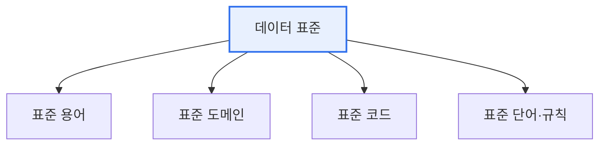

# 데이터 표준화의 필요성과 기대효과

## 1. 개요

### 가. 정의
> 조직 내 데이터의 **명칭·정의·형식·규칙을 일관된 기준으로 통일**하는 활동. 용어·도메인·코드·값을 표준화하여 데이터의 일관성과 상호운용성을 확보한다.

데이터 표준화가 필요한 근본 이유는 '**같은 것을 서로 다르게 부르는**' 혼란 때문이다. 어떤 시스템은 '고객번호', 다른 시스템은 'CUST_NO', 또 다른 곳은 'client_id'로 쓰면, 데이터를 통합·비교할 때마다 매핑 비용이 들고 오류가 생긴다. 표준화는 이 불일치를 원천 제거해 데이터를 신뢰할 수 있는 자산으로 만든다.

## 2. 표준화 대상 및 구성

| 대상 | 내용 |
|---|---|
| **표준 단어** | 데이터 명칭의 최소 의미 단위 통일 |
| **표준 용어** | 단어 조합으로 구성된 항목명 |
| **표준 도메인** | 데이터 유형·길이·형식 정의 |
| **표준 코드** | 코드값 체계 통일(예: 성별 M/F) |

## 3. 필요성과 기대효과

| 구분 | 내용 |
|---|---|
| **필요성** | 명칭·형식 불일치로 인한 통합·품질 저하, 중복·오류, 시스템 간 연계 곤란 |
| **일관성·품질** | 데이터 정합성·신뢰성 향상 |
| **상호운용성** | 시스템 간 연계·통합 용이 |
| **효율성** | 중복 제거, 유지보수·개발 비용 절감 |
| **활용성** | 데이터 검색·분석·재사용 촉진(데이터 거버넌스 기반) |

## 4. 시사점
- 표준화는 **데이터 거버넌스·품질관리의 출발점** — 표준 없인 품질도 없음
- 전사 데이터 사전(표준 사전)·MDM(마스터데이터 관리)과 연계
- 표준 준수를 지속 점검하는 거버넌스 체계 필요

---

> **한 줄 요약**: 데이터 표준화는 *용어·도메인·코드를 일관 기준으로 통일* 해 데이터 일관성·상호운용성·효율성을 확보하며, 데이터 거버넌스와 품질관리의 기반이 된다.
