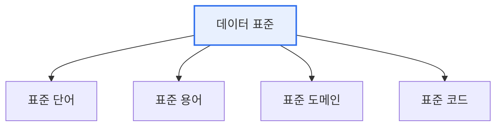

# 데이터 표준화의 필요성과 기대효과

## 1. 개요

### 가. 정의
> 조직 내에서 사용하는 데이터의 **명칭·정의·형식·표현 규칙을 일관된 기준으로 통일**하는 활동. 표준 단어·용어·도메인·코드를 정립하여 데이터의 일관성과 상호운용성을 확보한다.

데이터 표준화가 필요한 근본 이유는 '**같은 것을 서로 다르게 부르는 혼란**'에 있다. 한 회사 안에서도 영업 시스템은 '고객번호', 회계 시스템은 'CUST_NO', 신규 앱은 'client_id'로 같은 개념을 제각각 표현하면, 이 데이터들을 통합·비교할 때마다 매번 "이것과 저것이 같은 것"이라는 매핑 작업이 필요하고 그 과정에서 오류가 생긴다. 날짜를 'YYYY-MM-DD'와 'MM/DD/YY'로 섞어 쓰거나 성별을 'M/F'와 '1/2'로 혼용하면 집계가 틀어진다. 표준화는 이런 불일치를 애초에 제거해 데이터를 신뢰할 수 있는 자산으로 만든다.

### 나. 등장 배경
시스템이 부서별·시기별로 따로 구축되면서 데이터 사일로와 명칭 불일치가 누적되었고, 데이터 통합·분석·AI 활용이 중요해지면서 "**측정 가능해야 관리할 수 있고, 일관되어야 활용할 수 있다**"는 인식에서 데이터 표준화가 데이터 거버넌스의 출발점으로 자리 잡았다.

## 2. 표준화 대상

표준화는 데이터의 이름과 값을 여러 층위에서 통일한다. **표준 단어** 는 명칭을 구성하는 최소 의미 단위(예: '고객', '번호')를 통일하고, **표준 용어** 는 이 단어들을 조합한 항목명(예: '고객번호')을 정한다. **표준 도메인** 은 각 항목의 데이터 유형·길이·형식(예: 금액은 숫자 15자리)을 정의하고, **표준 코드** 는 코드값 체계(예: 성별 M/F)를 통일한다.

| 대상 | 내용 | 예시 |
|---|---|---|
| **표준 단어** | 명칭의 최소 의미 단위 | 고객, 번호, 금액 |
| **표준 용어** | 단어 조합 항목명 | 고객번호, 주문금액 |
| **표준 도메인** | 유형·길이·형식 정의 | 금액: NUMBER(15) |
| **표준 코드** | 코드값 체계 | 성별: M/F |

## 3. 필요성과 기대효과

표준화의 효과는 데이터 관리 전반에 파급된다. 무엇보다 명칭·형식이 통일되어 데이터의 **일관성·정합성**이 올라가고, 시스템 간 데이터를 매핑 없이 주고받을 수 있어 **상호운용성**이 확보된다. 중복 데이터가 제거되고 개발·유지보수 시 데이터 의미를 매번 파악할 필요가 없어져 **비용이 절감**되며, 표준화된 데이터는 검색·분석·재사용이 쉬워 **활용성**이 높아진다.

| 구분 | 내용 |
|---|---|
| **일관성·품질** | 명칭·형식 통일로 정합성·신뢰성 향상 |
| **상호운용성** | 시스템 간 연계·통합 용이(매핑 불필요) |
| **효율성** | 중복 제거, 개발·유지보수 비용 절감 |
| **활용성** | 데이터 검색·분석·재사용·AI 학습 촉진 |

## 4. 고려사항 및 시사점

1. **표준화는 데이터 거버넌스·품질관리의 출발점**이다. 표준이 없으면 품질 기준을 정의할 수도, 측정할 수도 없다. "표준 없이 품질 없다"는 말이 이를 요약한다.
2. **전사 표준 사전(Data Dictionary)과 MDM(마스터데이터 관리)** 로 표준을 정착시킨다. 고객·상품 같은 핵심 마스터데이터를 단일 기준으로 관리하면 표준화 효과가 극대화된다.
3. **표준은 만드는 것보다 지키게 하는 것이 어렵다**. 표준 준수를 개발·검수 프로세스에 내재화하고 지속 점검하는 거버넌스 체계가 없으면 시간이 지나며 다시 무너진다.

---

> **한 줄 요약**: 데이터 표준화는 *단어·용어·도메인·코드를 일관 기준으로 통일* 해 데이터의 일관성·상호운용성·효율성·활용성을 확보하며, 데이터 거버넌스·품질관리의 출발점으로서 표준 사전·MDM과 지속적 준수 관리가 뒷받침되어야 한다.
