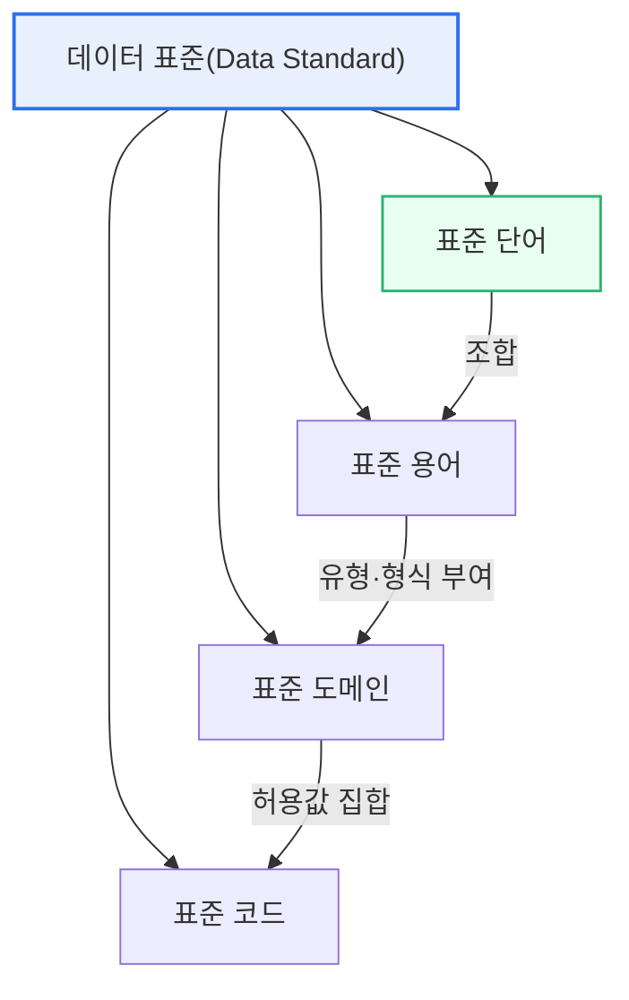
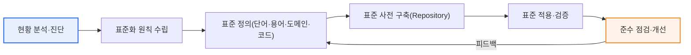

# 데이터 표준화의 필요성과 기대효과

## 1. 개요

### 가. 정의
> 조직 내에서 사용하는 데이터의 **명칭·정의·형식·표현 규칙을 일관된 기준으로 통일**하는 활동. 표준 단어·용어·도메인·코드를 정립하여 데이터의 일관성·상호운용성·품질을 확보하는 데이터 거버넌스의 기반 활동이다.

데이터 표준화가 필요한 근본 이유는 '**같은 것을 서로 다르게 부르는 혼란**'을 제거하는 데 있다. 한 회사 안에서도 영업 시스템은 '고객번호', 회계 시스템은 'CUST_NO', 신규 앱은 'client_id'로 같은 개념을 제각각 표현하면, 이 데이터들을 통합·비교할 때마다 매번 "이것과 저것이 같은 것"이라는 매핑 작업이 필요하고 그 과정에서 오류가 스며든다. 날짜를 'YYYY-MM-DD'와 'MM/DD/YY'로 섞어 쓰거나 성별을 'M/F'와 '1/2'로 혼용하면 집계 자체가 틀어진다. 표준화는 이런 불일치를 데이터가 생성되는 시점에 애초부터 차단해, 데이터를 신뢰할 수 있는 조직 자산으로 만든다.

### 나. 등장 배경과 필요성
표준화가 부상한 배경에는 정보시스템이 걸어온 역사가 있다. 시스템은 대체로 부서별·시기별로 따로따로 구축되었고, 각 시스템은 자기 편의대로 이름과 코드 체계를 정했다. 그 결과 조직 전체로 보면 데이터가 섬처럼 흩어진 **데이터 사일로(Data Silo)** 와 명칭 불일치가 오랜 기간 누적되었다. 평소에는 각 시스템이 알아서 잘 돌아가므로 문제가 드러나지 않다가, 전사 통합·데이터 웨어하우스 구축·경영 대시보드·AI 학습처럼 '데이터를 한데 모아 쓰려는' 순간 비로소 혼란이 폭발한다.

여기에 더해 빅데이터·인공지능 활용이 조직의 경쟁력을 좌우하게 되면서, "**측정 가능해야 관리할 수 있고, 일관되어야 활용할 수 있다**"는 인식이 확산되었다. 데이터 3법 개정과 마이데이터, 공공데이터 개방 정책처럼 조직 간·기관 간 데이터를 주고받는 요구가 커진 것도 표준화를 필수 과제로 밀어 올렸다. 표준화되지 않은 데이터는 내부에서조차 쓰기 어려운데, 외부와 교환하려면 더욱 불가능하기 때문이다. 이렇게 데이터 표준화는 데이터 품질관리와 거버넌스의 '출발점'으로 자리 잡았다.

### 다. 특징
데이터 표준화는 ① 단어에서 코드까지 여러 층위를 다루는 **계층성**, ② 한 번 정하면 전사가 따라야 하는 **강제성·구속성**, ③ 신규·변경 데이터에 지속 적용되어야 하는 **지속성**, ④ 기술이 아니라 합의와 프로세스가 좌우하는 **거버넌스 의존성** 이라는 특징을 가진다. 특히 표준은 '만드는 것'보다 '지키게 하는 것'이 어렵다는 점에서, 도구 도입이 아니라 조직의 규율 문제라는 성격이 강하다.

## 2. 데이터 표준화 대상과 체계

```mermaid
flowchart TB
  S["데이터 표준(Data Standard)"] --> W[표준 단어]
  S --> T[표준 용어]
  S --> D[표준 도메인]
  S --> C[표준 코드]
  W -->|조합| T
  T -->|유형·형식 부여| D
  D -->|허용값 집합| C
  style S fill:#e8f0fe,stroke:#2f6fed,stroke-width:2px
  style W fill:#e8fef0,stroke:#2fb36f,stroke-width:1.5px
```

표준화는 데이터의 이름과 값을 여러 층위에서 통일하며, 각 층위는 아래에서 위로 조립되는 관계를 가진다.

**표준 단어(Standard Word)** 는 항목 이름을 구성하는 최소 의미 단위다. 예컨대 '고객번호'라는 항목명은 '고객'과 '번호'라는 단어로 쪼개지는데, 조직은 '거래처/고객/클라이언트'처럼 뒤섞여 쓰이는 표현 중 하나를 대표 단어로 확정하고 나머지는 금칙어(사용 금지어)로 관리한다. 단어를 통일하지 않으면 상위의 용어도 표준화될 수 없으므로, 단어는 표준 체계의 벽돌에 해당한다. 실무에서는 '영문 약어'까지 함께 정해(고객→CUST, 번호→NO), 물리 컬럼명이 시스템마다 갈리지 않게 한다.

**표준 용어(Standard Term)** 는 표준 단어들을 규칙에 따라 조합한 '항목명(business term)'이다. '고객'+'번호'='고객번호'처럼 조합 순서와 방식을 정해 두면, 누가 만들어도 같은 개념에 같은 이름이 붙는다. 용어 표준의 실무적 가치는 개발자와 현업이 같은 이름으로 소통하게 해 요구사항 오해를 줄이는 데 있다. '주문금액'과 '결제금액'이 실제로 다른 개념이라면 용어로 명확히 구분하고, 같은 개념이라면 하나로 통합한다.

**표준 도메인(Standard Domain)** 은 각 항목이 가질 수 있는 데이터 유형·길이·형식을 정의한다. 예를 들어 '금액' 도메인은 'NUMBER(15)', '주민등록번호' 도메인은 '문자 13자리', '날짜' 도메인은 'YYYY-MM-DD'로 못 박는다. 도메인 표준의 핵심 효과는 물리 설계의 일관성이다. 같은 성격의 항목이 어떤 테이블에서는 20자, 다른 테이블에서는 10자로 정의되면 연계 시 값이 잘리는 사고가 나는데, 도메인을 표준화하면 이런 물리적 불일치가 사라진다.

**표준 코드(Standard Code)** 는 코드성 데이터의 값 체계를 통일한다. 성별을 'M/F'로 할지 '1/2'로 할지, 처리상태를 어떤 코드값 집합으로 표현할지를 전사 기준으로 정한다. 코드는 통계·집계의 축이 되는 경우가 많아, 코드가 통일되지 않으면 부서별 집계 결과를 합산조차 할 수 없다. 그래서 코드 표준은 표준화 효과가 가장 즉각적으로 체감되는 영역이다.

이 네 층위는 독립적이지 않고 아래에서 위로 조립되는 위계를 이룬다. 단어가 모여 용어가 되고, 용어에 도메인이 결합해 물리적 형식이 정해지며, 그 값의 허용 범위를 코드가 규정한다. 따라서 하위 층위(단어·도메인)가 흔들리면 상위 층위(용어·코드)도 표준화될 수 없으므로, 표준화는 반드시 단어·도메인 같은 기초 층위부터 다져야 한다. 상위만 급히 정하면 기반이 없어 곧 무너진다.

| 대상 | 내용 | 예시 | 통일하지 않으면 |
|---|---|---|---|
| **표준 단어** | 명칭의 최소 의미 단위 | 고객(CUST), 번호(NO), 금액(AMT) | 컬럼명·용어 난립 |
| **표준 용어** | 단어 조합 항목명 | 고객번호, 주문금액 | 요구사항 오해, 중복 항목 |
| **표준 도메인** | 유형·길이·형식 정의 | 금액: NUMBER(15), 날짜: YYYY-MM-DD | 연계 시 값 잘림·형변환 오류 |
| **표준 코드** | 코드값 허용 집합 | 성별: M/F, 상태: 01~09 | 집계 불가, 통계 왜곡 |

## 3. 데이터 표준화 수립 절차

```mermaid
flowchart LR
  A[현황 분석·진단] --> B[표준화 원칙 수립]
  B --> C["표준 정의(단어·용어·도메인·코드)"]
  C --> D["표준 사전 구축(Repository)"]
  D --> E[표준 적용·검증]
  E --> F[준수 점검·개선]
  F -->|피드백| C
  style A fill:#e8f0fe,stroke:#2f6fed,stroke-width:2px
  style F fill:#fef3e8,stroke:#ed8f2f,stroke-width:2px
```

표준화는 일회성 정의가 아니라 순환하는 관리 프로세스로 이해해야 한다. 먼저 **현황 분석·진단** 단계에서 기존 시스템의 컬럼·용어·코드를 수집해 얼마나 중복·불일치하는지를 파악한다. 이 진단 없이 표준을 만들면 현실과 동떨어진 이상론이 되어 지켜지지 않는다. 다음으로 **표준화 원칙** 을 세우는데, 단어 조합 규칙·약어 규칙·예외 처리 방침 같은 상위 규범을 먼저 합의해야 개별 표준이 흔들리지 않는다.

이어 **표준 정의** 단계에서 단어·용어·도메인·코드를 실제로 확정하고, 이를 **표준 사전(Data Dictionary/Repository)** 에 등재해 누구나 조회·활용할 수 있게 한다. 표준이 문서로만 존재하고 검색·재사용이 안 되면 사문화되므로, 사전은 표준화의 생명선이다.

마지막으로 **적용·검증** 과 **준수 점검** 단계에서 신규 개발·데이터 모델링에 표준을 강제하고, 주기적으로 위반 사례를 찾아 표준을 보완한다. 이 피드백 루프가 끊기면 표준은 시간이 지나며 반드시 무너진다. 특히 조직·업무가 변하면 새로운 단어·코드가 계속 생겨나므로, 표준을 한 번 만들고 끝내는 프로젝트가 아니라 상시 운영하는 관리 체계로 두어야 한다. 신규 표준 요청을 접수·심의·반영하는 절차와 담당 조직(데이터 관리자, DA)이 없으면 현업은 표준을 우회해 자기 방식대로 데이터를 만들게 된다.

## 4. 필요성과 기대효과 — 이유와 실무 함의

표준화의 효과는 데이터 관리 전반에 파급되며, 각 효과는 서로 인과로 얽혀 있다. 무엇보다 명칭·형식이 통일되면서 데이터의 **일관성·정합성** 이 올라간다. 이는 단순한 미관 문제가 아니라, 서로 다른 시스템의 '고객번호'가 정말 같은 고객을 가리킨다는 신뢰를 만들어 데이터 통합의 전제를 제공한다.

이 일관성 위에서 시스템 간 데이터를 매핑 없이 주고받을 수 있게 되어 **상호운용성** 이 확보된다. 예컨대 표준 코드로 통일된 두 시스템은 별도 변환 로직 없이 연계되지만, 표준이 없으면 연계 지점마다 변환 테이블을 만들고 유지해야 한다.

시스템이 N개면 연계 조합이 기하급수적으로 늘어나므로, 표준화의 비용 절감 효과는 시스템이 많을수록 커진다. 실제로 대형 공공·금융 기관에서 표준화가 차세대·재구축 사업의 핵심 과업으로 다뤄지는 이유가 여기 있다. 수백 개 테이블·수만 개 컬럼을 다루는 대형 시스템에서는 표준이 없으면 통합 자체가 불가능에 가깝고, 표준화 없이 진행된 통합은 이후 유지보수 단계에서 막대한 비용을 유발한다.

또한 중복 데이터·중복 항목이 제거되고, 개발자가 데이터의 의미를 매번 파악할 필요가 없어져 개발·유지보수 **비용이 절감** 된다. 마지막으로 표준화된 데이터는 검색·분석·재사용이 쉬워 데이터 **활용성** 이 높아지는데, 특히 AI 학습 데이터의 품질은 표준화 수준에 직접 좌우된다. 형식이 제각각인 데이터로는 신뢰할 수 있는 모델을 만들 수 없기 때문이다. 요컨대 표준화는 '품질 → 통합 → 비용 → 활용'으로 이어지는 가치 사슬의 첫 단추다.

구체적인 사례로 효과를 가늠해 보자. 어느 조직에 영업·회계·CRM 세 시스템이 각각 고객 식별자를 '고객번호(CHAR 10)', 'CUST_NO(NUMBER 8)', 'client_id(VARCHAR 12)'로 다르게 정의하고 있다고 하자. 이 상태에서 세 시스템을 연계하려면 시스템 쌍마다 매핑·형변환 로직이 필요하므로 3개 시스템에 대해 최대 3쌍(3×2/2)의 변환기를 만들고 유지해야 하며, 시스템이 늘수록 조합 수는 N(N-1)/2로 급증한다. 표준 용어 '고객번호'와 표준 도메인 'CHAR(10)'으로 통일하면 이 변환 로직이 사라지고, 세 시스템이 하나의 공통 규약으로 직접 연계된다. 형변환 과정에서 발생하던 값 잘림·자릿수 오류 같은 데이터 사고도 원천적으로 없어진다. 이처럼 표준화 효과는 시스템 수가 많고 연계가 복잡할수록 기하급수적으로 커진다.

| 구분 | 내용 | 실무적 함의 |
|---|---|---|
| **일관성·품질** | 명칭·형식 통일로 정합성·신뢰성 향상 | 데이터 통합의 전제 조건 확보 |
| **상호운용성** | 시스템 간 연계·통합 용이(매핑 불필요) | 연계 비용의 기하급수적 절감 |
| **효율성** | 중복 제거, 개발·유지보수 비용 절감 | 신규 개발 생산성·품질 동시 향상 |
| **활용성** | 검색·분석·재사용·AI 학습 촉진 | 데이터 기반 의사결정·AI 신뢰성 제고 |

## 5. 심화 — 데이터 거버넌스·MDM과의 연계, 공공 표준화 동향

데이터 표준화는 홀로 서지 못하고 상위 체계인 **데이터 거버넌스** 와 하위 실행 체계인 **MDM(마스터 데이터 관리)**, **데이터 품질관리** 와 맞물려야 실효를 낸다. 거버넌스는 표준을 정하고 준수를 강제하는 조직·정책·의사결정 체계를 제공하고, 표준화는 그 안에서 '무엇을 어떻게 통일할지'를 규정하며, MDM은 고객·상품처럼 여러 시스템이 공유하는 핵심 마스터데이터를 단일 기준으로 관리해 표준화 효과를 실물에서 구현한다. 예컨대 고객 마스터를 MDM으로 일원화하면, 표준 용어·코드가 실제 하나의 '골든 레코드(golden record)'로 수렴한다. 표준화가 규칙이라면 MDM은 그 규칙이 적용된 결과물인 셈이다.

최근 흐름으로는 데이터 메시(Data Mesh)·데이터 패브릭 같은 분산 데이터 아키텍처가 확산되면서, 중앙집중식 표준 강제만으로는 한계가 있다는 인식이 커졌다. 도메인마다 데이터 특성과 변화 속도가 달라, 중앙이 모든 표준을 세세히 정하면 현실을 따라가지 못하기 때문이다. 그래서 전사 공통 표준(연합 거버넌스로 정한 최소 공통 규약)과 도메인별 자율 표준을 결합하는 **연합형(federated) 거버넌스** 가 대안으로 제시된다. 도메인 간 연계에 필요한 최소한만 전사 표준으로 강제하고, 도메인 내부는 자율에 맡기되 그 자율 표준도 공통 규약을 위배하지 않게 하는 이층 구조다.

또한 데이터 카탈로그·메타데이터 관리 도구가 표준 사전과 결합해, 어떤 데이터가 어디에 있고 어떤 표준을 따르는지를 자동으로 추적·검증하는 방향으로 발전하고 있다. 과거에는 표준 준수 여부를 사람이 수작업으로 점검했다면, 이제는 컬럼 메타데이터를 자동 수집해 표준 사전과 대조하고 위반 항목을 리포트하는 방식으로 점검이 자동화된다. 데이터 계약(Data Contract)처럼 생산자와 소비자가 데이터의 스키마·형식·의미를 사전에 약속하고 이를 파이프라인에서 강제하는 기법도 표준화를 자동으로 관철하는 최신 수단으로 부상하고 있다.

공공 부문에서는 행정·공공기관을 대상으로 한 데이터베이스 표준화 지침과 공공데이터 개방 정책이 표준화를 제도적으로 요구해 왔다. 공통표준용어·공통표준도메인 같은 국가 차원의 표준을 제정해 기관 간 데이터 연계와 개방의 기반을 다지려는 노력이 이어지고 있다.

이는 표준화가 개별 조직의 효율 문제를 넘어, 기관 간 상호운용성과 데이터 경제의 기반 인프라라는 위상을 갖게 되었음을 보여준다. 마이데이터처럼 기관·기업 간 데이터를 안전하게 이동·결합하는 서비스가 성립하려면, 참여 주체들이 같은 항목을 같은 형식으로 표현한다는 표준이 선행되어야 한다. 표준이 없으면 데이터를 개방·거래해도 받는 쪽이 해석할 수 없어 활용 가치가 떨어진다. (구체적 지침 명칭·개정 시점은 발간 시기에 따라 다를 수 있어 일반화하여 서술한다.)

## 6. 고려사항 및 시사점

기술사 관점에서 데이터 표준화를 성공적으로 안착시키기 위한 고려사항은 다음과 같다.

1. **표준화는 데이터 거버넌스·품질관리의 출발점이다.** 표준이 없으면 품질 기준을 정의할 수도, 위반을 측정할 수도 없다. "표준 없이 품질 없다"는 말처럼, 데이터 전략을 세울 때는 표준화를 개별 과제가 아니라 거버넌스 체계 전체의 기초 공사로 위치시켜야 한다. 표준화 단독으로 추진하면 정합성이 떨어진다.

2. **만드는 것보다 지키게 하는 것이 어렵다 — 프로세스 내재화가 관건이다.** 아무리 정교한 표준도 신규 개발·데이터 모델링·검수 절차에 표준 준수 검증을 강제로 끼워 넣지 않으면 새 데이터가 다시 비표준으로 쌓인다. 표준 준수 여부를 자동 점검하는 도구와, 예외를 승인·관리하는 거버넌스 조직이 함께 있어야 표준이 유지된다.

3. **현실과의 균형 — 과도한 이상론을 경계해야 한다.** 기존 시스템 전부를 즉시 표준에 맞춰 개조하는 것은 비용·위험이 크다. 신규 시스템부터 표준을 적용하고, 기존 시스템은 연계 계층에서 매핑하거나 재구축 시점에 점진적으로 전환하는 현실적 로드맵이 필요하다. 표준은 조직이 감당할 수 있는 수준에서 시작해 확장해야 한다.

4. **전사 표준 사전·MDM으로 실체화해야 효과가 지속된다.** 표준이 검색·재사용 가능한 사전(Repository)으로 관리되고, 핵심 마스터데이터가 MDM으로 일원화될 때 표준화 효과가 극대화되고 장기간 유지된다. 사전과 MDM 없이 문서로만 존재하는 표준은 사문화된다.

5. **비즈니스·현업의 참여가 성패를 가른다.** 표준 단어·용어는 현업의 업무 언어를 반영해야 실제로 쓰인다. IT 부서가 일방적으로 정한 표준은 현업이 외면하므로, 표준 제정 단계부터 현업을 참여시켜 합의된 공통 어휘로 만들어야 한다. 표준화는 기술 프로젝트인 동시에 조직의 합의 프로젝트다.

## 참고자료
- 한국데이터산업진흥원(K-DATA), 데이터 품질·표준화 가이드 — https://www.kdata.or.kr/
- 행정안전부, 공공데이터 관리지침·공통표준 관련 정책 — https://www.data.go.kr/

---

> **한 줄 요약**: 데이터 표준화는 *단어·용어·도메인·코드를 일관 기준으로 통일* 해 데이터의 일관성·상호운용성·효율성·활용성을 확보하는 활동으로, 데이터 거버넌스·품질관리의 출발점이자 MDM·표준 사전과 지속적 준수 관리, 현업 참여가 뒷받침될 때 비로소 효과가 지속된다.
