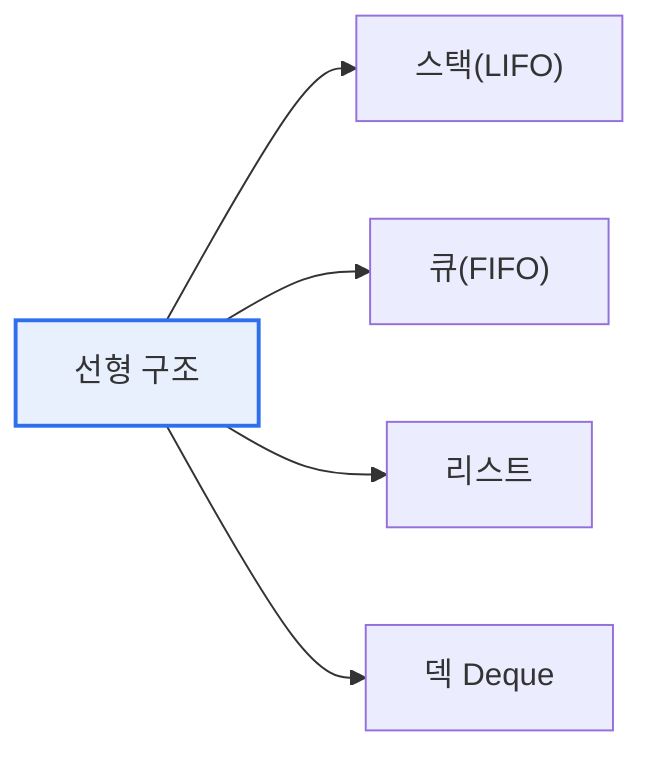

# 데이터 구조: 선형 구조와 비선형 구조

## 1. 개요

### 가. 정의
> **데이터 구조(Data Structure)** 는 데이터를 효율적으로 저장·관리하기 위한 논리적 조직 방식으로, 원소 간 연결 형태에 따라 **선형 구조**(일렬)와 **비선형 구조**(계층·망)로 구분된다.

구분의 핵심은 '**원소들이 어떻게 연결되어 있는가**'다. 선형 구조는 원소가 일렬로 1:1 이어져 앞뒤가 하나씩만 존재하고, 비선형 구조는 하나의 원소가 여러 원소와 연결(1:N, N:M)되어 계층·그물 형태를 이룬다. 이 연결 형태가 탐색·삽입·삭제의 효율과 표현 가능한 관계를 결정한다.

## 2. 선형 구조(Linear Structure) (가)

| 유형 | 개념 | 원리·활용 |
|---|---|---|
| **스택** | 후입선출(LIFO) | 함수 호출, 되돌리기(Undo) |
| **큐** | 선입선출(FIFO) | 작업 대기열, 버퍼 |
| **리스트** | 순차·연결 리스트 | 순차 접근·동적 삽입 |
| **덱(Deque)** | 양쪽 삽입·삭제 | 스케줄링 |

## 3. 비선형 구조(Non-Linear Structure) (나)

| 유형 | 개념 | 활용 |
|---|---|---|
| **트리(Tree)** | 계층 구조(1:N), 사이클 없음 | 파일시스템, 인덱스(B-Tree) |
| **그래프(Graph)** | 정점·간선의 망(N:M) | 네트워크, 경로 탐색(SNS·지도) |

## 4. 선형 vs 비선형 비교 (다)

| 구분 | 선형 구조 | 비선형 구조 |
|---|---|---|
| **연결** | 1:1(일렬) | 1:N, N:M(계층·망) |
| **표현 관계** | 순서 관계 | 계층·네트워크 관계 |
| **탐색** | 순차적 | 계층·경로 탐색(DFS·BFS) |
| **예** | 스택·큐·리스트 | 트리·그래프 |
| **적합** | 순서 있는 데이터 | 복잡한 관계·계층 데이터 |

## 5. 시사점
- 문제의 **데이터 관계 특성**에 맞는 구조 선택이 성능을 좌우
- 트리(균형·탐색)·그래프(최단경로) 등 응용 구조로 확장
- 자료구조 선택은 알고리즘 복잡도(O-Notation)와 직결

---

> **한 줄 요약**: 선형 구조(스택·큐·리스트)는 원소가 일렬로 연결되고, 비선형 구조(트리·그래프)는 계층·망으로 연결되며, 데이터 간 관계 특성에 따라 적합한 구조를 선택한다.
