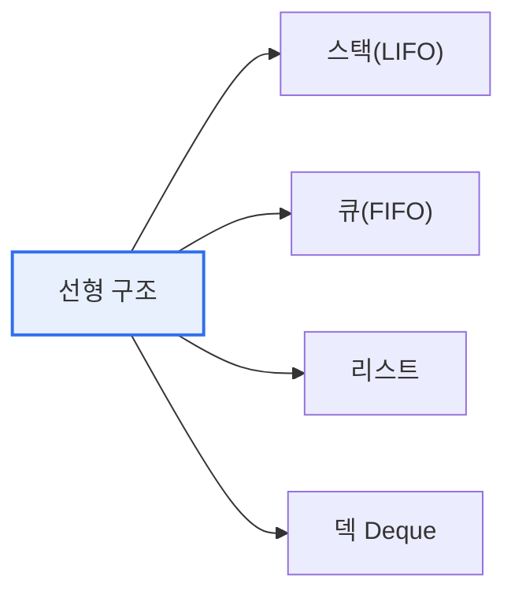

# 데이터 구조: 선형 구조와 비선형 구조

## 1. 개요

### 가. 정의
> **데이터 구조(Data Structure)** 는 데이터를 효율적으로 저장·관리하기 위한 논리적 조직 방식으로, 원소 간 연결 형태에 따라 **선형 구조**(원소가 일렬)와 **비선형 구조**(계층·망 형태)로 구분된다.

두 구조를 가르는 본질은 '**원소들이 어떻게 연결되어 있는가**'다. 선형 구조는 원소가 일렬로 늘어서 각 원소의 앞뒤에 하나씩만 이웃이 존재하는 1:1 연결이다. 반면 비선형 구조는 하나의 원소가 여러 원소와 연결(1:N 또는 N:M)되어 계층이나 그물 형태를 이룬다. 이 연결 형태의 차이가 결정적인 이유는, 그것이 곧 **어떤 관계를 표현할 수 있고 탐색·삽입·삭제가 얼마나 효율적인가**를 결정하기 때문이다. 순서가 중요한 데이터(대기열, 실행 이력)는 선형 구조로 자연스럽게 표현되고, 조직도·지도·SNS 친구 관계처럼 복잡한 관계는 비선형 구조라야 표현된다.

### 나. 필요성
문제의 데이터 관계 특성에 맞지 않는 구조를 쓰면 성능이 급격히 나빠진다. 예컨대 계층 관계를 억지로 선형 구조로 표현하면 탐색이 비효율적이다. 적절한 자료구조 선택은 알고리즘의 시간·공간 복잡도를 직접 좌우한다.

## 2. 선형 구조(Linear Structure)

선형 구조는 데이터 입출력 규칙에 따라 나뉜다. **스택** 은 나중에 넣은 것을 먼저 꺼내는 후입선출(LIFO)로, 함수 호출 스택이나 되돌리기(Undo) 기능처럼 '가장 최근 것을 먼저 처리'하는 상황에 쓰인다. **큐** 는 먼저 넣은 것을 먼저 꺼내는 선입선출(FIFO)로, 프린터 작업 대기열·버퍼처럼 '순서대로 처리'하는 데 쓰인다. **리스트** 는 순차·연결 방식으로 임의 위치 접근·삽입을 지원하고, **덱** 은 양쪽 끝에서 모두 삽입·삭제가 가능하다.

| 유형 | 개념 | 대표 활용 |
|---|---|---|
| **스택** | 후입선출(LIFO) | 함수 호출, 되돌리기, 수식 계산 |
| **큐** | 선입선출(FIFO) | 작업 대기열, 버퍼, BFS |
| **리스트** | 순차·연결 리스트 | 순차 접근·동적 삽입 |
| **덱(Deque)** | 양쪽 삽입·삭제 | 스케줄링, 슬라이딩 윈도우 |

## 3. 비선형 구조(Non-Linear Structure)

비선형 구조의 대표는 트리와 그래프다. **트리** 는 하나의 부모가 여러 자식을 갖는 계층(1:N) 구조로 사이클이 없으며, 파일 시스템의 폴더 구조나 데이터베이스 인덱스(B-Tree)처럼 계층·정렬 데이터에 쓰인다. **그래프** 는 정점(Vertex)과 간선(Edge)으로 이뤄진 망(N:M) 구조로, 지하철 노선도·SNS 친구 관계·내비게이션 경로처럼 복잡한 상호 연결을 표현한다.

| 유형 | 개념 | 활용 |
|---|---|---|
| **트리(Tree)** | 계층 구조(1:N), 사이클 없음 | 파일시스템, 인덱스, 조직도 |
| **그래프(Graph)** | 정점·간선의 망(N:M) | 네트워크, 최단경로(지도·SNS) |

## 4. 선형 vs 비선형 비교

두 구조는 표현하는 관계와 탐색 방식에서 대비된다. 선형은 순서 관계를 순차적으로 탐색하고, 비선형은 계층·네트워크 관계를 깊이우선(DFS)·너비우선(BFS) 등으로 탐색한다.

| 구분 | 선형 구조 | 비선형 구조 |
|---|---|---|
| **연결** | 1:1(일렬) | 1:N, N:M(계층·망) |
| **표현 관계** | 순서 관계 | 계층·네트워크 관계 |
| **탐색** | 순차적 | DFS·BFS(경로 탐색) |
| **예** | 스택·큐·리스트 | 트리·그래프 |
| **적합** | 순서 있는 데이터 | 복잡한 관계·계층 데이터 |

## 5. 고려사항 및 시사점

1. **데이터의 관계 특성에 맞는 구조 선택이 성능을 좌우**한다. 순서·이력은 선형, 계층·관계는 비선형이 자연스럽고 효율적이다.
2. **응용 자료구조로의 확장**을 이해해야 한다. 균형 트리(AVL·B-Tree)는 탐색을, 힙은 우선순위를, 그래프 알고리즘(다익스트라)은 최단경로를 효율화한다.
3. **자료구조 선택은 알고리즘 복잡도(O-Notation)와 직결**된다. 같은 문제도 어떤 구조를 쓰느냐에 따라 O(n)과 O(log n)으로 갈리므로, 자료구조와 알고리즘을 함께 설계해야 한다.

---

> **한 줄 요약**: 선형 구조(스택·큐·리스트)는 원소가 1:1로 일렬 연결되고 비선형 구조(트리·그래프)는 1:N·N:M의 계층·망으로 연결되며, 데이터의 관계 특성에 맞는 구조 선택이 탐색 효율과 알고리즘 복잡도를 좌우한다.
