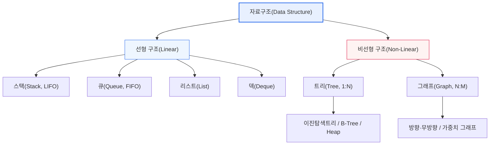
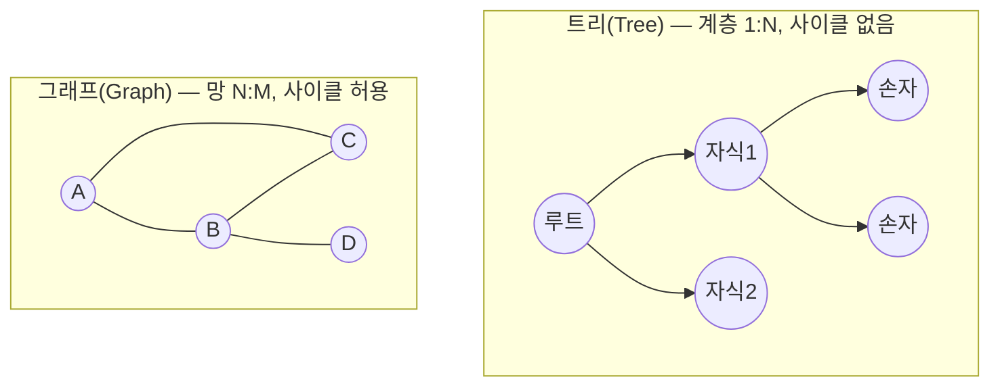

# 데이터 구조: 선형 구조와 비선형 구조

## 1. 개요

### 가. 정의
> **데이터 구조(Data Structure)** 는 데이터를 효율적으로 저장·관리·연산하기 위한 논리적 조직 방식으로, 원소 간 연결 형태에 따라 원소가 일렬로 이어지는 **선형 구조(Linear Structure)** 와 계층·망 형태로 이어지는 **비선형 구조(Non-Linear Structure)** 로 구분된다.

두 구조를 가르는 본질은 '**원소들이 서로 어떻게 연결되어 있는가**'다. 선형 구조는 원소가 일렬로 늘어서 각 원소의 앞뒤에 이웃이 하나씩만 존재하는 1:1 연결이다. 첫 원소와 끝 원소를 제외하면 모든 원소는 정확히 하나의 선행자와 하나의 후행자를 가진다. 반면 비선형 구조는 하나의 원소가 여러 원소와 연결(1:N 또는 N:M)되어 계층이나 그물 형태를 이룬다. 하나의 부모가 여러 자식을 거느리거나, 한 정점이 여러 정점과 간선으로 이어지는 형태다.

이 연결 형태의 차이가 결정적인 이유는, 그것이 곧 **어떤 관계를 표현할 수 있고 탐색·삽입·삭제가 얼마나 효율적인가**를 규정하기 때문이다. 순서가 중요한 데이터(대기 행렬, 함수 호출 이력, 실행 취소 스택)는 선형 구조로 자연스럽게 표현된다. 반면 조직도의 상하 관계, 지하철 노선의 환승 관계, SNS의 친구 관계처럼 하나가 여럿과 얽히는 복잡한 관계는 비선형 구조라야 왜곡 없이 표현된다. 즉 자료구조 선택은 단순한 저장 편의의 문제가 아니라, **문제 도메인의 관계 구조를 코드로 옮기는 모델링의 문제**다.

한 가지 유의할 점은 '선형/비선형'은 어디까지나 **논리적(추상적) 구조**의 구분이라는 것이다. 물리적으로는 선형 구조인 배열이 메모리에 연속 배치되든, 비선형 구조인 트리가 포인터로 흩어져 배치되든, 이는 구현(물리 구조)의 문제다. 예컨대 힙(Heap)은 논리적으로는 완전 이진 트리(비선형)지만 물리적으로는 배열(선형)로 구현된다. 이처럼 논리 구조와 물리 구조를 분리해 이해하는 것이 자료구조 설계의 출발점이다.

### 나. 등장 배경 및 필요성
문제의 데이터 관계 특성에 맞지 않는 구조를 선택하면 성능이 급격히 나빠진다. 예컨대 조직도 같은 계층 관계를 억지로 배열(선형)로 표현하면, 특정 노드의 하위 조직을 찾는 데 전체를 훑어야 하므로 탐색이 O(n)까지 늘어난다. 반대로 단순히 순서대로 쌓고 꺼내면 되는 작업 이력을 트리로 구현하면 불필요한 복잡성만 커진다.

적절한 자료구조 선택은 알고리즘의 시간·공간 복잡도를 직접 좌우한다. 같은 '탐색' 연산이라도 정렬되지 않은 선형 리스트에서는 O(n)이지만, 균형 이진 탐색 트리에서는 O(log n)이다. 데이터가 100만 건일 때 O(n)은 최대 100만 번, O(log n)은 약 20번의 비교로 끝난다. 이 격차가 곧 응답 속도와 처리량의 차이로 나타나므로, 기술사 관점에서 자료구조는 **알고리즘·성능 설계와 분리할 수 없는 기반 기술**이다.

## 2. 데이터 구조의 전체 분류 체계

먼저 데이터 구조가 어떤 갈래로 나뉘는지 전체 지도를 그려 보면, 선형·비선형이 어디에 위치하는지 분명해진다.

```mermaid
flowchart TB
  DS["자료구조(Data Structure)"] --> LN["선형 구조(Linear)"]
  DS --> NL["비선형 구조(Non-Linear)"]
  LN --> ST["스택(Stack, LIFO)"]
  LN --> QU["큐(Queue, FIFO)"]
  LN --> LI["리스트(List)"]
  LN --> DQ["덱(Deque)"]
  NL --> TR["트리(Tree, 1:N)"]
  NL --> GR["그래프(Graph, N:M)"]
  TR --> BST["이진탐색트리 / B-Tree / Heap"]
  GR --> DG["방향·무방향 / 가중치 그래프"]
  style DS fill:#e8f0fe,stroke:#2f6fed,stroke-width:2px
  style LN fill:#eef6ff,stroke:#2f6fed
  style NL fill:#fef3f2,stroke:#e11d48
```

위 분류에서 보듯 선형 구조는 '입출력 규칙'에 따라, 비선형 구조는 '연결의 위상(계층이냐 망이냐)'에 따라 세분된다. 다음 장부터 각 갈래의 원리와 실제 쓰임을 문단으로 풀어 설명한다.

## 3. 선형 구조(Linear Structure)

선형 구조는 데이터를 어떤 규칙으로 넣고 빼느냐에 따라 성격이 완전히 달라진다. 규칙이 곧 그 자료구조의 정체성이며, 이 규칙 덕분에 특정 상황에서 O(1)의 매우 빠른 연산이 보장된다.

### 가. 스택(Stack) — 후입선출(LIFO)
**스택** 은 가장 나중에 넣은 원소를 가장 먼저 꺼내는 후입선출(Last-In-First-Out) 구조다. 접시를 쌓았다가 위에서부터 걷어내는 모습과 같아, 삽입(push)과 삭제(pop)가 모두 '맨 위(top)' 한 곳에서만 일어난다. 이 제약 덕분에 두 연산 모두 O(1)로 처리된다.

스택이 강력한 이유는 '**가장 최근의 상태로 되돌아가는**' 문제에 완벽히 들어맞기 때문이다. 프로그램의 함수 호출 스택이 대표적이다. 함수 A가 B를 부르고 B가 C를 부르면, 반환은 정확히 역순(C→B→A)으로 이뤄져야 하는데 이는 곧 LIFO다. 문서 편집기의 되돌리기(Undo), 웹 브라우저의 '뒤로 가기', 수식의 괄호 짝 검사, 후위 표기식 계산도 모두 스택으로 구현된다. 예를 들어 괄호가 3중으로 중첩된 수식에서 여는 괄호를 push하고 닫는 괄호에서 pop하면, 스택이 비는지 여부로 짝이 맞는지 O(n)에 판정할 수 있다.

주의할 점은 스택의 크기 관리다. 재귀 호출이 너무 깊어지면 호출 스택이 한계를 넘어 스택 오버플로가 발생한다. 실무에서 재귀를 반복문+명시적 스택으로 바꾸거나 꼬리 재귀 최적화를 고려하는 이유가 여기에 있다.

### 나. 큐(Queue) — 선입선출(FIFO)
**큐** 는 먼저 넣은 원소를 먼저 꺼내는 선입선출(First-In-First-Out) 구조로, 매표소 줄서기와 같다. 삽입(enqueue)은 뒤(rear)에서, 삭제(dequeue)는 앞(front)에서 일어난다. 큐는 '**들어온 순서를 공정하게 지켜 처리**'해야 하는 모든 상황의 기반이다.

프린터 인쇄 작업 대기열, OS의 프로세스 스케줄링 대기열, 네트워크 패킷 버퍼, 메시지 큐(Kafka·RabbitMQ) 등이 모두 큐다. 그래프의 너비 우선 탐색(BFS)도 방문할 노드를 큐에 담아 가까운 곳부터 훑는다. 실무에서는 배열을 원형으로 재활용하는 **원형 큐(Circular Queue)** 를 써서 앞쪽이 비었을 때 메모리를 낭비하지 않도록 하고, 생산자-소비자 문제에서는 크기가 한정된 큐로 유량을 제어(백프레셔)한다.

### 다. 리스트(List)와 덱(Deque)
**리스트** 는 원소를 순서대로 담되 임의 위치의 접근·삽입·삭제를 지원하는 범용 구조다. 구현 방식에 따라 성격이 갈리는데, **배열 기반(순차) 리스트** 는 인덱스로 i번째 원소를 O(1)에 즉시 접근할 수 있으나 중간 삽입·삭제 시 원소를 밀어야 해 O(n)이 든다. **연결 리스트(Linked List)** 는 각 노드가 다음 노드의 주소를 가리켜, 중간 삽입·삭제는 포인터만 바꾸면 되므로 O(1)이지만 i번째를 찾으려면 앞에서부터 따라가야 해 O(n)이다. 이 트레이드오프 때문에 '**조회가 잦으면 배열, 삽입·삭제가 잦으면 연결 리스트**'라는 실무 원칙이 성립한다.

**덱(Deque, Double-Ended Queue)** 은 양쪽 끝에서 모두 삽입·삭제가 가능한 구조로, 스택과 큐를 모두 포괄한다. 슬라이딩 윈도우 최댓값 계산, 최근 사용 항목 캐시(LRU) 관리 등에서 앞뒤를 자유롭게 다뤄야 할 때 쓰인다.

아래 표는 선형 구조를 규칙·연산 복잡도·활용 기준으로 정리한 것이다. 표는 어디까지나 앞의 산문 설명을 압축한 보조 자료다.

| 유형 | 규칙 | 대표 연산 복잡도 | 대표 활용 |
|---|---|---|---|
| **스택** | 후입선출(LIFO) | push/pop O(1) | 함수 호출, 되돌리기, 괄호 검사, DFS |
| **큐** | 선입선출(FIFO) | enqueue/dequeue O(1) | 작업 대기열, 스케줄링, 버퍼, BFS |
| **리스트(배열)** | 인덱스 순차 | 접근 O(1), 중간삽입 O(n) | 조회 위주 컬렉션 |
| **리스트(연결)** | 포인터 연결 | 접근 O(n), 삽입 O(1) | 삽입·삭제 잦은 컬렉션 |
| **덱(Deque)** | 양쪽 삽입·삭제 | 양끝 O(1) | 슬라이딩 윈도우, LRU |

## 4. 비선형 구조(Non-Linear Structure)

비선형 구조의 대표는 트리와 그래프다. 두 구조 모두 '하나가 여럿과 연결'되지만, 트리는 사이클이 없는 계층(1:N)이고 그래프는 사이클을 허용하는 망(N:M)이라는 점에서 갈린다. 아래는 트리와 그래프의 위상 차이를 나타낸 세부 개념도다.

```mermaid
flowchart TB
  subgraph 트리["트리(Tree) — 계층 1:N, 사이클 없음"]
    R((루트)) --> C1((자식1))
    R --> C2((자식2))
    C1 --> G1((손자))
    C1 --> G2((손자))
  end
  subgraph 그래프["그래프(Graph) — 망 N:M, 사이클 허용"]
    V1((A)) --- V2((B))
    V2 --- V3((C))
    V3 --- V1
    V2 --- V4((D))
  end
```

### 가. 트리(Tree)
**트리** 는 하나의 루트(root)에서 시작해 부모가 여러 자식을 갖는 계층 구조이며, 사이클이 없고 임의의 두 노드 사이 경로가 유일하다. 트리가 중요한 이유는 '**계층 관계를 그대로 표현하면서도 탐색을 로그 시간으로 끌어내리는**' 힘 때문이다.

가장 널리 쓰이는 **이진 탐색 트리(BST)** 는 '왼쪽 자식 < 부모 < 오른쪽 자식'의 규칙으로 데이터를 정렬 상태로 유지해, 탐색·삽입·삭제를 평균 O(log n)에 수행한다. 다만 입력이 정렬된 순서로 들어오면 한쪽으로 치우쳐 O(n)으로 퇴화하는데, 이를 막기 위해 **AVL 트리·레드블랙 트리** 같은 균형 트리가 회전 연산으로 높이를 자동 조정한다. 디스크 기반 데이터베이스와 파일 시스템은 한 노드가 수백 개의 자식을 갖는 **B-Tree/B+Tree** 를 인덱스로 써서, 디스크 접근 횟수를 트리 높이(보통 3~4단계)로 최소화한다. 수백만 행 테이블에서도 몇 번의 블록 읽기로 원하는 레코드를 찾는 비결이 바로 이 구조다. 또한 우선순위 큐를 구현하는 **힙(Heap)** 은 부모가 항상 자식보다 크거나(작거나) 하다는 규칙으로 최댓값·최솟값을 O(1)에 꺼내고 O(log n)에 재정렬한다.

### 나. 그래프(Graph)
**그래프** 는 정점(Vertex)의 집합과 이들을 잇는 간선(Edge)의 집합으로 정의되며, 관계에 방향이 있으면 방향 그래프, 간선에 비용이 붙으면 가중치 그래프다. 그래프는 '**임의의 개체 간 복잡한 상호 연결**'을 표현하는 가장 일반적인 도구다.

내비게이션의 최단 경로 탐색은 교차로를 정점, 도로를 가중치 간선으로 본 뒤 다익스트라(Dijkstra) 알고리즘을 적용한 결과다. SNS의 친구 추천은 사용자 그래프에서 '친구의 친구'를 찾는 문제이고, 웹 검색의 페이지 순위(PageRank)는 링크 그래프의 중요도 계산이다. 그래프는 인접 행렬(정점 수 V에 대해 O(V²) 공간)이나 인접 리스트(간선 수에 비례하는 O(V+E) 공간)로 구현하는데, 간선이 성긴(sparse) 실제 네트워크에서는 인접 리스트가 훨씬 효율적이다. 탐색은 깊이 우선(DFS, 스택 활용)과 너비 우선(BFS, 큐 활용)이 기본이며, 이는 앞서 본 선형 구조가 비선형 구조의 탐색 엔진으로 쓰이는 좋은 예다.

| 유형 | 연결 형태 | 핵심 변형 | 활용 |
|---|---|---|---|
| **트리(Tree)** | 계층 1:N, 사이클 없음 | BST, AVL, B-Tree, Heap | 인덱스, 파일시스템, 우선순위 큐 |
| **그래프(Graph)** | 망 N:M, 사이클 허용 | 방향·가중치·이분 그래프 | 최단경로, SNS, 추천, PageRank |

## 5. 선형 vs 비선형 비교 — 차이가 생기는 이유

두 구조의 차이는 표면적인 모양이 아니라 '**표현하려는 관계의 성질**'에서 비롯된다. 선형 구조는 시간·순서처럼 한 줄로 세울 수 있는 관계에 최적화되어 있고, 그래서 탐색도 앞에서 뒤로 순차적으로 흐른다. 비선형 구조는 한 줄로 세울 수 없는 계층·네트워크 관계를 담기 위해 태어났고, 그래서 여러 갈래로 뻗어 나가는 DFS·BFS 같은 탐색이 필요하다. 즉 탐색 방식의 차이는 연결 형태의 차이에서 필연적으로 파생된 결과다.

실무적 함의도 여기서 나온다. 순서만 지키면 되는 로그·이력·버퍼는 선형으로 구현해 구현 단순성과 O(1) 연산을 얻는 편이 낫고, 다대다로 얽힌 관계나 계층 탐색이 핵심인 문제(추천·경로·조직)는 처음부터 비선형으로 설계해야 나중에 성능 병목과 재설계 비용을 피할 수 있다.

| 구분 | 선형 구조 | 비선형 구조 |
|---|---|---|
| **연결** | 1:1(일렬) | 1:N, N:M(계층·망) |
| **표현 관계** | 순서·시간 관계 | 계층·네트워크 관계 |
| **탐색** | 순차 탐색 | DFS·BFS(경로·계층 탐색) |
| **대표 예** | 스택·큐·리스트·덱 | 트리·그래프 |
| **적합 상황** | 순서 있는 데이터, 버퍼·이력 | 복잡한 관계·계층·경로 데이터 |
| **구현 유의** | 오버플로·원형 재활용 | 균형 유지·사이클 처리 |

## 6. 심화 — 응용 자료구조와 실무 적용 전략

현대 시스템은 순수한 선형·비선형을 그대로 쓰기보다, 둘을 결합하거나 특화한 **응용 자료구조**를 쓴다. 이를 이해하는 것이 기술사 수준의 깊이다.

첫째, **해시 테이블(Hash Table)** 은 키를 해시 함수로 배열 인덱스에 사상해 평균 O(1) 탐색을 실현하되, 충돌 해결에 연결 리스트(체이닝)를 결합한다. 선형 구조(배열+리스트)를 조합해 '거의 상수 시간 조회'라는 새로운 성질을 만들어 낸 사례다. 대규모 캐시(Redis)와 데이터베이스 조인의 핵심이다.

둘째, 데이터베이스 인덱스 설계는 곧 자료구조 선택이다. 범위 검색(BETWEEN)과 정렬이 잦으면 정렬 상태를 유지하는 **B+Tree 인덱스**, 등가 검색만 필요하면 **해시 인덱스**를 택한다. 실제로 100만 행 테이블에서 인덱스 없이 조회하면 전체 스캔 O(n)이지만, B+Tree 인덱스가 있으면 몇 번의 노드 탐색으로 끝나 응답 시간이 수십 배 개선되는 경우가 흔하다.

셋째, 최근에는 그래프 관계 자체를 저장·질의하는 **그래프 데이터베이스(Neo4j 등)** 가 부상했다. 관계형 DB에서 다단계 조인으로 표현하던 '친구의 친구의 친구'를 그래프 순회로 직접 처리해, 관계 탐색이 지배적인 추천·사기 탐지·지식 그래프 도메인에서 성능 이점을 보인다. 이는 도메인의 관계 구조에 맞는 저장소를 고르는 것이 여전히 근본 원리임을 보여 준다.

## 7. 고려사항 및 시사점

1. **데이터의 관계 특성에 맞는 구조 선택이 성능을 좌우한다.** 순서·이력은 선형, 계층·관계는 비선형이 자연스럽고 효율적이다. 잘못된 선택은 단순한 비효율을 넘어 확장 단계에서 전면 재설계를 부르므로, 설계 초기에 도메인의 관계 구조를 먼저 분석해야 한다.

2. **자료구조 선택은 알고리즘 복잡도(빅오)와 직결된다.** 같은 문제도 어떤 구조를 쓰느냐에 따라 O(n)과 O(log n), 심지어 O(1)로 갈린다. 자료구조와 알고리즘은 함께 설계해야 하며, '탐색·삽입·삭제 중 무엇이 지배적 연산인가'를 먼저 정한 뒤 그 연산이 빠른 구조를 골라야 한다.

3. **시간-공간 트레이드오프를 항상 저울질해야 한다.** 해시 테이블은 빠른 조회를 위해 여유 메모리를 쓰고, 인접 행렬은 밀집 그래프에 유리하나 성긴 그래프에는 공간을 낭비한다. 메모리 제약이 큰 임베디드·모바일 환경에서는 공간 효율이, 대용량 서버에서는 시간 효율이 우선될 수 있다.

4. **논리 구조와 물리 구현을 분리해 판단해야 한다.** 힙이 배열로, 그래프가 인접 리스트로 구현되듯, 같은 논리 구조도 접근 패턴·캐시 지역성·디스크 특성에 따라 최적 구현이 달라진다. 특히 디스크·SSD 기반에서는 캐시 지역성과 블록 접근 횟수가 이론적 복잡도만큼 중요하다.

5. **응용·특화 구조로의 확장을 상시 검토한다.** 균형 트리·해시 테이블·그래프 DB처럼 기본 구조를 조합·특화한 해법이 계속 발전하므로, 문제 규모와 접근 패턴이 바뀌면 자료구조 선택도 재평가해야 한다.

---

> **한 줄 요약**: 선형 구조(스택·큐·리스트·덱)는 원소가 1:1로 일렬 연결되어 순서 관계를 O(1) 연산으로 다루고, 비선형 구조(트리·그래프)는 1:N·N:M의 계층·망으로 연결되어 복잡한 관계와 로그 시간 탐색을 지원하며, 데이터의 관계 특성에 맞는 구조 선택이 탐색 효율과 알고리즘 복잡도를 결정한다.
