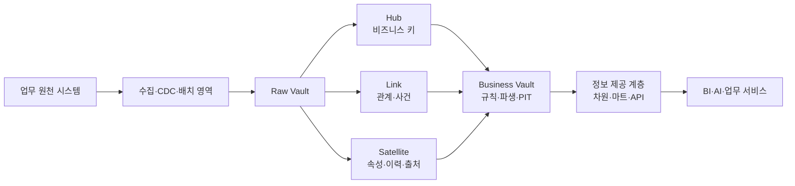
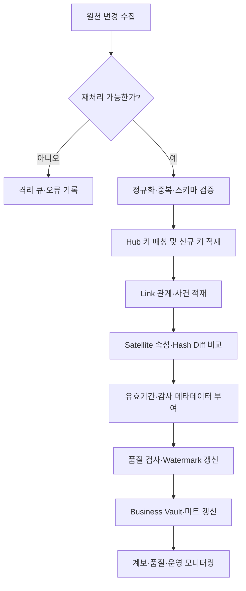

# Data Vault 2.0 기반 데이터 웨어하우스 모델링

## 1. 개요

### 가. 정의

> **Data Vault 2.0**은 업무 변화를 수용하는 확장형 데이터 웨어하우스를 위해 비즈니스 키를 보존하는 Hub, 관계를 표현하는 Link, 맥락·이력을 저장하는 Satellite로 데이터를 분리하고, 병렬 적재·이력 보존·감사 가능성을 중심으로 Raw Vault와 Business Vault를 설계하는 데이터 모델링 방법론이다.

Data Vault는 특정 데이터베이스 제품이나 단순한 테이블 템플릿이 아니다.
업무 시스템이 계속 추가되고 소스 스키마가 바뀌는 상황에서 원천 데이터를 가능한 한 손실 없이 적재하고, 나중에 업무 규칙과 분석 요구를 재현할 수 있도록 저장 구조와 적재 원칙을 함께 제시한다.
따라서 Hub·Link·Satellite라는 세 종류의 테이블 이름만 외우면 답안의 핵심을 놓치게 된다.
핵심은 식별자와 관계, 맥락과 이력을 서로 다른 변화 속도로 분리하여 변경을 국소화하는 데 있다.

전통적인 차원 모델은 분석 질의에 바로 쓰기 좋은 스타 스키마를 제공하지만, 새로운 소스나 속성이 들어올 때 차원과 사실 테이블을 다시 조정해야 하는 경우가 많다.
반면 Data Vault는 원천의 사실을 Raw Vault에 먼저 기록하고, 소비자에게 필요한 비즈니스 규칙과 성능 최적화를 Business Vault와 정보 제공 계층에서 수행한다.
이 분리는 원천 보존과 사용 편의성이라는 서로 다른 목표를 한 모델에 과도하게 요구하지 않도록 한다.

Data Vault의 역사 보존은 단순한 백업과 다르다.
어떤 소스에서 어느 시각에 어떤 키와 속성이 유입되었는지, 그 값이 언제 유효했는지, 어떤 적재 배치가 만들었는지를 추적할 수 있어야 한다.
이러한 시간성과 출처는 재무·고객·공급망 분석에서 결과를 재현하고, 데이터 오류의 원인을 역추적하며, 규제 감사에 대응하는 기반이 된다.

### 나. 등장 배경과 필요성

첫째, 기업 데이터 환경은 인수·합병, SaaS 도입, 조직 개편, 마이크로서비스 분리로 인해 소스가 계속 늘어난다.
처음에는 ERP 한 개만 통합하던 웨어하우스가 CRM, 주문 플랫폼, IoT, 외부 파트너 데이터까지 연결되면 같은 고객을 식별하는 규칙과 갱신 주기가 서로 달라진다.
모든 소스를 처음부터 완벽하게 통합하려 하면 공통 모델 합의가 병목이 되고, 요구사항이 확정되기 전에 설계가 낡을 수 있다.

둘째, 분석 결과가 현재 값만 보여 주면 과거의 의사결정을 재현하기 어렵다.
고객 등급이나 상품 분류가 바뀌었을 때 과거 주문을 현재 기준으로 다시 분류하면 당시 보고서와 다른 결과가 나온다.
Data Vault는 관측 시각, 적재 시각, 원천 식별자와 변경 이력을 분리하여 “그때 데이터가 무엇이었는가”와 “현재 업무상 어떻게 해석하는가”를 구분한다.

셋째, 데이터 적재 파이프라인을 소스별로 병렬화할 필요가 있다.
중앙 통합 테이블에 모든 변환을 한 번에 몰아넣으면 특정 소스의 지연이나 스키마 변경이 전체 적재를 막는다.
Hub·Link·Satellite를 업무 키와 관계 단위로 분해하면 소스별 수집과 속성별 이력 적재를 독립적으로 운영할 수 있다.

넷째, 데이터 레이크와 클라우드 웨어하우스에서는 저장 비용보다 변경 대응과 운영 자동화가 더 큰 비용이 될 수 있다.
Data Vault는 원천 보존 계층, 이력 계층, 규칙 계층을 분리해 메타데이터 기반 자동 생성과 반복 가능한 적재 패턴을 적용하기 쉽게 한다.
다만 원천 데이터를 모두 저장한다고 해서 무조건 좋은 것은 아니며, 개인정보 최소수집과 보존기간 정책을 함께 설계해야 한다.

### 다. 핵심 목표와 적용 범위

Data Vault의 첫 번째 목표는 **변경에 대한 탄력성**이다.
새로운 속성은 Satellite를 추가하거나 기존 Satellite의 이력 구조를 확장하는 방식으로 수용할 수 있고, 새로운 관계는 Link로 분리할 수 있다.
이는 전체 통합 모델을 매번 재작성하지 않고 변화가 발생한 영역만 수정하게 한다.

두 번째 목표는 **감사 가능성과 재현성**이다.
각 행에 원천 시스템, 적재 시각, 배치 식별자, 레코드의 유효 시각 같은 기술 메타데이터를 보존하면 결과가 어디서 왔는지 설명할 수 있다.
그러나 기술 메타데이터가 있다고 의미가 자동으로 정합해지는 것은 아니므로 업무 용어, 데이터 계약, 품질 규칙을 별도로 연결해야 한다.

세 번째 목표는 **병렬성과 확장성**이다.
고객 정보와 계약 정보, 주문과 결제 관계를 서로 독립된 흐름으로 적재하고, 여러 소스의 Satellite를 병렬 처리하면 대규모 배치와 스트리밍을 조합할 수 있다.
이때 병렬성은 테이블을 잘게 쪼개는 것만으로 생기지 않으며, 중복 이벤트, 순서 뒤바뀜, 재처리와 키 충돌을 제어하는 멱등성 설계가 전제된다.

Data Vault가 적합한 범위는 소스가 많고 변경이 잦으며 장기 이력과 추적성이 중요한 통합 분석 플랫폼이다.
반대로 단일 소스의 단순 리포트나 소규모 업무 데이터베이스에는 Hub·Link·Satellite를 도입하는 오버헤드가 더 클 수 있다.
기술사 답안에서는 “모든 데이터 웨어하우스에 적용”이라고 단정하지 말고, 변화율·감사 수준·분석 지연시간·운영 역량을 기준으로 적용 여부를 판단해야 한다.

## 2. 구성요소와 데이터 흐름

### 가. 전체 구조

원천 시스템은 ERP, CRM, 주문, 결제, 센서, 파일, 외부 API처럼 서로 다른 스키마와 갱신 주기를 갖는다.
수집 계층은 전체 데이터를 한 번에 업무 의미로 바꾸기보다 원천 식별자와 변경 이벤트를 보존하면서 Raw Vault로 전달한다.
CDC를 사용하는 경우에는 생성·수정·삭제 이벤트의 순서와 재처리 위치를 함께 관리해야 하며, 배치 파일을 사용하는 경우에는 파일 해시와 수신 시각을 관리해야 한다.

Raw Vault는 원천 사실을 가능한 한 가공 없이 보존하는 계층이다.
여기서 “가공하지 않는다”는 말은 모든 원본을 무제한 저장한다는 뜻이 아니라, 업무 의미를 임의로 덮어쓰지 않고 추적 가능한 규칙으로 정규화한다는 뜻이다.
문자 인코딩, 표준 시각, 키 정규화처럼 기술적 처리는 필요할 수 있지만, 원천 값과 변환 이력을 잃지 않아야 한다.

Business Vault는 여러 원천을 결합하여 업무 분석에 필요한 파생 규칙을 적용하는 계층이다.
Point-in-Time 테이블, Bridge 테이블, 현재 상태 플래그, 효과성 판단, 중복 제거 결과 등이 이 계층에 놓일 수 있다.
이렇게 하면 Raw Vault는 원천 변경에 안정적으로 남고, 정책 변경은 Business Vault에서 버전 관리할 수 있다.

정보 제공 계층은 사용자 질의와 도구의 성능에 맞게 스타 스키마, 와이드 테이블, 데이터 마트, 피처 뷰 등으로 구성한다.
최종 사용자는 Hub나 Satellite를 직접 조인하기보다 의미가 명확하고 품질 SLO가 정의된 데이터 제품을 사용해야 한다.
Raw Vault의 정규성과 감사성, 마트의 사용성과 성능은 서로 다른 최적화 목표이므로 계층을 분리하는 것이 설계의 핵심이다.

### 나. Hub: 비즈니스 키의 안정적 중심

Hub는 고객번호, 계약번호, 상품코드, 계좌번호처럼 업무에서 독립적으로 식별되는 핵심 비즈니스 개체를 표현한다.
Hub의 중심에는 비즈니스 키가 있으며, 단순한 데이터베이스 자동 증가 번호가 아니라 소스가 바뀌어도 업무적으로 같은 대상을 가리키는 식별자가 필요하다.
소스가 여러 개라면 원천 시스템 코드와 원천 키를 함께 보관해 충돌을 방지하고, 통합 식별자와 매핑 관계를 명확하게 해야 한다.

Hub에는 보통 Hub Key, Business Key, Load Date, Record Source와 같은 속성을 둔다.
Hub Key는 조인과 참조의 안정성을 제공하고, Business Key는 업무 의미와 중복 판단의 근거가 된다.
Load Date는 데이터가 플랫폼에 들어온 시각이며, 업무 이벤트가 발생한 시각이나 유효 시작 시각과 같다고 가정해서는 안 된다.

Hub에 고객의 이름, 주소, 등급과 같은 변하는 설명 속성을 넣지 않는 이유는 변화 속도가 다르기 때문이다.
이런 속성을 Hub에 넣으면 고객 정보가 바뀔 때마다 Hub 행을 갱신해야 하고, 식별자와 설명의 역할이 섞여 이력 추적이 어려워진다.
속성은 Satellite에 두어 변경 시 새 버전을 추가하고, Hub는 개체의 존재와 식별에 집중하게 한다.

비즈니스 키는 그럴듯해 보인다고 바로 통합 키로 사용해서는 안 된다.
시스템 A의 고객번호와 시스템 B의 회원번호가 같은 고객을 뜻한다고 확정하려면 매핑 규칙, 중복 해소 기준, 업무 소유자 승인과 예외 처리 절차가 필요하다.
키가 불안정하거나 재사용된다면 원천 시스템 식별자와 유효기간을 함께 보존하고, 통합 고객 식별은 별도 매핑 모델로 관리한다.

### 다. Link: 관계와 사건의 기록

Link는 Hub 사이의 관계나 업무 사건을 표현한다.
고객과 계약의 관계, 주문과 상품의 관계, 계좌와 거래의 관계처럼 둘 이상의 업무 개체가 함께 의미를 만들 때 Link를 사용한다.
Link에 관계의 속성을 과도하게 넣기보다는, 관계의 발생 자체와 참여 키를 보존하고 변화하는 설명은 Satellite로 분리하는 것이 일반적인 원칙이다.

Link는 단순한 다대다 연결 테이블 이상의 의미를 가진다.
주문·결제·배송처럼 시간에 따라 발생하는 사건은 참여 Hub와 발생 시각을 결합해 분석의 중심이 된다.
같은 Hub 조합이 여러 번 발생할 수 있는 사건이면 비즈니스 키만으로 중복을 제거해서는 안 되고, 거래번호·이벤트번호·발생순번 같은 사건 식별자를 별도로 고려해야 한다.

관계가 세 개 이상의 Hub에 걸치면 링크를 어떻게 분해할지 신중해야 한다.
예를 들어 주문, 고객, 판매점, 상품이 동시에 참여하는 거래에서 하나의 링크에 모든 키를 넣으면 의미는 분명하지만 변경과 재사용이 어려워질 수 있다.
반대로 작은 링크로 무조건 분해하면 조인 복잡도와 중복 사건 가능성이 커지므로, 업무 사건의 원자성과 분석 질의를 기준으로 설계한다.

Link의 Satellite에는 상태, 역할, 수량, 계약 조건, 유효기간처럼 관계에 귀속되는 속성을 저장할 수 있다.
상품 자체의 색상은 상품 Hub의 Satellite에 있어야 하지만, 주문 시점의 판매가격과 할인율은 주문-상품 관계의 Satellite에 있어야 과거 거래를 재현할 수 있다.
속성의 귀속 대상을 잘못 정하면 고객·상품 변경이 과거 주문을 오염시키는 문제가 생긴다.

### 라. Satellite: 맥락·이력·출처

Satellite는 Hub 또는 Link에 종속된 설명 속성과 그 변화 이력을 저장한다.
고객 이름·주소, 계약 상태, 상품 설명, 신용평가 결과, 주문 상태가 대표적인 예다.
Satellite는 데이터의 의미와 변화 주기가 비슷한 속성을 묶고, 보안 등급과 소유 조직이 다른 속성은 분리하여 접근 통제와 변경 관리를 쉽게 한다.

Satellite의 한 행은 대체로 부모 키, Load Date, Hash Diff, Record Source, 속성 값으로 구성된다.
Hash Diff는 이전 버전과 속성 집합이 달라졌는지 빠르게 판단하는 데 쓰일 수 있지만, 해시가 같다고 업무 의미가 반드시 동일하다고 증명되는 것은 아니다.
해시 알고리즘, 문자열 정규화, null 표현, 컬럼 순서, 인코딩 규칙을 표준화하지 않으면 같은 값이 다른 해시가 되거나 서로 다른 값이 같은 비교 규칙으로 처리될 수 있다.

속성 그룹을 하나의 Satellite에 모두 넣을지 여러 개로 나눌지는 변경률과 보안 경계를 기준으로 결정한다.
매일 바뀌는 고객 상태와 거의 바뀌지 않는 인구통계 속성을 함께 두면 작은 변경에도 큰 행이 반복 저장되고, 개인정보 접근 범위도 불필요하게 넓어진다.
반면 너무 세분화하면 조인이 많아지고 메타데이터 관리가 복잡해지므로, 의미·변경주기·소유권·보안등급의 공통성을 확인한다.

Satellite는 현재값 테이블이 아니라 이력 테이블이라는 점이 중요하다.
현재 상태만 제공해야 하는 서비스는 Business Vault나 정보 제공 계층에서 최신 행을 판별해 만든다.
Raw Vault의 이력을 직접 삭제하거나 덮어써서 최신 상태를 만들면 과거 보고서 재현과 감사 가능성을 잃게 되므로, 원본 계층과 소비 계층의 목적을 분리한다.

## 3. 적재 절차와 키 설계

### 가. 적재 순서

먼저 원천 이벤트 또는 파일을 수집하고, 수신 ID와 체크포인트를 저장해 같은 입력을 다시 처리할 수 있게 한다.
수집 성공과 비즈니스 적재 성공은 별개의 상태로 관리해야 한다.
파일을 받았다는 사실만으로 Hub·Link·Satellite에 모두 정상 반영되었다고 표시하면 장애 복구 시 누락 구간을 찾기 어렵다.

다음 단계에서는 키 정규화, 시간대 통일, 필수 필드 검사, 스키마 버전 확인, 중복 이벤트 판별을 수행한다.
이 단계에서 원천 값을 무조건 버리기보다 오류 행을 격리 영역에 보존하고, 오류 코드와 재처리 가능 여부를 기록한다.
품질 검사를 통과하지 못한 행을 조용히 제외하면 적재 건수는 성공처럼 보여도 분석 결과가 조용히 줄어드는 더 위험한 문제가 생긴다.

Hub는 먼저 업무 키가 이미 존재하는지 확인하고, 신규 키이면 Hub Key를 생성한다.
Hash Key를 사용하는 경우 키 생성 함수와 입력 필드 순서를 표준화하여 서로 다른 파이프라인이 같은 개체에 같은 키를 만들도록 한다.
해시 충돌 가능성, 알고리즘 교체, 키 길이, 대소문자와 공백 정규화 정책을 설계서에 명시해야 한다.

Hub가 준비된 뒤 Link를 적재하면 참여 Hub의 키를 참조할 수 있다.
관계의 원천 사건 ID를 유일성 기준에 포함하고, 같은 사건이 재전송되어도 한 번만 반영되는 멱등 키를 마련한다.
Satellite는 부모 키와 속성 변경 여부를 비교해 실제 변화가 있을 때 새 이력 행을 추가하며, 반복 수신된 동일 이벤트는 중복 행을 만들지 않도록 한다.

마지막으로 적재 건수, 신규 Hub 수, 미매핑 키 수, Link 고아 행 수, Satellite 변경률, 지연시간을 검증한다.
검증 결과는 파이프라인 로그뿐 아니라 데이터 품질 저장소와 운영 대시보드에서 조회할 수 있어야 한다.
Watermark는 마지막으로 성공한 입력 위치를 나타내므로, 실패한 단계의 입력을 건너뛰지 않도록 커밋 순서와 재처리 범위를 함께 관리한다.

### 나. 효과성·시점 모델

Data Vault에서 Load Date는 플랫폼에 관측된 시점이고, Effective Date는 업무적으로 값이 유효한 시점이다.
예를 들어 9월 1일에 발생한 고객 등급 변경이 네트워크 장애로 9월 3일 도착했다면, 두 날짜는 다르다.
분석자가 “9월 2일 당시 우리가 알고 있던 값”을 원하는지, “업무상 9월 1일부터 적용된 값”을 원하는지에 따라 조회 규칙이 달라진다.

이 두 시점을 혼동하면 늦게 도착한 데이터를 과거 기간에 반영할 때 보고서가 달라지거나, 당시 의사결정에 사용된 데이터와 현재 재계산한 데이터가 일치하지 않는다.
따라서 Satellite에 유효 시작·종료 시각, 적재 시각, 원천 이벤트 시각을 필요한 수준으로 저장하고, 시간 기준을 데이터 계약에 명시한다.

현재 행을 찾는 로직도 단순히 가장 큰 Load Date를 고르는 것으로 충분하지 않을 수 있다.
미래 유효 행, 늦게 도착한 수정, 동일 시각의 다중 이벤트, 삭제 표시가 함께 존재할 수 있기 때문이다.
Business Vault에서 업무 우선순위와 시점 규칙을 명시한 PIT·현재 상태 뷰를 생성하고, 소비자가 임의로 최신 행을 고르지 않게 하는 것이 안전하다.

### 다. 데이터 품질과 멱등성

멱등성은 같은 입력을 한 번 처리하든 여러 번 처리하든 최종 결과가 같도록 만드는 성질이다.
Data Vault는 재처리와 병렬 적재를 전제로 하므로, 부모 키와 원천 이벤트 식별자, 속성 해시, 적재 배치 정보를 조합해 중복 방지 기준을 만든다.
단순히 파이프라인 실행 ID를 키로 삼으면 재실행마다 같은 데이터가 새 행으로 쌓이는 문제가 생긴다.

대표 품질 규칙은 Hub 비즈니스 키의 필수성, Hub Key의 유일성, Link 참여 키의 참조 가능성, Satellite 부모 키의 존재, 유효기간 겹침, Record Source의 허용 목록, Hash Diff 재현성이다.
이 규칙은 적재 후 샘플 조회만으로 끝내지 않고, 배치마다 자동 검증하여 실패 시 소비 계층으로 전파되지 않게 한다.

원천 삭제도 중요한 품질 항목이다.
소프트 삭제 플래그를 전달하는지, 삭제 이벤트가 별도로 오는지, 보존정책 때문에 물리 삭제가 필요한지에 따라 모델이 달라진다.
개인정보 삭제 요구는 Raw Vault의 “역사 보존” 원칙보다 우선할 수 있으므로, 토큰화·분리 보관·삭제 증적·백업 만료를 포함한 정책을 데이터 모델과 운영 절차에 반영한다.

## 4. Data Vault 2.0과 다른 모델의 비교

### 가. 스타 스키마와의 차이

스타 스키마는 사실 테이블과 차원 테이블을 중심으로 질의 경로가 단순하고, BI 도구가 이해하기 쉽다.
따라서 사용자 대시보드의 응답시간과 업무 용어 중심의 사용성을 최우선으로 한다면 스타 스키마가 직접적인 선택이 될 수 있다.
그러나 여러 소스의 원천 이력과 변경 과정을 한 모델에서 동시에 표현하려 하면 차원 변경 관리와 ETL 복잡도가 커질 수 있다.

Data Vault는 Raw Vault에서 이력과 출처를 우선 보존하고, 최종 사용자 편의를 위한 스타 스키마를 별도 계층에서 생성한다.
그 결과 Raw Vault는 조인이 많고 바로 질의하기 어렵지만, 새로운 소스와 속성을 수용할 때 전체 차원 모델을 흔들지 않는다.
두 모델은 경쟁 관계라기보다 저장·통합 계층과 소비·표현 계층에서 역할이 다를 수 있다.

| 비교 항목 | Data Vault 2.0 | 스타 스키마 | 실무적 판단 |
|---|---|---|---|
| 기본 목적 | 변경 탄력성·이력·감사 | 분석 질의 단순화·성능 | 계층별 목표를 분리 |
| 중심 구조 | Hub·Link·Satellite | Fact·Dimension | 소스 수와 소비자 수를 고려 |
| 스키마 변경 | 영향 범위를 국소화 | 차원·사실 재설계 가능성 | 변경률이 높으면 Vault 유리 |
| 사용자 접근 | 직접 사용보다 마트 생성 | BI 도구에 친화적 | 최종 제공 계층에 적합 |
| 저장량·조인 | 이력과 기술 메타데이터로 증가 | 비교적 단순 | 저장비와 쿼리비를 함께 계산 |
| 감사·재현 | 원천·시점·출처 추적에 강함 | 구현 방식에 따라 다름 | 규제·감사 요구를 우선 평가 |

예를 들어 금융기관이 고객·계좌·거래 원천을 통합하면서 매년 상품과 규정이 바뀐다면 Data Vault로 원천 이력과 관계를 보존하고, 월말 손익 마트는 스타 스키마로 제공할 수 있다.
반대로 한 부서가 한 시스템의 일별 판매량만 조회한다면 Data Vault를 중간에 넣는 것보다 단순한 차원 모델이나 집계 테이블이 운영상 합리적일 수 있다.

### 나. 데이터 레이크·레이크하우스와의 차이

데이터 레이크는 다양한 형식의 원천 데이터를 저비용으로 보관하는 데 강하고, 레이크하우스는 오브젝트 스토리지 위에 트랜잭션·스키마·테이블 관리를 결합한다.
Data Vault는 저장 매체보다 통합 모델과 이력 관리 원칙에 초점을 둔다.
따라서 레이크하우스 위에 Raw Vault를 구현하거나, 웨어하우스 엔진에 Data Vault를 구현하는 조합이 가능하다.

레이크의 원본 영역은 구조 변화와 비정형 데이터를 폭넓게 담지만, 업무 키·관계·이력의 의미가 일관되게 관리되지 않으면 소비자가 각자 해석하게 된다.
Data Vault는 원천 보존과 별개로 비즈니스 키와 관계를 명시하여 통합 카탈로그와 계보를 만들기 쉽게 한다.
다만 모든 원천을 Vault 테이블로 복제하면 레이크의 유연성과 비용 이점을 잃을 수 있으므로, 원본 영역과 정합성 높은 통합 영역의 역할을 구분한다.

### 다. 3NF 모델과의 차이

3NF 모델은 함수적 종속과 중복 제거를 통해 업무 데이터를 정규화하고 갱신 이상을 줄인다.
업무 트랜잭션의 정확한 상태 관리에는 강하지만, 여러 소스의 역사와 출처를 분석 관점에서 유지하려면 별도의 이력 설계가 필요하다.
Data Vault도 구성요소 내부에서 중복을 줄이지만, 분석용 최소 테이블 수보다 변화 격리와 이력 보존을 우선한다.

3NF와 Data Vault의 선택은 “정규화가 좋은가”의 문제가 아니라 업무 목적과 시간축의 문제다.
운영계의 주문 처리에는 3NF와 강한 제약이 적합하고, 장기간의 원천 통합과 변경 추적에는 Vault가 적합할 수 있다.
하나의 데이터 플랫폼 안에서도 운영계·Raw Vault·Business Vault·마트가 서로 다른 모델을 사용할 수 있다.

## 5. 적용 사례와 심화

### 가. 유통·커머스 사례

여러 온라인 채널과 오프라인 매장이 고객·상품·주문을 서로 다른 키로 관리한다고 가정하자.
고객 Hub는 각 소스의 원천 키와 통합 매핑을 보존하고, 주문 Link는 고객·상품·판매채널·주문 사건을 연결한다.
주문 시점의 가격과 할인은 Link Satellite에 두어 상품의 현재 가격이 바뀌어도 과거 주문 금액이 변하지 않게 한다.

이 구조의 장점은 새 판매채널이 추가될 때 기존 주문 마트의 모든 ETL을 다시 설계하지 않고, 채널 소스의 Hub 매핑과 관련 Link·Satellite를 추가할 수 있다는 점이다.
하지만 동일 고객 판별이 부정확하면 고객 생애가치가 중복 집계되므로, 키 매핑의 신뢰도와 수동 검토 큐를 운영해야 한다.
또한 주문 취소·부분 환불·재배송은 단순한 현재 상태 갱신이 아니라 사건의 순서와 금액을 보존해야 하는 Link 설계 과제다.

### 나. 제조·공급망 사례

제조기업은 공장·설비·자재·공급업체·생산오더가 서로 다른 시스템에 존재하고, 설비 센서와 품질검사 데이터가 지속적으로 들어온다.
설비 Hub와 생산오더 Hub, 설비-오더 Link를 두고, 상태·정비 이력·검사 결과를 Satellite로 분리하면 센서 시스템 교체와 ERP 개편을 별도로 수용할 수 있다.

Business Vault에서는 생산오더와 검사 결과를 결합해 불량률, 설비별 가동시간, 공급업체별 납기 지표를 계산한다.
이때 센서 이벤트 시각과 수집 시각이 다르므로, 지연 도착 이벤트를 어느 생산 기간에 귀속할지 규칙을 명시해야 한다.
실시간 제어가 필요한 경우에는 Data Vault를 제어 루프의 직접 저장소로 사용하지 않고, 운영 시스템과 분석 플랫폼을 분리하는 것이 안전하다.

### 다. 공공·규제 데이터 사례

공공기관은 사업별 시스템과 위탁기관이 많고, 법령·코드·조직이 바뀌어 과거 통계의 재현성이 중요하다.
Raw Vault에 원천 기관, 수신 파일, 적용 코드 버전, 적재 배치를 기록하면 집계 결과의 근거를 설명하기 쉬워진다.
Business Vault에서는 정책에 따른 대상자 판정과 통계 기준을 버전으로 관리하여, 같은 원천이라도 당시 규칙과 현재 규칙의 결과를 구분할 수 있다.

다만 공공 데이터에는 주민식별정보와 민감정보가 포함될 수 있다.
원천 이력 보존을 이유로 접근권한을 넓히면 안 되며, 토큰화·암호화·열 단위 접근제어·접근 로그·보존기간·파기 검증을 Data Vault 운영에 포함해야 한다.
감사 가능한 모델은 데이터를 영원히 보관하는 모델이 아니라, 보관 목적과 파기 증적까지 설명할 수 있는 모델이다.

### 라. 최신 실무 확장 방향

현대의 Data Vault 2.0 구현은 SQL 스크립트를 사람이 반복 작성하는 방식에서 메타데이터 기반 자동화로 이동하고 있다.
Hub·Link·Satellite의 정의, 소스 매핑, 키 규칙, 품질 규칙을 메타데이터로 관리하면 테이블·적재 코드·문서·계보를 함께 생성할 수 있다.
그러나 자동 생성은 잘못된 업무 키나 잘못된 속성 귀속을 빠르게 확산시킬 수 있으므로, 도메인 전문가 승인과 변경 이력은 반드시 남겨야 한다.

CDC와 스트리밍을 결합할 때는 순서, 중복, 지연 도착, 삭제, 스키마 진화를 함께 처리해야 한다.
이벤트의 도착 순서만 믿지 않고 원천 로그 위치와 이벤트 시각, 워터마크, 보정 처리 정책을 저장해야 한다.
실시간성이 중요하더라도 모든 소비자가 원천 이벤트를 직접 읽게 만들기보다, 검증된 Business Vault 뷰와 품질 상태를 제공하는 것이 운영 안정성에 유리하다.

## 6. 고려사항 및 시사점

### 가. 비즈니스 키와 통합 식별자

비즈니스 키 선정은 모델의 성패를 좌우한다.
업무적으로 안정적인 키인지, 시스템 간 의미가 같은지, 재사용·변경·복합키 여부가 무엇인지 확인하고, 키 소유자와 예외 처리 규칙을 문서화한다.
Hash Key는 성능과 분산 적재에 유용하지만, 업무 키의 의미를 대체하지 않으며 해시 입력 표준화와 충돌 대응이 필요하다.

### 나. 역사 보존과 개인정보 최소화의 균형

Raw Vault의 보존성은 개인정보와 충돌할 수 있다.
민감 속성은 별도 Satellite와 권한 영역으로 분리하고, 분석 계층에는 토큰이나 비식별 키만 제공하며, 목적 달성 후 파기와 백업 만료까지 관리한다.
삭제 요청이 발생했을 때 원천·파생·캐시·백업의 처리 범위를 계보로 확인하고, 삭제 결과를 감사 증적으로 남겨야 한다.

### 다. 성능과 비용

Hub·Link·Satellite는 이력과 메타데이터를 많이 저장하고 조인 수가 증가할 수 있다.
자주 사용하는 시점 조인은 PIT 테이블과 집계 뷰로 최적화하되, 갱신 주기와 재계산 비용을 측정해야 한다.
클라우드에서는 저장비만 줄이기 위해 원천 이력을 삭제하기보다, 파티션·압축·클러스터링·저장등급·보존기간을 조합해 비용과 재현성을 함께 최적화한다.

### 라. 데이터 품질과 운영 책임

Data Vault는 데이터 품질을 자동으로 보장하는 모델이 아니다.
키 중복, 고아 Link, 유효기간 겹침, 누락 이벤트, 스키마 변경, 지연 도착을 품질 규칙으로 정의하고, 임계치를 넘으면 소비 계층에 경고·차단·보정 상태를 전달해야 한다.
각 데이터 제품의 소유자, 원천 시스템 담당자, 플랫폼 운영자, 보안 담당자의 책임 경계를 RACI로 정한다.

### 마. 모델링 거버넌스

Hub·Link·Satellite를 어떤 상황에서 추가할지, Satellite를 어떻게 분할할지, 비즈니스 키를 누가 승인할지 표준을 마련한다.
모델 변경은 코드 리뷰와 자동 검증을 거치고, 스키마·메타데이터·품질 규칙·계보가 함께 변경되도록 파이프라인을 구성한다.
표준을 지나치게 경직되게 만들면 도입이 느려지고, 반대로 팀마다 다르게 해석하면 통합의 장점이 사라지므로 예외 승인 절차를 둔다.

### 바. 도입 전략과 성공 지표

처음부터 전사 모든 도메인을 변환하지 말고, 변경이 잦고 이력·감사 가치가 높은 도메인 하나를 선정한다.
고객·주문처럼 효과가 분명한 영역에서 키 매핑, 재처리, 품질 대시보드, 마트 제공까지 하나의 수직 슬라이스로 검증한 뒤 확장한다.

성공 여부는 테이블 수가 아니라 신규 소스 온보딩 기간, 재처리 성공률, 계보 커버리지, 품질 오류 탐지시간, 핵심 마트의 재현성, 소비자 만족도와 비용으로 측정한다.
Data Vault를 도입했는데도 모든 소비자가 원천 테이블을 직접 조인하고 수작업 규칙을 유지한다면 모델의 목적을 달성하지 못한 것이다.

## 7. 답안 구성 전략

시험 답안에서는 먼저 Data Vault를 변경 탄력성·이력·감사·병렬 적재를 위한 방법론으로 정의한다.
그 다음 Hub·Link·Satellite의 역할과 Raw Vault→Business Vault→정보 제공 계층의 흐름을 개념도로 제시한다.

이후 비즈니스 키, Hash Key, Hash Diff, Load Date, Effective Date, Record Source, 멱등성을 적재 절차와 연결해 설명한다.
단순히 용어를 나열하지 말고, 왜 속성을 Satellite에 두고 왜 주문가격처럼 사건에 귀속된 값을 Link Satellite에 두는지 사례로 보여 준다.

마지막에는 스타 스키마·3NF·레이크하우스와 비교하여 적용 조건과 트레이드오프를 제시한다.
개인정보 최소수집, 품질·계보, 비용·성능, 조직 거버넌스와 도입 전략을 고려사항으로 정리하면 기술사 관점의 결론을 만들 수 있다.

## 참고자료

- Data Vault 모델의 개념과 Hub·Link·Satellite 구조: https://en.wikipedia.org/wiki/Data_vault_modeling
- Kimball Group의 차원 모델링 기법 참고: https://www.kimballgroup.com/data-warehouse-business-intelligence-resources/kimball-techniques/

---

> **한 줄 요약**: Data Vault 2.0은 비즈니스 키·관계·속성 이력을 Hub·Link·Satellite로 분리해 원천 변화와 감사 요구를 견디는 통합 저장 계층을 만들고, Business Vault와 데이터 마트에서 업무 규칙·성능·사용성을 보완하는 방법론이다.
