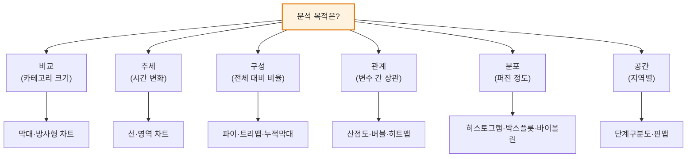

# 데이터 시각화(Data Visualization)

## 1. 개요

### 가. 정의
> 데이터 시각화란 정량·정성 데이터를 **위치·길이·각도·면적·색·형태 등 시각적 부호(visual encoding)로 변환**하여, 사람이 패턴·추세·관계·이상치를 직관적으로 인식하고 통찰(Insight)을 이끌어내도록 돕는 표현·소통 기법이다.

시각화의 힘은 도구가 아니라 **인간의 인지 구조**에서 나온다. 사람의 뇌는 숫자의 나열을 순차적으로 읽어 해석하는 데는 느리지만, 색·위치·크기 같은 시각 속성은 **주의를 기울이기 전에(preattentive) 병렬적으로 순식간에 인지**한다. 수백 행의 표에서는 보이지 않던 급증 구간, 이상치, 상관관계가 하나의 그래프에서는 한눈에 드러나는 이유가 여기에 있다. 따라서 좋은 시각화는 '보기 좋은 그림'이 아니라 '**데이터의 의미를 왜곡 없이, 정확하고 효율적으로 전달하는 커뮤니케이션 인터페이스**'로 정의해야 한다.

이 점을 극적으로 보여주는 고전적 사례가 **앤스컴의 4중주(Anscombe's Quartet)** 다. 평균·분산·상관계수·회귀식이 거의 동일한 네 개의 데이터셋이 산점도로 그리면 완전히 다른 모양(선형·곡선·이상치 주도)을 드러낸다. 요약 통계만 보면 같아 보이는 데이터가 시각화하면 본질이 갈린다는 이 사례는, 시각화가 단순 보조 표현이 아니라 **분석의 한 방법론**임을 증명한다. 반대로 잘못된 시각화(축 절단, 3D 왜곡, 부적절한 차트 선택)는 오히려 사실을 왜곡해 잘못된 의사결정을 유도하므로, 시각화는 '무엇을 보여줄지'만큼 '어떻게 왜곡하지 않을지'가 중요하다.

### 나. 등장 배경과 필요성
데이터는 폭증하지만 사람이 소화할 수 있는 인지 대역폭은 한정적이다. 조직이 수집하는 로그·거래·센서 데이터는 기하급수적으로 늘어나는 반면, 의사결정자가 회의 한 번에 이해할 수 있는 정보량은 수십 년 전과 다르지 않다. 이 **'데이터 공급과 인지 소비의 불균형'** 이 시각화를 필수로 만든다. 시각화는 방대한 데이터를 압축해 의사결정자가 빠르게 상황을 파악하고 행동하도록 돕는다.

특히 데이터 기반 경영·AI 시대에는 분석 결과를 이해관계자에게 설득력 있게 전달하는 **'데이터 스토리텔링'** 의 핵심 수단으로 자리 잡았다. 아무리 정교한 머신러닝 모델도 그 결과를 비전문가 경영진이 이해하지 못하면 의사결정으로 이어지지 않는다. 실제로 나이팅게일이 크림전쟁 사망 원인을 '장미 도표(rose diagram)'로 시각화해 위생 개혁을 이끌어낸 것, 존 스노가 콜레라 사망 지점을 지도에 찍어 오염된 우물(브로드가 펌프)을 밝혀낸 것은 모두 **데이터가 아니라 시각화가 의사결정을 바꾼** 역사적 사례다.

## 2. 시각화의 원리와 제작 절차

데이터 시각화는 즉흥적으로 차트를 그리는 작업이 아니라, **분석 목적에서 시각 부호로 이어지는 매핑(mapping)의 설계**다. 전체 절차를 구조도로 표현하면 다음과 같다.

**첫째, 데이터 수집·정제 단계**에서는 결측치·이상치·척도(scale)를 정리한다. 이 단계가 부실하면 그 위에 아무리 예쁜 차트를 얹어도 '쓰레기를 넣으면 쓰레기가 나온다(GIGO)'는 원칙을 벗어나지 못한다. 예컨대 단위가 섞인 매출 데이터(원·천원·백만원)를 정규화하지 않고 막대차트로 그리면 축이 무의미해진다.

**둘째, 분석 목적 정의**는 시각화의 성패를 가르는 가장 중요한 단계다. '무엇을 말하려는가'가 곧 차트를 결정하기 때문이다. 카테고리 간 크기를 견주려는 것인지(비교), 시간에 따른 변화를 보려는 것인지(추세), 두 변수의 관계를 보려는 것인지(상관)에 따라 선택할 시각 부호가 달라진다. 목적을 건너뛰고 '멋진 차트'부터 고르면 데이터가 메시지를 따라가는 것이 아니라 메시지가 차트에 끌려간다.

**셋째, 데이터를 시각 부호로 매핑**한다. 여기서 핵심은 **인지 정확도 순서**다. 클리블랜드-맥길(Cleveland & McGill)의 실험에 따르면 사람은 값을 '위치(공통 축상의 길이)'로 표현할 때 가장 정확히 읽고, '각도·면적'으로 표현하면 오차가 커진다. 파이차트가 막대차트보다 비교에 불리한 이유가 바로 각도·면적으로 인코딩하기 때문이다. 따라서 정밀한 비교가 목적이면 값을 '길이·위치'에 매핑해야 한다.

**넷째, 차트 제작 후 반드시 해석·검증**한다. 자신이 의도한 메시지와 다르게 읽힐 여지는 없는지, 축·범례·색이 오해를 부르지 않는지 스스로 점검한다. 이 검증-피드백 루프가 있어야 시각화가 '데이터로 거짓말하기'로 전락하지 않는다.

이 절차 전체를 관통하는 제작 원리는 네 가지로 정리된다.

| 원리 | 내용 | 위반 시 문제 |
|---|---|---|
| **정확성(Truthfulness)** | 데이터를 왜곡 없이 표현(축 0 시작, 3D 금지) | 축 절단으로 3% 차이를 3배로 과장 |
| **명확성(Clarity)** | 전달 메시지가 분명, 강조점 명시 | 무엇을 보라는지 알 수 없는 산만한 차트 |
| **효율성(Efficiency)** | 최소 잉크로 최대 정보(데이터-잉크 비율↑) | 격자·그림자·장식이 데이터를 가림 |
| **심미성(Aesthetics)** | 가독성 높은 색·레이아웃·정렬 | 채도 높은 색 남발로 피로·오독 유발 |

특히 **정확성**은 나머지 셋에 우선한다. 축의 시작점을 0이 아닌 곳에서 끊거나(축 절단, truncated axis) 3D 효과로 원근에 따라 면적을 왜곡하면, 데이터가 사실이어도 그림은 거짓을 말한다. **데이터-잉크 비율(Data-Ink Ratio)** 개념을 제시한 에드워드 터프티(Edward Tufte)는 '전달에 기여하지 않는 모든 잉크(차트정크, chartjunk)를 제거하라'고 했는데, 이는 효율성 원리의 이론적 근거다.

## 3. 시각화 유형 — 목적별 차트 선택

시각화 유형은 앞서 강조한 대로 '**무엇을 보여주려는가**'라는 분석 목적에서 결정된다. 데이터의 구조(범주형/연속형/시계열/지리)와 전달 의도(비교/추세/구성/관계/분포/공간)의 조합이 차트를 규정한다. 목적과 차트가 어긋나면(예: 시계열을 파이차트로) 아무리 미려해도 오해를 부른다.

**비교(Comparison)** 목적에는 막대차트가 표준이다. 값을 공통 축상의 길이로 인코딩하므로 인지 정확도가 가장 높다. 카테고리 수가 많거나 다차원(예: 부서×역량)이면 방사형(radar)도 쓰지만, 각 축의 척도가 다르면 오독 위험이 있어 제한적으로 쓴다.

**추세(Trend)** 는 선·영역 차트가 적합하다. 시간축(x)을 따라 값(y)의 연속적 변화를 선의 기울기로 보여준다. 예컨대 월별 방문자 수를 선차트로 그리면 계절성·급증·급감이 기울기로 즉시 드러난다. 다만 **선차트를 여러 개 겹칠 때는 5개 이내**로 제한해야 스파게티 차트가 되지 않는다.

**구성(Composition)** 은 전체 대비 부분의 비율을 보여준다. 파이·도넛·트리맵이 여기에 속하는데, 파이차트는 각도로 인코딩해 정확한 비교가 어려우므로 **항목 3~5개 이하, 합이 100%인 경우**에만 권장된다. 항목이 많으면 계층 구조를 면적으로 표현하는 트리맵이 낫다.

**관계(Relationship)** 는 산점도·버블·히트맵으로 표현한다. 예를 들어 광고비(x)와 매출(y)의 상관을 산점도로 그리면 양의 상관·군집·이상치가 한눈에 보인다. 세 번째 변수를 점 크기(버블)나 색으로 추가하면 다차원 관계도 한 화면에 담을 수 있다.

**분포(Distribution)** 는 히스토그램·박스플롯·바이올린플롯이 담당한다. 성적·소득처럼 데이터가 어떻게 퍼졌는지, 중앙값·사분위·이상치가 어디인지를 보여준다. A/B 테스트에서 두 그룹의 응답시간 분포를 박스플롯으로 겹쳐 그리면 평균만으로는 놓치는 꼬리(tail) 차이를 잡아낸다.

**공간(Spatial)** 은 지도 기반이다. 지역별 판매를 단계구분도(choropleth)로, 위치별 밀도를 히트맵으로 표현한다. 단, 단계구분도는 면적이 큰 행정구역이 시각적으로 과대표현되는 편향이 있어, 인구 기준 카토그램으로 보정하기도 한다.

## 4. 비교·사례 — 좋은 시각화와 나쁜 시각화

효과적인 시각화는 '더 화려하게'가 아니라 '더 명료하게'를 지향한다. 같은 데이터라도 인코딩 선택에 따라 전달력이 크게 달라진다.

| 구분 | 나쁜 시각화 | 좋은 시각화 | 차이가 생기는 이유 |
|---|---|---|---|
| **축** | y축을 90~100으로 절단 | 0부터 시작 | 절단은 작은 차이를 과장(왜곡) |
| **차트** | 12개 항목 파이차트 | 정렬된 가로막대 | 각도보다 길이가 비교에 정확 |
| **색** | 무지개 7색 남발 | 강조 1색+회색 | 색이 많으면 위계가 사라짐 |
| **장식** | 3D·그림자·격자 | 최소 잉크 | 차트정크가 데이터를 가림 |

첫째, **차트 선택의 사례**로 '카테고리 12개의 시장 점유율'을 들 수 있다. 이를 파이차트로 그리면 인접 조각의 크기를 각도로 구분하기 어렵지만, 값 기준으로 정렬한 가로막대로 그리면 순위와 격차가 즉시 읽힌다. 실무에서 파이차트를 정렬 막대로 바꾸는 것만으로 보고서 오독률이 눈에 띄게 줄어드는 이유다.

둘째, **축 조작의 사례**다. 두 제품의 만족도가 각각 92점, 95점일 때 y축을 90~96으로 절단하면 막대 높이 차이가 마치 몇 배처럼 보인다. 3점(약 3%) 차이가 시각적으로는 3배로 과장되는 것이다. 이는 언론·광고에서 흔히 악용되는 왜곡 기법으로, 축을 0부터 시작하면 실제 미미한 차이로 정직하게 드러난다.

셋째, **색과 접근성의 사례**다. 전체 인구의 약 8%(남성 기준)에 이르는 적록색맹을 고려하면, 빨강-초록 대비로 증감을 표현한 대시보드는 상당수 사용자에게 무의미하다. 파랑-주황 같은 색맹 안전 팔레트(예: ColorBrewer, Viridis)로 바꾸면 접근성이 크게 개선된다. 효율화 방안을 종합하면 ① 목적·데이터 특성 우선의 차트 선택, ② 차트정크 제거와 색·레이블 최소화·일관화, ③ 대시보드·인터랙티브(드릴다운·필터)로 사용자의 자기주도적 탐색 지원, ④ 색맹 팔레트·모바일 반응형·대체텍스트 등 접근성 확보로 요약된다.

## 5. 심화 — 최신 동향과 생성형 AI 기반 시각화

시각화 기술은 '정적 차트 → 인터랙티브 대시보드 → 대화형·자동 생성'으로 진화하고 있다. 이 흐름의 배경에는 데이터 접근을 전문가에서 현업(citizen analyst)으로 넓히려는 **데이터 민주화(data democratization)** 요구가 있다.

**첫째, BI 도구의 셀프서비스화**다. Tableau·Power BI·Looker 같은 도구는 SQL·코딩 없이 드래그앤드롭으로 대시보드를 만들게 해, 시각화를 데이터팀의 전유물에서 현업의 일상 도구로 바꿨다. 최근에는 실시간 스트리밍 데이터와 연결해 운영 대시보드(운영 KPI, 실시간 모니터링)로 확장되고 있다.

**둘째, 자연어 기반 자동 시각화(NL2Chart/NLQ)** 다. 생성형 AI·LLM의 발전으로 '지난 분기 지역별 매출을 보여줘'라고 자연어로 질의하면 적절한 차트를 자동 생성하는 기능이 주요 BI 도구(예: Power BI Copilot, Tableau의 자연어 질의)에 탑재되고 있다. 이는 차트 선택·인코딩이라는 전문 지식을 도구가 대신하는 방향으로, 시각화 리터러시의 문턱을 낮춘다. 다만 자동 생성 차트가 항상 최적·정직한 것은 아니므로, **사람의 검증(축·척도·오독 여부)** 은 여전히 필요하다.

**셋째, 코드 기반 재현가능 시각화**다. Python의 Matplotlib·Seaborn·Plotly, JavaScript의 D3.js, 그리고 '**그래픽 문법(Grammar of Graphics)**' 을 구현한 ggplot2·Vega-Lite는 시각화를 코드로 정의해 버전관리·자동화·재현이 가능하게 한다. 특히 Vega-Lite는 데이터·인코딩·마크를 선언적으로 기술해, 시각화 설계 원리를 그대로 코드에 반영한다는 점에서 이론과 실무를 잇는다.

이 밖에 지리공간·네트워크·3D·VR 시각화, 그리고 대용량 데이터를 브라우저에서 처리하는 WebGL 기반 렌더링(deck.gl 등)이 확산되고 있다. 다만 화려함이 명료함을 압도하는 순간 시각화의 본령(정확·명확한 소통)이 훼손된다는 원칙은 어떤 신기술에도 변하지 않는다.

## 6. 고려사항 및 시사점 (기술사 관점)

1. **시각화는 분석의 끝이 아니라 소통의 시작이다.** 통찰을 의사결정으로 연결하려면 BI 도구(Tableau·Power BI)와 데이터 스토리텔링을 결합해야 한다. 기술사는 '어떤 모델을 썼는가'보다 '결과를 의사결정자가 이해·신뢰하는가'를 기준으로 시각화 산출물을 평가해야 하며, 분석 파이프라인의 마지막 1마일(last mile)로서 시각화에 투자해야 한다.

2. **시각화 윤리와 거버넌스를 제도화해야 한다.** 축 조작·체리피킹·부적절한 차트로 특정 결론을 유도하는 것은 '데이터로 거짓말하기'다. 조직 차원에서 시각화 가이드라인(축 0 시작 원칙, 승인된 색 팔레트, 차트 유형 표준)을 수립해 일관성·정직성을 강제하는 것이 트레이드오프를 관리하는 방법이다.

3. **접근성·포용성은 선택이 아니라 요건이다.** 색맹 안전 팔레트, 대체텍스트, 모바일 반응형은 WCAG 등 접근성 표준과 연계되며, 공공·금융 서비스에서는 법적 요구사항이 될 수 있다. 전략적으로 접근성을 초기 설계에 내재화(built-in)하는 것이 후행 보정보다 비용이 낮다.

4. **자동화와 인간 검증의 균형이 관건이다.** 생성형 AI 기반 NL2Chart는 생산성을 높이지만, 자동 생성 차트의 왜곡·환각(hallucination) 위험이 있다. 기술사는 '자동 생성 + 사람 검증(human-in-the-loop)'의 거버넌스를 설계해, 속도와 정직성을 함께 확보해야 한다.

5. **인지 부하와 데이터 리터러시를 함께 고려해야 한다.** 아무리 좋은 시각화도 청중의 데이터 해석 역량이 낮으면 오독된다. 조직의 데이터 리터러시 교육과 시각화 표준화를 병행하는 것이 장기적 데이터 문화 전환의 전제다.

## 참고자료
- Edward Tufte, "The Visual Display of Quantitative Information" — 데이터-잉크 비율·차트정크 개념
- Cleveland & McGill, "Graphical Perception" (1984) — 시각 부호별 인지 정확도 실험
- ColorBrewer 색 팔레트: https://colorbrewer2.org
- Vega-Lite(그래픽 문법 기반 선언적 시각화): https://vega.github.io/vega-lite/

---

> **한 줄 요약**: 데이터 시각화는 *정확·명확·효율·심미* 원리에 따라 데이터를 인지 정확도 높은 시각 부호(위치·길이 우선)로 매핑하고 목적별 차트(비교·추세·구성·관계·분포·공간)를 선택해 통찰을 직관적으로 전달하는 커뮤니케이션 기법으로, 차트정크 제거·인터랙티브·접근성으로 효율화하되 축 조작을 배격하는 시각화 윤리와 생성형 AI 자동화 시대의 인간 검증이 핵심이다.
