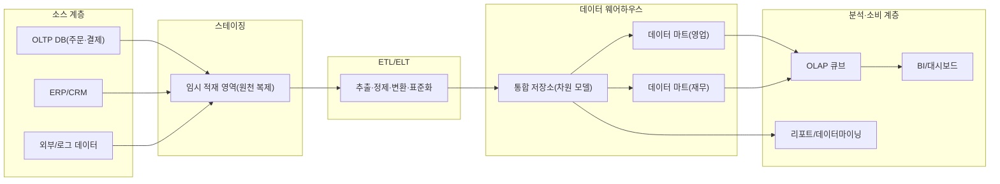
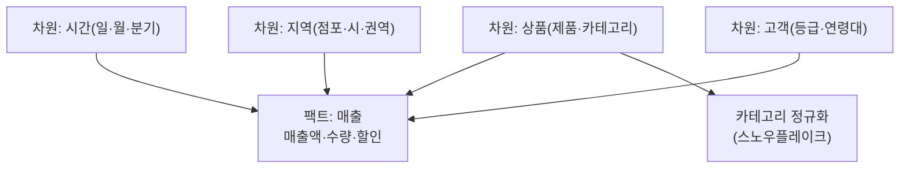

# 데이터 웨어하우스(Data Warehouse)와 OLAP

## 1. 개요

> **데이터 웨어하우스(Data Warehouse, DW)**는 여러 운영계(OLTP) 시스템에 흩어진 데이터를 주제(subject) 중심으로 통합·정제하여, 시간의 흐름에 따라 축적하고 삭제·갱신 없이 보존함으로써 의사결정 지원 질의(분석)를 위해 최적화한 통합 데이터 저장소이다. **OLAP(Online Analytical Processing)**은 이렇게 축적된 데이터를 다차원(multidimensional) 관점에서 빠르게 집계·탐색하도록 지원하는 분석 처리 기술이다.

기업이 운영하는 정보시스템은 대부분 주문·결제·재고처럼 개별 트랜잭션을 정확하고 빠르게 처리하는 OLTP(Online Transaction Processing) 목적으로 설계된다.
OLTP 데이터베이스는 정규화되어 있어 갱신 이상을 방지하고 짧은 트랜잭션을 다수 처리하는 데 유리하지만, "지난 3년간 지역별·분기별 매출 추이를 제품군별로 비교"하는 식의 광범위한 집계 질의에는 부적합하다.
이런 질의는 수십 개 테이블을 조인하고 수억 건을 스캔해야 하므로 운영계에 부하를 주고, 무엇보다 운영계는 과거 이력을 오래 보존하지 않는다.
데이터 웨어하우스는 이 간극을 메우기 위해 등장했다 — 운영계와 분리된 별도 저장소에 이력을 축적하고, 분석에 유리한 구조로 재구성한다.

빌 인먼(Bill Inmon)은 DW를 "주제지향적(subject-oriented)·통합적(integrated)·시간가변적(time-variant)·비휘발적(non-volatile) 데이터의 집합"으로 정의했고, 이 네 가지 특성은 DW를 OLTP DB와 구분하는 핵심 기준이 된다.
주제지향은 '고객·상품·매출'처럼 업무 주제 단위로 데이터를 조직함을, 통합은 여러 소스의 코드·단위·표현을 일관되게 표준화함을, 시간가변은 스냅샷에 시점을 부여해 이력을 남김을, 비휘발은 적재 후 원칙적으로 갱신·삭제하지 않고 읽기 중심으로 운영함을 의미한다.

논술 답안에서는 DW를 단순한 "큰 데이터베이스"로 축소하지 않는 것이 중요하다.
DW는 (1) OLTP와의 목적·구조 차이, (2) ETL/ELT로 이루어지는 데이터 통합 파이프라인, (3) 차원 모델링(스타/스노우플레이크 스키마)이라는 설계 기법, (4) OLAP 큐브를 통한 다차원 분석이라는 네 축이 결합된 체계로 서술해야 한다.
최근에는 데이터 레이크·레이크하우스와의 관계, 클라우드 DW(MPP)와 컬럼 저장의 부상까지 연결하면 시의성 있는 답안이 된다.

### 가. 등장 배경과 필요성

첫째, 운영계와 분석계의 분리가 필요하다.
분석 질의를 운영 DB에 직접 던지면 락 경합과 대량 스캔으로 주문·결제 같은 핵심 트랜잭션의 응답시간이 나빠진다.
DW는 분석 워크로드를 물리적으로 격리해 운영계 성능을 보호하면서, 읽기·집계에 최적화된 별도 환경을 제공한다.

둘째, 데이터 통합과 '단일 진실 원천(Single Source of Truth)'이 요구된다.
같은 '매출'이라도 영업·회계·물류 시스템의 정의와 코드 체계가 다르면 부서마다 숫자가 어긋난다.
DW는 ETL 과정에서 코드·단위·기준을 표준화하여 전사가 동일한 정의로 지표를 해석하게 만든다.

셋째, 이력 축적과 추세 분석이 필요하다.
운영계는 최신 상태만 유지하지만, 경영 의사결정은 과거와 현재를 비교하는 시계열 분석을 요구한다.
DW는 시점별 스냅샷을 비휘발적으로 보존하여 장기 추세·계절성·이상 징후를 추적할 수 있게 한다.

## 2. 전체 구조와 데이터 흐름

데이터 웨어하우스는 소스에서 최종 분석까지 여러 계층을 거친다.
운영계·외부 데이터가 스테이징 영역으로 추출되고, 정제·변환을 거쳐 DW에 적재되며, 특정 부서·주제에 맞춘 데이터 마트(Data Mart)로 분할되어 OLAP·BI 도구로 소비된다.

**소스 계층**은 DW가 통합할 원천 데이터를 제공한다.
운영계 DB뿐 아니라 ERP·CRM, 외부 시장 데이터, 웹 로그 등 이질적인 소스가 포함되며, 각각 스키마·코드 체계·갱신 주기가 다르다.
이 이질성을 흡수하는 것이 이후 ETL의 핵심 과제다.

**스테이징 영역**은 소스에서 뽑아낸 원천을 임시로 담아 두는 완충 지대다.
소스 시스템에 대한 접근 시간을 최소화하고, 변환 도중 실패해도 소스에 영향을 주지 않도록 격리한다.
스테이징에서 정제·중복 제거·형 변환이 이루어진 뒤 본 DW로 넘어간다.

**ETL/ELT 계층**은 데이터 통합의 심장이다.
추출(Extract)은 소스에서 데이터를 가져오고, 변환(Transform)은 코드 표준화·단위 통일·결측 처리·집계·서로게이트 키 생성을 수행하며, 적재(Load)는 결과를 DW에 넣는다.
전통적 ETL은 별도 엔진에서 변환 후 적재하지만, 클라우드 DW의 연산력이 커지면서 먼저 적재하고 DW 내부에서 SQL로 변환하는 ELT가 확산되었다.

**DW·데이터 마트 계층**은 통합된 데이터를 차원 모델로 저장한다.
전사 통합 저장소를 중심에 두고, 영업·재무처럼 특정 부서·주제에 맞춘 부분집합인 데이터 마트를 파생시켜 질의 성능과 접근 통제를 개선한다.
인먼식 하향식(중앙 DW→마트)과 킴볼(Ralph Kimball)식 상향식(마트 통합→버스 아키텍처)이 대표 설계 철학이다.

## 3. 차원 모델링과 OLAP 연산

DW 설계의 핵심 기법은 **차원 모델링(Dimensional Modeling)**이다.
분석의 대상이 되는 측정값(매출액·수량 등)을 **팩트 테이블(Fact Table)**에 두고, 분석의 관점(시간·상품·지역·고객 등)을 **차원 테이블(Dimension Table)**로 분리하여, 팩트를 중심으로 차원이 별 모양으로 연결되는 **스타 스키마(Star Schema)**를 구성한다.
차원 테이블은 의도적으로 비정규화하여 조인 수를 줄이고 질의 성능을 높인다.

스타 스키마의 차원을 다시 정규화하여 계층을 별도 테이블로 쪼개면 **스노우플레이크 스키마(Snowflake Schema)**가 된다.
스노우플레이크는 저장 중복을 줄이고 계층 관리를 명확히 하지만, 조인이 늘어 질의가 복잡해지고 성능이 떨어질 수 있다.
따라서 저장 효율과 계층 무결성이 중요하면 스노우플레이크를, 질의 성능과 단순성이 우선이면 스타 스키마를 택하는 것이 실무 관행이다.
차원 값이 시간에 따라 변할 때(예: 고객 등급 변경)를 다루는 **SCD(Slowly Changing Dimension)** 기법도 중요한데, 덮어쓰는 Type 1, 이력 행을 추가하는 Type 2, 이전 값을 컬럼으로 보관하는 Type 3이 대표적이다.
예컨대 마케팅 분석에서 "VIP 승급 이전과 이후의 구매 패턴"을 보려면 Type 2로 등급 변경 이력을 남겨야 한다.

**OLAP 연산**은 이렇게 구성된 다차원 큐브(cube)를 탐색하는 표준 조작이다.
사용자는 다음과 같은 연산으로 데이터를 여러 각도에서 분석한다.

| 연산 | 의미 | 예시 |
|---|---|---|
| Roll-up | 상위 계층으로 집계 | 일별 → 월별 → 분기별 매출 합산 |
| Drill-down | 하위 계층으로 상세화 | 분기 매출 → 월 → 일 단위로 세분화 |
| Slice | 한 차원을 고정해 부분집합 추출 | '2026년 3분기'로 시간 차원 고정 |
| Dice | 여러 차원에 범위 조건 부여 | 특정 지역·특정 제품군만 선택 |
| Pivot(Rotate) | 축을 회전해 관점 전환 | 행·열의 차원을 서로 교환 |

이러한 연산은 경영진이 "전체 → 이상 구간 → 원인"으로 좁혀 가는 자연스러운 탐색 과정을 그대로 지원한다.
예를 들어 전사 매출이 감소했을 때 Roll-up 수준에서 이상을 인지하고, Drill-down으로 어느 권역·제품이 원인인지 파고들며, Slice/Dice로 특정 조건을 격리해 원인을 규명한다.

## 4. OLAP 구현 유형 비교와 OLTP와의 차이

OLAP은 데이터를 어디에·어떻게 저장하느냐에 따라 세 방식으로 나뉘며, 각각 성능·확장성·유연성의 트레이드오프가 다르다.
아래 비교의 핵심은 "미리 계산해 두면 빠르지만 유연성과 확장성이 떨어지고, 관계형에 맡기면 유연하고 확장되지만 응답이 느려진다"는 원리다.

| 구분 | MOLAP | ROLAP | HOLAP |
|---|---|---|---|
| 저장 | 다차원 큐브(사전 집계) | 관계형 DB(스타 스키마) | 요약=큐브, 상세=관계형 |
| 질의 성능 | 매우 빠름 | 상대적으로 느림 | 중간(요약은 빠름) |
| 확장성/대용량 | 큐브 폭발로 제한 | 우수 | 절충 |
| 유연성 | 낮음(사전 정의) | 높음(임의 SQL) | 중간 |
| 대표 | Essbase, SSAS(MOLAP) | 대다수 SQL 기반 BI | SSAS(HOLAP) |

MOLAP은 집계를 미리 계산해 큐브에 저장하므로 응답이 빠르지만, 차원과 조합이 늘면 사전 집계량이 폭증하는 '데이터 폭발(data explosion)' 문제가 있다.
ROLAP은 관계형 DB에 스타 스키마로 두고 질의 시점에 집계하므로 대용량과 임의 질의에 강하지만 응답이 느릴 수 있다.
HOLAP은 자주 쓰는 요약은 큐브로, 세부는 관계형으로 두어 둘을 절충한다.

DW/OLAP과 OLTP의 차이를 명확히 대비하면 설계 판단의 근거가 분명해진다.

| 관점 | OLTP(운영계) | OLAP/DW(분석계) |
|---|---|---|
| 목적 | 트랜잭션 처리 | 의사결정 지원 분석 |
| 질의 | 짧은 읽기/쓰기 다수 | 광범위한 읽기·집계 소수 |
| 설계 | 정규화(3NF) | 비정규화(스타 스키마) |
| 데이터 | 현재 상태, 상세 | 이력 축적, 요약 포함 |
| 저장 방식 | 행 지향(row-store) | 열 지향(column-store) 유리 |
| 갱신 | 빈번한 갱신·삭제 | 주기적 배치 적재, 비휘발 |

특히 저장 방식의 차이는 성능에 직결된다.
분석 질의는 소수 컬럼을 대량 행에 걸쳐 집계하므로, 같은 컬럼 값을 연속 저장하는 **열 지향(컬럼 저장)**이 I/O와 압축 면에서 압도적으로 유리하다.
Amazon Redshift, Google BigQuery, Snowflake 같은 클라우드 DW가 컬럼 저장과 MPP(Massively Parallel Processing)를 결합해 수십억 행 집계를 수 초에 처리하는 것이 이 원리의 산업적 구현이다.

## 5. 심화 — 클라우드 DW·레이크하우스로의 진화

전통적 DW는 온프레미스에 고정 용량으로 구축되어, 피크 분석 부하에 맞춰 과다 투자하거나 반대로 자원이 부족해지는 문제가 있었다.
2010년대 이후 **클라우드 데이터 웨어하우스**가 이 한계를 바꾸었다.
Snowflake는 **저장과 연산의 분리(decoupled storage/compute)**를 도입해, 동일 데이터에 대해 여러 가상 웨어하우스가 독립적으로 확장·과금되도록 했다 — 대량 적재와 대화형 분석이 서로 간섭하지 않고, 사용한 만큼만 비용을 낸다.
BigQuery는 서버리스로 인프라 관리 없이 페타바이트급 질의를 지원하고, Redshift는 RA3 노드로 컴퓨트/스토리지를 분리했다.

한편 정형 DW만으로는 로그·이미지·텍스트 같은 비정형·반정형 데이터를 담기 어려워 **데이터 레이크(Data Lake)**가 병행 도입되었지만, 레이크는 거버넌스·스키마·트랜잭션이 약해 '데이터 늪(swamp)'이 되기 쉬웠다.
이를 통합한 것이 **데이터 레이크하우스(Lakehouse)**로, 값싼 오브젝트 스토리지 위에 Delta Lake·Apache Iceberg·Hudi 같은 개방형 테이블 포맷으로 ACID 트랜잭션·스키마 진화·타임 트래블을 부여해 DW의 신뢰성과 레이크의 유연성을 결합한다.
즉 DW→레이크→레이크하우스의 흐름은 "정형 분석의 신뢰성"과 "다양한 데이터의 수용성"을 하나로 모으려는 진화로 이해할 수 있다.

또한 실시간 의사결정 수요가 커지면서, 배치 중심의 전통 DW에 스트리밍 적재(CDC·Kafka)와 근실시간 집계가 결합되고 있다.
과거 야간 배치로 하루 한 번 갱신하던 DW가, 변경 데이터 캡처를 통해 수 분 단위로 최신 상태를 반영하는 방향으로 이동하는 것이다.

## 6. 고려사항 및 시사점

- **모델링 철학 선택(Inmon vs Kimball)**: 전사 표준화·거버넌스가 중요하면 중앙 DW를 먼저 세우는 하향식(Inmon)이, 빠른 가치 실현이 중요하면 부서 마트를 먼저 만들고 버스 아키텍처로 통합하는 상향식(Kimball)이 유리하다. 두 방식은 대립이 아니라 조직 성숙도와 우선순위에 따른 선택지이며, 실무에서는 혼합형이 흔하다.
- **성능과 유연성의 트레이드오프**: 사전 집계(MOLAP)·요약 테이블·머티리얼라이즈드 뷰는 응답을 빠르게 하지만 저장·갱신 비용과 큐브 폭발을 유발한다. 질의 패턴을 분석해 자주 쓰는 집계만 선별적으로 사전 계산하고, 나머지는 컬럼 저장·MPP로 처리하는 균형 설계가 필요하다.
- **데이터 품질과 단일 진실 원천**: DW의 가치는 통합된 지표 정의에서 나온다. ETL 단계의 표준화·검증과 함께 데이터 거버넌스·마스터 데이터 관리(MDM)·데이터 계약을 연계해 지표 정의의 일관성을 조직적으로 보장해야 한다. SCD 전략을 명확히 정해 이력의 정확성도 확보한다.
- **비용·거버넌스·전망**: 클라우드 DW는 사용량 기반 과금이라 무분별한 대형 질의가 비용 폭증을 부른다 — FinOps 관점의 워크로드 모니터링·질의 최적화·수명주기 정책이 필요하다. 개인정보가 포함된 이력을 장기 보존하므로 접근통제·마스킹·보존기간 관리도 필수다. 향후 DW는 레이크하우스로의 수렴, 실시간화, BI에 결합되는 생성형 AI(자연어 질의) 방향으로 진화할 전망이며, 기술사는 이를 조직의 분석 성숙도·규제·비용 제약과 함께 종합 판단해야 한다.

## 참고자료

- Kimball Group, "Dimensional Modeling Techniques", https://www.kimballgroup.com/data-warehouse-business-intelligence-resources/kimball-techniques/dimensional-modeling-techniques/
- Snowflake, "What Is a Data Warehouse?", https://www.snowflake.com/guides/what-data-warehouse
- Databricks, "What is a Data Lakehouse?", https://www.databricks.com/glossary/data-lakehouse
- AWS, "What is OLAP?", https://aws.amazon.com/what-is/olap/

---

> **한 줄 요약**: 데이터 웨어하우스는 운영계와 분리해 주제지향·통합·시간가변·비휘발 원칙으로 이력을 축적한 분석 전용 저장소이고, 차원 모델링(스타/스노우플레이크)과 OLAP 연산(롤업·드릴다운·슬라이스·다이스·피벗)으로 다차원 분석을 지원하며, 최근에는 컬럼 저장·MPP 기반 클라우드 DW와 레이크하우스로 진화하고 있다.
