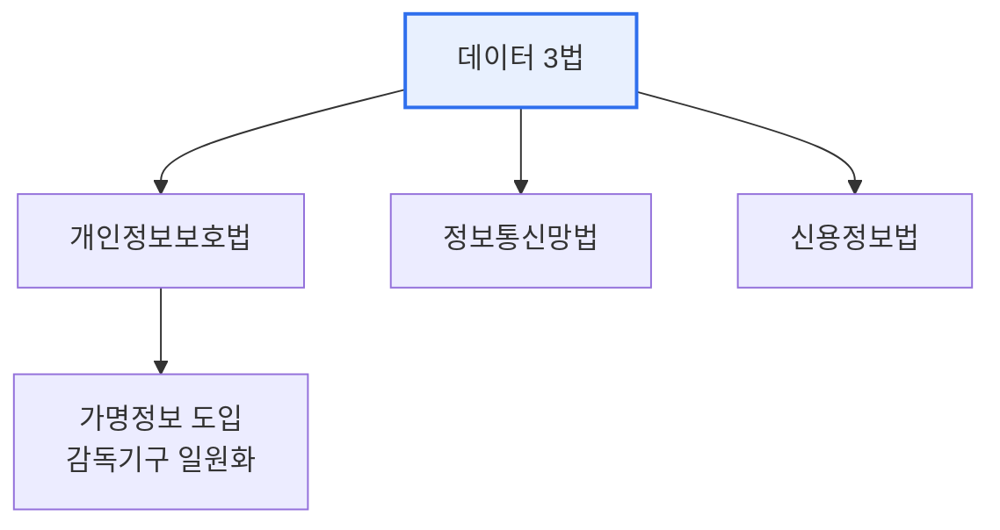

# 데이터 3법과 마이데이터

## 1. 개요

### 가. 정의
> **데이터 3법**은 개인정보보호법·정보통신망법·신용정보법을 통칭하며, 개인정보 보호를 강화하면서도 **가명정보 개념 도입 등으로 데이터 활용의 길을 연** 법 개정이다. **마이데이터(MyData)** 는 정보주체가 자신의 개인정보를 **직접 관리·활용(제3자 전송 요구)** 하도록 하는 개인정보 자기결정권 기반 서비스다.

데이터 3법 개정의 핵심 취지는 '**보호와 활용의 균형**'이다. 4차 산업혁명 시대에 데이터가 핵심 자원인데, 개인정보 규제가 지나치게 엄격하면 데이터 활용 산업이 위축되고, 반대로 느슨하면 프라이버시가 침해된다. 데이터 3법은 이 딜레마를 **가명정보** 라는 장치로 푼다. 개인을 특정할 수 없게 가명 처리한 정보는 통계·연구·산업 목적으로 동의 없이 활용할 수 있게 열어주되, 재식별을 엄격히 금지한다. 또한 개인정보 감독기구를 개인정보보호위원회로 일원화해 규율 체계를 정비했다. 마이데이터는 이 기반 위에서, 여러 기관에 흩어진 내 정보를 내가 원하는 곳으로 모아 맞춤 서비스를 받게 하는 데이터 주권의 실현이다.

### 나. 개정 배경
데이터 경제 활성화 요구와 프라이버시 보호 강화라는 상반된 요구, 그리고 감독기구 분산으로 인한 혼선을 해소하기 위해 데이터 3법이 개정되었다.

## 2. 데이터 3법 주요 개정 내용

| 법 | 주요 개정 내용 |
|---|---|
| **개인정보보호법** | 가명정보 개념 도입(동의 없이 활용), 개인정보보호위원회로 감독 일원화 |
| **정보통신망법** | 개인정보 관련 규정을 개인정보보호법으로 이관(중복 해소) |
| **신용정보법** | 금융 마이데이터(본인신용정보관리업) 근거 마련, 가명정보 활용 |

핵심은 가명정보 활용 허용과 감독 체계 정비다. 이를 통해 데이터 결합·분석 산업의 법적 기반이 마련되었다.

## 3. 마이데이터의 개념과 산업별 제공정보

마이데이터는 정보주체의 **전송요구권** 에 기반해, 여러 기관에 흩어진 본인 정보를 한곳에 모아 관리·활용하게 한다. 산업별로 제공되는 정보 범위가 다르다.

| 산업 | 주요 제공정보 |
|---|---|
| **금융** | 계좌·카드·대출·투자 내역(자산 통합 조회) |
| **의료** | 진료·처방·건강검진 기록 |
| **공공** | 세금·복지·자격 정보 |
| **통신·유통** | 통신 이용·소비 내역 |

금융 마이데이터가 가장 먼저 시행되어, 여러 금융사의 자산을 한 앱에서 통합 조회·관리하는 서비스가 대표적이다.

## 4. 마이데이터 활성화 방안 및 시사점

1. **표준화와 안전한 전송 인프라**가 전제다. 기관마다 다른 데이터를 API로 표준화해 안전하게 전송하는 인프라(전송 규격·인증)가 갖춰져야 마이데이터가 작동한다.
2. **보안·프라이버시가 신뢰의 기반**이다. 내 정보를 모으는 만큼 유출 위험도 커지므로, 강력한 인증·암호화·최소수집과 정보주체 통제권 보장이 활성화의 조건이다.
3. **정보주체 중심의 데이터 주권**으로 확장된다. 금융을 넘어 의료·공공·유통 등 전 분야로 마이데이터가 확산되며, 개인이 자기 데이터의 주인이 되어 가치를 되찾는 데이터 경제로 나아간다.

---

> **한 줄 요약**: 데이터 3법은 *가명정보 도입과 감독 일원화로 보호와 활용의 균형* 을 도모한 개정이며, 마이데이터는 *전송요구권으로 흩어진 본인 정보를 통합·활용* 하는 데이터 주권 서비스로, 표준화·보안·프라이버시가 활성화의 전제다.
